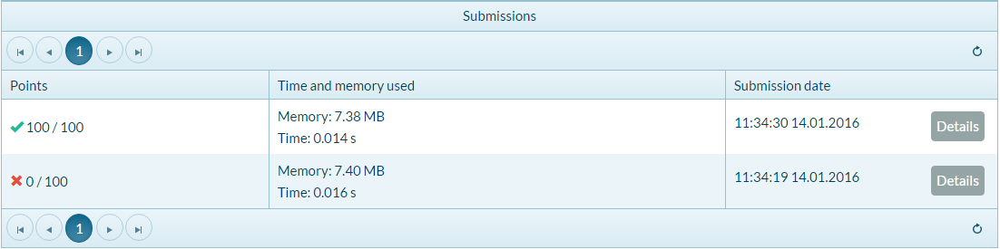
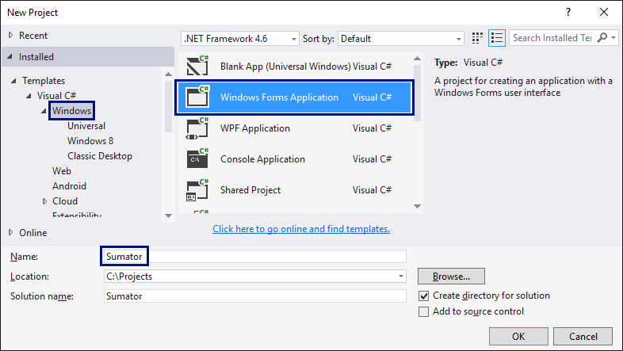
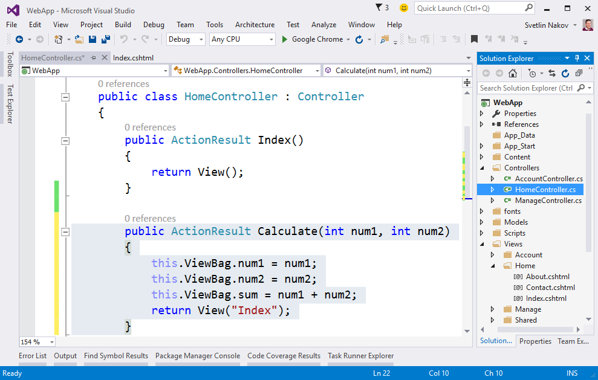

Упражнения: Първи стъпки в коденето
===================================

Задачи за упражнение в клас и за домашно към курса [„Основи на
програмирането" @
СофтУни](https://softuni.bg/courses/programming-basics).

Конзолна програмка "Hello SoftUni"
----------------------------------

Напишете **конзолна C\# програма**, която отпечатва текста "**Hello
SoftUni**".

1.  Стартирайте Visual Studio.

2.  Създайте нов конзолен проект: \[File\] \[New\] \[Project\].

{width="5.92799978127734in"
height="3.2040168416447945in"}

3.  Изберете от диалоговия прозорец \[Visual C\#\] \[Windows\] \[Console
    Application\] и дайте подходящо име на проекта, например
    "**HelloSoftuni**":

{width="6.220778652668416in"
height="3.6454319772528434in"}

4.  Намерете секцията **Main(string\[\] args)**. В нея се пише програмен
    код (команди) на езика C\#.

5.  Придвижете курсора между отварящата и затварящата скоба **{ }**.

6.  Натиснете **\[Enter\]** след отварящата скоба **{**.

{width="5.259739720034996in"
height="4.611080489938757in"}

7.  Напишете следния програмен код (команда за печатане на текста
    **\"Hello SoftUni\"**):

  ---------------------------------------
  Console.WriteLine(\"Hello SoftUni\");
  ---------------------------------------

Кодът на програмата се пише отместен навътре с една табулация спрямо
отварящата скоба **{**.

{width="5.649350393700788in"
height="4.124397419072616in"}

8.  **Стартирайте** програмата с натискане на **\[Ctrl+F5\]**. Трябва да
    получите следния резултат:

{width="3.6041666666666665in" height="1.125in"}

9.  **Тествайте** решението на тази задача в онлайн judge системата на
    СофтУни. За целта първо отворете
    <https://judge.softuni.bg/Contests/Practice/Index/150#0>. Влезте с
    вашето потребителско име в СофтУни. Ще се появи прозорец за
    изпращане на решения за задача "**Hello SoftUni**". Копирайте сорс
    кода от Visual Studio и го поставете в полето за изпращане на
    решения:

{width="6.531944444444444in"
height="4.784027777777778in"}

10. **Изпратете решението** за оценяване с бутона \[Submit\]. Ще
    получите резултата след няколко секунди в таблицата с изпратени
    решения в judge системата:

{width="7.277246281714786in"
height="1.8159995625546808in"}

Конзолна програма "Expression"
------------------------------

Напишете **конзолна C\# програма**, която пресмята и отпечатва
стойността на следния **числен израз**:

  ----------------------------------------------------------
  (3522 + 52353) \* 23 - (2336 \* 501 + 23432 - 6743) \* 3
  ----------------------------------------------------------

Забележка: не е разрешено да се пресметне стойността предварително
(например с Windows Calculator).

1.  Направете нов C\# конзолен проект с име "**Expression**".

2.  Намерете метода "**static void Main(string\[\] args)**" и влезте в
    неговото тяло между **{** и **}**.

3.  Сега трябва да напишете кода, който да изчисли горния числен израз и
    да отпечата на конзолата стойността му. Подайте горния числен израз
    в скобите на командата **Console.WriteLine()**:

{width="7.301020341207349in"
height="5.45599956255468in"}

4.  Стартирайте програмата с \[Ctrl+F5\] и проверете дали вашият
    резултат прилича на нашия:

{width="5.299411636045495in"
height="1.143999343832021in"}

5.  Тествайте вашата програма в judge системата:
    <https://judge.softuni.bg/Contests/Practice/Index/150#1>.

{width="7.235741469816273in"
height="4.304000437445319in"}

Числата от 1 до 20
------------------

Напишете C\# конзолна програма, която отпечатва числата от 1 до 20 на
отделни редове на конзолата.

1.  Създайте конзолно C\# приложение с име "**Nums1To20**":

{width="6.671586832895888in" height="3.76in"}

2.  Напишете 20 команди **Console.WriteLine()**, една след друга, за да
    отпечатате числата от 1 до 20.

{width="6.641013779527559in" height="4.32in"}

3.  **Тествайте** вашето решение на задачата в judge системата:
    <https://judge.softuni.bg/Contests/Practice/Index/150#2>

4.  Можете ли да напишете програмата по **по-умен начин**, така че да не
    повтаряте 20 пъти една и съща команда? Потърсете в Интернет
    информация за „[**for loop
    C\#**](https://www.google.com/search?q=for+loop+C%23)".

Триъгълник от 55 звездички
--------------------------

Напишете C\# конзолна програма, която отпечатва **триъгълник от 55
звездички**, разположени на 10 реда:

+----------------------+
| \*                   |
|                      |
| \*\*                 |
|                      |
| \*\*\*               |
|                      |
| \*\*\*\*             |
|                      |
| \*\*\*\*\*           |
|                      |
| \*\*\*\*\*\*         |
|                      |
| \*\*\*\*\*\*\*       |
|                      |
| \*\*\*\*\*\*\*\*     |
|                      |
| \*\*\*\*\*\*\*\*\*   |
|                      |
| \*\*\*\*\*\*\*\*\*\* |
+----------------------+

1.  Създайте ново конзолно C\# приложение с име "**TriangleOf55Stars**".

2.  Напишете код, който печата триъгълника от звездички, например чрез
    10 команди, подобни на **Console.WriteLine(\"\*\")**.

3.  **Тествайте** кода си в judge системата:
    <https://judge.softuni.bg/Contests/Practice/Index/150#3>.

4.  Опитайте да подобрите решението си, така че да няма много повтарящи
    се команди. Може ли това да стане с **for цикъл**?

Лице на правоъгълник
--------------------

Напишете C\# програма, която прочита от конзолата две числа **a** и
**b**, въведени от потребителя, пресмята и отпечатва **лицето на
правоъгълник** със страни **a** и **b**. Примерен вход и изход:

  **a**   **b**   **area**
  ------- ------- ----------
  2       7       14
  7       8       56
  12      5       60

1.  Направете конзолна C\# програма. За да прочетете двете числа,
    използвайте следния код:

+-------------------------------------------+
| static void Main(string\[\] args)         |
|                                           |
| {                                         |
|                                           |
| var a = double.Parse(Console.ReadLine()); |
|                                           |
| var b = double.Parse(Console.ReadLine()); |
|                                           |
| // TODO: calculate the area and print it  |
|                                           |
| }                                         |
+-------------------------------------------+

2.  Допишете програмата по-горе, за да пресмята лицето на правоъгълника
    и да го проверява.

3.  Тествайте решението си в judge системата:
    <https://judge.softuni.bg/Contests/Practice/Index/150#4>.

\* Квадрат от звездички
-----------------------

Напишете C\# конзолна програма, която прочита от конзолата цяло
положително число **N,** въведено от потребителя, и отпечатва на
конзолата **квадрат от N звездички**, като в примерите по-долу:

+----------+------------+
| **вход** | **изход**  |
+==========+============+
| 3        | \*\*\*     |
|          |            |
|          | \* \*      |
|          |            |
|          | \*\*\*     |
+----------+------------+
| 4        | \*\*\*\*   |
|          |            |
|          | \* \*      |
|          |            |
|          | \* \*      |
|          |            |
|          | \*\*\*\*   |
+----------+------------+
| 5        | \*\*\*\*\* |
|          |            |
|          | \* \*      |
|          |            |
|          | \* \*      |
|          |            |
|          | \* \*      |
|          |            |
|          | \*\*\*\*\* |
+----------+------------+

1.  Направете конзолна C\# програма. За да прочетете числото **N** (2 ≤
    N ≤100), използвайте следния код:

+----------------------------------------+
| static void Main(string\[\] args)      |
|                                        |
| {                                      |
|                                        |
| var n = int.Parse(Console.ReadLine()); |
|                                        |
| // TODO: print the rectangle           |
|                                        |
| }                                      |
+----------------------------------------+

2.  Допишете програмата по-горе, за да отпечатва квадрат, съставен от
    звездички. Може да се наложи да използвате **for-цикли**. Потърсете
    информация в Интернет.

3.  Тествайте решението си в judge системата:
    <https://judge.softuni.bg/Contests/Practice/Index/150#5>.

Упражнения: Графични и Web приложения
=====================================

Графично приложение „Суматор за числа"
--------------------------------------

Напишете **графично (GUI) приложение**, което изчислява **сумата на две
числа**:

{width="4.486832895888014in"
height="2.0721609798775154in"}

При въвеждане на две числа в първите две текстови полета и натискане на
бутона \[Calculate\] се изчислява тяхната сума и резултатът се показва в
третото текстово поле.

За разлика от конзолните приложения, които четат и пишат данните си във
вид на текст на конзолата, **графичните (GUI) приложения** имат визуален
потребителски интерфейс. Графичните приложения (настолни приложения,
desktop apps) се състоят от един от няколко графични прозореца, в които
има контроли: текстови полета, бутони, картинки, таблици и други.

За нашето приложение ще използваме технологията **Windows Forms**, която
позволява създаване на графични приложения за Windows в средата за
разработка **Visual Studio** с езика за програмиране **C\#**.

1.  Във Visual Studio създайте нов C\# проект от тип „**Windows Forms
    Application**":

{width="6.12in" height="3.449134951881015in"}

2.  При създаването на Windows Forms приложение ще се появи **редактор
    за потребителски интерфейс**, в който могат да се слагат различни
    визуални елементи (например кутийки с текст и бутони):

{width="6.811504811898513in"
height="4.111708223972004in"}

3.  Изтеглете от лентата вляво (Toolbox) три текстови полета
    (**TextBox**), два надписа (**Label**) и един бутон (Button), и ги
    подредете в прозореца на приложението. Трябва да се получи нещо като
    това:

{width="6.786481846019248in"
height="3.456000656167979in"}

4.  Променете **имената** на всяка от контролите. Това става от
    прозорчето "**Properties**" вдясно чрез промяна на полето
    **(Name)**:

{width="6.63200021872266in"
height="3.8260323709536306in"}

-   Имена на текстовите полета: **textBox1**, **textBox2**,
    **textBoxSum**

-   Име на бутона: **buttonCalculate**

-   Име на формата: **FormCalculate**

5.  Променете **заглавията** (**Text** свойството) на контролите:

-   **buttonCalculate** \"**Calculate**\"

-   **label1** \"**+**\"

-   **label2** \"**=**\"

-   **Form1** \"**Sumator**\"

{width="6.27200021872266in"
height="3.6183464566929135in"}

6.  **Преоразмерете и подредете контролите**, за да изглеждат по-добре:

{width="6.500491032370953in"
height="3.415638670166229in"}

7.  **Стартирайте** приложението с \[Ctrl+F5\]. То би трябвало да
    тръгне, но да не работи напълно, защото не сме написали какво се
    случва при натискане на бутона.

{width="2.7395833333333335in" height="1.34375in"}

8.  Сега е време **да напишете кода, който сумира числата** от първите
    две полета и показва резултата в третото поле. За целта **кликвате
    два пъти върху бутона** \[Calculate\]. Ще се появи място, където да
    напишете какво да се случва при натискане на бутона:

{width="5.871796806649169in"
height="3.4955271216097987in"}

9.  Напишете следния C\# код между отварящата и затварящата скоба **{**
    **}**, където е курсорът:

+-----------------------------------------------+
| var num1 = decimal.Parse(this.textBox1.Text); |
|                                               |
| var num2 = decimal.Parse(this.textBox2.Text); |
|                                               |
| var sum = num1 + num2;                        |
|                                               |
| textBoxSum.Text = sum.ToString();             |
+-----------------------------------------------+

> Този код взима първото число от полето **textBox1** в променлива
> **num1**, след това второто число от полето **textBox2** в променлива
> **num2**, след това ги сумира **num1** **+** **num2** в променлива
> **sum** и накрая извежда текстовата стойност на **sum** в полето
> **textBoxSum**.

{width="6.1555708661417325in"
height="3.3854166666666665in"}

10. **Стартирайте отново** програмата с \[Ctrl+F5\] и я **пробвайте дали
    работи**. Пробвайте да сметнете **4** **+** **5**. След това
    пробвайте да сметнете **-12.5** **+** **1.3**:

{width="2.7395833333333335in" height="1.34375in"}
{width="2.7516119860017496in"
height="1.3496489501312336in"}

11. Пробвайте с **невалидни числа**, примерно "**aaa**" и "**bbb**".
    Изглежда има проблем:

{width="2.7395833333333335in" height="1.34375in"}
{width="3.7659241032370954in" height="1.34375in"}

12. Проблемът идва от прехвърлянето на текстово поле в число. Ако
    стойността в полето не е число, програмата се чупи и **дава
    грешка**. Можете да поправите кода, за да решите проблема така:

+-----------------------------------------------------------------+
| private void buttonCalculate\_Click(object sender, EventArgs e) |
|                                                                 |
| {                                                               |
|                                                                 |
| try                                                             |
|                                                                 |
| {                                                               |
|                                                                 |
| var num1 = decimal.Parse(this.textBox1.Text);                   |
|                                                                 |
| var num2 = decimal.Parse(this.textBox2.Text);                   |
|                                                                 |
| var sum = num1 + num2;                                          |
|                                                                 |
| textBoxSum.Text = sum.ToString();                               |
|                                                                 |
| }                                                               |
|                                                                 |
| catch (Exception)                                               |
|                                                                 |
| {                                                               |
|                                                                 |
| textBoxSum.Text = \"error\";                                    |
|                                                                 |
| }                                                               |
|                                                                 |
| }                                                               |
+-----------------------------------------------------------------+

Горният код прихваща грешките при работа с числа (**хваща
изключенията**) и в случай на грешка извежда стойност "**error**" в
полето с резултата.

13. Стартирайте отново програмата с \[Ctrl+F5\] и я **пробвайте дали
    работи**. Този път при грешно число резултатът е "**error**" и
    програмата не се чупи.

{width="2.7395833333333335in" height="1.34375in"}
{width="2.7723162729658792in"
height="1.359805336832896in"}

Уеб приложение „Суматор за числа"
---------------------------------

Напишете **уеб приложение**, което изчислява **сумата на две числа**.
При въвеждане на две числа в първите две текстови полета и натискане на
бутона \[Calculate\] се изчислява тяхната сума и резултатът се показва в
третото текстово поле. Уеб приложението би могло да изглежда по следния
начин:

{width="5.095999562554681in"
height="2.619543963254593in"}

За разлика от конзолните приложения, които четат и пишат данните си във
вид на текст на конзолата, **уеб приложения** имат **уеб базиран
потребителски интерфейс**. Уеб приложенията се зареждат от някакъв
Интернет адрес (URL) чрез стандартен **уеб браузър**. Потребителите
пишат входните данни в страница, визуализирана от уеб приложението,
данните се обработват на уеб сървъра и резултатите се показват отново в
страницата в уеб браузъра.

За нашето уеб приложение ще използваме технологията **ASP.NET MVC**,
която позволява създаване на уеб приложения с езика за програмиране
**C\#** в средата за разработка **Visual Studio**.

1.  Във Visual Studio създайте нов C\# проект от тип „**ASP.NET Web
    Application**":

{width="6.430274496937883in"
height="3.624000437445319in"}

2.  Изберете тип приложение "**MVC**":

{width="6.0in" height="4.679250874890639in"}

3.  Намерете файла **Views\\Home\\Index.cshtml**. В него стои изгледът
    (view) за главната страница на уеб приложението:

{width="6.329693788276465in"
height="3.0959995625546806in"}

14. Изтрийте стария код от файла **Index.chtml** и напишете вместо него
    следния код:

+-----------------------------------------------------------------------+
| @{                                                                    |
|                                                                       |
| ViewBag.Title = \"Sumator\";                                          |
|                                                                       |
| }                                                                     |
|                                                                       |
| \<h2\>Sumator\</h2\>                                                  |
|                                                                       |
| \<form method=\"post\" action=\"/home/calculate\"\>                   |
|                                                                       |
| \<input type=\"number\" name=\"num1\" value=\"\@ViewBag.num1\" /\>    |
|                                                                       |
| \<span\>+\</span\>                                                    |
|                                                                       |
| \<input type=\"number\" name=\"num2\" value=\"\@ViewBag.num2\" /\>    |
|                                                                       |
| \<span\>=\</span\>                                                    |
|                                                                       |
| \<input type=\"number\" readonly=\"readonly\" value=\"\@ViewBag.sum\" |
| /\>                                                                   |
|                                                                       |
| \<input type=\"submit\" value=\"Calculate\" /\>                       |
|                                                                       |
| \</form\>                                                             |
+-----------------------------------------------------------------------+

Този код създава една **уеб форма** с **три текстови полета** и един
**бутон** в нея. В полетата се зареждат стойности, които се изчисляват
предварително в обекта **ViewBag**. Указано е, че при натискане на
бутона \[Calculate\] ще се извика действието **/home/calculate**
(действие **calculate** от **home** контролера).

4.  Ето как трябва да изглежда файлът **Index.cshtml** след промяната:

{width="6.678527996500438in"
height="3.287742782152231in"}

15. Остава да се напише **действието** (action), което сумира числата
    при натискане на бутона \[Calculate\]. Отворете файла
    **Controllers\\HomeController.cs** и добавете следния код в тялото
    на **HomeController** класа:

+---------------------------------------------------+
| public ActionResult Calculate(int num1, int num2) |
|                                                   |
| {                                                 |
|                                                   |
| this.ViewBag.num1 = num1;                         |
|                                                   |
| this.ViewBag.num2 = num2;                         |
|                                                   |
| this.ViewBag.sum = num1 + num2;                   |
|                                                   |
| return View(\"Index\");                           |
|                                                   |
| }                                                 |
+---------------------------------------------------+

Този код осъществява действието "**calculate**". То приема два
параметъра **num1** и **num2** и ги записва в обекта **ViewBag**, след
което изчислява и записва тяхната **сума**. Записаните във **ViewBag**
стойности след това се използват от изгледа, за да се покажат в трите
текстови полета във формата за сумиране на числа в уеб страницата от
приложението.

5.  Ето как трябва да изглежда файлът **HomeController.cs** след
    промяната:

{width="6.39200021872266in"
height="4.065520559930008in"}

6.  Приложението е готово. Можете да го стартирате с **\[Ctrl+F5\]** и
    да го тествате дали работи:

{width="6.745757874015748in"
height="2.9096937882764653in"}
