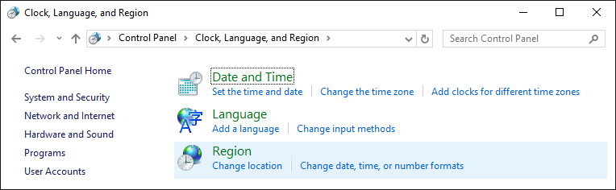

Упражнения: Прости пресмятания
==============================

Задачи за упражнение в клас и за домашно към курса [„Основи на
програмирането" @
СофтУни](https://softuni.bg/courses/programming-basics).

Празно Visual Studio решение (Blank Solution)
---------------------------------------------

Създайте празно решение (**Blank Solution**) във Visual Studio.
Решенията (solutions) във Visual Studio обединяват **група проекти**.
Тази възможност е изключително удобна, когато искаме да работим по
няколко проекта и бързо да превключваме между тях или искаме да обединим
логически няколко взаимосвързани проекта.

В настоящото практическо занимание ще използваме **Blank Solution с
няколко проекта** за да организираме решенията на задачите от
упражненията -- всяка задача в отделен проект и всички проекти в общ
solution.

1.  Стартирайте Visual Studio.

2.  Създайте нов **Blank Solution**: \[File\] \[New\] \[Project\].

{width="5.694444444444445in"
height="3.077782152230971in"}

3.  Изберете от диалоговия прозорец \[Templates\] \[Other Project
    Types\] \[Visual Studio Solutions\] \[**Blank Solution**\] и дайте
    подходящо име на проекта, например "**Simple-Calculations**":

{width="5.705745844269466in"
height="3.2156692913385827in"}

Сега имате създаден **празен Visual Studio Solution** (с 0 проекта в
него):

{width="5.917650918635171in"
height="3.64246062992126in"}

Целта на този blank solution e да добавяте в него **по един проект за
всяка задача** от упражненията.

Пресмятане на лице на квадрат
-----------------------------

Първата задача от тази тема е следната: да се напише **конзолна
програма**, която **прочита цяло число** „**a"**, въведено от
потребителя, и **пресмята лицето на квадрат** **със страна** „**a"**.
Задачата е тривиално лесна: въвеждате число от конзолата, умножавате го
само по себе си и печатате получения резултат на конзолата.

1.  Създайте **нов проект** в съществуващото Visual Studio решение. В
    Solution Explorer кликнете с десен бутон на мишката върху **Solution
    \'Simple-Calculations\'**. Изберете \[Add\] \[New Project...\]:

{width="5.798248031496063in"
height="3.571187664041995in"}

2.  Ще се отвори диалогов прозорец за избор на тип проект за създаване.
    Изберете C\# конзолно приложение с име "**Square-Area**":

{width="6.478521434820648in"
height="3.6511898512685916in"}

Вече имате solution с едно конзолно приложение в него. Остава да
напишете кода за решаване на задачата.

3.  Отидете в тялото на метода **Main(string\[\] args)** и напишете кода
    от картинката по-долу:

{width="4.315144356955381in"
height="3.1112795275590552in"}

Кодът прочита цяло число с **a** **=**
**int.Parse(Console.ReadLine())**, след това изчислява **area** **=**
**a** **\*** **a** и накрая печата стойността на променливата **area**.

4.  **Стартирайте** програмата с \[Ctrl+F5\] и я **тествайте** с
    различни входни стойности:

{width="3.732587489063867in"
height="1.1054199475065616in"}

5.  **Тествайте** решението си в **judge системата**:
    <https://judge.softuni.bg/Contests/Practice/Index/151#0>. Трябва да
    получите 100 точки (напълно коректно решение):

{width="6.656486220472441in"
height="4.927777777777778in"}

{width="6.750468066491688in"
height="1.690161854768154in"}

От инчове към сантиметри
------------------------

Да се напише програма, която **чете от конзолата число** (не непременно
цяло), въведено от потребителя, и преобразува числото **от инчове в
сантиметри**. За целта **умножава инчовете по 2.54** (защото 1 инч =
2.54 сантиметра).

1.  Първо създайте **нов C\# конзолен проект** в решението
    "**Simple-Calculations**". Кликнете с мишката върху решението в
    Solution Explorer и изберете \[Add\] \[New Project...\]:

{width="5.49253937007874in"
height="1.5529505686789151in"}

Изберете \[Visual C\#\] \[Windows\] \[Console Application\] и задайте
име "**Inches-to-Centimeters**":

{width="6.5156692913385825in"
height="3.672128171478565in"}

2.  **Напишете кода** на програмата. Може да си помогнете с примерния
    код от картинката:

{width="4.4415463692038495in"
height="1.671634951881015in"}

3.  **Стартирайте програмата**, както обикновено с \[Ctrl+F5\]:

{width="4.231342957130359in"
height="1.112714348206474in"}

Изненада! Како става? Програмата не работи правилно... Всъщност това не
е ли предходната програма?

Във Visual Studio **текущият активен проект** в един solution е маркиран
в получерно и може да се сменя:

{width="2.088860454943132in"
height="2.2238812335958005in"}

4.  За да включите режим на **автоматично преминаване към текущия
    проект**, кликнете върху главния solution с десния бутон на мишката
    и изберете **\[Set StartUp Projects...\]**:

{width="4.254215879265092in"
height="2.5746270778652667in"}

Ще се появи диалогов прозорец, от който трябва да се избере **\[Startup
Project\]** \[**Current selection**\]:

{width="6.710157480314961in"
height="3.9701498250218723in"}

5.  Сега отново **стартирайте програмата**, както обикновено с
    \[Ctrl+F5\]. Този път ще се стартира текущата отворена програма,
    която преобразува инчове в сантиметри. Изглежда работи коректно:

{width="4.076174540682414in"
height="1.1940299650043744in"}

6.  Сега **превключете към преходната програма** (лице на квадрат). Това
    става с двоен клик на мишката върху файла **Program.cs** от
    предходния проект "**Square-Area**" в панела \[Solution Explorer\]
    на Visual Studio:

{width="7.135637576552931in"
height="4.216418416447944in"}

7.  Натиснете пак **\[Ctrl+F5\]**. Този път трябва да се стартира
    другият проект:

{width="4.452833552055993in"
height="0.9477602799650043in"}

8.  Превключете обратно към проекта "**Inches-to-Centimeters**" и го
    стартирайте с **\[Ctrl+F5\]**:

{width="4.517163167104112in"
height="1.1417913385826772in"}

**Превключването между проектите** е много лесно, нали? Просто избираме
файла със сорс кода на програмата, кликваме го два пъти с мишката и при
стартиране тръгва програмата от този файл.

9.  Тествайте с **дробни числа**, например с **2.5**:

{width="4.276118766404199in"
height="1.2021216097987752in"}

**Внимание:** в зависимост от регионалните настройки на операционната
система, е възможно вместо **десетична точка** (US настройки) да се
използва **десетична запетая** (BG настройки). Ако програмата очаква
десетична точка и бъде въведено число с десетична запетая или на обратно
(бъде въведена десетична точка когато се очаква десетична запетая), ще
се получи следната грешка:

{width="6.694029965004375in"
height="2.2138101487314086in"}

Препоръчително е **да промените настройките на компютъра си**, така че
да се използва **десетична точка**:

{width="7.080435258092739in"
height="2.186894138232721in"}

{width="7.142050524934383in"
height="4.5898031496063in"}

10. Вече е време за **тестване в judge системата**:
    <https://judge.softuni.bg/Contests/Practice/Index/151#1>. Решението
    би трябвало да бъде прието като напълно коректно:

{width="6.248031496062992in"
height="2.074803149606299in"}

Поздрав по име
--------------

Да се напише програма, която **чете от конзолата име на човек**,
въведено от потребителя, и отпечатва "**Hello,** **\<name\>!**", където
**\<name\>** е въведеното преди това име.

1.  Първо създайте **нов C\# конзолен проект** с име "**Greeting**" в
    решението "**Simple-Calculations**":

{width="5.503677821522309in"
height="3.149253062117235in"}

2.  **Напишете кода** на програмата. Ако се затруднявате, може да
    ползвате примерния код по-долу:

{width="5.512012248468942in"
height="3.1540223097112863in"}

3.  **Стартирайте** програмата с **\[Ctrl+F5\]** и я тествайте:

{width="4.45522419072616in"
height="1.1816721347331585in"}

4.  Тествайте в **judge системата**:
    <https://judge.softuni.bg/Contests/Practice/Index/151#2>. Преди да
    пратите решението сложете коментар на първия ред, който печата
    "Enter your name".

Съединяване на текст и числа
----------------------------

Напишете C\# програма, която прочита от конзолата име, фамилия, възраст
и град, въведени от потребителя, и печата съобщение от следния вид:
"**You are \<firstName\> \<lastName\>, a \<age\>-years old person from
\<town\>**".

1.  Добавете към текущото Visual Studio решение още един **конзолен C\#
    проект** с име "**Concatenate-Data**".

2.  **Напишете кода**, който чете входните данни от конзолата:

{width="3.649253062117235in"
height="0.8432841207349081in"}

3.  **Допишете код**, който отпечатва описаното в условието на задачата
    съобщение.

{width="4.977243000874891in"
height="0.7916666666666666in"}

На горната картинка кодът е нарочно даден размазан, за да помислите как
да си го напишете сами.

4.  **Тествайте** решението локално с \[Ctrl+F5\] и въвеждане на
    примерни данни.

5.  Тествайте решението си в **judge системата**:
    <https://judge.softuni.bg/Contests/Practice/Index/151#3>.

Лице на трапец
--------------

Напишете програма, която чете от конзолата три числа **b1**, **b2** и
**h**, въведени от потребителя, и **пресмята лицето на трапец** с основи
**b1** и **b2** и височина **h**. **Формулата за лице на трапец** е
**(b1** **+** **b2)** **\*** **h** **/** **2**.

На фигурата по-долу е показан трапец със страни 8 и 13 и височина 7. Той
има лице (8 + 13) \* 7 / 2 = 73.5.

{width="4.223880139982502in"
height="2.4046270778652667in"}

1.  Добавете към текущото Visual Studio решение още един **конзолен C\#
    проект** с име "**Trapezoid-Area**".

2.  **Напишете кода**, който чете входните данни от конзолата, пресмята
    лицето на трапеца и го отпечатва:

{width="4.160603674540682in"
height="1.5542082239720034in"}

Кодът на картинката е нарочно размазан, за да си го доизмислите и
допишете сами.

3.  **Тествайте** решението локално с \[Ctrl+F5\] и въвеждане на
    примерни данни.

4.  Тествайте решението си в **judge системата**:
    <https://judge.softuni.bg/Contests/Practice/Index/151#4>.

Периметър и лице на кръг
------------------------

Напишете програма, която чете от конзолата **число** **r**,въведено от
потребителя, и пресмята и отпечатва **лицето** и **периметъра на кръг**
/ окръжност с радиус **r**.

+----------+------------------------------+
| **вход** | **изход**                    |
+==========+==============================+
| 3        | Area = 28.2743338823081      |
|          |                              |
|          | Perimeter = 18.8495559215388 |
+----------+------------------------------+
| 4.5      | Area = 63.6172512351933      |
|          |                              |
|          | Perimeter = 28.2743338823081 |
+----------+------------------------------+

За изчисленията можете да използвате следните формули:

-   area = Math.PI \* r \* r

-   perimeter = 2 \* Math.PI \* r

Тествайте решението си в **judge системата**:
<https://judge.softuni.bg/Contests/Practice/Index/151#5>.

Лице на правоъгълник в равнината
--------------------------------

{width="3.767361111111111in"
height="3.2993055555555557in"}**Правоъгълник** е зададен с
**координатите** на два от своите срещуположни ъгъла (**x1**, **y1**) --
(**x2**, **y2**). Да се пресметнат **площта** и **периметъра** му.
**Входът** се въвежда от потребителя. Числата **x1**, **y1**, **x2** и
**y2** са дадени по едно наред. **Изходът** се извежда на конзолата и
трябва да съдържа два реда с по една число на всеки от тях -- лицето и
периметъра.

+----------+-------------+
| **вход** | **изход**   |
+==========+=============+
| 60       | 1500        |
|          |             |
| 20       | 160         |
|          |             |
| 10       |             |
|          |             |
| 50       |             |
+----------+-------------+
| 30       | 2000        |
|          |             |
| 40       | 180         |
|          |             |
| 70       |             |
|          |             |
| -10      |             |
+----------+-------------+
| 600.25   | 350449.6875 |
|          |             |
| 500.75   | 2402        |
|          |             |
| 100.50   |             |
|          |             |
| -200.5   |             |
+----------+-------------+

Тествайте решението си в **judge системата**:
<https://judge.softuni.bg/Contests/Practice/Index/151#6>.

Лице на триъгълник
------------------

Напишете програма, която чете от конзолата **страна** и **височина** на
**триъгълник,** въведени от потребителя, и пресмята неговото лице.
Използвайте **формулата** за лице на триъгълник: **area** **=** **a**
**\*** **h** **/** **2**. Закръглете резултата до **2 знака след
десетичната точка** използвайки [**Math.Round(area,
2)**](https://msdn.microsoft.com/en-us/library/75ks3aby(v=vs.110).aspx).

+----------+-----------------------+
| **вход** | **изход**             |
+==========+=======================+
| 20       | Triangle area = 300   |
|          |                       |
| 30       |                       |
+----------+-----------------------+
| 15       | Triangle area = 262.5 |
|          |                       |
| 35       |                       |
+----------+-----------------------+
| 7.75     | Triangle area = 32.74 |
|          |                       |
| 8.45     |                       |
+----------+-----------------------+
| 1.23456  | Triangle area = 2.82  |
|          |                       |
| 4.56789  |                       |
+----------+-----------------------+

Тествайте решението си в **judge системата**:
<https://judge.softuni.bg/Contests/Practice/Index/151#7>.

Конзолен конвертор: от градуси °C към градуси °F
------------------------------------------------

Напишете програма, която чете **градуси по скалата на Целзий** (°C),
въведени от потребителя, и ги преобразува до **градуси по скалата на
Фаренхайт** (°F). Потърсете в Интернет подходяща
[формула](http://bfy.tw/3rGh), с която да извършите изчисленията.
Примери:

  **вход**   **изход**      **вход**   **изход**      **вход**   **изход**      **вход**   **изход**
  ---------- ----------- -- ---------- ----------- -- ---------- ----------- -- ---------- -----------
  25         77             0          32             -5.5       22.1           32.3       90.14

Тествайте решението си в **judge системата**:
<https://judge.softuni.bg/Contests/Practice/Index/151#8>.

Конзолен конвертор: от радиани в градуси
----------------------------------------

Напишете програма, която чете **ъгъл в
[радиани](https://bg.wikipedia.org/wiki/%D0%A0%D0%B0%D0%B4%D0%B8%D0%B0%D0%BD)**
(rad), въведен от потребителя, и го преобразува в
[**градуси**](https://bg.wikipedia.org/wiki/%D0%93%D1%80%D0%B0%D0%B4%D1%83%D1%81_(%D1%8A%D0%B3%D1%8A%D0%BB))
(deg). Потърсете в Интернет подходяща формула. Числото **π** в C\#
програми е достъпно чрез **Math.PI**. Закръглете резултата до
най-близкото цяло число използвайки **Math.Round()**. Примери:

  **вход**   **изход**      **вход**   **изход**      **вход**   **изход**      **вход**   **изход**
  ---------- ----------- -- ---------- ----------- -- ---------- ----------- -- ---------- -----------
  3.1416     180            6.2832     360            0.7854     45             0.5236     30

Тествайте решението си в **judge системата**:
<https://judge.softuni.bg/Contests/Practice/Index/151#9>.

Конзолен конвертор: USD към BGN
-------------------------------

Напишете програма за **конвертиране на щатски долари** (USD) **в
български лева** (BGN). **Закръглете** резултата до **2 цифри** след
десетичната точка. Използвайте фиксиран **курс** между долар и лев: **1
USD** = **1.79549 BGN**.

  **вход**   **изход**      **вход**   **изход**       **вход**   **изход**
  ---------- ----------- -- ---------- ------------ -- ---------- -----------
  20         35.91 BGN      100        179.55 BGN      12.5       22.44 BGN

Тествайте решението си в **judge системата**:
<https://judge.softuni.bg/Contests/Practice/Index/151#10>.

\* Конзолен междувалутен конвертор
----------------------------------

Напишете програма за **конвертиране на парична сума от една валута в
друга**. Трябва да се поддържат следните валути: **BGN**, **USD**,
**EUR**, **GBP**. Използвайте следните фиксирани валутни курсове:

  **Курс**    **USD**   **EUR**   **GBP**
  ----------- --------- --------- ---------
  **1 BGN**   1.79549   1.95583   2.53405

**Входът** e **сума за конвертиране**, **входна валута**, **изходна
валута**, въведени от потребителя. **Изходът** е едно число --
преобразуваната сума по посочените по-горе курсове, закръглен до **2
цифри** след десетичната точка. Примери:

<table>
<thead>
<tr class="header">
<th><strong>вход</strong></th>
<th><strong>изход</strong></th>
<th></th>
<th><strong>вход</strong></th>
<th><strong>изход</strong></th>
<th></th>
<th><strong>вход</strong></th>
<th><strong>изход</strong></th>
<th></th>
<th><strong>вход</strong></th>
<th><strong>изход</strong></th>
</tr>
</thead>
<tbody>
<tr class="odd">
<td>
20

USD

BGN
</td>
<td>35.91 BGN</td>
<td></td>
<td>
100

BGN

EUR
</td>
<td>51.13 EUR</td>
<td></td>
<td>
12.35

EUR

GBP
</td>
<td>9.53 GBP</td>
<td></td>
<td>
150.35

USD

EUR
</td>
<td>138.02 EUR</td>
</tr>
</tbody>
</table>

Тествайте решението си в **judge системата**:
<https://judge.softuni.bg/Contests/Practice/Index/151#11>.

\*\* Пресмятане с дати: 1000 дни на Земята
------------------------------------------

Напишете програма, която чете **рождена дата** във формат
"**dd-MM-yyyy**", въведена от потребителя, и пресмята датата, на която
се навършват **1000 дни** от тази рождена дата и я отпечатва в същия
формат.

  **вход**     **изход**
  ------------ ------------
  25-02-1995   20-11-1997
  07-11-2003   02-08-2006
  30-12-2002   24-09-2005
  01-01-2012   26-09-2014
  14-06-1980   10-03-1983

**\* Подсказки**: потърсете информация за типа **DateTime** в C\# и
по-конкретно разгледайте методите **ParseExact(str,** **format)**,
**AddDays(count)** и **ToString(format)**. С тяхна помощ може да решите
задачата, без да е необходимо да изчислявате дни, месеци и високосни
години.

Тествайте решението си в **judge системата**:
<https://judge.softuni.bg/Contests/Practice/Index/151#12>. Не печатайте
нищо допълнително на конзолата освен изискваната дата!

Упражнения: Графични и Web приложения
=====================================

Графично приложение: конвертор от BGN към EUR
---------------------------------------------

Създайте **графично приложение** (GUI application), което пресмята
стойността в **евро** (EUR) на парична сума, зададена в **лева** (BGN).
При промяна на стойността в лева, равностойността в евро трябва да се
преизчислява автоматично. Използвайте курс лева / евро: **1.95583**.

{width="3.4716043307086615in"
height="1.4736067366579177in"}

1.  Добавете към текущото Visual Studio решение още един проект. Този
    път създайте **Windows Forms** приложение със C\# с име
    "**BGN-to-EUR-Converter**":

{width="6.701502624671916in"
height="3.7768613298337708in"}

2.  Подредете следните UI контролите във формата:

-   **NumericUpDown** с име **numericUpDownAmount** -- ще въвежда сумата
    за конвертиране

-   **Label** с име **labelResult** -- ще показва резултата след
    конвертиране

-   Още два Label компонента, служещи единствено за статично
    изобразяване на текст

Графичният редактор за потребителски интерфейс може да изглежда по
подобен начин:

{width="7.246527777777778in"
height="3.2756944444444445in"}

3.  Задайте настройки на формата и на отделните контроли:

FormConverter

{width="3.4692344706911635in"
height="1.5522998687664042in"}

-   Text = \"BGN to EUR\"

-   Font.Size = 12

-   MaximizeBox = False

-   MinimizeBox = False

-   FormBorderStyle = FixedSingle

numericUpDownAmount

{width="1.156411854768154in"
height="0.3750524934383202in"}

-   Value = 1

-   Minimum = 0

-   Maximum = 10000000

-   TextAlign = Right

-   DecimalPlaces = 2

labelResult

{width="3.0837642169728783in"
height="0.44797900262467194in"}

-   AutoSize = False

-   BackColor = PaleGreen

-   TextAlign = MiddleCenter

-   Font.Size = 14

-   Font.Bold = True

4.  Дефинирайте **обработчици на събития** по контролите:

{width="6.72799978127734in"
height="3.2263451443569555in"}

Хванете следните събития:

-   **FormConverter.Load** (кликнете върху формата с мишката 2 пъти)

-   **numericUpDownAmount.ValueChanged** (кликнете върху
    **NumericUpDown** контролата 2 пъти)

-   **numericUpDownAmount.KeyUp** (изберете **Events** от таблото
    **Properties** и кликнете 2 пъти върху **KeyUp**)

Събитието **Form.Load** се изпълнява при стартиране на програмата, преди
да се появи прозореца на приложението. Събитието
**NumericUpDown.ValueChanged** се изпълнява при промяна на стойността в
полето за въвеждане на число. Събитието **NumericUpDown.KeyUp** се
изпълнява след натискане на клавиш в полето за въвеждане на число. При
всяко от тези събития ще преизчисляваме резултата.

За **хващане на събитие** ползвайте иконката със събитията в
**Properties** прозореца във Visual Studio:

{width="3.3900109361329833in"
height="2.2640004374453193in"}

Сложете следния **C\#** **код** за обработка на събитията:

+-----------------------------------------------------------------------+
| private void FormConverter\_Load(object sender, EventArgs e)          |
|                                                                       |
| {                                                                     |
|                                                                       |
| ConvertCurrency();                                                    |
|                                                                       |
| }                                                                     |
|                                                                       |
| private void numericUpDownAmount\_ValueChanged(object sender,         |
| EventArgs e)                                                          |
|                                                                       |
| {                                                                     |
|                                                                       |
| ConvertCurrency();                                                    |
|                                                                       |
| }                                                                     |
|                                                                       |
| private void numericUpDownAmount\_KeyUp(object sender, KeyEventArgs   |
| e)                                                                    |
|                                                                       |
| {                                                                     |
|                                                                       |
| ConvertCurrency();                                                    |
|                                                                       |
| }                                                                     |
+-----------------------------------------------------------------------+

Всички прихванати събития извикват метода **ConvertCurrency()**, който
конвертира зададената сума от лева в евро и показва резултата в зелената
кутийка.

5.  **Напишете кода** (програмната логика) за конвертиране от лева към
    евро:

+-------------------------------------------------+
| private void ConvertCurrency()                  |
|                                                 |
| {                                               |
|                                                 |
| var amountBGN = this.numericUpDownAmount.Value; |
|                                                 |
| var amountEUR = amountBGN \* 1.95583m;          |
|                                                 |
| this.labelResult.Text =                         |
|                                                 |
| amountBGN + \" BGN = \" +                       |
|                                                 |
| Math.Round(amountEUR, 2) + \" EUR\";            |
|                                                 |
| }                                               |
+-------------------------------------------------+

6.  **Стартирайте** проектa с \[Ctrl+F5\] и тествайте дали работи
    правилно.

\*\*\* Графично приложение: хвани бутона!
-----------------------------------------

{width="3.9763888888888888in"
height="2.5965277777777778in"}Създайте забавно графично приложение
„**хвани бутона**": една **форма** съдържа един **бутон**. При
преместване на курсора на мишката върху бутона той се премества на
случайна позиция. Така се създава усещане, че „**бутонът бяга от
мишката** и е трудно да се хване". При „хващане" на бутона се извежда
съобщение-поздрав.

**\* Подсказка**: напишете обработчик за събитието **Button.MouseEnter**
и премествайте бутона на случайна позиция. Използвайте генератор за
случайни числа **Random**. Позицията на бутона се задава от свойството
**Location**. За да бъде новата позиция на бутона в рамките на формата,
можете да направите изчисления спрямо размера на формата, достъпен от
свойството **ClientSize**. Можете да ползвате следния код за ориентир:

+-----------------------------------------------------------------------+
| private void **buttonCatchMe**\_**MouseEnter**(object sender,         |
| EventArgs e)                                                          |
|                                                                       |
| {                                                                     |
|                                                                       |
| Random rand = new Random();                                           |
|                                                                       |
| var maxWidth = this.ClientSize.Width -                                |
| buttonCatchMe.ClientSize.Width;                                       |
|                                                                       |
| var maxHeight = this.ClientSize.Height -                              |
| buttonCatchMe.ClientSize.Height;                                      |
|                                                                       |
| this.buttonCatchMe.Location = new Point(                              |
|                                                                       |
| rand.Next(maxWidth), rand.Next(maxHeight));                           |
|                                                                       |
| }                                                                     |
+-----------------------------------------------------------------------+

Изпитни задачи от минали издания на курса
=========================================

{width="3.7708333333333335in" height="2.2222222222222223in"}\*Учебна зала
-----------------------------------------------------------------------------------------------

*Първа задача от изпита на 6 март 2016. Тествайте решението си
[**тук**](https://judge.softuni.bg/Contests/Practice/Index/169#0).*

**Учебна зала** има правоъгълен размер **w** на **h** метра, без колони
във вътрешността си. Залата е разделена на две части -- лява и дясна, с
коридор приблизително по средата. В лявата и в дясната част има **редици
с бюра**. В задната част на залата има голяма **входна врата**. В
предната част на залата има **катедра** с подиум за преподавателя. Едно
**работно място** заема **70 на 120 cm** (маса с размер 70 на 40 cm +
място за стол и преминаване с размер 70 на 80 cm). **Коридорът** е широк
поне **100 cm**. Изчислено е, че заради **входната врата** (която е с
отвор 160 cm) се губи точно **1 работно място**, а заради **катедрата**
(която е с размер 160 на 120 cm) се губят точно **2 работни места**.
Напишете програма, която прочита размерите на учебната зала и изчислява
**броя работни места в нея** при описаното разположение (вж. фигурата).

### Вход

От конзолата се четат 2 **числа**, по едно на ред: **h** (дължина в
метри) и **w** (широчина в метри) , въведени от потребителя.

Ограничения: **3** ≤ **h** ≤ **w** ≤ **100**.

### Изход

Да се отпечата на конзолата едно цяло число: **броят места** в учебната
зала.

### Примерен вход и изход

+-----------------+-----------------+-----------------+-----------------+
| **Вход**        | **Изход**       | **Чертеж**      | **Обяснения**   |
+=================+=================+=================+=================+
| 15              | 129             | {width=" | 1500 cm. В тях  |
| 8.9             |                 | 2.1010422134733 | могат да бъдат  |
|                 |                 | 16in"           | разположени     |
|                 |                 | height="1.23611 | **12 реда** (12 |
|                 |                 | 11111111112in"} | \* 120 cm =     |
|                 |                 |                 | 1440 + 60 cm    |
|                 |                 |                 | остатък).       |
|                 |                 |                 |                 |
|                 |                 |                 | Залата е широка |
|                 |                 |                 | 890 cm. От тях  |
|                 |                 |                 | 100 cm отиват   |
|                 |                 |                 | за коридора в   |
|                 |                 |                 | средата. В      |
|                 |                 |                 | останалите 790  |
|                 |                 |                 | cm могат да се  |
|                 |                 |                 | разположат по   |
|                 |                 |                 | **11 бюра**     |
|                 |                 |                 | **на ред** (11  |
|                 |                 |                 | \* 70 cm = 770  |
|                 |                 |                 | cm + 20 cm      |
|                 |                 |                 | остатък).       |
|                 |                 |                 |                 |
|                 |                 |                 | **Брой места**  |
|                 |                 |                 | = **12 \* 11 -  |
|                 |                 |                 | 3** = 132 - 3 = |
|                 |                 |                 | **129** (имаме  |
|                 |                 |                 | 12 реда по 11   |
|                 |                 |                 | места = 132     |
|                 |                 |                 | минус 3 места   |
|                 |                 |                 | за катедра и    |
|                 |                 |                 | входна врата).  |
+-----------------+-----------------+-----------------+-----------------+
| 8.4             | 39              | {width=" | 840 cm. В тях   |
| 5.2             |                 | 2.1088560804899 | могат да бъдат  |
|                 |                 | 386in"          | разположени **7 |
|                 |                 | height="1.28740 | реда** (7 \*    |
|                 |                 | 81364829397in"} | 120 cm = 840,   |
|                 |                 |                 | без остатък).   |
|                 |                 |                 |                 |
|                 |                 |                 | Залата е широка |
|                 |                 |                 | 520 cm. От тях  |
|                 |                 |                 | 100 cm отиват   |
|                 |                 |                 | за коридора в   |
|                 |                 |                 | средата. В      |
|                 |                 |                 | останалите 420  |
|                 |                 |                 | cm могат да се  |
|                 |                 |                 | разположат по   |
|                 |                 |                 | **6 бюра** **на |
|                 |                 |                 | ред** (6 \* 70  |
|                 |                 |                 | cm = 420 cm,    |
|                 |                 |                 | без остатък).   |
|                 |                 |                 |                 |
|                 |                 |                 | **Брой места**  |
|                 |                 |                 | = **7 \* 6 -    |
|                 |                 |                 | 3** = 42 - 3 =  |
|                 |                 |                 | **39** (имаме 7 |
|                 |                 |                 | реда по 6 места |
|                 |                 |                 | = 42 минус 3    |
|                 |                 |                 | места за        |
|                 |                 |                 | катедра и       |
|                 |                 |                 | входна врата).  |
+-----------------+-----------------+-----------------+-----------------+

\*Зеленчукова борса
-------------------

*Първа задача от изпита на 26 март 2016. Тествайте решението си*
***[тук](https://judge.softuni.bg/Contests/Practice/Index/179#0).***

Градинар продавал реколтата от градината си на зеленчуковата борса.
Продава **зеленчуци за** **N лева на килограм** и **плодове за M лева за
килограм**. Напишете програма, която да **пресмята приходите от
реколтата в евро** ( ако приемем, че **едно евро** е равно на
**1.94лв**).

### Вход

От конзолата се четат **4 числа**, по едно на ред, въведени от
потребителя:

-   Първи ред -- Цена за килограм зеленчуци -- число с плаваща запетая

-   Втори ред -- Цена за килограм плодове -- число с плаваща запетая

-   Трети ред -- Общо килограми на зеленчуците -- цяло число

-   Четвърти ред -- Общо килограми на плодовете -- цяло число

**Ограничения**: **Всички числа ще са в интервала от 0.00 до 1000.00**

### Изход

Да се отпечата на конзолата **едно число с плаваща запетая**:
**приходите от всички плодове и зеленчуци в** **евро**. Резултатът **да
се форматира до втория знак след запетаята.**

### Примерен вход и изход

+----------+-----------+----------------------------------------------------+
| **Вход** | **Изход** | **Обяснения**                                      |
+==========+===========+====================================================+
| 0.194    | 101.00    | Зеленчуците струват -- 0.194лв. \* 10кг. = 1.94лв. |
|          |           |                                                    |
| 19.4     |           | Плодовете струват -- 19.4лв. \* 10кг. = 194лв.     |
|          |           |                                                    |
| 10       |           | Общо -- 195.94лв. = 101евро                        |
|          |           |                                                    |
| 10       |           |                                                    |
+----------+-----------+----------------------------------------------------+
| 1.5      | 20.62     |                                                    |
|          |           |                                                    |
| 2.5      |           |                                                    |
|          |           |                                                    |
| 10       |           |                                                    |
|          |           |                                                    |
| 10       |           |                                                    |
+----------+-----------+----------------------------------------------------+

\*Ремонт на плочки
------------------

*Първа задача от изпита на 24 април 2016. Тествайте решението си*
***[тук](https://judge.softuni.bg/Contests/Practice/Index/181#0).***

**На** **площадката** пред жилищен блок трябва да се **поставят
плочки**. **Площадката** **е** с форма на **квадрат** **със страна N
метра**. **Плочките** са **широки „W" метра** и **дълги „L" метра**. На
площадката има **една** **пейка с ширина M метра** и **дължина O
метра**. Под нея **не е нужно** да се слагат плочки. **Всяка плочка** се
поставя за **0.2 минути**.

Напишете **програма**, която **чете от конзолата** **размерите** на
**площадката**, **плочките** и **пейката** и пресмята **колко плочки са
необходими** да се покрие площадката и пресмята **времето за поставяне
на всички плочки**.

**Пример:** **площадка** с **размер** **20м.** има **площ 400кв.м**.
**Пейка** широка **1м.** и дълга **2м.**, заема **площ 2кв.м**. Една
**плочка** е **широка** **5м.** и **дълга 4м.** има **площ = 20кв.м.**
**Площта** която трябва да се покрие е **400 -- 2 = 398 кв.м.**
Необходими са **398 / 20 = 19.90 плочки**. Необходимото **време** е
**19.90 \* 0.2 = 3.98 минути**.

### Вход

От конзолата се четат **5 числа**, въведени от потребителя:

-   **N** -- **дължината** на **страна** от **площадката** в интервала
    **\[1\...100\]**

-   **W** -- **широчината** на една **плочка** в интервала
    **\[0.1\...10.00\]**

-   **L** -- **дължината** на една **плочка** в интервала
    **\[0.1\...10.00\]**

-   **М** -- **широчината** на **пейката** в интервала **\[0\...10\]**

-   **О** -- **дължината** на **пейката** в интервала **\[0\...10\]**

### Изход

Да се отпечата на конзолата две числа: **броят плочки**, необходим за
ремонта и **времето за поставяне**, всяко на нов ред. Резултатът **да се
форматира до втория знак след запетаята.**

### Примерен вход и изход

+-----------------------+-----------------------+-----------------------+
| **Вход**              | **Изход**             | **Обяснения**         |
+=======================+=======================+=======================+
| 20                    | 19.90                 | **Обща площ** = 20 \* |
|                       |                       | 20 = **400**; площ на |
| 5                     | 3.98                  | **пейката** = 1 \* 2  |
|                       |                       | = **2**               |
| 4                     |                       |                       |
|                       |                       | **Площ** **за         |
| 1                     |                       | покриване** = 400 --  |
|                       |                       | 2 = **398**           |
| 2                     |                       |                       |
|                       |                       | **Площ на плочки** =  |
|                       |                       | 5 \* 4 = **20**       |
|                       |                       |                       |
|                       |                       | **Необходими плочки** |
|                       |                       | = 398 / 20 = **19.9** |
|                       |                       |                       |
|                       |                       | **Необходимо време**  |
|                       |                       | = 19.9 \* 0.2 =       |
|                       |                       | **3.98**              |
+-----------------------+-----------------------+-----------------------+
| 40                    | 3302.08               |                       |
|                       |                       |                       |
| 0.8                   | 660.42                |                       |
|                       |                       |                       |
| 0.6                   |                       |                       |
|                       |                       |                       |
| 3                     |                       |                       |
|                       |                       |                       |
| 5                     |                       |                       |
+-----------------------+-----------------------+-----------------------+

\*Парички
---------

*Първа задача от изпита на 17 юли 2016. Тествайте решението си*
***[тук](https://judge.softuni.bg/Contests/Practice/Index/233#0).***

Преди време **Пешо си е купил биткойни**. Сега ще ходи на екскурзия из
Европа и **ще му трябват евра**. Освен биткойни **има и китайски юанa**.
Пешо иска да **обмени парите** си **в евро** за екскурзията. Напишете
програма, която да **пресмята колко евра може да купи спрямо следните
валутни курсове:**

-   **1 биткойн** = **1168 лева**.

-   **1 китайски юан** = **0.15 долара**.

-   **1 долар** = **1.76 лева**.

-   **1 евро** = **1.95 лева**.

Обменnото бюро има **комисионна от 0 до 5 процента от крайната сума в
евро. **

### Вход

От конзолата се четат **3 числа**, въведени от потребителя:

-   На **първия ред** -- **броят биткойни**. **Цяло число в интервала**
    **\[0...20\]**

-   На **втория ред** -- **броят китайски юана**. **Реално число в
    интервала \[0.00... 50 000.00\]**

-   На **третия ред** -- **комисионната. Реално число в интервала \[0.00
    \... 5.00\]**

### Изход

На конзолата **да се отпечата 1 число** - **резултатът от обмяната на
валутите**. Резултатът **да се форматира до втория знак след
запетаята.**

### Примерен вход и изход

+-----------------+-----------------+-----------------+-----------------+
| **Вход**        | **Изход**       | **Обяснения**   |
+=================+=================+=================+=================+
| 1               | 569.67          | 1 биткойн =     |                 |
|                 |                 | **1168 лева**   |                 |
| 5               |                 |                 |                 |
|                 |                 | 5 юана = 0.75   |                 |
| 5               |                 | долара          |                 |
|                 |                 |                 |                 |
|                 |                 | 0.75 долара =   |                 |
|                 |                 | **1.32 лева**   |                 |
|                 |                 |                 |                 |
|                 |                 | **1168 + 1.32 = |                 |
|                 |                 | 1169.32 лева**  |                 |
|                 |                 | =               |                 |
|                 |                 | **599.651282051 |                 |
|                 |                 | 282             |                 |
|                 |                 | евро**          |                 |
|                 |                 |                 |                 |
|                 |                 | **Комисионна:** |                 |
|                 |                 | 5% от           |                 |
|                 |                 | 599.65128205128 |                 |
|                 |                 | 2               |                 |
|                 |                 | =               |                 |
|                 |                 | **29.9825641025 |                 |
|                 |                 | 641**           |                 |
|                 |                 |                 |                 |
|                 |                 | **Резултат:**   |                 |
|                 |                 | 599.65128205128 |                 |
|                 |                 | 2               |                 |
|                 |                 | -               |                 |
|                 |                 | 29.982564102564 |                 |
|                 |                 | 1               |                 |
|                 |                 | =               |                 |
|                 |                 | **569.668717948 |                 |
|                 |                 | 718             |                 |
|                 |                 | евро**          |                 |
+-----------------+-----------------+-----------------+-----------------+
| **Вход**        | **Изход**       | **Вход**        | **Изход**       |
+-----------------+-----------------+-----------------+-----------------+
| 20              | 12442.24        | 7               | 10659.47        |
|                 |                 |                 |                 |
| 5678            |                 | 50200.12        |                 |
|                 |                 |                 |                 |
| 2.4             |                 | 3               |                 |
+-----------------+-----------------+-----------------+-----------------+

\*Дневна печалба
----------------

*Първа задача от изпита на 28 август 2016. Тествайте решението си*
***[тук](https://judge.softuni.bg/Contests/Practice/Index/274#0).***

Иван е програмист в **американска компания** и **работи** от вкъщи
**средно N дни** **в месеца** като изкарва **средно по M долара на
ден**. В края на годината Иван **получава бонус**, който е **равен на
2.5 месечни заплати**. **От спечеленото през годината му се удържат 25%
данъци.** Напишете програма, която да **пресмята, колко е чистата средна
печалба на Иван на ден в лева**, тъй като той харчи изкараното в
България. Приема се, че в **годината има точно 365 дни**. **Курсът на
долара** спрямо лева ще **се чете от конзолата**.

### Вход

От конзолата се четат 3 **числа**, въведени от потребителя:

-   На **първия ред** -- **работни дни в месеца**. **Цяло число в
    интервала** **\[5...30\]**

-   На **втория ред** -- **изкарани пари на ден**. **Реално число в
    интервала \[10.00... 2000.00\]**

-   На **третия ред -- курсът на долара спрямо лева /1 долар = X лева/.
    Реално число в интервала \[0.99... 1.99\]**

### Изход

На конзолата **да се отпечата 1 число** -- **средната печалба на ден в
лева**. Резултатът **да се форматира до втория знак след запетаята.**

### Примерен вход и изход

+-----------------+-----------------+-----------------+-----------------+
| **Вход**        | **Изход**       | **Обяснения**   |
+=================+=================+=================+=================+
| 21              | 74.61           | **1 месечна     |                 |
|                 |                 | заплата** = 21  |                 |
| 75.00           |                 | \* 75 = **1575  |                 |
|                 |                 | долара**        |                 |
| 1.59            |                 |                 |                 |
|                 |                 | **Годишен       |                 |
|                 |                 | доход** =       |                 |
|                 |                 | 1575\*12 +      |                 |
|                 |                 | 1575\*2.5 =     |                 |
|                 |                 | **22837.5       |                 |
|                 |                 | долара**        |                 |
|                 |                 |                 |                 |
|                 |                 | **Данък** = 25% |                 |
|                 |                 | от 22837.5 =    |                 |
|                 |                 | **5709.375**    |                 |
|                 |                 |                 |                 |
|                 |                 | **Чист годишен  |                 |
|                 |                 | доход** =       |                 |
|                 |                 | 17128.125       |                 |
|                 |                 | долара =        |                 |
|                 |                 | **27233.71875   |                 |
|                 |                 | лв**            |                 |
|                 |                 |                 |                 |
|                 |                 | **Средна        |                 |
|                 |                 | печалба на ден  |                 |
|                 |                 | =** 27233.71875 |                 |
|                 |                 | / 365 = **74.61 |                 |
|                 |                 | лева**          |                 |
+-----------------+-----------------+-----------------+-----------------+
| **Вход**        | **Изход**       | **Вход**        | **Изход**       |
+-----------------+-----------------+-----------------+-----------------+
| 15              | 80.24           | 22              | 196.63          |
|                 |                 |                 |                 |
| 105             |                 | 199.99          |                 |
|                 |                 |                 |                 |
| 1.71            |                 | 1.50            |                 |
+-----------------+-----------------+-----------------+-----------------+
