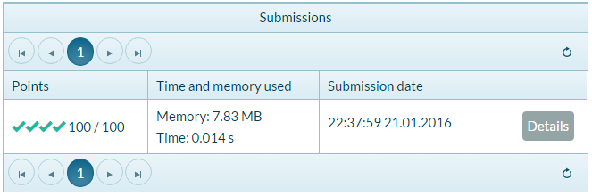

Упражнения: Прости проверки
===========================

Задачи за упражнение в клас и за домашно към курса [„Основи на
програмирането" @
СофтУни](https://softuni.bg/courses/programming-basics).

Празно Visual Studio решение (Blank Solution)
---------------------------------------------

Създайте празно решение (**Blank Solution**) във Visual Studio за да
организирате решенията на задачите от упражненията -- всяка задача ще
бъде в отделен проект и всички проекти ще бъдат в общ solution.

1.  Стартирайте Visual Studio.

2.  Създайте нов **Blank Solution**: \[File\] \[New\] \[Project\].

{width="5.694444444444445in"
height="3.077782152230971in"}

3.  Изберете от диалоговия прозорец \[Templates\] \[Other Project
    Types\] \[Visual Studio Solutions\] \[**Blank Solution**\] и дайте
    подходящо име на проекта, например "**Simple-Conditions**":

{width="6.5905271216097985in"
height="3.714315398075241in"}

Сега имате създаден **празен Visual Studio Solution** (без проекти в
него):

{width="6.606527777777778in"
height="3.5068099300087487in"}

Целта на този **blank solution** e да добавяте в него **по един проект
за всяка задача** от упражненията.

Проверка за отлична оценка
--------------------------

Първата задача от тази тема е да се напише **конзолна програма**, която
**чете оценка** (десетично число), въведена от потребителя, и отпечатва
"**Excellent!**", ако оценката е **5.50** или по-висока.

  **вход**   **изход**       **вход**   **изход**           **вход**   **изход**       **вход**   **изход**
  ---------- ------------ -- ---------- ---------------- -- ---------- ------------ -- ---------- ----------------
  6          Excellent!      5          *(няма изход)*      5.50       Excellent!      5.49       *(няма изход)*

1.  Създайте **нов проект** в съществуващото Visual Studio решение. В
    Solution Explorer кликнете с десен бутон на мишката върху **Solution
    \'Simple-Conditions\'**. Изберете \[Add\] \[New Project...\]:

{width="6.5359995625546805in"
height="4.025575240594925in"}

2.  Ще се отвори диалогов прозорец за избор на тип проект за създаване.
    Изберете C\# конзолно приложение и задайте име
    "**Excellent-Result**":

{width="6.508393482064742in"
height="3.6680271216097986in"}

Вече имате solution с едно конзолно приложение в него. Остава да
напишете кода за решаване на задачата.

3.  Отидете в тялото на метода **Main(string\[\]** **args)** и напишете
    решението на задачата. Можете да си помогнете с кода от картинката
    по-долу:

{width="5.25599956255468in"
height="3.344034339457568in"}

4.  **Стартирайте** програмата с \[Ctrl+F5\] и я **тествайте** с
    различни входни стойности:

{width="3.7754494750656167in"
height="0.8764446631671041in"}
{width="3.2240004374453193in"
height="0.8727602799650044in"}

5.  **Тествайте** решението си в **judge системата**:
    <https://judge.softuni.bg/Contests/Practice/Index/152#0>. Трябва да
    получите **100 точки** (напълно коректно решение):

{width="6.864583333333333in" height="5.65625in"}

{width="6.919160104986877in"
height="1.8197495625546807in"}

Отлична оценка или не
---------------------

Следващата задача от тази тема е да се напише **конзолна програма**,
която **чете оценка** (десетично число), въведена от потребителя, и
отпечатва "**Excellent!**", ако оценката е **5.50** или по-висока, или
"**Not excellent.**" в противен случай.

  **вход**   **изход**       **вход**   **изход**           **вход**   **изход**       **вход**   **изход**
  ---------- ------------ -- ---------- ---------------- -- ---------- ------------ -- ---------- ----------------
  6          Excellent!      5          Not excellent.      5.50       Excellent!      5.49       Not excellent.

1.  Първо създайте **нов C\# конзолен проект** в решението
    "**Simple-Conditions**".

    -   Кликнете с мишката върху решението в Solution Explorer и
        изберете \[Add\] \[**New Project**...\].

    -   Изберете \[Visual C\#\] \[Windows\] \[**Console Application**\]
        и задайте име "**Excellent-or-Not**".

2.  **Напишете кода** на програмата. Може да си помогнете с примерния
    код от картинката:

{width="4.236583552055993in"
height="2.005986439195101in"}

3.  Включете режим на **автоматично превключване към текущия проект**
    като кликнете върху главния solution с десния бутон на мишката и
    изберете **\[Set StartUp Projects...\]**:

{width="4.60799978127734in"
height="2.7887357830271218in"}

Ще се появи диалогов прозорец, от който трябва да се избере **\[Startup
Project\]** \[**Current selection**\]:

{width="6.693001968503937in" height="3.96in"}

4.  Сега **стартирайте програмата**, както обикновено с \[Ctrl+F5\] и я
    тествайте:

    {width="3.2240004374453193in"
    height="0.8727602799650044in"}
    {width="3.0265649606299214in"
    height="0.8611668853893263in"}

5.  Тествайте в **judge системата**:
    <https://judge.softuni.bg/Contests/Practice/Index/151#1>. Решението
    би трябвало да бъде прието като напълно коректно:

{width="6.248031496062992in"
height="2.074803149606299in"}

Четно или нечетно
-----------------

Да се напише програма, която чете **цяло число**, въведено от
потребителя, и печата дали е **четно** или **нечетно**. Примери:

  **вход**   **изход**      **вход**   **изход**      **вход**   **изход**      **вход**   **изход**
  ---------- ----------- -- ---------- ----------- -- ---------- ----------- -- ---------- -----------
  2          even           3          odd            25         odd            1024       even

1.  Първо добавете **нов C\# конзолен проект** в съществуващия solution.

2.  **Напишете кода** на програмата. Проверката за четност може да се
    реализира чрез проверка на **остатъка при деление на 2** по следния
    начин: **var even = (num % 2 == 0)**.

3.  **Стартирайте** програмата с **\[Ctrl+F5\]** и я тествайте:

{width="4.27200021872266in"
height="1.2228521434820647in"}

4.  Тествайте в **judge системата**:
    <https://judge.softuni.bg/Contests/Practice/Index/151#2>.

Намиране на по-голямото число
-----------------------------

Да се напише програма, която чете **две цели числа**, въведени от
потребителя, и отпечатва по-голямото от двете. Примери:

<table>
<thead>
<tr class="header">
<th><strong>вход</strong></th>
<th><strong>изход</strong></th>
<th></th>
<th><strong>вход</strong></th>
<th><strong>изход</strong></th>
<th></th>
<th><strong>вход</strong></th>
<th><strong>изход</strong></th>
<th></th>
<th><strong>вход</strong></th>
<th><strong>изход</strong></th>
</tr>
</thead>
<tbody>
<tr class="odd">
<td>
5

3
</td>
<td>5</td>
<td></td>
<td>
3

5
</td>
<td>5</td>
<td></td>
<td>
10

10
</td>
<td>10</td>
<td></td>
<td>
-5

5
</td>
<td>5</td>
</tr>
</tbody>
</table>

1.  Първо добавете **нов C\# конзолен проект** в съществуващия solution.

2.  **Напишете кода** на програмата. Необходима е единична
    **if**-**else** конструкция.

3.  **Стартирайте** програмата с **\[Ctrl+F5\]** и я тествайте:

{width="3.855999562554681in"
height="1.502136920384952in"}

4.  Тествайте решението си в **judge системата**:
    <https://judge.softuni.bg/Contests/Practice/Index/151#3>.

**Подсказка**: може да си помогнете частично с кода от картинката, който
е нарочно замъглен, за да помислите как да си го напишете сами:

{width="4.909333989501312in"
height="2.104000437445319in"}

Изписване на число до 10 с думи
-------------------------------

Да се напише програма, която чете **цяло число в диапазона \[0...9\]**,
въведено от потребителя, и го **изписва с думи** на английски език. Ако
числото е извън диапазона, изписва "**number too big**". Примери:

  **вход**   **изход**      **вход**   **изход**      **вход**   **изход**      **вход**   **изход**
  ---------- ----------- -- ---------- ----------- -- ---------- ----------- -- ---------- ----------------
  5          five           1          one            9          nine           10         number too big

Тествайте решението си в **judge системата**:
<https://judge.softuni.bg/Contests/Practice/Index/151#4>.

**Подсказка**: можете да напишете дълга
**if**-**else**-**if**-**else**...**else**, с която да разгледате
възможните **10 случая**.

Бонус точки
-----------

Дадено е **цяло число** -- брой точки. Върху него се начисляват **бонус
точки** по правилата, описани по-долу. Да се напише програма, която
пресмята **бонус точките** за това число и **общия брой точки** с
бонусите.

-   Ако числото е **до 100** включително, бонус точките са **5**.

-   Ако числото е **по-голямо от 100**, бонус точките са **20%** от
    числото.

-   Ако числото е **по-голямо от 1000**, бонус точките са **10%** от
    числото.

-   Допълнителни бонус точки (начисляват се отделно от предходните):

    -   За **четно** число + 1 т.

    -   За число, което **завършва на 5** + 2 т.

Примери:

<table>
<thead>
<tr class="header">
<th><strong>вход</strong></th>
<th><strong>изход</strong></th>
<th></th>
<th><strong>вход</strong></th>
<th><strong>изход</strong></th>
<th></th>
<th><strong>вход</strong></th>
<th><strong>изход</strong></th>
<th></th>
<th><strong>вход</strong></th>
<th><strong>изход</strong></th>
</tr>
</thead>
<tbody>
<tr class="odd">
<td>20</td>
<td>
6

26
</td>
<td></td>
<td>175</td>
<td>
37

212
</td>
<td></td>
<td>2703</td>
<td>
270.3

2973.3
</td>
<td></td>
<td>15875</td>
<td>
1589.5

17464.5
</td>
</tr>
</tbody>
</table>

Ето как би могло да изглежда решението на задачата в действие:

{width="3.309831583552056in"
height="1.1119991251093613in"}

Тествайте решението си в **judge системата**:
<https://judge.softuni.bg/Contests/Practice/Index/151#5>.

**Подсказка**:

-   Основните бонус точки можете да изчислите с
    **if**-**else**-**if**-**else**-**if** конструкция (имате 3 случая).

-   Допълнителните бонус точки можете да изчислите с
    **if**-**else**-**if** конструкция (имате още 2 случая).

Сумиране на секунди
-------------------

Трима спортни състезатели финишират за някакъв **брой секунди** (между
**1** и **50**). Да се напише програма, която чете времената на
състезателите, въведени от потребителя, и пресмята **сумарното им
време** във формат \"**минути:секунди**\". Секундите да се изведат с
**водеща нула** (2 \"02\", 7 \"07\", 35 \"35\"). Примери:

<table>
<thead>
<tr class="header">
<th><strong>вход</strong></th>
<th><strong>изход</strong></th>
<th></th>
<th><strong>вход</strong></th>
<th><strong>изход</strong></th>
<th></th>
<th><strong>вход</strong></th>
<th><strong>изход</strong></th>
<th></th>
<th><strong>вход</strong></th>
<th><strong>изход</strong></th>
</tr>
</thead>
<tbody>
<tr class="odd">
<td>
35

45

44
</td>
<td>2:04</td>
<td></td>
<td>
22

7

34
</td>
<td>1:03</td>
<td></td>
<td>
50

50

49
</td>
<td>2:29</td>
<td></td>
<td>
14

12

10
</td>
<td>0:36</td>
</tr>
</tbody>
</table>

Тествайте решението си в **judge системата**:
<https://judge.softuni.bg/Contests/Practice/Index/151#6>.

**Подсказка**:

-   Сумирайте трите числа и получете резултата в секунди. Понеже **1
    минута = 60 секунди**, ще трябва да изчислите броя минути и броя
    секунди в диапазона от 0 до 59.

-   Ако резултатът е между 0 и 59, отпечатайте 0 минути + изчислените
    секунди.

-   Ако резултатът е между 60 и 119, отпечатайте 1 минута + изчислените
    секунди минус 60.

-   Ако резултатът е между 120 и 179, отпечатайте 2 минути + изчислените
    секунди минус 120.

-   Ако секундите са по-малко от 10, изведете водеща нула преди тях.

Конвертор за мерни единици
--------------------------

Да се напише програма, която **преобразува разстояние** между следните 8
**мерни единици**: **m**, **mm**, **cm**, **mi**, **in**, **km**,
**ft**, **yd**. Използвайте съответствията от таблицата по-долу:

  **входна единица**    **изходна единица**
  --------------------- -----------------------------------
  **1** meter (**m**)   **1000** millimeters (**mm**)
  **1** meter (**m**)   **100** centimeters (**cm**)
  **1** meter (**m**)   **0.000621371192** miles (**mi**)
  **1** meter (**m**)   **39.3700787** inches (**in**)
  **1** meter (**m**)   **0.001** kilometers (**km**)
  **1** meter (**m**)   **3.2808399** feet (**ft**)
  **1** meter (**m**)   **1.0936133** yards (**yd**)

Входните данни се състоят от три реда, въведени от потребителя:

-   Първи ред: число за преобразуване

-   Втори ред: входна мерна единица

-   Трети ред: изходна мерна единица (за резултата)

Резултатът **да се форматира** до **осмия знак след десетичната
запетая**.

Примерен вход и изход:

+----------+------------------+--+-----------+------------------+--+----------+------------+
| **вход** | **изход**        |  | **вход**  | **изход**        |  | **вход** | **изход**  |
+==========+==================+==+===========+==================+==+==========+============+
| 12       | 39370\. 07886932 |  | 150 mi in | 9503999.99393599 |  | 450      | 0.41148000 |
|          |                  |  |           |                  |  |          |            |
| km       |                  |  |           |                  |  | yd       |            |
|          |                  |  |           |                  |  |          |            |
| ft       |                  |  |           |                  |  | km       |            |
+----------+------------------+--+-----------+------------------+--+----------+------------+

Тествайте решението си в **judge системата**:
<https://judge.softuni.bg/Contests/Practice/Index/151#7>.

Познай паролата
---------------

Да се напише програма, която **чете парола** (един ред с произволен
текст), въведена от потребителя, и проверява дали въведеното **съвпада**
с фразата "**s3cr3t!P\@ssw0rd**". При съвпадение да се изведе
"**Welcome**". При несъвпадение да се изведе "**Wrong password!**".
Примери:

  **вход**   **изход**            **вход**           **изход**      **вход**       **изход**
  ---------- ----------------- -- ------------------ ----------- -- -------------- -----------------
  qwerty     Wrong password!      s3cr3t!P\@ssw0rd   Welcome        s3cr3t!p\@ss   Wrong password!

Тествайте решението си в **judge системата**:
<https://judge.softuni.bg/Contests/Practice/Index/151#8>.

**Подсказка**: използвайте **if**-**else** конструкцията.

Число от 100 до 200
-------------------

Да се напише програма, която **чете цяло число**, въведено от
потребителя, и проверява дали е **под 100**, **между 100 и 200** или
**над 200**. Да се отпечатат съответно съобщения като в примерите
по-долу:

  **вход**   **изход**          **вход**   **изход**                **вход**   **изход**
  ---------- --------------- -- ---------- --------------------- -- ---------- ------------------
  95         Less than 100      120        Between 100 and 200      210        Greater than 200

Тествайте решението си в **judge системата**:
<https://judge.softuni.bg/Contests/Practice/Index/151#9>.

**Подсказка**: използвайте **if**-**else**-**if**-**else** конструкция
за да проверите всеки от трите случая.

Еднакви думи
------------

Да се напише програма, която **чете две думи**, въведени от потребителя,
и проверява дали са еднакви. Да не се прави разлика между главни и малки
думи. Да се изведе "**yes**" или "**no**". Примери:

<table>
<thead>
<tr class="header">
<th><strong>вход</strong></th>
<th><strong>изход</strong></th>
<th></th>
<th><strong>вход</strong></th>
<th><strong>изход</strong></th>
<th></th>
<th><strong>вход</strong></th>
<th><strong>изход</strong></th>
<th></th>
<th><strong>вход</strong></th>
<th><strong>изход</strong></th>
<th></th>
<th><strong>вход</strong></th>
<th><strong>изход</strong></th>
</tr>
</thead>
<tbody>
<tr class="odd">
<td>
Hello

Hello
</td>
<td>yes</td>
<td></td>
<td>
SoftUni

softuni
</td>
<td>yes</td>
<td></td>
<td>
Soft

Uni
</td>
<td>no</td>
<td></td>
<td>
beer

vodka
</td>
<td>no</td>
<td></td>
<td>
HeLlO

hELLo
</td>
<td>yes</td>
</tr>
</tbody>
</table>

Тествайте решението си в **judge системата**:
<https://judge.softuni.bg/Contests/Practice/Index/151#10>.

**Подсказка**: използвайте **if**-**else** конструкция. Преди сравняване
на думите ги обърнете в долен регистър: **word = word.ToLower()**.

Информация за скоростта
-----------------------

Да се напише програма, която **чете скорост** (десетично число),
въведена от потребителя, и отпечатва **информация за скоростта**. При
скорост **до 10** (включително) отпечатайте "**slow**". При скорост
**над 10** и **до 50** отпечатайте "**average**". При скорост **над 50**
и **до 150** отпечатайте "**fast**". При скорост **над 150** и **до
1000** отпечатайте "**ultra fast**". При по-висока скорост отпечатайте
"**extremely fast**". Примери:

  **вход**   **изход**      **вход**   **изход**      **вход**   **изход**      **вход**   **изход**       **вход**   **изход**
  ---------- ----------- -- ---------- ----------- -- ---------- ----------- -- ---------- ------------ -- ---------- ----------------
  8          slow           49.5       average        126        fast           160        ultra fast      3500       extremely fast

Тествайте решението си в **judge системата**:
<https://judge.softuni.bg/Contests/Practice/Index/151#11>.

**Подсказка**: използвайте серия от **if**-**else**-**if**-**else-**...
конструкции, за да хванете всичките 5 случая.

Лица на фигури
--------------

Да се напише програма, в която потребителят **въвежда вида и размерите
на геометрична** фигура и пресмята лицето й. Фигурите са четири вида:
квадрат (**square**), правоъгълник (**rectangle**), кръг (**circle**) и
триъгълник (**triangle**). На първия ред на входа се чете вида на
фигурата (**square**, **rectangle**, **circle** или **triangle**). Ако
фигурата е **квадрат**, на следващия ред се чете едно число -- дължина
на страната му. Ако фигурата е **правоъгълник**, на следващите два реда
четат две числа -- дължините на страните му. Ако фигурата е **кръг**, на
следващия ред чете едно число -- радиусът на кръга. Ако фигурата е
**триъгълник**, на следващите два реда четат две числа -- дължината на
страната му и дължината на височината към нея. Резултатът да се закръгли
до **3 цифри след десетичната точка**. Примери:

<table>
<thead>
<tr class="header">
<th><strong>вход</strong></th>
<th><strong>изход</strong></th>
<th></th>
<th><strong>вход</strong></th>
<th><strong>изход</strong></th>
<th></th>
<th><strong>вход</strong></th>
<th><strong>изход</strong></th>
<th></th>
<th><strong>вход</strong></th>
<th><strong>изход</strong></th>
</tr>
</thead>
<tbody>
<tr class="odd">
<td>
square

5
</td>
<td>25</td>
<td></td>
<td>
rectangle

7

2.5
</td>
<td>17.5</td>
<td></td>
<td>
circle

6
</td>
<td>113.097</td>
<td></td>
<td>
triangle

4.5

20
</td>
<td>45</td>
</tr>
</tbody>
</table>

Тествайте решението си в **judge системата**:
<https://judge.softuni.bg/Contests/Practice/Index/151#12>.

**Подсказка**: използвайте серия от **if**-**else**-**if**-**else-**...
конструкции, за да обработите 4-те вида фигури.

Време + 15 минути
-----------------

Да се напише програма, която **чете час и минути** от 24-часово
денонощие, въведени от потребителя, и изчислява колко ще е **часът след
15 минути**. Резултатът да се отпечата във формат **hh:mm**. Часовете
винаги са между 0 и 23, а минутите винаги са между 0 и 59. Часовете се
изписват с една или две цифри. Минутите се изписват винаги с по две
цифри, с **водеща нула** когато е необходимо. Примери:

<table>
<thead>
<tr class="header">
<th><strong>вход</strong></th>
<th><strong>изход</strong></th>
<th></th>
<th><strong>вход</strong></th>
<th><strong>изход</strong></th>
<th></th>
<th><strong>вход</strong></th>
<th><strong>изход</strong></th>
<th></th>
<th><strong>вход</strong></th>
<th><strong>изход</strong></th>
<th></th>
<th><strong>вход</strong></th>
<th><strong>изход</strong></th>
</tr>
</thead>
<tbody>
<tr class="odd">
<td>
1

46
</td>
<td>2:01</td>
<td></td>
<td>
0

01
</td>
<td>0:16</td>
<td></td>
<td>
23

59
</td>
<td>0:14</td>
<td></td>
<td>
11

08
</td>
<td>11:23</td>
<td></td>
<td>
12

49
</td>
<td>13:04</td>
</tr>
</tbody>
</table>

Тествайте решението си в **judge системата**:
<https://judge.softuni.bg/Contests/Practice/Index/151#13>.

**Подсказка**: добавете 15 минути и направете няколко проверки. Ако
минутите надвишат 59, увеличете часовете с 1 и намалете минутите със 60.
По аналогичен начин разгледайте случая, когато часовете надвишат 23. При
печатането на минутите проверете за водеща нула.

Еднакви 3 числа
---------------

Три еднакви числа: да се въведат 3 числа и да се отпечата дали са
еднакви (yes / no).

\*Изписване на число до 100 с думи
----------------------------------

Да се напише програма, която превръща число \[0...100\] в текст: 25
"twenty five"

Упражнения: Графични и Web приложения
=====================================

Графично приложение: конвертор за валути
----------------------------------------

Създайте графично (**GUI**) приложение за **конвертиране на валути**.
Приложението трябва да изглежда приблизително като на картинката
по-долу:

{width="3.323380358705162in"
height="1.7085717410323709in"}

1.  Създайте нов **Windows Forms Application** с име
    "**Currency-Converter**":

{width="6.776202974628172in"
height="3.819610673665792in"}

2.  **Наредете контролите** във формата: една кутийка за въвеждане на
    число (**NumericUpDown**), един падащ списък с валути
    (**ComboBox**), текстов блок за резултата (**Label**) и няколко
    надписа (**Label**). Нагласете **размерите** и свойствата им, за да
    изглеждат долу-горе като на картинката:

{width="6.731325459317585in"
height="3.135693350831146in"}

3.  Задайте следните препоръчителни **настройки на контролите**:

За **главната форма** (**Form**), която съдържа всички контроли:

-   (name) = **FormConverter**

-   **Text** = \"**Currency Converter**\"

-   **Font.Size** = **12**

-   **MaximizeBox** = **False**

-   **MinimizeBox** = **False**

-   **FormBorderStyle** = **FixedSingle**

За **полето за въвеждане на число** (**NumericUpDown**):

-   (name) = **numericUpDownAmount**

-   **Value** = **1**

-   **Minimum** = **0**

-   **Maximum** = **1000000**

-   **TextAlign** = **Right**

-   **DecimalPlaces** = **2**

За **падащия списък в валутите** (**ComboBox**):

-   (name) = **comboBoxCurrency**

-   **DropDownStyle** = **DropDownList**

-   **Items** =

    -   **EUR**

    -   **USD**

    -   **GBP**

За **текстовия блок за резултата** (**Label**):

-   (name) = **labelResult**

-   **AutoSize** = **False**

-   **BackColor** = **PaleGreen**

-   **TextAlign** = **MiddleCenter**

-   **Font.Size** = **14**

-   **Font.Bold** = **True**

4.  Хванете следните **събития**, за да напишете C\# кода, който ще се
    изпълни при настъпването им:

-   Събитието **ValueChanged** на контролата за въвеждане на число
    **numericUpDownAmount**:

{width="6.785472440944882in"
height="3.052972440944882in"}

-   Събитието **Load** на формата **FormConverter**.

-   Събитието **SelectedIndexChanged** на падащия списък за избор на
    валута **comboBoxCurrency**.

5.  Напишете следния **C\# код** за обработка на събитията:

+-----------------------------------------------------------------------+
| private void FormConverter\_Load(object sender, EventArgs e)          |
|                                                                       |
| {                                                                     |
|                                                                       |
| this.comboBoxCurrency.SelectedItem = \"EUR\";                         |
|                                                                       |
| }                                                                     |
|                                                                       |
| private void numericUpDownAmount\_ValueChanged(object sender,         |
| EventArgs e)                                                          |
|                                                                       |
| {                                                                     |
|                                                                       |
| ConvertCurrency();                                                    |
|                                                                       |
| }                                                                     |
|                                                                       |
| private void comboBoxCurrency\_SelectedIndexChanged(object sender,    |
| EventArgs e)                                                          |
|                                                                       |
| {                                                                     |
|                                                                       |
| ConvertCurrency();                                                    |
|                                                                       |
| }                                                                     |
+-----------------------------------------------------------------------+

Задачата на горния код е да избере при стартиране на програмата валута
"**EUR**" и при промяна на стойностите в полето за сума или при смяна на
валутата да изчисли резултата, извиквайки **ConvertCurrency()**.

6.  Следва да се напише действието **ConvertCurrency()** за конвертиране
    на въведената сума от лева в избраната валута:

+-----------------------------------------------------------------------+
| private void ConvertCurrency()                                        |
|                                                                       |
| {                                                                     |
|                                                                       |
| var originalAmount = this.numericUpDownAmount.Value;                  |
|                                                                       |
| var convertedAmount = originalAmount;                                 |
|                                                                       |
| if (this.comboBoxCurrency.SelectedItem.ToString() == \"EUR\")         |
|                                                                       |
| {                                                                     |
|                                                                       |
| convertedAmount = originalAmount / 1.95583m;                          |
|                                                                       |
| }                                                                     |
|                                                                       |
| else if (this.comboBoxCurrency.SelectedItem.ToString() == \"USD\")    |
|                                                                       |
| {                                                                     |
|                                                                       |
| convertedAmount = originalAmount / 1.80810m;                          |
|                                                                       |
| }                                                                     |
|                                                                       |
| else if (this.comboBoxCurrency.SelectedItem.ToString() == \"GBP\")    |
|                                                                       |
| {                                                                     |
|                                                                       |
| convertedAmount = originalAmount / 2.54990m;                          |
|                                                                       |
| }                                                                     |
|                                                                       |
| this.labelResult.Text = originalAmount + \" лв. = \" +                |
|                                                                       |
| Math.Round(convertedAmount, 2) + \" \" +                              |
| this.comboBoxCurrency.SelectedItem;                                   |
|                                                                       |
| }                                                                     |
+-----------------------------------------------------------------------+

Горният код взима **сумата** за конвертиране от полето
**numericUpDownAmount** и **избраната валута** за резултата от полето
**comboBoxCurrency**. След това с **условна конструкция** според
избраната валута, сумата се дели на **валутния курс** (който е фиксиран
твърдо в сорс кода). Накрая се генерира текстово **съобщение с
резултата** (закръглен до 2 цифри след десетичната точка) и се записва в
зелената кутийка **labelResult**.

Изпитни задачи от минали издания на курса
=========================================

\*Цена за транспорт
-------------------

*Втора задача от междинния изпит на 6 март 2016. Тествайте решението си
[**тук**](https://judge.softuni.bg/Contests/Practice/Index/169#1).*

Студент трябва да пропътува **n** **километра**. Той има избор измежду
**три вида транспорт**:

-   **Такси**. Начална такса: **0.70** лв. Дневна тарифа: **0.79** лв. /
    км. Нощна тарифа: **0.90** лв. / км.

-   **Автобус**. Дневна / нощна тарифа: **0.09** лв. / км. Може да се
    използва за разстояния минимум **20** км.

-   **Влак**. Дневна / нощна тарифа: **0.06** лв. / км. Може да се
    използва за разстояния минимум **100** км.

Напишете програма, която чете броя километри **n** и период от деня (ден
или нощ), въведени от потребителя, и изчислява **цената на най-евтиния
транспорт**.

### Вход

От конзолата се четат **два реда**:

-   Първият ред съдържа числото **n** -- брой километри -- цяло число в
    интервала \[1...5000\].

-   Вторият ред съдържа дума "**day**" или "**night**" -- пътуване през
    деня или през нощта.

### Изход

Да се отпечата на конзолата **най-ниската цена** за посочения брой
километри. Резултатът **да се форматира** до **втория знак след
десетичната запетая**.

### Примерен вход и изход

+-----------------------+-----------------------+-----------------------+
| **Вход**              | **Изход**             | **Обяснения**         |
+=======================+=======================+=======================+
| 5                     | 4.65                  | Разстоянието е под 20 |
|                       |                       | км може да се ползва  |
| day                   |                       | само **такси**.       |
|                       |                       | Началната такса е     |
|                       |                       | 0.70 лв. Понеже е     |
|                       |                       | през деня, тарифата е |
|                       |                       | 0.79 лв. / км. С      |
|                       |                       | такси **цената** е:   |
|                       |                       | 0.70 + 5 \* 0.79 =    |
|                       |                       | **4.65** лв.          |
+-----------------------+-----------------------+-----------------------+
| 7                     | 7.00                  | Разстоянието е под 20 |
|                       |                       | км може да се ползва  |
| night                 |                       | само **такси**.       |
|                       |                       | Началната такса е     |
|                       |                       | 0.70 лв. Понеже е     |
|                       |                       | през нощта, тарифата  |
|                       |                       | е 0.90 лв. / км. С    |
|                       |                       | такси **цената** е:   |
|                       |                       | 0.70 + 7 \* 0.90 =    |
|                       |                       | **7.00** лв.          |
+-----------------------+-----------------------+-----------------------+
| 25                    | 2.25                  | Разстоянието е над 20 |
|                       |                       | км може да се ползва  |
| day                   |                       | **автобус**, но не    |
|                       |                       | може да се ползва     |
|                       |                       | влак. Автобусът е     |
|                       |                       | най-евтиния възможен  |
|                       |                       | вариант. С автобус    |
|                       |                       | **цената** е: 25 \*   |
|                       |                       | 0.09 = **2.25** лв.   |
+-----------------------+-----------------------+-----------------------+
| 180                   | 10.80                 | Разстоянието е над    |
|                       |                       | 100 км може да се     |
| night                 |                       | ползва **влак**.      |
|                       |                       | Влакът е най-евтиният |
|                       |                       | възможен вариант за   |
|                       |                       | пътуване. С влак      |
|                       |                       | **цената** е: 180 \*  |
|                       |                       | 0.06 = **10.80** лв.  |
+-----------------------+-----------------------+-----------------------+

\*Тръби в басейн
----------------

*Втора задача от изпита на 26 март 2016. Тествайте решението си
[**тук**](https://judge.softuni.bg/Contests/Practice/Index/179#1).*

Басейн с **обем V** има **две тръби** от които се пълни. **Всяка тръба
има определен дебит** (литрите вода минаващи през една тръба за един
час). Работникът **пуска тръбите едновременно** и излиза за **N часа**.
Напишете програма, която изкарва състоянието на басейна, **в момента,
когато работникът се върне. **

### Вход

От конзолата се четат **четири реда**, въведени от потребителя:

-   Първият ред съдържа числото **V -- Обем на басейна в литри** -- цяло
    число в интервала \[1...10000\].

-   Вторият ред съдържа числото **P1 -- дебит на първата тръба за час**
    -- цяло число в интервала \[1...5000\].

-   Третият ред съдържа числото **P2 -- дебит на втората тръба за
    час**-- цяло число в интервала \[1...5000\].

-   Четвъртият ред съдържа числото **H -- часовете които работникът
    отсъства** -- число с плаваща запетая в интервала \[1.0...24.00\]

### Изход

Да се отпечата на конзолата **едно от двете възможни състояния**:

-   До колко се е запълнил басейна и коя тръба с колко процента е
    допринесла. Всички проценти се свеждат до цяло число (без
    закръгляне).

    -   \"The pool is **\[x\]%** full. Pipe 1: **\[y\]%**. Pipe 2:
        **\[z\]%**.\"

-   ### Aко басейнът се е препълнил -- с колко литра е прелял за даденото време, число с плаваща запетая, форматирано до първия знак след десетичната запетая.

    -   \"For **\[x\]** hours the pool overflows with **\[y\]**
        liters.\"

\* **Имайте предвид**, че поради **свеждането до цяло число** се **губят
данни** и нормално **сборът на процентите да е 99%, а не 100%.**

### Примерен вход и изход

+-----------------------+-----------------------+-----------------------+
| **Вход**              | **Изход**             | **Обяснения**         |
+=======================+=======================+=======================+
| 1000                  | The pool is 66% full. | За 3 часа:            |
|                       | Pipe 1: 45%. Pipe 2:  |                       |
| 100                   | 54%.                  | Първата тръба е       |
|                       |                       | напълнила -- 300 л.   |
| 120                   |                       |                       |
|                       |                       | Втората тръба е       |
| 3                     |                       | напълнила -- 360 л.   |
|                       |                       |                       |
|                       |                       | Общо -- 660 л. \<     |
|                       |                       | 1000 л. =\> 66% са    |
|                       |                       | запълнени             |
|                       |                       |                       |
|                       |                       | Първата тръба е       |
|                       |                       | допринесла с 45% (300 |
|                       |                       | от 660 л.).           |
|                       |                       |                       |
|                       |                       | Втората тръба е       |
|                       |                       | допринесла с 54% (360 |
|                       |                       | от 660 л.).           |
+-----------------------+-----------------------+-----------------------+
| 100                   | For 2.5 hours the     | За 2.5 часа:          |
|                       | pool overflows with   |                       |
| 100                   | 400.0 liters.         | Първата тръба е       |
|                       |                       | напълнила -- 250 л.   |
| 100                   |                       |                       |
|                       |                       | Втората тръба е       |
| 2.5                   |                       | напълнила -- 250 л.   |
|                       |                       |                       |
|                       |                       | Общо -- 500 л. \> 100 |
|                       |                       | л. =\> 400 л. са      |
|                       |                       | преляли.              |
+-----------------------+-----------------------+-----------------------+

\*Поспаливата котка Том
-----------------------

*Втора задача от изпитa на 24 април 2016. Тествайте решението си
[**тук**](https://judge.softuni.bg/Contests/Practice/Index/181#1).*

**Котката Том** обича по цял ден да спи, за негово съжаление стопанинът
му си играе с него винаги когато има свободно време. За да се наспи
добре, **нормата за игра** на Том е **30 000 минути в година.** Времето
за игра на Том **зависи от почивните дни на стопанина му**:

-   Когато е на **работа**, стопанинът му си играе с него **по 63 минути
    на ден**.

-   Когато **почива**, стопанинът му си играе с него **по 127 минути на
    ден.**

Напишете програма, която чете **броя почивни дни**, въведени от
потребителя, и отпечатва дали **Том може да се наспи добре** и колко е
**разликата от нормата** за текущата година, като приемем че **годината
има 365 дни.**

**Пример**: 20 почивни дни -\> работните дни са 345 (365 -- 20 = 245).
Реалното време за игра е 24 275 минути (345 \* 63 + 20 \*127). Разликата
от нормата е 5 725 минути (30 000 -- 24 275 = 5 725) или 95 часа и 25
минути.

### Вход

Входът се чете от конзолата и се състои от **едно число -- броят почивни
дни** -- **цяло число** в интервала **\[0\...365\]**

### Изход

На конзолата трябва да се отпечатат **два реда**.

-   Ако времето за игра на Том **е над нормата** за текущата година:

    -   **На първия ред** отпечатайте: **"Tom will run away"**

    -   **На втория ред** отпечатайте разликата от нормата във формат:

> "{H} hours and {M} minutes more for play"

-   Ако времето за игра на Том **е под нормата** за текущата година:

    -   **На първия ред** отпечатайте: **"Tom sleeps well"**

    -   **На втория ред** отпечатайте разликата от нормата във формат:

> "{H} hours and {M} minutes less for play"

### Примерен вход и изход

+-----------------------+-----------------------+-----------------------+
| **вход**              | **изход**             | **коментари**         |
+=======================+=======================+=======================+
| 20                    | Tom sleeps well       | Почични дни: 20 \*    |
|                       |                       | 127 = 2 540 минути    |
|                       | 95 hours and 25       | игра                  |
|                       | minutes less for play |                       |
|                       |                       | Работни дни: 365 - 20 |
|                       |                       | = 345 \* 63 = 21 735  |
|                       |                       | минути игра           |
|                       |                       |                       |
|                       |                       | 30 000 \> 24 274 =\>  |
|                       |                       | остават 5725 мин = 95 |
|                       |                       | часа и 25 мин         |
+-----------------------+-----------------------+-----------------------+
| 113                   | Tom will run away     | Почични дни: 113 \*   |
|                       |                       | 127 = 14 351 минути   |
|                       | 3 hours and 47        |                       |
|                       | minutes more for play | Работни дни: 365 -    |
|                       |                       | 113 = 252 \* 63 = 15  |
|                       |                       | 876 минути            |
|                       |                       |                       |
|                       |                       | 30 000 \< 30 227 =\>  |
|                       |                       | 227 мин повече = 3    |
|                       |                       | часа и 47 мин         |
+-----------------------+-----------------------+-----------------------+

 {#section .ListParagraph}

\*Реколта
---------

*Втора задача от изпитa на 17 юли 2016. Тествайте решението си
[**тук**](https://judge.softuni.bg/Contests/Practice/Index/233#1).*

От **лозе с площ X квадратни метри** се заделя **40% от реколтата за
производство на вино**. От **1 кв.м лозе** се **изкарват Y килограма
грозде**. За **1 литър вино** са **нужни 2,5 кг. грозде**. **Желаното
количество вино** за продан е **Z литра**.

Напишете **програма**, която **пресмята колко вино може да се
произведе** и **дали** това количество **е достатъчно.** **Ако е
достатъчно**, **остатъкът се разделя по равно** **между работниците на
лозето**.

### Вход

Входът се чете от конзолата и се състои от **точно 4 реда**, въведени от
потребителя**:**

-   1ви ред: **X кв.м е лозето** -- **цяло число в интервала \[10 ...
    5000\]**;

-   2ри ред: **Y грозде за един кв.м** -- **реално число в интервала
    \[0.00 ... 10.00\]**;

-   3ти ред: **Z нужни литри вино** -- **цяло число в интервала \[10 ...
    600\];**

-   4ти ред: **брой работници** -- **цяло число в интервала \[1 ...
    20\];**

### Изход

На конзолата трябва да се отпечата следното:

-   Ако **произведеното** вино е **по-малко от нужното**:

    -   "**It will be a tough winter! More {недостигащо вино} liters
        wine needed.**"

        -   **Резултатът** трябва да е **закръглен** **към по-ниско цяло
            число**

-   Ако **произведеното** вино е **повече от нужното**:

    -   "**Good harvest this year! Total wine: {общо вино} liters.**"

        -   **Резултатът** трябва да е **закръглен към по-ниско цяло
            число**

    -   "**{Оставащо вино} liters left -\> {вино за 1 работник} liters
        per person.**"

        -   И **двата резултата** трябва да са **закръглени към
            по-високото цяло число**

### Примерен вход и изход

+-----------------------+-----------------------+-----------------------+
| **вход**              | **изход**             | **коментари**         |
+=======================+=======================+=======================+
| 650                   | Good harvest this     | **Общо грозде**: 650  |
|                       | year! Total wine: 208 | \* 2 = **1 300**      |
| 2                     | liters.               |                       |
|                       |                       | **Вино** = 40% \*     |
| 175                   | 33 liters left -\> 11 | 1300 / 2,5 = **208**  |
|                       | liters per person.    |                       |
| 3                     |                       | **208 \> 175**        |
|                       |                       |                       |
|                       |                       | 208 - 175 = **33 л    |
|                       |                       | остават** -\> **11 л  |
|                       |                       | на човек**            |
+-----------------------+-----------------------+-----------------------+
| 1020                  | It will be a tough    | **Общо грозде**: 1    |
|                       | winter! More 180      | 020 \* 1.5 = **1      |
| 1.5                   | liters wine needed.   | 530**                 |
|                       |                       |                       |
| 425                   |                       | **Вино** = 40% \* 1   |
|                       |                       | 530 / 2,5 =           |
| 4                     |                       | **244.80**            |
|                       |                       |                       |
|                       |                       | **244.80 \< 425**     |
|                       |                       |                       |
|                       |                       | 425 - 244.8 = **180.2 |
|                       |                       | -\> 180** **л не      |
|                       |                       | достигат**            |
+-----------------------+-----------------------+-----------------------+

 {#section-1 .ListParagraph}
