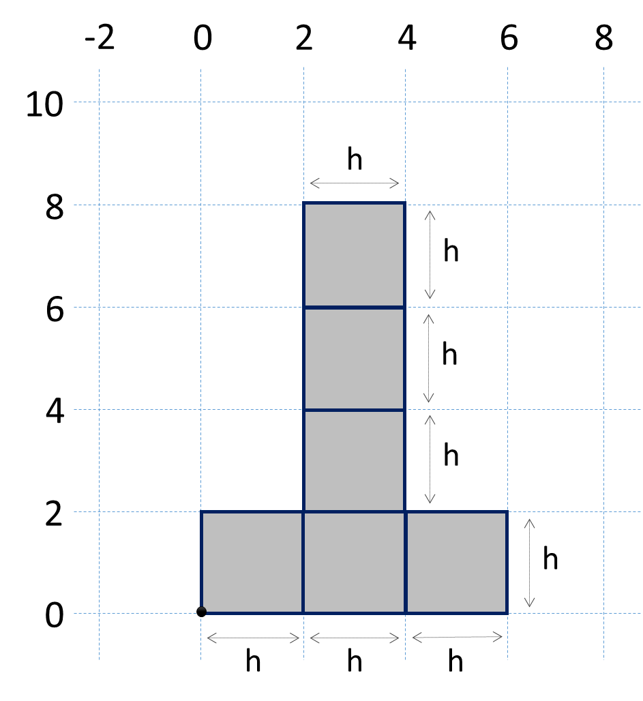

Упражнения: По-сложни проверки
==============================

Задачи за упражнение в клас и за домашно към курса [„Основи на
програмирането" @
СофтУни](https://softuni.bg/courses/programming-basics).

Празно Visual Studio решение (Blank Solution)
---------------------------------------------

Създайте празно решение (**Blank Solution**) във Visual Studio за да
организирате решенията на задачите от упражненията. Всяка задача ще бъде
в отделен проект и всички проекти ще бъдат в общ solution.

1.  Стартирайте **Visual Studio**.

2.  Създайте нов **Blank Solution**: \[File\] \[New\] \[Project\].

{width="5.694444444444445in"
height="3.077782152230971in"}

3.  Изберете от диалоговия прозорец \[Templates\] \[Other Project
    Types\] \[Visual Studio Solutions\] \[**Blank Solution**\] и дайте
    подходящо име на проекта, например "**Complex-Conditions**":

{width="6.707121609798775in"
height="3.78002624671916in"}

Сега имате създаден **празен Visual Studio Solution** (без проекти в
него):

{width="6.1653729221347335in"
height="3.2655489938757656in"}

Целта на този **blank solution** e да съдържа **по един проект за всяка
задача** от упражненията.

Обръщение според възраст и пол
------------------------------

Първата задача от тази тема е да се напише **конзолна програма**, която
**прочита възраст** (десетично число) и **пол** ("**m**" или "**f**"),
въведени от потребителя, и отпечатва **обръщение** измежду следните:

-   "**Mr.**" -- мъж (пол "**m**") на 16 или повече години

-   "**Master**" -- момче (пол "**m**") под 16 години

-   "**Ms.**" -- жена (пол "**f**") на 16 или повече години

-   "**Miss**" -- момиче (пол "**f**") под 16 години

Примери:

<table>
<thead>
<tr class="header">
<th><strong>вход</strong></th>
<th><strong>изход</strong></th>
<th></th>
<th><strong>вход</strong></th>
<th><strong>изход</strong></th>
<th></th>
<th><strong>вход</strong></th>
<th><strong>изход</strong></th>
<th></th>
<th><strong>вход</strong></th>
<th><strong>изход</strong></th>
</tr>
</thead>
<tbody>
<tr class="odd">
<td>
12

f
</td>
<td>Miss</td>
<td></td>
<td>
17

m
</td>
<td>Mr.</td>
<td></td>
<td>
25

f
</td>
<td>Ms.</td>
<td></td>
<td>
13.5

m
</td>
<td>Master</td>
</tr>
</tbody>
</table>

1.  Създайте **нов проект** в съществуващото Visual Studio решение. В
    Solution Explorer кликнете с десен бутон на мишката върху
    **Solution** реда и изберете \[Add\] \[New Project...\]:

{width="4.766945538057743in"
height="2.935999562554681in"}

2.  Ще се отвори диалогов прозорец за избор на тип проект за създаване.
    Изберете **C\#** **конзолно приложение** и задайте подходящо име,
    например "**Personal-Titles**":

{width="6.685780839895013in"
height="3.7679997812773403in"}

Вече имате solution с едно конзолно приложение в него. Остава да
напишете кода за решаване на задачата.

3.  Отидете в тялото на метода **Main(string\[\]** **args)** и напишете
    решението на задачата. Можете да си помогнете с кода от картинката
    по-долу:

{width="5.28in" height="2.758654855643045in"}

4.  **Стартирайте** програмата с \[Ctrl+F5\] и я **тествайте** с
    различни входни стойности:

{width="3.5in" height="1.220472440944882in"}
{width="3.5in" height="1.220472440944882in"}

5.  **Тествайте** решението си в **judge системата**:
    <https://judge.softuni.bg/Contests/Practice/Index/153#0>. Трябва да
    получите **100 точки** (напълно коректно решение):

{width="7.042209098862642in" height="4.72in"}

{width="7.071976159230096in"
height="2.497364391951006in"}

Квартално магазинче
-------------------

Следващата задача има за цел да тренира работата с **вложени проверки**
(nested **if**). Ето го и условието: предприемчив българин отваря
**квартални магазинчета** в **няколко града** и продава на **различни
цени**:

  град / продукт   **coffee**   **water**   **beer**   **sweets**   **peanuts**
  ---------------- ------------ ----------- ---------- ------------ -------------
  **Sofia**        0.50         0.80        1.20       1.45         1.60
  **Plovdiv**      0.40         0.70        1.15       1.30         1.50
  **Varna**        0.45         0.70        1.10       1.35         1.55

Напишете програма, която чете **град** (стринг), **продукт** (стринг) и
**количество** (десетично число), въведени от потребителя, и пресмята и
отпечатва **колко струва** съответното количество от избрания продукт в
посочения град. Примери:

<table>
<thead>
<tr class="header">
<th><strong>вход</strong></th>
<th><strong>изход</strong></th>
<th></th>
<th><strong>вход</strong></th>
<th><strong>изход</strong></th>
<th></th>
<th><strong>вход</strong></th>
<th><strong>изход</strong></th>
<th></th>
<th><strong>вход</strong></th>
<th><strong>изход</strong></th>
<th></th>
<th><strong>вход</strong></th>
<th><strong>изход</strong></th>
</tr>
</thead>
<tbody>
<tr class="odd">
<td>
coffee

Varna

2
</td>
<td>0.9</td>
<td></td>
<td>
peanuts

Plovdiv

1
</td>
<td>1.5</td>
<td></td>
<td>
beer

Sofia

6
</td>
<td>7.2</td>
<td></td>
<td>
water

Plovdiv

3
</td>
<td>2.1</td>
<td></td>
<td>
sweets

Sofia

2.23
</td>
<td>3.2335</td>
</tr>
</tbody>
</table>

1.  Създайте **нов проект** в съществуващото Visual Studio решение. В
    Solution Explorer кликнете с десен бутон на мишката върху
    **Solution** реда и изберете \[Add\] \[New Project...\]:

{width="5.2475371828521435in"
height="3.231999125109361in"}

2.  Ще се отвори диалогов прозорец за избор на тип проект за създаване.
    Изберете **C\#** **конзолно приложение** и задайте подходящо име,
    например "**Small-Shop**":

{width="6.717028652668416in"
height="3.785611329833771in"}

Вече имате ново конзолно приложение и остава да напишете кода за
решаване на задачата.

3.  Отидете в тялото на метода **Main(string\[\]** **args)** и напишете
    решението на задачата. Можете да си помогнете с кода от картинката
    по-долу. Можете да прехвърлите всички букви в долен регистър с
    **.ToLower()** за да сравнявате продукти и градове без значение на
    малки / главни букви:

{width="5.178435039370079in"
height="3.059915791776028in"}

4.  За **да активирате текущия проект** да стартира при \[Ctrl+F5\],
    избере "**Set StartUp Projects...**":

{width="4.766286089238845in"
height="3.5120002187226596in"}

Изберете първата опция:

{width="6.427286745406824in"
height="2.7520002187226598in"}

5.  **Стартирайте** програмата с \[Ctrl+F5\] и я **тествайте** с
    различни входни стойности:

{width="3.1359995625546806in"
height="1.2505905511811024in"}
{width="3.169834864391951in"
height="1.2448337707786528in"}

6.  **Тествайте** решението си в **judge системата**:
    <https://judge.softuni.bg/Contests/Practice/Index/153#1>.

Точка в правоъгълник
--------------------

Напишете програма, която проверява дали **точка {x, y}** се намира
**вътре в правоъгълник {x1, y1} -- {x2, y2}**. Входните данни се четат
от конзолата и се състоят от 6 реда, въведени от потребителя:
десетичните числа **x1**, **y1**, **x2**, **y2**, **x** и **y** (като се
гарантира, че **x1 \< x2** и **y1 \< y2**). Една точка е вътрешна за
даден правоъгълник, ако се намира някъде във вътрешността му или върху
някоя от страните му. Отпечатайте "**Inside**" или "**Outside**".

Примери:

+---------+---------+---------+---------+---------+---------+---------+
| **вход* | **изход | **визуа |         | **вход* | **изход | **визуа |
| *       | **      | лизация |         | *       | **      | лизация |
|         |         | **      |         |         |         | **      |
+=========+=========+=========+=========+=========+=========+=========+
| 2       | Inside  | {width |         |         |         | ){width |
| 12      |         | ="2.066 |         | 12      |         | ="2.066 |
|         |         | 9291338 |         |         |         | 9291338 |
| 3       |         | 582676i |         | 3       |         | 582676i |
|         |         | n"      |         |         |         | n"      |
| 8       |         | height= |         | 11      |         | height= |
|         |         | "1.6574 |         |         |         | "1.6574 |
| -1      |         | 8031496 |         | -3.5    |         | 8031496 |
|         |         | 06299in |         |         |         | 06299in |
|         |         | "}      |         |         |         | "}      |
+---------+---------+---------+---------+---------+---------+---------+

+---------+---------+---------+---------+---------+---------+---------+
| **вход* | **изход | **визуа |         | **вход* | **изход | **визуа |
| *       | **      | лизация |         | *       | **      | лизация |
|         |         | **      |         |         |         | **      |
+=========+=========+=========+=========+=========+=========+=========+
| -1      | Inside  | {width |         |         |         | ){width |
| 4       |         | ="2.093 |         | 4       |         | ="2.093 |
|         |         | 0446194 |         |         |         | 1649168 |
| 1       |         | 225723i |         | 1       |         | 85389in |
|         |         | n"      |         |         |         | "       |
| 0.5     |         | height= |         | -1.2    |         | height= |
|         |         | "1.4479 |         |         |         | "1.4479 |
| 1       |         | 1666666 |         | 1.4     |         | 9978127 |
|         |         | 66667in |         |         |         | 73404in |
|         |         | "}      |         |         |         | "}      |
+---------+---------+---------+---------+---------+---------+---------+

**Тествайте** решението си в **judge системата**:
<https://judge.softuni.bg/Contests/Practice/Index/153#2>.

\* **Подсказка**: една точка е вътрешна за даден многоъгълник, ако
едновременно са изпълнени следните четири условия (можете да ги
проверите с **if** проверка с логическо „**и**" -- оператор **&&**):

-   Точката е надясно от лявата стена на правоъгълника (**x \>= x1**)

-   Точката е наляво от дясната стена на правоъгълника (**x \<= x2**)

-   Точката е надолу от горната стена на правоъгълника (**y \>= y1**)

-   Точката е нагоре от долната стена на правоъгълника (**y \<= y2**)

Плод или зеленчук?
------------------

Да се напише програма, която **чете име на продукт**, въведено от
потребителя, и проверява дали е **плод** или **зеленчук**.

-   Плодовете \"**fruit**\" са **banana**, **apple**, **kiwi**,
    **cherry**, **lemon** и **grapes**

-   Зеленчуците \"**vegetable**\" са **tomato**, **cucumber**,
    **pepper** и **carrot**

-   Всички останали са \"**unknown**\"

Да се изведе "**fruit**", "**vegetable**" или "**unknown**" според
въведения продукт. Примери:

  **вход**   **изход**      **вход**   **изход**      **вход**   **изход**      **вход**   **изход**
  ---------- ----------- -- ---------- ----------- -- ---------- ----------- -- ---------- -----------
  banana     fruit          apple      fruit          tomato     vegetable      water      unknown

**Тествайте** решението си в **judge системата**:
<https://judge.softuni.bg/Contests/Practice/Index/153#3>.

\* **Подсказка**: използвайте условна **if** проверка с логическо
„**или**" -- operator **\|\|**.

Невалидно число
---------------

Дадено **число е валидно**, ако е в диапазона \[**100**...**200**\] или
е **0**. Да се напише програма, която **чете цяло число**, въведено от
потребителя, и печата "**invalid**" ако въведеното число **не е
валидно**. Примери:

  **вход**   **изход**      **вход**   **изход**           **вход**   **изход**      **вход**   **изход**
  ---------- ----------- -- ---------- ---------------- -- ---------- ----------- -- ---------- ----------------
  75         invalid        150        *(няма изход)*      220        invalid        199        *(няма изход)*

  **вход**   **изход**      **вход**   **изход**           **вход**   **изход**           **вход**   **изход**
  ---------- ----------- -- ---------- ---------------- -- ---------- ---------------- -- ---------- ----------------
  -1         invalid        100        *(няма изход)*      200        *(няма изход)*      0          *(няма изход)*

**Тествайте** решението си в **judge системата**:
<https://judge.softuni.bg/Contests/Practice/Index/153#4>.

\* **Подсказка**: използвайте условна **if** проверка с **отрицание** и
логически операции.

Точка върху страната на правоъгълник
------------------------------------

Напишете програма, която проверява дали **точка {x, y}** се намира
**върху някоя от страните на правоъгълник {x1, y1} -- {x2, y2}**.
Входните данни се четат от конзолата и се състоят от 6 реда въведени от
потребителя: десетичните числа **x1**, **y1**, **x2**, **y2**, **x** и
**y** (като се гарантира, че **x1 \< x2** и **y1 \< y2**). Да се
отпечата "**Border**" (точката лежи на някоя от страните) или "**Inside
/ Outside**" (в противен случай). Примери:

+---------+---------+---------+---------+---------+---------+---------+
| **вход* | **изход | **визуа |         | **вход* | **изход | **визуа |
| *       | **      | лизация |         | *       | **      | лизация |
|         |         | **      |         |         |         | **      |
+=========+=========+=========+=========+=========+=========+=========+
| 2       | Inside  | {width |         |         |         | ){width |
| 12      |         | ="2.066 |         | 12      |         | ="2.095 |
|         |         | 9291338 |         |         |         | 6517935 |
| 3       |         | 582676i |         | 3       |         | 25809in |
|         |         | n"      |         |         |         | "       |
| 8       |         | height= |         | 12      |         | height= |
|         |         | "1.6574 |         |         |         | "1.6339 |
| -1      |         | 8031496 |         | -1      |         | 6653543 |
|         |         | 06299in |         |         |         | 30708in |
|         |         | "}      |         |         |         | "}      |
+---------+---------+---------+---------+---------+---------+---------+

**Тествайте** решението си в **judge системата**:
<https://judge.softuni.bg/Contests/Practice/Index/153#5>.

\* **Подсказка**: използвайте една или няколко условни **if** проверки с
логически операции. Точка **{x, y}** лежи върху някоя от страните на
правоъгълник **{x1, y1} -- {x2, y2}**, ако е изпълнено едно от следните
условия:

-   **x** съвпада с **x1** или **x2** и същевременно **y** е между
    **y1** и **y2**

-   **y** съвпада с **y1** или **y2** и същевременно **x** е между
    **x1** и **x2**

Можете да проверите горните условия с една по-сложна **if**-**else**
конструкция или с няколко по-прости проверки или с **вложени**
**if**-**else** проверки.

Магазин за плодове
------------------

Магазин за плодове през **работните дни** работи на следните **цени**:

  **плод**   banana   apple   orange   grapefruit   kiwi   pineapple   grapes
  ---------- -------- ------- -------- ------------ ------ ----------- --------
  **цена**   2.50     1.20    0.85     1.45         2.70   5.50        3.85

**Събота** и **неделя** магазинът работи на **по-високи** **цени**:

  **плод**   banana   apple   orange   grapefruit   kiwi   pineapple   grapes
  ---------- -------- ------- -------- ------------ ------ ----------- --------
  **цена**   2.70     1.25    0.90     1.60         3.00   5.60        4.20

Напишете програма, която чете от конзолата **плод** (banana / apple /
orange / grapefruit / kiwi / pineapple / grapes), **ден от седмицата**
(Monday / Tuesday / Wednesday / Thursday / Friday / Saturday / Sunday) и
**количество** (десетично число) , въведени от потребителя, и пресмята
**цената** според цените от таблиците по-горе. Резултатът да се отпечата
**закръглен с 2 цифри** след десетичната точка. При невалиден ден от
седмицата или невалидно име на плод да се отпечата "**error**". Примери:

<table>
<thead>
<tr class="header">
<th><strong>вход</strong></th>
<th><strong>изход</strong></th>
<th></th>
<th><strong>вход</strong></th>
<th><strong>изход</strong></th>
<th></th>
<th><strong>вход</strong></th>
<th><strong>изход</strong></th>
<th></th>
<th><strong>вход</strong></th>
<th><strong>изход</strong></th>
<th></th>
<th><strong>вход</strong></th>
<th><strong>изход</strong></th>
</tr>
</thead>
<tbody>
<tr class="odd">
<td>
apple

Tuesday

2
</td>
<td>2.40</td>
<td></td>
<td>
orange

Sunday

3
</td>
<td>2.70</td>
<td></td>
<td>
kiwi

Monday

2.5
</td>
<td>6.75</td>
<td></td>
<td>
grapes

Saturday

0.5
</td>
<td>2.10</td>
<td></td>
<td>
tomato

Monday

0.5
</td>
<td>error</td>
</tr>
</tbody>
</table>

**Тествайте** решението си в **judge системата**:
<https://judge.softuni.bg/Contests/Practice/Index/153#6>.

\* **Подсказки**:

-   Прочетете входа и обърнете името на плода и деня от седмицата в
    **малки букви**:

{width="4.460629921259843in"
height="0.6456692913385826in"}

-   Първоначално задайте цена **-1**:

{width="1.6062992125984252in"
height="0.2204724409448819in"}

-   Използвайте вложени **if** проверки, за да изчислите цената за
    дадения плод и ден от седмицата:

{width="5.97244094488189in"
height="2.641732283464567in"}

-   Накрая проверете цената. Ако все още е **-1**, значи даденият плод
    или денят от седмицата е **невалиден**. За да отпечатате точно **2
    цифри след десетичната точка** (със закръгляне), използвайте
    форматиращ низ "**{0:f2}**". Кодът може да е подобен на следния:

> {width="4.669291338582677in"
> height="0.889763779527559in"}

Търговски комисионни
--------------------

Фирма дава следните **комисионни** на търговците си според **града**, в
който работят и обема на **продажбите** **s**:

  **Град**   **0 ≤ s ≤ 500**   **500 \< s ≤ 1 000**   **1 000 \< s ≤ 10 000**   **s \> 10 000**
  ---------- ----------------- ---------------------- ------------------------- -----------------
  Sofia      5%                7%                     8%                        12%
  Varna      4.5%              7.5%                   10%                       13%
  Plovdiv    5.5%              8%                     12%                       14.5%

Напишете **конзолна програма**, която чете име на **град** (стринг) и
обем на **продажби** (десетично число) , въведени от потребителя, и
изчислява и извежда размера на търговската **комисионна** според горната
таблица. Резултатът да се изведе закръглен с **2 цифри след десетичната
точка**. При **невалиден** град или обем на продажбите (отрицателно
число) да се отпечата "**error**".

Примери:

<table>
<thead>
<tr class="header">
<th><strong>вход</strong></th>
<th><strong>изход</strong></th>
<th></th>
<th><strong>вход</strong></th>
<th><strong>изход</strong></th>
<th></th>
<th><strong>вход</strong></th>
<th><strong>изход</strong></th>
<th></th>
<th><strong>вход</strong></th>
<th><strong>изход</strong></th>
</tr>
</thead>
<tbody>
<tr class="odd">
<td>
Sofia

1500
</td>
<td>120.00</td>
<td></td>
<td>
Plovdiv

499.99
</td>
<td>27.50</td>
<td></td>
<td>
Varna

3874.50
</td>
<td>387.45</td>
<td></td>
<td>
Kaspichan

-50
</td>
<td>error</td>
</tr>
</tbody>
</table>

**Тествайте** решението си в **judge системата**:
<https://judge.softuni.bg/Contests/Practice/Index/153#7>.

\* **Подсказки**:

-   Прочетете входа и **обърнете града в** **малки букви** (като в
    предходната задача).

-   Първоначално задайте **комисионна -1**. Тя ще бъде променена, ако
    градът и ценовият диапазон бъдат намерени в таблицата с
    комисионните.

-   Използвайте вложени **if** проверки, за **да изчислите
    комисионната** според града и според обема на продажбите. Може да си
    помогнете с кода по-долу:

{width="5.344000437445319in"
height="2.9529002624671916in"}

-   Накрая проверете комисионната. Ако все още е **-1**, значи
    въведеният град или обем продажби не се срещат в таблицата с
    комисионните и трябва да се отпечата "**error**". В противен случай
    трябва да се изчисли комисионната (процент комисионна по обем на
    продажбите) и да се отпечата със закръгляне с точно **2 цифри след
    десетичната точка**. Може да използвате
    **Console.WriteLine(\"{0:f2}\",** **...)**.

Ден от седмицата
----------------

Напишете програма, която чете **цяло** **число**, въведено от
потребителя, и отпечатва **ден от седмицата** (на английски език), в
граници \[1\...7\] или отпечатва "**Error**" в случай, че въведеното
число е **невалидно**. Примери:

  **Вход**   **Изход**
  ---------- -----------
  1          Monday
  2          Tuesday
  3          Wednesday
  4          Thursday
  5          Friday
  6          Saturday
  7          Sunday
  -1         Error

**\*Подсказка:** Използвайте условната конструкция
[**switch-case**](https://developer.mozilla.org/en-US/docs/Web/JavaScript/Reference/Statements/switch).

Клас животно
------------

Напишете програма, която отпечатва класа на животното според неговото
име, въведено от потребителя.

-   **dog -\> mammal**

-   **crocodile, tortoise, snake -\> reptile**

-   **others -\> unknown**

Примери:

  **Вход**   **Изход**
  ---------- -----------
  dog        mammal
  snake      reptile
  cat        unknown

**\*Подсказка:** Използвайте условната конструкция **switch-case**.

Кино
----

В една кинозала столовете са наредени в правоъгълна форма в **r** реда и
**c** колони. Има три вида прожекции с билети на различни цени:

-   **Premiere** -- премиерна прожекция, на цена **12.00** лева.

-   **Normal** -- стандартна прожекция, на цена **7.50** лева.

-   **Discount** -- прожекция за деца, ученици и студенти на намалена
    цена от **5.00** лева.

Напишете програма, която чете **тип прожекция** (стринг), брой
**редове** и брой **колони** в залата (цели числа), въведени от
потребителя, и изчислява общите приходи от билети при пълна зала.
Резултатът да се отпечата във формат като в примерите по-долу, с 2 знака
след десетичната точка. Примери:

+----------+--------------+--+----------+--------------+--+----------+--------------+
| **вход** | **изход**    |  | **вход** | **изход**    |  | **вход** | **изход**    |
+==========+==============+==+==========+==============+==+==========+==============+
| Premiere | 1440.00 leva |  | Normal   | 2047.50 leva |  | Discount | 1800.00 leva |
|          |              |  |          |              |  |          |              |
| 10       |              |  | 21       |              |  | 12       |              |
|          |              |  |          |              |  |          |              |
| 12       |              |  | 13       |              |  | 30       |              |
+----------+--------------+--+----------+--------------+--+----------+--------------+

**Тествайте** решението си в **judge системата**:
<https://judge.softuni.bg/Contests/Practice/Index/153#8>.

\* **Подсказка**: използвайте прости проверки и елементарни изчисления.
За да изведете резултата с точно 2 цифри след десетичната точка,
използвайте **Console.WriteLine(\"{0:f2}\",** **result)**.

Волейбол
--------

Влади е студент, живее в София и си ходи от време на време до родния
град. Той е много запален по волейбола, но е зает през работните дни и
играе **волейбол** само през **уикендите** и в **празничните дни**.
Влади играе **в София** всяка **събота**, когато **не е на работа** и
**не си пътува до родния град**, както и в **2/3 от празничните дни**.
Той пътува до **родния си град** **h пъти** в годината, където играе
волейбол със старите си приятели в **неделя**. Влади **не е на работа
3/4 от уикендите**, в които е в София. Отделно, през **високосните
години** Влади играе с **15% повече** волейбол от нормалното. Приемаме,
че годината има точно **48 уикенда**, подходящи за волейбол.

Напишете програма, която изчислява **колко пъти Влади е играл волейбол**
през годината. **Закръглете резултата** надолу до най-близкото цяло
число (например 2.15 2; 9.95 9).

Входните данни се въвеждат от потребителя, в следния вид:

-   Първият ред съдържа думата "**leap**" (високосна година) или
    "**normal**" (невисокосна).

-   Вторият ред съдържа цялото число **p** -- брой празници в годината
    (които не са събота и неделя).

-   Третият ред съдържа цялото число **h** -- брой уикенди, в които
    Влади си пътува до родния град.

Примери:

+-----------------------+-----------------------+-----------------------+
| **вход**              | **изход**             | **Коментари**         |
+=======================+=======================+=======================+
| leap                  | 45                    | 48 уикенда в          |
|                       |                       | годината, разделени   |
| 5                     |                       | по следния начин:     |
|                       |                       |                       |
| 2                     |                       | -   46 уикенда в      |
|                       |                       |     София 46 \* 3 / 4 |
|                       |                       |     **34.5** съботни  |
|                       |                       |     игри в София      |
|                       |                       |                       |
|                       |                       | -   2 уикенда в       |
|                       |                       |     родния си град 2  |
|                       |                       |     недели **2** игри |
|                       |                       |     в неделя в родния |
|                       |                       |     град              |
|                       |                       |                       |
|                       |                       | 5 празника:           |
|                       |                       |                       |
|                       |                       | -   5 \* 2/3          |
|                       |                       |     **3.333** игри в  |
|                       |                       |     София в празничен |
|                       |                       |     ден               |
|                       |                       |                       |
|                       |                       | Общо игри през        |
|                       |                       | уикенди и празници в  |
|                       |                       | София и в родния      |
|                       |                       | град: 34.5 + 2 +      |
|                       |                       | 3.333 **39.833**      |
|                       |                       |                       |
|                       |                       | Годината е високосна: |
|                       |                       |                       |
|                       |                       | -   Влади играе       |
|                       |                       |     допълнителни      |
|                       |                       |     15% \* 39.833     |
|                       |                       |     **5.975** игри    |
|                       |                       |     волейбол          |
|                       |                       |                       |
|                       |                       | Общо игри през цялата |
|                       |                       | година:               |
|                       |                       |                       |
|                       |                       | -   39.833 + 5.975 =  |
|                       |                       |     **45.808** игри   |
|                       |                       |                       |
|                       |                       | -   Резултатът е      |
|                       |                       |     **45** (закръгля  |
|                       |                       |     се надолу)        |
+-----------------------+-----------------------+-----------------------+

<table>
<thead>
<tr class="header">
<th><strong>вход</strong></th>
<th><strong>изход</strong></th>
<th></th>
<th><strong>вход</strong></th>
<th><strong>изход</strong></th>
<th></th>
<th><strong>вход</strong></th>
<th><strong>изход</strong></th>
<th></th>
<th><strong>вход</strong></th>
<th><strong>изход</strong></th>
<th></th>
<th><strong>вход</strong></th>
<th><strong>изход</strong></th>
</tr>
</thead>
<tbody>
<tr class="odd">
<td>
normal

3

2
</td>
<td>38</td>
<td></td>
<td>
leap

2

3
</td>
<td>43</td>
<td></td>
<td>
normal

11

6
</td>
<td>44</td>
<td></td>
<td>
leap

0

1
</td>
<td>41</td>
<td></td>
<td>
normal

6

13
</td>
<td>43</td>
</tr>
</tbody>
</table>

**Тествайте** решението си в **judge системата**:
<https://judge.softuni.bg/Contests/Practice/Index/153#9>.

\* **Подсказки**:

-   Пресметнете **уикендите в София** (48 минус уикендите в родния
    град). Пресметнете **броя игри в уикендите в София**: умножете
    уикендите в София с (3.0 / 4). Обърнете внимание, че трябва да се
    използва **дробно деление** (3.0 / 4), а не целочислено (3 / 4).

-   Пресметнете **броя игри в родния град**. Те са точно колкото са
    пътуванията до родния град.

-   Пресметнете **броя игри в празничен ден**. Те са броя празници
    умножени по (2.0 / 3).

-   **Сумирайте** броя на всички игри. Той е дробно число. Не бързайте
    да закръгляте още.

-   Ако годината е **високосна**, добавете **15%** към общия брой игри.

-   Накрая **закръглете** надолу до най-близкото цяло число с
    **Math.Truncate(result)**.

    {width="2.2319444444444443in"
    height="2.3673611111111112in"}

\* Точка във фигурата
---------------------

**Фигура** се състои от **6 блокчета** **с размер** **h \* h**,
разположени като на фигурата вдясно. Долният ляв ъгъл на сградата е на
позиция {0, 0}. Горният десен ъгъл на фигурата е на позиция {**2\*h**,
**4\*h**}. На фигурата координатите са дадени при **h = 2**.

Напишете програма, която чете цяло число **h** и координатите на дадена
**точка** {**x**, **y**} (цели числа), въведени от потребителя, и
отпечатва дали точката е вътре във фигурата (**inside**), вън от
фигурата (**outside**) или на някоя от стените на фигурата (**border**).

Примери:

+---------+---------+---------+---------+---------+---------+---------+
| **вход* | **изход | **визуа |         | **вход* | **изход | **визуа |
| *       | **      | лизация |         | *       | **      | лизация |
|         |         | **      |         |         |         | **      |
+=========+=========+=========+=========+=========+=========+=========+
| 2       | outside | {width |         |         |         | ){width |
| 10      |         | ="2.094 |         | 55      |         | ="2.094 |
|         |         | 4881889 |         |         |         | 4881889 |
|         |         | 76378in |         |         |         | 76378in |
|         |         | "       |         |         |         | "       |
|         |         | height= |         |         |         | height= |
|         |         | "2.8582 |         |         |         | "2.8582 |
|         |         | 6771653 |         |         |         | 6771653 |
|         |         | 5433in" |         |         |         | 5433in" |
|         |         | }       |         |         |         | }       |
+---------+---------+---------+---------+---------+---------+---------+
| 2       | inside  |         |         | 15      | inside  |         |
|         |         |         |         |         |         |         |
| 3       |         |         |         | 29      |         |         |
|         |         |         |         |         |         |         |
| 1       |         |         |         | 37      |         |         |
+---------+---------+---------+---------+---------+---------+---------+
| 2       | border  |         |         | 15      | outside |         |
|         |         |         |         |         |         |         |
| 2       |         |         |         | 37      |         |         |
|         |         |         |         |         |         |         |
| 2       |         |         |         | 18      |         |         |
+---------+---------+---------+---------+---------+---------+---------+
| 2       | border  |         |         | 15      | outside |         |
|         |         |         |         |         |         |         |
| 6       |         |         |         | -4      |         |         |
|         |         |         |         |         |         |         |
| 0       |         |         |         | 7       |         |         |
+---------+---------+---------+---------+---------+---------+---------+
| 2       | outside |         |         | 15      | border  |         |
|         |         |         |         |         |         |         |
| 0       |         |         |         | 30      |         |         |
|         |         |         |         |         |         |         |
| 6       |         |         |         | 0       |         |         |
+---------+---------+---------+---------+---------+---------+---------+

**Тествайте** решението си в **judge системата**:
<https://judge.softuni.bg/Contests/Practice/Index/153#10>.

\* **Подсказки**:

-   Може да разделите фигурата на **два правоъгълника** с обща стена.

-   Една точка е **външна** (**outside**) за фигурата, когато е
    едновременно **извън** двата правоъгълника.

-   Една точка е **вътрешна** (**inside**) за фигурата, ако е вътре в
    някой от правоъгълниците (изключвайки стените им) или лежи върху
    общата им стена.

-   В **противен случай** точката лежи на стената на правоъгълника
    (**border**).

Упражнения: Графични и Web приложения
=====================================

\* Точка и правоъгълник -- графично (GUI) приложение
----------------------------------------------------

Да се разработи графично (**GUI**) приложение за **визуализация на точка
и правоъгълник**. Приложението трябва да изглежда приблизително по
следния начин:

{width="6.437007874015748in"
height="3.6496062992125986in"}

{width="3.751968503937008in"
height="2.720472440944882in"}
{width="3.372916666666667in"
height="2.72503280839895in"}

От контролите вляво се задават координатите на **два от ъглите на
правоъгълник** (десетични числа) и координатите на **точка**.
Приложението **визуализира графично** правоъгълника и точката и изписва
дали точката е **вътре** в правоъгълника (**Inside**), **вън** от него
(**Outside**) или на някоя от стените му (**Border**).

Приложението **премества** и **мащабира** координатите на правоъгълника
и точката, за да бъдат максимално големи, но да се събират в полето за
визуализация в дясната страна на приложението.

**Внимание**: това приложение е значително **по-сложно** от предходните
графични приложения, които разработвахте до сега, защото изисква
ползване на функции за чертане и нетривиални изчисления за
преоразмеряване и преместване на правоъгълника и точката. Следват
инструкции за изграждане на приложението стъпка по стъпка.

1.  Създайте нов **Windows Forms Application** с подходящо име, например
    "**Point-and-Rectangle**":

{width="6.401883202099738in"
height="3.60799978127734in"}

2.  **Наредете контролите** във формата както е показано на фигурата
    по-долу: 6 кутийки за въвеждане на число (**NumericUpDown**) с
    надписи (**Label**) пред всяка от тях, бутон (**Button**) за
    изчертаване на правоъгълника и точката и текстов блок за резултата
    (**Label**). Нагласете **размерите** и свойствата на контролите, за
    да изглеждат долу-горе като на картинката:

{width="6.756852580927384in"
height="4.440679133858268in"}

3.  Задайте следните препоръчителни **настройки на контролите**:

За **главната форма** (**Form**), която съдържа всички контроли:

-   (name) = **FormPointAndRectangle**

-   **Text** = \"**Point and Rectangle**\"

-   **Font.Size** = **12**

-   **Size** = **700,** **410**

-   **MinimumSize** = **500,** **400**

-   **FormBorderStyle** = **FixedSingle**

За **полетата за въвеждане на число** (**NumericUpDown**):

-   (name) = **numericUpDownX1**; **numericUpDownY1**;
    **numericUpDownX2**; **numericUpDownY2**; **numericUpDownX**;
    **numericUpDownY**

-   **Value** = **2**; **-3**; **12**; **3**; **8**; **-1**

-   **Minimum** = **-100000**

-   **Maximum** = **100000**

-   **DecimalPlaces** = **2**

За **бутона** (**Button**) **за визуализация** на правоъгълника и
точката:

-   (name) = **buttonDraw**

-   **Text** = "**Draw**"

За **текстовия блок за резултата** (**Label**):

-   (name) = **labelLocation**

-   **AutoSize** = **False**

-   **BackColor** = **PaleGreen**

-   **TextAlign** = **MiddleCenter**

За **полето с чертежа** (**PictureBox**):

-   (name) = **pictureBox**

-   **Anchor** = **Top**, **Bottom**, **Left**, **Right**

4.  Хванете следните **събития**, за да напишете C\# кода, който ще се
    изпълни при настъпването им:

-   Събитието **Click** на бутона **buttonDraw** (извиква се при
    натискане на бутона).

-   Събитието **ValueChanged** на контролите за въвеждане на числа
    **numericUpDownX1**, **numericUpDownY1**, **numericUpDownX2**,
    **numericUpDownY2**, **numericUpDownX** и **numericUpDownY**
    (извиква се при промяна на стойността в контролата за въвеждане на
    число).

-   Събитието **Load** на формата **FormPointAndRectangle** (извиква се
    при стартиране на приложението, преди да се появи главната форма на
    екрана).

-   Събитието **Resize** на формата **FormPointAndRectangle** (извиква
    се при промяна на размера на главната формата).

5.  Всички изброени по-горе събития ще изпълняват едно и също действие
    -- **Draw()**, което ще визуализира правоъгълника и точката и ще
    показва дали тя е вътре, вън или на някоя от страните. Кодът трябва
    да прилича на този:

+-----------------------------------------------------------------------+
| private void buttonDraw\_Click(object sender, EventArgs e)            |
|                                                                       |
| {                                                                     |
|                                                                       |
| Draw();                                                               |
|                                                                       |
| }                                                                     |
|                                                                       |
| private void FormPointAndRectangle\_Load(object sender, EventArgs e)  |
|                                                                       |
| {                                                                     |
|                                                                       |
| Draw();                                                               |
|                                                                       |
| }                                                                     |
|                                                                       |
| private void FormPointAndRectangle\_Resize(object sender, EventArgs   |
| e)                                                                    |
|                                                                       |
| {                                                                     |
|                                                                       |
| Draw();                                                               |
|                                                                       |
| }                                                                     |
|                                                                       |
| private void numericUpDownX1\_ValueChanged(object sender, EventArgs   |
| e)                                                                    |
|                                                                       |
| {                                                                     |
|                                                                       |
| Draw();                                                               |
|                                                                       |
| }                                                                     |
|                                                                       |
| // **TODO**: implement the same way event handlers                    |
| numericUpDownY1\_ValueChanged, numericUpDownX2\_ValueChanged,         |
| numericUpDownY2\_ValueChanged, numericUpDownX\_ValueChanged and       |
| numericUpDownY\_ValueChanged                                          |
|                                                                       |
| private void Draw()                                                   |
|                                                                       |
| {                                                                     |
|                                                                       |
| // **TODO**: implement this a bit later ...                           |
|                                                                       |
| }                                                                     |
+-----------------------------------------------------------------------+

6.  Започнете от по-лесната част: **печат на информация къде е точката
    спрямо правоъгълника** (Inside, Outside или Border). Можете да
    ползвате следния код:

+-----------------------------------------------------------------------+
| private void Draw()                                                   |
|                                                                       |
| {                                                                     |
|                                                                       |
| // Get the rectangle and point coordinates from the form              |
|                                                                       |
| var x1 = this.numericUpDownX1.Value;                                  |
|                                                                       |
| var y1 = this.numericUpDownY1.Value;                                  |
|                                                                       |
| var x2 = this.numericUpDownX2.Value;                                  |
|                                                                       |
| var y2 = this.numericUpDownY2.Value;                                  |
|                                                                       |
| var x = this.numericUpDownX.Value;                                    |
|                                                                       |
| var y = this.numericUpDownY.Value;                                    |
|                                                                       |
| // Display the location of the point: Inside / Border / Outside       |
|                                                                       |
| DisplayPointLocation(x1, y1, x2, y2, x, y);                           |
|                                                                       |
| }                                                                     |
|                                                                       |
| private void DisplayPointLocation(                                    |
|                                                                       |
| decimal x1, decimal y1, decimal x2, decimal y2, decimal x, decimal y) |
|                                                                       |
| {                                                                     |
|                                                                       |
| var left = Math.Min(x1, x2);                                          |
|                                                                       |
| var right = Math.Max(x1, x2);                                         |
|                                                                       |
| var top = Math.Min(y1, y2);                                           |
|                                                                       |
| var bottom = Math.Max(y1, y2);                                        |
|                                                                       |
| if (x \> left && x \< right && ...)                                   |
|                                                                       |
| {                                                                     |
|                                                                       |
| this.labelLocation.Text = \"Inside\";                                 |
|                                                                       |
| this.labelLocation.BackColor = Color.LightGreen;                      |
|                                                                       |
| }                                                                     |
|                                                                       |
| else if (... \|\| y \< top \|\| y \> bottom)                          |
|                                                                       |
| {                                                                     |
|                                                                       |
| this.labelLocation.Text = \"Outside\";                                |
|                                                                       |
| this.labelLocation.BackColor = Color.LightSalmon;                     |
|                                                                       |
| }                                                                     |
|                                                                       |
| else                                                                  |
|                                                                       |
| {                                                                     |
|                                                                       |
| this.labelLocation.Text = \"Border\";                                 |
|                                                                       |
| this.labelLocation.BackColor = Color.Gold;                            |
|                                                                       |
| }                                                                     |
|                                                                       |
| }                                                                     |
+-----------------------------------------------------------------------+

Помислете как **да допишете** недовършените (нарочно) условия в
if-проверките! Кодът по-горе нарочно не се компилира, защото целта му е
да помислите как и защо работи и да допишете липсващите части.

Горният код взима координатите на правоъгълника и точките и проверява
дали точката е вътре, вън или на страната на правоъгълника. При
визуализацията на резултата се сменя и цвета на фона на текстовия блок,
който го съдържа.

7.  Остава да се имплементира най-сложната част: визуализация на
    правоъгълника и точката в контролата **pictureBox** с
    преоразмеряване. Можете да ползвате **кода по-долу**, който прави
    малко изчисления и рисува син правоъгълник и тъмносиньо кръгче
    (точката) според зададените във формата координати. За съжаление
    сложността на кода надхвърля изучавания до момента материал и е
    сложно да се обясни в детайли как точно работи. Можете да разгледате
    коментарите за ориентация. Това е пълната версия на действието
    **Draw()**:

+-----------------------------------------------------------------------+
| private void Draw()                                                   |
|                                                                       |
| {                                                                     |
|                                                                       |
| // Get the rectangle and point coordinates from the form              |
|                                                                       |
| var x1 = this.numericUpDownX1.Value;                                  |
|                                                                       |
| var y1 = this.numericUpDownY1.Value;                                  |
|                                                                       |
| var x2 = this.numericUpDownX2.Value;                                  |
|                                                                       |
| var y2 = this.numericUpDownY2.Value;                                  |
|                                                                       |
| var x = this.numericUpDownX.Value;                                    |
|                                                                       |
| var y = this.numericUpDownY.Value;                                    |
|                                                                       |
| // Display the location of the point: Inside / Border / Outside       |
|                                                                       |
| DisplayPointLocation(x1, y1, x2, y2, x, y);                           |
|                                                                       |
| // Calculate the scale factor (ratio) for the diagram holding the     |
|                                                                       |
| // rectangle and point in order to fit them well in the picture box   |
|                                                                       |
| var minX = Min(x1, x2, x);                                            |
|                                                                       |
| var maxX = Max(x1, x2, x);                                            |
|                                                                       |
| var minY = Min(y1, y2, y);                                            |
|                                                                       |
| var maxY = Max(y1, y2, y);                                            |
|                                                                       |
| var diagramWidth = maxX - minX;                                       |
|                                                                       |
| var diagramHeight = maxY - minY;                                      |
|                                                                       |
| var ratio = 1.0m;                                                     |
|                                                                       |
| var offset = 10;                                                      |
|                                                                       |
| if (diagramWidth != 0 && diagramHeight != 0)                          |
|                                                                       |
| {                                                                     |
|                                                                       |
| var ratioX = (pictureBox.Width - 2 \* offset - 1) / diagramWidth;     |
|                                                                       |
| var ratioY = (pictureBox.Height - 2 \* offset - 1) / diagramHeight;   |
|                                                                       |
| ratio = Math.Min(ratioX, ratioY);                                     |
|                                                                       |
| }                                                                     |
|                                                                       |
| // Calculate the scaled rectangle coordinates                         |
|                                                                       |
| var rectLeft = offset + (int)Math.Round((Math.Min(x1, x2) - minX) \*  |
| ratio);                                                               |
|                                                                       |
| var rectTop = offset + (int)Math.Round((Math.Min(y1, y2) - minY) \*   |
| ratio);                                                               |
|                                                                       |
| var rectWidth = (int)Math.Round(Math.Abs(x2 - x1) \* ratio);          |
|                                                                       |
| var rectHeight = (int)Math.Round(Math.Abs(y2 - y1) \* ratio);         |
|                                                                       |
| var rect = new Rectangle(rectLeft, rectTop, rectWidth, rectHeight);   |
|                                                                       |
| // Calculate the scalled point coordinates                            |
|                                                                       |
| var pointX = (int)Math.Round(offset + (x - minX) \* ratio);           |
|                                                                       |
| var pointY = (int)Math.Round(offset + (y - minY) \* ratio);           |
|                                                                       |
| var pointRect = new Rectangle(pointX - 2, pointY - 2, 5, 5);          |
|                                                                       |
| // Draw the rectangle and point                                       |
|                                                                       |
| pictureBox.Image = new Bitmap(pictureBox.Width, pictureBox.Height);   |
|                                                                       |
| using (var g = Graphics.FromImage(pictureBox.Image))                  |
|                                                                       |
| {                                                                     |
|                                                                       |
| // Draw diagram background (white area)                               |
|                                                                       |
| g.Clear(Color.White);                                                 |
|                                                                       |
| // Draw the rectangle (scalled to the picture box size)               |
|                                                                       |
| var pen = new Pen(Color.Blue, 3);                                     |
|                                                                       |
| g.DrawRectangle(pen, rect);                                           |
|                                                                       |
| // Draw the point (scalled to the picture box size)                   |
|                                                                       |
| pen = new Pen(Color.DarkBlue, 5);                                     |
|                                                                       |
| g.DrawEllipse(pen, pointRect);                                        |
|                                                                       |
| }                                                                     |
|                                                                       |
| }                                                                     |
|                                                                       |
| private decimal Min(decimal val1, decimal val2, decimal val3)         |
|                                                                       |
| {                                                                     |
|                                                                       |
| return Math.Min(val1, Math.Min(val2, val3));                          |
|                                                                       |
| }                                                                     |
|                                                                       |
| private decimal Max(decimal val1, decimal val2, decimal val3)         |
|                                                                       |
| {                                                                     |
|                                                                       |
| return Math.Max(val1, Math.Max(val2, val3));                          |
|                                                                       |
| }                                                                     |
+-----------------------------------------------------------------------+

В горния код се срещат доста **преобразувания на типове**, защото се
работи с различни типове числа (десетини числа, реални числа и цели
числа) и понякога се изисква да се преминава между тях.

8.  **Компилирайте кода**. Ако има някакви грешки, ги отстранете.
    Най-вероятната причина за грешка е несъответстващо име на някоя от
    контролите или ако сте написали кода на неправилно място.

9.  **Стартирайте приложението** и го **тествайте** (с разцъкване).
    Пробвайте да въвеждате различни правоъгълници и позиционирайте
    точката на различни позиции, преоразмерявайте приложението и вижте
    дали се държи коректно.

Изпитни задачи от минали издания на курса
=========================================

\* Мобилен оператор
-------------------

*Трета задача от изпитa на 17 септември 2017. Тествайте решението си
[**тук**](https://judge.softuni.bg/Contests/Practice/Index/784#2).*

Мобилен оператор предлага договори с различна месечна такса в зависимост
от срока - 1 или 2 години. Да се напише програма, която изчислява
дължимата сума, която трябва да се плати за определен брой месеци.

  срок / тип     **Small**   **Middle**   **Large**   **ExtraLarge**
  -------------- ----------- ------------ ----------- ----------------
  **1 година**   9.98 лв.    18.99 лв.    25.98 лв.   35.99 лв.
  **2 години**   8.58 лв.    17.09 лв.    23.59 лв.   31.79 лв.

**Условия:**

-   **при добавен мобилен интернет, към таксата се добавя:**

<!-- -->

-   **при сума по-малка или равна от 10.00 лв. 5.50 лв.**

-   **при сума по-малка или равна от 30.00 лв. 4.35 лв.**

-   **при сума по-голяма от 30.00 лв. 3.85 лв.**

<!-- -->

-   **ако договорът за две години, общата сума се намалява с 3.75%**

### Вход

От конзолата се четат **3 реда**:

1.  **срок на договор** -- **текст** - **"one"**, или **"two"**

2.  **тип на договор -- текст** - **"Small", "Middle", "Large"или
    "ExtraLarge";**

3.  **добавен интернет** -- **текст** - **"yes"**, или **"no"**

4.  **брой месеци за плащане - цяло число в интервала \[1 ... 24\]**;

### Изход

-   На конзолата се отпечатва **1 ред**:

-   **Цената, която заплаща клиентът**, **форматирана до втория знак
    след десетичната запетая**, в следния формат: **\"{цената} lv."**

### Примерен вход и изход:

+-----------+-----------+-----------+-----------+-----------+-----------+
| **Вход**  | **Изход** | **Обяснен |
|           |           | ия**      |
+===========+===========+===========+===========+===========+===========+
| one       | 154.80    | **Цената  |           |           |           |
|           | lv.       | на        |           |           |           |
| Small     |           | договор   |           |           |           |
|           |           | за 1      |           |           |           |
| yes       |           | година и  |           |           |           |
|           |           | тип**     |           |           |           |
| 10        |           | Small **е |           |           |           |
|           |           | 9.98      |           |           |           |
|           |           | лв.**     |           |           |           |
|           |           |           |           |           |           |
|           |           | **Заедно  |           |           |           |
|           |           | с         |           |           |           |
|           |           | мобилния  |           |           |           |
|           |           | интернет: |           |           |           |
|           |           | 9.98+5.50 |           |           |           |
|           |           | =15.48    |           |           |           |
|           |           | лв.**     |           |           |           |
|           |           |           |           |           |           |
|           |           | **отстъпк |           |           |           |
|           |           | а**       |           |           |           |
|           |           | няма      |           |           |           |
|           |           |           |           |           |           |
|           |           | **Крайна  |           |           |           |
|           |           | цена**:   |           |           |           |
|           |           | 15.48 \*  |           |           |           |
|           |           | 10        |           |           |           |
|           |           | месеца=   |           |           |           |
|           |           | **154.80  |           |           |           |
|           |           | лв.**     |           |           |           |
+-----------+-----------+-----------+-----------+-----------+-----------+
| **Вход**  | **Изход** | **Вход**  | **Изход** | **Вход**  | **Изход** |
+-----------+-----------+-----------+-----------+-----------+-----------+
| two       | 227.05    | two       | 686.07    | two       | 271.04    |
|           | lv.       |           | lv.       |           | lv.       |
| Large     |           | ExtraLarg |           | Small     |           |
|           |           | e         |           |           |           |
| no        |           |           |           | yes       |           |
|           |           | yes       |           |           |           |
| 10        |           |           |           | 20        |           |
|           |           | 20        |           |           |           |
+-----------+-----------+-----------+-----------+-----------+-----------+

\* Фото снимки
--------------

*Трета задача от изпитa на 03 септември 2017. Тествайте решението си
[**тук**](https://judge.softuni.bg/Contests/Practice/Index/750#2).*\
Фото-ателие приема поръчки за изваждане на снимки на хартия в няколко
размера със следните цени **за една снимка**. Една поръчка включва
снимки **само от един размер**. В зависимост от **поръчания брой**
снимки, се прави различна **отстъпка**.

+------------+-------------------+----------------------------------------------+
| **Размер** | **Единична цена** | **Отстъпка от цената**                       |
+============+===================+==============================================+
| 9X13       | 0.16 лв.          | **Над** **50 броя** включително -- **5%**    |
+------------+-------------------+----------------------------------------------+
| 10X15      | 0.16 лв.          | **Над** **80 броя** включително -- **3%**    |
+------------+-------------------+----------------------------------------------+
| 13X18      | 0.38 лв.          | **От 50 до 100** броя включително -- **3%**\ |
|            |                   | **Над 100** броя -- **5%**                   |
+------------+-------------------+----------------------------------------------+
| 20X30      | 2.90 лв.          | **От 10 до 50** броя включително -- **7%**   |
|            |                   |                                              |
|            |                   | **Над 50** броя -- **9%**                    |
+------------+-------------------+----------------------------------------------+

Ако поръчката се направи **онлайн**, се ползва допълнителна отстъпка
**2%**, **независимо** от броя на снимките.

### Вход

Потребителят въвежда **3 реда**:

1.  **Брой снимки --** **цяло число в интервала \[0..1000\];**

2.  **Вид снимки** -- **текст \"9X13\" или \"10X15\" или \"13X18\" или
    \"20X30\";**

3.  **Начин на поръчване** -- **текст \"online\" или \"office\";**

### Изход

Извежда се едно число -- стойността на поръчката, в следния формат:

-   **\"{стойност на поръчката}BGN\"**

    **Резултатът да се форматира до два знака след десетичната
    запетая.**

### Примерен вход и изход

+-----------------------+-----------------------+-----------------------+
| **Вход**              | **Изход**             | **Обяснения**         |
+=======================+=======================+=======================+
| 5                     | 0.78BGN               | Цената е: 5 броя \*   |
|                       |                       | 0.16 лв. = 0.80 лв.   |
| 9X13                  |                       | Не се ползва отстъпка |
|                       |                       | за брой снимки,       |
| online                |                       | защото 5 \< 50. Тъй   |
|                       |                       | като начинът на       |
|                       |                       | поръчване е online се |
|                       |                       | ползва **2%           |
|                       |                       | отстъпка**, 0.80 \*   |
|                       |                       | 0.98 = 0.784 лв.      |
|                       |                       | Числото се форматира  |
|                       |                       | до 2 знака -- 0.78    |
+-----------------------+-----------------------+-----------------------+
| 105                   | 277.10BGN             | Цената е: 105 броя \* |
|                       |                       | 2.90 лв. = 304.50 лв. |
| 20X30                 |                       |                       |
|                       |                       | 105 \> 50 →           |
| office                |                       | отстъпката за брой    |
|                       |                       | снимки е 9%. Цената   |
|                       |                       | става 304.50 \* 0.91  |
|                       |                       | = 277.095 лв.         |
|                       |                       |                       |
|                       |                       | Тъй като начинът на   |
|                       |                       | поръчване е           |
|                       |                       | **office**, не се     |
|                       |                       | ползва допълнителна   |
|                       |                       | отстъпка. Числото се  |
|                       |                       | форматира до 2 знака  |
|                       |                       | -- 277.10             |
+-----------------------+-----------------------+-----------------------+

\* Плодови коктейли
-------------------

*Трета задача от изпитa на 25 юни 2017. Тествайте решението си
[**тук**](https://judge.softuni.bg/Contests/Practice/Index/642#2).*

Новият хит на плажа са плодови коктейли в кофи. Предлагат се кофи от **2
л. и 5 л.** като **цената на коктейлите зависи от плодовете, които се
съдържат в тях**. **В зависимост от размера на питието, което се поръчва
цената за литър е различна. От конзолата се четат плодовете, размерът на
коктейла ((малък) 2 л. или (голям) 5 л.), както и колко питиета си
поръчва клиентът.** Да се напише програма, която изчислява сумата, която
трябва да се плати за поръчката.

                        **Диня **      **Манго**      **Ананас**     **Малина**
  --------------------- -------------- -------------- -------------- --------------
  **2 литра (small)**   56 лв./л.      36.66 лв./л.   42.10 лв./л.   20 лв./л.
  **5 литра (big)**     28.70 лв./л.   19.60 лв./л.   24.80 лв./л.   15.20 лв./л.

**При поръчки:**

-   **над 1000 лв. има 50% отстъпка;**

-   **от 400 лв. до 1000 лв. има 15% отстъпка;**

### Вход

От конзолата се четат **3 реда**:

5.  **Плод** -- **текст** - **"Watermelon"**, **"Mango", "Pineapple"**
    или **"Raspberry"**;

6.  **Размерът на коктейла** -- **текст** - **"small"** или **"big"**;

7.  **Брой на поръчаните питиета** -- **цяло число в интервала \[1 ...
    10000\]**;

### Изход

На конзолата се отпечатва **1 ред**:

-   **Цената, която заплаща клиентът**, **форматирана до втория знак
    след десетичната запетая**, в следния формат:

**\"{цената} lv."**

### Примерен вход и изход

+-----------+-----------+-----------+-----------+-----------+-----------+
| **Вход**  | **Изход** | **Обяснен |
|           |           | ия**      |
+===========+===========+===========+===========+===========+===========+
| Watermelo | 487.90    | **Цената  |           |           |           |
| n         | lv.       | на голям  |           |           |           |
|           |           | коктейл с |           |           |           |
| big       |           | диня** е  |           |           |           |
|           |           | 5 \*      |           |           |           |
| 4         |           | 28.70 =   |           |           |           |
|           |           | **143.50  |           |           |           |
|           |           | лв.**     |           |           |           |
|           |           |           |           |           |           |
|           |           | **Цената  |           |           |           |
|           |           | на 4      |           |           |           |
|           |           | коктейла* |           |           |           |
|           |           | *:        |           |           |           |
|           |           | **574     |           |           |           |
|           |           | лв.**     |           |           |           |
|           |           |           |           |           |           |
|           |           | 400 \<    |           |           |           |
|           |           | 574 \<    |           |           |           |
|           |           | 1000 -\>  |           |           |           |
|           |           | клиентът  |           |           |           |
|           |           | получава  |           |           |           |
|           |           | **15%     |           |           |           |
|           |           | отстъпка  |           |           |           |
|           |           | **        |           |           |           |
|           |           |           |           |           |           |
|           |           | 15 % от   |           |           |           |
|           |           | 574 =     |           |           |           |
|           |           | **86.1    |           |           |           |
|           |           | лв.       |           |           |           |
|           |           | отстъпка* |           |           |           |
|           |           | *         |           |           |           |
|           |           |           |           |           |           |
|           |           | **Крайна  |           |           |           |
|           |           | цена**:   |           |           |           |
|           |           | 574 --    |           |           |           |
|           |           | 86.1 =    |           |           |           |
|           |           | **487.9   |           |           |           |
|           |           | лв.**     |           |           |           |
+-----------+-----------+-----------+-----------+-----------+-----------+
| **Вход**  | **Изход** | **Вход**  | **Изход** | **Вход**  | **Изход** |
+-----------+-----------+-----------+-----------+-----------+-----------+
| Pineapple | 84.20 lv. | Raspberry | 1000.00   | Mango     | 666.40    |
|           |           |           | lv.       |           | lv.       |
| small     |           | small     |           | big       |           |
|           |           |           |           |           |           |
| 1         |           | 50        |           | 8         |           |
+-----------+-----------+-----------+-----------+-----------+-----------+

\* Финален конкурс
------------------

*Трета задача от изпитa на 23 юли 2017. Тествайте решението си
[**тук**](https://judge.softuni.bg/Contests/Practice/Index/715#2).\
*\
След успешно класиране **групата** заминава за финалното състезание.
След представяне всяка група получава парична награда. Тя зависи от
това, дали финалът е в **България** или в **чужбина**, от **броя**
**точки**, които журито е дало и **сезона** през който се е провело
състезанието.

-   Ако състезанието се е провело в България паричната награда се
    **изчислява** като се **умножат** **точките** по **броя**
    **участниците**.

-   Ако се е провело в чужбина -- се **умножават** **броя**
    **участници** по **броя** **точки** и **към тях се добавя 50%** от
    получената сума.

От **получената** **сума** се **изваждат** разходите посочени в проценти
спрямо **сезона** който се е провел :

                 **Лято**   **Зима**
  -------------- ---------- ----------
  **България**   5%         8%
  **Чужбина**    10%        15%

**След завръщането си групата дарява 75% от сумата, след приспаднатите
разходи, за благотворителност, а останалата сума се разпределя между
членовете на групата.**

**Да се напише програма, която изчислява колко пари са дадени за
благотворителност и колко е получил всеки един член на групата.\
**

Вход
====

От конзолата се четат **4 реда**:

8.  **Брой танцьори -- цяло число в интервала \[1...10\]**;

9.  **Брой точки -- реално число в интервала \[1.00...10000.00\]**;

10. **Сезон -- "summer" / "winter"**;

11. **Място -- „Bulgaria" / „Abroad";**

Изход
=====

На конзолата се отпечатват **2 реда**:

-   **Сумата**, която са дали за благотворителност, форматирана **до
    втория знак след десетичната запетая **

    „**Charity - {обща сума}**"

-   **Сумата**, която е получил **един** танцьор, форматирана **до
    втория знак след десетичната запетая**

    „**Money per dancer - {сума}**"

### Примерен вход и изход:

+-----------------+-----------------+-----------------+-----------------+
| **Вход**        | **Изход**       | **Вход**        | **Изход**       |
+=================+=================+=================+=================+
| 1               | Charity - 90.62 | 25              | Charity -       |
|                 |                 |                 | 1690.50         |
| 89.5            | Money per       | 98              |                 |
|                 | dancer - 30.21  |                 | Money per       |
| summer          |                 | winter          | dancer - 22.54  |
|                 |                 |                 |                 |
| Abroad          |                 | Bulgaria        |                 |
+-----------------+-----------------+-----------------+-----------------+
| **Обяснение**   | **Обяснение**   |                 |                 |
+-----------------+-----------------+-----------------+-----------------+
| Пари: 1 \* 89.5 | Пари: 25 \* 98  |                 |                 |
| = 89.5 + 50% от | = 2450          |                 |                 |
| 89.5 = 134.25   |                 |                 |                 |
|                 | Пари след       |                 |                 |
| Пари след       | разходите: 2450 |                 |                 |
| разходите:      | -- 8% от 2450 = |                 |                 |
| 134.25 -- 10%   | 2254            |                 |                 |
| от 134.25 =     |                 |                 |                 |
| 120.825         | Пари за         |                 |                 |
|                 | благотворително |                 |                 |
| Пари за         | ст:             |                 |                 |
| благотворително | 75% от 2254 =   |                 |                 |
| ст:             | 1690.5          |                 |                 |
| 75% от 120.825  |                 |                 |                 |
| = 90.61875      | Останали пари:  |                 |                 |
|                 | 2254 - 1690.5 = |                 |                 |
| Останали пари:  | 563.5           |                 |                 |
| 120.825 -       |                 |                 |                 |
| 90.61875 =      | Пари за         |                 |                 |
| 30.20625        | танцьори: 563.5 |                 |                 |
|                 | / 25 = 22.54    |                 |                 |
| Пари за         |                 |                 |                 |
| танцьори:       |                 |                 |                 |
| 30.20625 / 1 =  |                 |                 |                 |
| 30.20625        |                 |                 |                 |
+-----------------+-----------------+-----------------+-----------------+

\* Ученически лагер
-------------------

*Трета задача от изпитa на 07 май 2017. Тествайте решението си
[**тук**](https://judge.softuni.bg/Contests/Practice/Index/540#2).\
*

Частно училище организира лагери за учениците по време на ваканциите.
**В зависимост от вида на ваканцията (пролетна, лятна или зимна) и вида
на групата (момчета/момичета или смесена) цената на нощувката в хотела е
различна, както и спортът, който ще практикуват учениците**.

                         **Зимна ваканция**   **Пролетна ваканция**   **Лятна ваканция**
  ---------------------- -------------------- ----------------------- --------------------
  **момчета/момичета**   9.60                 7.20                    15
  **смесена група**      10                   9.50                    20

Училището получава **отстъпка от крайната цена**, **в зависимост от
броя** на настанените в хотела ученици:

-   Ако броят на учениците е **50 или повече**, училището получава **50%
    отстъпка**

-   Ако броят на учениците е **20 или повече и в същото време по-малък
    от 50**, училището получава **15%** **отстъпка**

-   Ако броят на учениците е **10 или повече и в същото време по-малък
    от 20**, училището получава **5% отстъпка**

**В таблицата по-долу са дадени спортовете, които ще се практикуват в
зависимост от вида на ваканцията и групата:**

                      **Зимна ваканция**   **Пролетна ваканция**   **Лятна ваканция**
  ------------------- -------------------- ----------------------- --------------------
  **момичета**        Gymnastics           Athletics               Volleyball
  **момчета**         Judo                 Tennis                  Football
  **смесена група**   Ski                  Cycling                 Swimming

**Да се напише програма, която пресмята цената, която ще заплати
училището за нощувките и принтира спорта, който ще се практикува от
учениците.**

### Вход

От конзолата се четат **4 реда**:

12. **Сезонът** -- **текст** - **"Winter"**, **"Spring"** или
    **"Summer"**;

13. **Видът на групата** -- **текст** - **"boys"**, **"girls"** или
    **"mixed"**;

14. **Брой на учениците** -- **цяло число в интервала \[1 ... 10000\]**;

15. **Брой на нощувките** -- **цяло число в интервала \[1 ... 100\]**.

### Изход

На конзолата се отпечатва **1 ред**:

-   **Спортът**, който са практикували учениците и **цената за
    нощувките**, която е заплатило училището, **форматирана до втория
    знак след десетичната запетая**, в следния формат:

**\"{спортът} {цената} lv."**

### Примерен вход и изход:

+-----------------------+-----------------------+-----------------------+
| **Вход**              | **Изход**             | **Обяснения**         |
+=======================+=======================+=======================+
| Spring                | Athletics 856.80 lv.  | Пролетна ваканция,    |
|                       |                       | група от момичета =\> |
| girls                 |                       | спортът е             |
|                       |                       | **Athletics**.        |
| 20                    |                       |                       |
|                       |                       | **Цена на             |
| 7                     |                       | нощувките**: 20 \*    |
|                       |                       | 7.20 \* 7 = **1008**  |
|                       |                       | лв.                   |
|                       |                       |                       |
|                       |                       | Учениците са 20 =\>   |
|                       |                       | **15% отстъпка**      |
|                       |                       |                       |
|                       |                       | **Крайна цена**: 1008 |
|                       |                       | -- (15% от 1008) =    |
|                       |                       | **856.8** лв.         |
+-----------------------+-----------------------+-----------------------+

+----------+-----------------+
| **Вход** | **Изход**       |
+==========+=================+
| Winter   | Ski 1350.00 lv. |
|          |                 |
| mixed    |                 |
|          |                 |
| 9        |                 |
|          |                 |
| 15       |                 |
+----------+-----------------+

+----------+----------------------+
| **Вход** | **Изход**            |
+==========+======================+
| Summer   | Football 3150.00 lv. |
|          |                      |
| boys     |                      |
|          |                      |
| 60       |                      |
|          |                      |
| 7        |                      |
+----------+----------------------+

+----------+---------------------+
| **Вход** | **Изход**           |
+==========+=====================+
| Spring   | Cycling 2147.95 lv. |
|          |                     |
| mixed    |                     |
|          |                     |
| 17       |                     |
|          |                     |
| 14       |                     |
+----------+---------------------+
