Упражнения: Повторения (цикли)
==============================

Задачи за упражнение в клас и за домашно към курса [„Основи на
програмирането" @
СофтУни](https://softuni.bg/courses/programming-basics).

Празно Visual Studio решение (Blank Solution)
---------------------------------------------

1.  Създайте празно решение (**Blank Solution**) във Visual Studio за да
    организирате кода от задачите за упражнение. Целта на този **blank
    solution** e да съдържа **по един проект за всяка задача** от
    упражненията.

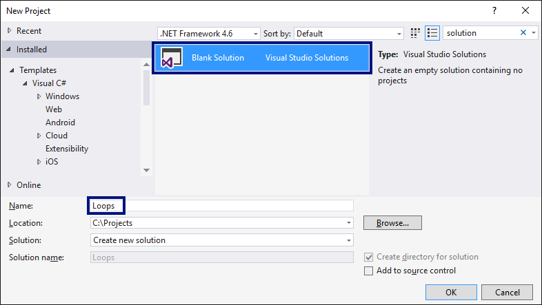{width="7.14671697287839in"
height="4.027777777777778in"}

2.  Задайте **да се стартира по подразбиране текущия проект** (не
    първият в решението). Кликнете с десен бутон на мишката върху
    **Solution \'Loops\'** **\[Set StartUp Projects...\]** **\[Current
    selection\]**.

Числа от 1 до 100
-----------------

Напишете програма, която отпечатва числата от 1 до 100, по едно на ред.

+----------+-----------+
| **вход** | **изход** |
+==========+===========+
| (няма)   | 1         |
|          |           |
|          | 2         |
|          |           |
|          | 3         |
|          |           |
|          | ...       |
|          |           |
|          | 98        |
|          |           |
|          | 99        |
|          |           |
|          | 100       |
+----------+-----------+

**Подсказки**:

1.  Създайте **нов проект** в съществуващото Visual Studio решение --
    конзолна C\# програма. Задайте подходящо име на проекта, например
    "**Numbers1To100**".

2.  Отидете в тялото на метода **Main(string\[\]** **args)** и напишете
    решението на задачата. Можете да си помогнете с кода от картинката
    по-долу:

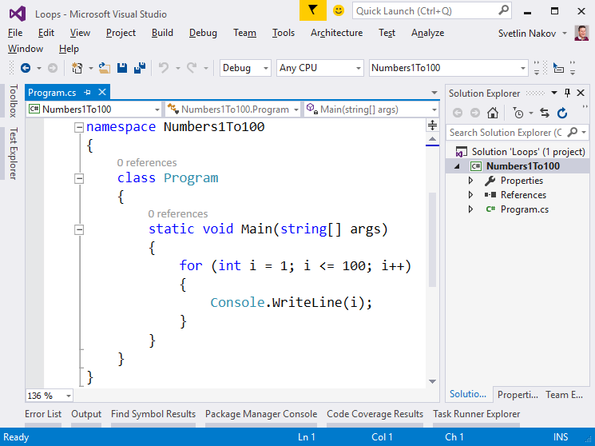{width="7.246527777777778in"
height="5.427777777777778in"}

3.  **Стартирайте** програмата с \[Ctrl+F5\] и я **тествайте**:

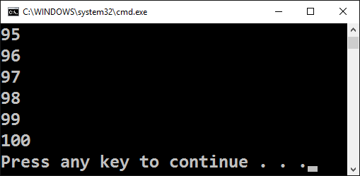{width="3.336806649168854in"
height="1.6323468941382326in"}

4.  **Тествайте** решението си в **judge системата**:
    <https://judge.softuni.bg/Contests/Practice/Index/154#0>. Трябва да
    получите **100 точки** (напълно коректно решение).

Числа до 1000, завършващи на 7
------------------------------

Напишете програма, която отпечатва числата в диапазона **\[1...1000\]**,
които **завършват на 7**.

+----------+-----------+
| **вход** | **изход** |
+==========+===========+
| (няма)   | 7         |
|          |           |
|          | 17        |
|          |           |
|          | 27        |
|          |           |
|          | ...       |
|          |           |
|          | 997       |
+----------+-----------+

**Тествайте** решението си в **judge системата**:
<https://judge.softuni.bg/Contests/Practice/Index/154#1>.

**Подсказка**: можете да завъртите **for**-цикъл от 1 до 1000 и да
проверите всяко число дали завършва на 7. Едно число **num** завършва на
7, когато **(num** **%** **10** **==** **7)**.

Всички латински букви
---------------------

Напишете програма, която отпечатва всички букви от латинската азбука:
**a**, **b**, **c**, ..., **z**.

**Тествайте** решението си в **judge системата**:
<https://judge.softuni.bg/Contests/Practice/Index/154#2>.

**Подсказка**: можете да завъртите **for**-цикъл от **\'a\'** до
**\'z\'** (освен числа може да въртите в цикъл и букви).

Сумиране на числа
-----------------

Да се напише програма, която **чете n-**на брой **цели числа**, въведени
от потребителя, **и ги сумира**.

-   От първия ред на входа се въвежда броят числа **n**.

-   От следващите **n** реда се въвежда по едно цяло число.

Програмата трябва да прочете числата, да ги сумира и да отпечата сумата
им. Примери:

<table>
<thead>
<tr class="header">
<th><strong>вход</strong></th>
<th><strong>изход</strong></th>
<th></th>
<th><strong>вход</strong></th>
<th><strong>изход</strong></th>
<th></th>
<th><strong>вход</strong></th>
<th><strong>изход</strong></th>
<th></th>
<th><strong>вход</strong></th>
<th><strong>изход</strong></th>
<th></th>
<th><strong>вход</strong></th>
<th><strong>изход</strong></th>
</tr>
</thead>
<tbody>
<tr class="odd">
<td>
2

10

20
</td>
<td>30</td>
<td></td>
<td>
3

-10

-20

-30
</td>
<td>-60</td>
<td></td>
<td>
4

45

-20

7

11
</td>
<td>43</td>
<td></td>
<td>
1

999
</td>
<td>999</td>
<td></td>
<td>0</td>
<td>0</td>
</tr>
</tbody>
</table>

**Тествайте** решението си в **judge системата**:
<https://judge.softuni.bg/Contests/Practice/Index/154#3>.

**Подсказки**:

-   Първо въведете едно число **n** (броят числа, които предстои да
    бъдат въведени).

-   Инициализирайте **sum** **=** **0** (в началото няма още прочетени
    числа, и съответно сумата е празна).

-   В цикъл **n пъти** прочетете по едно цяло число **num** и го
    прибавете към сумата (**sum** **=** **sum** **+** **num**).

-   Накрая в **sum** трябва да се е запазила сумата на прочетените
    числа. Отпечатайте я.

Най-голямо число
----------------

Напишете програма, която чете **n-на брой цели числа** (**n** \> 0),
въведени от потребителя, и намира **най-голямото** измежду тях. Първо се
въвежда броят числа **n**, а след това самите **n** числа, по едно на
ред. Примери:

<table>
<thead>
<tr class="header">
<th><strong>вход</strong></th>
<th><strong>изход</strong></th>
<th></th>
<th><strong>вход</strong></th>
<th><strong>изход</strong></th>
<th></th>
<th><strong>вход</strong></th>
<th><strong>изход</strong></th>
<th></th>
<th><strong>вход</strong></th>
<th><strong>изход</strong></th>
<th></th>
<th><strong>вход</strong></th>
<th><strong>изход</strong></th>
</tr>
</thead>
<tbody>
<tr class="odd">
<td>
2

100

99
</td>
<td>100</td>
<td></td>
<td>
3

-10

20

-30
</td>
<td>20</td>
<td></td>
<td>
4

45

-20

7

99
</td>
<td>99</td>
<td></td>
<td>
1

999
</td>
<td>999</td>
<td></td>
<td>
2

-1

-2
</td>
<td>-1</td>
</tr>
</tbody>
</table>

**Тествайте** решението си в **judge системата**:
<https://judge.softuni.bg/Contests/Practice/Index/154#4>.

**Подсказки**:

-   Първо въведете едно число **n** (броят числа, които предстои да
    бъдат въведени).

-   Въведете от конзолата първото число. Сложете текущият максимум
    **max** да е прочетеното число.

-   В цикъл **n-1 пъти** прочетете по едно цяло число **num**. Ако
    прочетеното число **num** е по-голямо от текущият максимум **max**,
    запомнете **num** в **max**.

-   Накрая в **max** трябва да се е запазило най-голямото число.
    Отпечатайте го.

Най-малко число
---------------

Напишете програма, която чете **n-на брой цели числа** (**n** \> 0),
въведени от потребителя, и намира **най-малкото** измежду тях. Първо се
въвежда броят числа **n**, а след това самите **n** числа, по едно на
ред. Примери:

<table>
<thead>
<tr class="header">
<th><strong>вход</strong></th>
<th><strong>изход</strong></th>
<th></th>
<th><strong>вход</strong></th>
<th><strong>изход</strong></th>
<th></th>
<th><strong>вход</strong></th>
<th><strong>изход</strong></th>
<th></th>
<th><strong>вход</strong></th>
<th><strong>изход</strong></th>
<th></th>
<th><strong>вход</strong></th>
<th><strong>изход</strong></th>
</tr>
</thead>
<tbody>
<tr class="odd">
<td>
2

100

99
</td>
<td>99</td>
<td></td>
<td>
3

-10

20

-30
</td>
<td>-30</td>
<td></td>
<td>
4

45

-20

7

99
</td>
<td>-20</td>
<td></td>
<td>
1

999
</td>
<td>999</td>
<td></td>
<td>
2

-1

-2
</td>
<td>-2</td>
</tr>
</tbody>
</table>

**Тествайте** решението си в **judge системата**:
<https://judge.softuni.bg/Contests/Practice/Index/154#5>.

**Подсказки**: задачата е абсолютно аналогична с предходната.

Лява и дясна сума
-----------------

Да се напише програма, която чете **2\*n-на брой** цели числа, подадени
от потребителя, и проверява дали **сумата на първите n числа** (лява
сума) е равна на **сумата на вторите n числа** (дясна сума). При
равенство печата \"**Yes**\" + **сумата**; иначе печата \"**No**\" +
**разликата**. Разликата се изчислява като положително число (по
абсолютна стойност). Примери:

+---------+---------+---------+---------+---------+---------+---------+
| **вход* | **изход | **комен |         | **вход* | **изход | **комен |
| *       | **      | тар**   |         | *       | **      | тар**   |
+=========+=========+=========+=========+=========+=========+=========+
| 2       | Yes,    | 10+90 = |         | 2       | No,     | 90+9 ≠  |
|         | sum =   | 60+40 = |         |         | diff =  | 50+50   |
| 10      | 100     | 100     |         | 90      | 1       |         |
|         |         |         |         |         |         | Differe |
| 90      |         |         |         | 9       |         | nce     |
|         |         |         |         |         |         | =       |
| 60      |         |         |         | 50      |         | \|99-10 |
|         |         |         |         |         |         | 0\|     |
| 40      |         |         |         | 50      |         | = 1     |
+---------+---------+---------+---------+---------+---------+---------+

**Тествайте** решението си в **judge системата**:
<https://judge.softuni.bg/Contests/Practice/Index/154#6>.

**Подсказки**:

-   Въведете **n**.

-   Въведете първите **n** числа (**лявата** половина) и ги сумирайте.

-   Въведете още **n** числа (**дясната** половина) и ги сумирайте.

-   Изчислете **разликата** между сумите по абсолютна стойност:
    **Math.Abs(leftSum** **-** **rightSum)**.

-   Ако разликата е **0**, отпечатайте \"**Yes**\" + **сумата**; иначе
    отпечатайте \"**No**\" + **разликата**.

Четна / нечетна сума
--------------------

Да се напише програма, която чете **n-на брой** цели числа, подадени от
потребителя, и проверява дали **сумата от числата на четни позиции** е
равна на **сумата на числата на нечетни позиции**. При равенство да се
отпечата \"**Yes**\" + **сумата**; иначе да се отпечата \"**No**\" +
**разликата**. Разликата се изчислява по абсолютна стойност. Примери:

<table>
<thead>
<tr class="header">
<th><strong>вход</strong></th>
<th><strong>изход</strong></th>
<th><strong>коментар</strong></th>
<th></th>
<th><strong>вход</strong></th>
<th><strong>изход</strong></th>
<th><strong>коментар</strong></th>
<th></th>
<th><strong>вход</strong></th>
<th><strong>изход</strong></th>
<th><strong>коментар</strong></th>
</tr>
</thead>
<tbody>
<tr class="odd">
<td>
4

10

50

60

20
</td>
<td>
Yes

Sum = 70
</td>
<td>10+60 = 50+20 = 70</td>
<td></td>
<td>
4

3

5

1

-2
</td>
<td>
No

Diff = 1
</td>
<td>
3+1 ≠ 5-2

Diff = 
|4-3| = 1
</td>
<td></td>
<td>
3

5

8

1
</td>
<td>
No

Diff = 2
</td>
<td>
5+1 ≠ 8

Diff = 
|6-8| = 2
</td>
</tr>
</tbody>
</table>

**Тествайте** решението си в **judge системата**:
<https://judge.softuni.bg/Contests/Practice/Index/154#7>.

**Подсказки**: Въведете числата едно по едно и изчислете двете **суми**
(числа на **четни** позиции и числа на **нечетни** позиции). Както в
предходната задача, изчислете абсолютна стойност на разликата и
отпечатайте резултата (\"**Yes**\" + **сумата** при разлика 0 или
\"**No**\" + **разликата** в противен случай).

Сумиране на гласните букви
--------------------------

Да се напише програма, която чете **текст** (стринг), въведен от
потребителя, и изчислява и отпечатва **сумата от стойностите на гласните
букви** според таблицата по-долу:

  буква      a   e   i   o   u
  ---------- --- --- --- --- ---
  стойност   1   2   3   4   5

Примери:

  **вход**   **изход**   **коментар**
  ---------- ----------- ---------------------------
  hello      6           e + o = 2 + 4 = 6
  hi         3           i = 3
  bamboo     9           a + o + o = 1 + 4 + 4 = 9
  beer       4           e + e = 2 + 2 = 4

**Тествайте** решението си в **judge системата**:
<https://judge.softuni.bg/Contests/Practice/Index/154#8>.

**Подсказки**:

-   Прочетете входния текст **s**. Нулирайте сумата.

-   Завъртете цикъл от **0** до **s.Length-1** (дължината на текста -1).

-   Проверете всяка буква **s\[i\]** дали е гласна и съответно добавете
    към сумата стойността й.

\*Елемент, равен на сумата на останалите
----------------------------------------

Да се напише програма, която чете **n-на брой** цели числа, въведени от
потребителя, и проверява дали сред тях съществува число, което е равно
на сумата на всички останали. Ако има такъв елемент, печата \"**Yes**\",
\"**Sum =** \" + **неговата стойност**; иначе печата \"**No**\",
\"**Diff =** \" + **разликата между най-големия елемент и сумата на
останалите** (по абсолютна стойност).

Примери:

+----------+-----------+----------------------------+
| **вход** | **изход** | **коментари**              |
+==========+===========+============================+
| 7        | Yes       | 3 + 4 + 1 + 2 + 1 + 1 = 12 |
|          |           |                            |
| 3        | Sum = 12  |                            |
|          |           |                            |
| 4        |           |                            |
|          |           |                            |
| 1        |           |                            |
|          |           |                            |
| 1        |           |                            |
|          |           |                            |
| 2        |           |                            |
|          |           |                            |
| **12**   |           |                            |
|          |           |                            |
| 1        |           |                            |
+----------+-----------+----------------------------+
| 4        | Yes       | 1 + 2 + 3 = 12             |
|          |           |                            |
| **6**    | Sum = 6   |                            |
|          |           |                            |
| 1        |           |                            |
|          |           |                            |
| 2        |           |                            |
|          |           |                            |
| 3        |           |                            |
+----------+-----------+----------------------------+
| 3        | No        | \|10 - (1 + 1)\| = 8       |
|          |           |                            |
| 1        | Diff = 8  |                            |
|          |           |                            |
| 1        |           |                            |
|          |           |                            |
| 10       |           |                            |
+----------+-----------+----------------------------+
| 3        | No        | \|5 - (5 + 1)\| = 1        |
|          |           |                            |
| 5        | Diff = 1  |                            |
|          |           |                            |
| 5        |           |                            |
|          |           |                            |
| 1        |           |                            |
+----------+-----------+----------------------------+
| 3        | No        |                            |
|          |           |                            |
| 1        | Diff = 1  |                            |
|          |           |                            |
| 1        |           |                            |
|          |           |                            |
| 1        |           |                            |
+----------+-----------+----------------------------+

**Тествайте** решението си в **judge системата**:
<https://judge.softuni.bg/Contests/Practice/Index/154#9>.

**Подсказка**: изчислете **сумата** на всички елементи и
**най-големият** от тях и проверете търсеното условие.

\*Четни / нечетни позиции
-------------------------

Напишете програма, която чете **n-на брой** **числа**, въведени от
потребителя, и пресмята **сумата**, **минимума** и **максимума** на
числата на **четни** и **нечетни** позиции (броим от 1). Когато няма
минимален / максимален елемент, отпечатайте "**No**".

Изходът да се форматира в следния вид:

\"**OddSum=**\" + {**сума** на числата на **нечетни** позиции},

\"**OddMin=**\" + { **минимална** стойност на числата на **нечетни**
позиции } / {"**No**"},

\"**OddMax=**\" + { **максимална** стойност на числата на **нечетни**
позиции } / {"**No**"},

\"**EvenSum=**\" + { **сума** на числата на **четни** позиции },

\"**EvenMin=**\" + { **минимална** стойност на числата на **четни**
позиции } / {"**No**"},

\"**EvenMax=**\" + { **максимална** стойност на числата на **четни**
позиции } / {"**No**"}

Примери:

<table>
<thead>
<tr class="header">
<th><strong>вход</strong></th>
<th><strong>изход</strong></th>
<th></th>
<th><strong>вход</strong></th>
<th><strong>изход</strong></th>
<th></th>
<th><strong>вход</strong></th>
<th><strong>изход</strong></th>
<th></th>
<th><strong>вход</strong></th>
<th><strong>изход</strong></th>
</tr>
</thead>
<tbody>
<tr class="odd">
<td>
6

<strong>2</strong>

3

<strong>5</strong>

4

<strong>2</strong>

1
</td>
<td>OddSum=9, OddMin=2, OddMax=5, EvenSum=8, EvenMin=1, EvenMax=4</td>
<td></td>
<td>
2

<strong>1.5</strong>

-2.5
</td>
<td>OddSum=1.5, OddMin=1.5, OddMax=1.5, EvenSum=-2.5, EvenMin=-2.5, EvenMax=-2.5</td>
<td></td>
<td>
1

<strong>1</strong>
</td>
<td>OddSum=1, OddMin=1, OddMax=1, EvenSum=0, EvenMin=No, EvenMax=No</td>
<td></td>
<td>0</td>
<td>OddSum=0, OddMin=No, OddMax=No, EvenSum=0, EvenMin=No, EvenMax=No</td>
</tr>
<tr class="even">
<td><strong>вход</strong></td>
<td><strong>изход</strong></td>
<td></td>
<td><strong>вход</strong></td>
<td><strong>изход</strong></td>
<td></td>
<td><strong>вход</strong></td>
<td><strong>изход</strong></td>
<td></td>
<td><strong>вход</strong></td>
<td><strong>изход</strong></td>
</tr>
<tr class="odd">
<td>
5

<strong>3</strong>

-2

<strong>8</strong>

11

<strong>-3</strong>
</td>
<td>OddSum=8, OddMin=-3, OddMax=8, EvenSum=9, EvenMin=-2, EvenMax=11</td>
<td></td>
<td>
4

1.5

<strong>1.75</strong>

1.5

<strong>1.75</strong>
</td>
<td>OddSum=3, OddMin=1.5, OddMax=1.5, EvenSum=3.5, EvenMin=1.75, EvenMax=1.75</td>
<td></td>
<td>
1

<strong>-5</strong>
</td>
<td>OddSum=-5, OddMin=-5, OddMax=-5, EvenSum=0, EvenMin=No, EvenMax=No</td>
<td></td>
<td>
3

<strong>-1</strong>

-2

<strong>-3</strong>
</td>
<td>OddSum=-4, OddMin=-3, OddMax=-1, EvenSum=-2, EvenMin=-2, EvenMax=-2</td>
</tr>
</tbody>
</table>

**Тествайте** решението си в **judge системата**:
<https://judge.softuni.bg/Contests/Practice/Index/154#10>.

**Подсказки**:

-   Задача обединява няколко предходни задачи: намиране на **минимум**,
    намиране на **максимум**, намиране на **сума** и обработка на
    елементите от **четни и нечетни позиции**. Припомнете си ги.

-   Работете с **дробни числа** (не цели). Сумата, минимумът и
    максимумът също са дробни числа.

-   Използвайте **неутрална начална стойност** при намиране на минимум /
    максимум, например **1000000000.0** и **-1000000000.0**. Ако
    получите накрая неутралната стойност, печатайте "**No**".

Еднакви двойки
--------------

Дадени са 2\***n-на брой** числа. Първото и второто формират **двойка**,
третото и четвъртото също и т.н. Всяка двойка има **стойност** -- сумата
от съставящите я числа. Напишете програма, която проверява **дали всички
двойки имат еднаква стойност** или печата **максималната разлика** между
две последователни двойки. Ако всички двойки имат еднаква стойност,
отпечатайте \"**Yes, value={Value}**\" + **стойността**. В противен
случай отпечатайте \"**No, maxdiff={Difference}**\" + **максималната
разлика**. Примери:

+---------+---------+---------+---------+---------+---------+---------+
| **вход* | **изход | **комен |         | **вход* | **изход | **комен |
| *       | **      | тари**  |         | *       | **      | тари**  |
+=========+=========+=========+=========+=========+=========+=========+
| 3       | Yes,    | стойнос |         | 2       | No,     | стойнос |
|         | value=3 | ти      |         |         | maxdiff | ти      |
| 1       |         | = {3,   |         | 1       | =1      | = {3,   |
|         |         | 3, 3}   |         |         |         | 4}      |
| 2       |         |         |         | 2       |         |         |
|         |         | еднакви |         |         |         | разлики |
| 0       |         | стойнос |         | 2       |         | = {1}   |
|         |         | ти      |         |         |         |         |
| 3       |         |         |         | 2       |         | макс.   |
|         |         |         |         |         |         | разлика |
| 4       |         |         |         |         |         | = 1     |
|         |         |         |         |         |         |         |
| -1      |         |         |         |         |         |         |
+---------+---------+---------+---------+---------+---------+---------+
| 4       | No,     | стойнос |         | 1       | Yes,    | стойнос |
|         | maxdiff | ти      |         |         | value=1 | ти      |
| 1       | =4      | = {2,   |         | 5       | 0       | = {10}  |
|         |         | 4, 4,   |         |         |         |         |
| 1       |         | 0}      |         | 5       |         | една    |
|         |         |         |         |         |         | стойнос |
| 3       |         | разлики |         |         |         | т       |
|         |         | = {2,   |         |         |         |         |
| 1       |         | 0, 4}   |         |         |         | еднакви |
|         |         |         |         |         |         | стойнос |
| 2       |         | макс.   |         |         |         | ти      |
|         |         | разлика |         |         |         |         |
| 2       |         | = 4     |         |         |         |         |
|         |         |         |         |         |         |         |
| 0       |         |         |         |         |         |         |
|         |         |         |         |         |         |         |
| 0       |         |         |         |         |         |         |
+---------+---------+---------+---------+---------+---------+---------+
| 2       | Yes,    | стойнос |         | 2       | No,     | стойнос |
|         | value=- | ти      |         |         | maxdiff | ти      |
| -1      | 1       | = {-1,  |         | -1      | =2      | = {1,   |
|         |         | -1}     |         |         |         | -1}     |
| 0       |         |         |         | 2       |         |         |
|         |         | еднакви |         |         |         | разлики |
| 0       |         | стойнос |         | 0       |         | = {2}   |
|         |         | ти      |         |         |         |         |
| -1      |         |         |         | -1      |         | макс.   |
|         |         |         |         |         |         | разлика |
|         |         |         |         |         |         | = 2     |
+---------+---------+---------+---------+---------+---------+---------+

**Тествайте** решението си в **judge системата**:
<https://judge.softuni.bg/Contests/Practice/Index/154#11>.

**Подсказки**:

-   Прочитайте входните числа **по двойки**. За всяка двойка пресмятайте
    **сумата**.

-   Докато четете входните двойки, за всяка двойка без първата
    пресмятайте **разликата с предходната**. За целта пазете в отделна
    променлива сумата на предходната двойка.

-   Намерете **най-голямата разлика** между две двойки. Ако е **0**,
    печатайте "**Yes**" иначе "**No**" + разликата.

 {#section .ListParagraph}

Упражнения: Графични и Web приложения
=====================================

\* Чертане с костенурка -- графично GUI приложение
--------------------------------------------------

Целта на следващото упражнение е да си поиграем с една **библиотека за
рисуване**, известна като "**графика с костенурка**" (**turtle
graphics**). Ще изградим **графично приложение**, в което ще **рисуваме
различни фигури**, придвижвайки нашата "**костенурка**" по екрана чрез
операции от типа "отиди напред 100 позиции", "завърти се надясно на 30
градуса", "отиди напред още 50 позиции". Приложението ще изглежда
приблизително така:

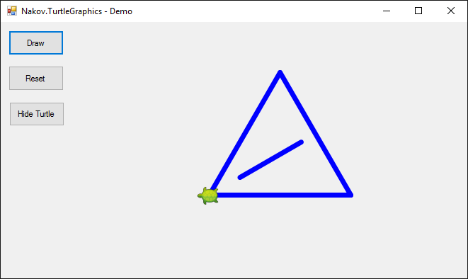{width="4.225695538057742in"
height="2.5187948381452316in"}

1.  Запознайте се с **концепцията за рисуване** "**Turtle Graphics**".
    Можете да разгледате следните източници:

-   Дефиниция на понятието "turtle graphics" --
    <http://c2.com/cgi/wiki?TurtleGraphics>

-   Статия за "turtle graphics" в Wikipedia --
    <https://en.wikipedia.org/wiki/Turtle_graphics>

-   Интерактивен онлайн инструмент за чертане с костенурка --
    <https://blockly-games.appspot.com/turtle>

2.  Създайте нов **C\# Windows Forms проект**:

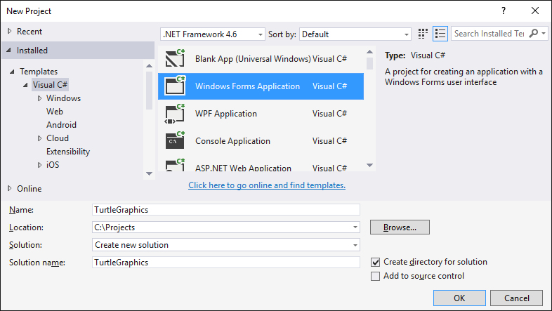{width="6.231371391076116in" height="3.5125in"}

3.  Инсталирайте **NuGet** пакета \"**Nakov.TurtleGraphics**\" към
    вашият Windows Forms проект.

От Visual Studio може да се добавят **външни библиотеки** (пакети) към
вашите C\# проекти. Те добавят допълнителна функционалност към вашите
приложения. Официалното хранилище (repository) за C\# библиотеки се
поддържа от Microsoft и се нарича **NuGet**
([www.nuget.org](http://www.nuget.org)).

Кликнете върху проекта в **Solution Explorer** и изберете **\[Manage
NuGet Packages...\]**:

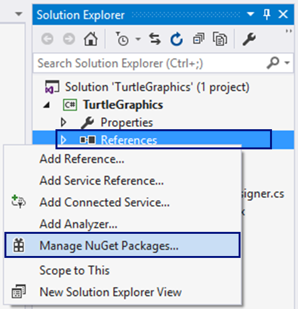{width="3.156431539807524in"
height="3.2708333333333335in"}

Ще се отвори прозорец за търсене и инсталиране на **NuGet** пакети.
Потърсете пакети по ключова дума "**nakov**". Ще излязат няколко пакета.
Изберете пакет "**Nakov.TurtleGraphics**". Натиснете **\[Install\]** за
да го инсталирате към вашия C\# проект:

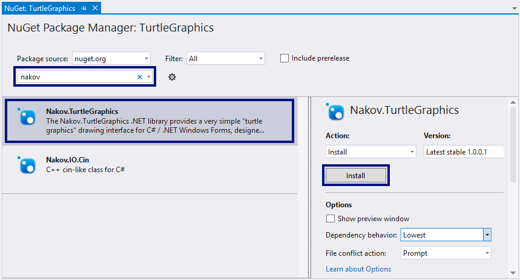{width="6.767362204724409in"
height="3.639523184601925in"}

Към вашият C\# проект вече в включена външната библиотека
"**Nakov.TurtleGraphics**". Тя дефинира един клас **Turtle**, с който
представлява **костенурка за рисуване**. За да го използвате, трябва да
добавите в C\# кода за вашата форма (**Form1.cs**) следния код
най-отгоре в началото на файла:

  -----------------------------
  using Nakov.TurtleGraphics;
  -----------------------------

4.  Сега сложете **три бутона** във формата и нагласете **имената** и
    **свойствата** им както е посочено по-долу:

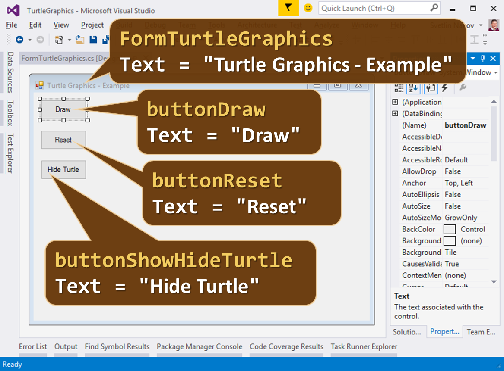{width="6.798611111111111in"
height="5.015826771653543in"}

5.  Кликнете два пъти върху бутона **\[Draw\]**, за да напишете кода,
    който да се изпълни при натискането му. Напишете следния код:

+------------------------------------------------------------+
| private void buttonDraw\_Click(object sender, EventArgs e) |
|                                                            |
| {                                                          |
|                                                            |
| Turtle.Rotate(30);                                         |
|                                                            |
| Turtle.Forward(200);                                       |
|                                                            |
| Turtle.Rotate(120);                                        |
|                                                            |
| Turtle.Forward(200);                                       |
|                                                            |
| Turtle.Rotate(120);                                        |
|                                                            |
| Turtle.Forward(200);                                       |
|                                                            |
| }                                                          |
+------------------------------------------------------------+

Този код мести и върти костенурката, която в началото е в центъра на
екрана (в средата на формата), и чертае равностранен триъгълник. Може да
го редактирате и да си поиграете с него.

6.  **Стартирайте** приложението с **\[Ctrl+F5\]**. Тествайте го дали
    работи (натиснете **\[Draw\]** бутона няколко пъти):

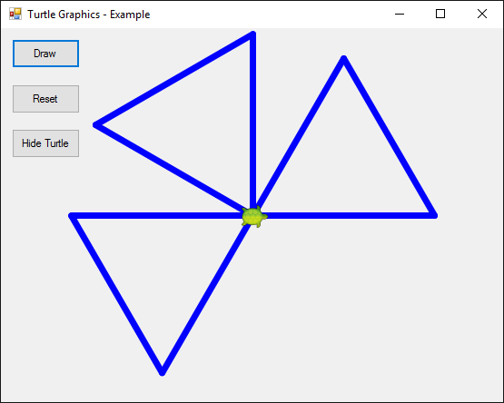{width="4.677083333333333in"
height="3.7416666666666667in"}

7.  Сега можете да напишете **по-сложна програма за костенурката**:

+----------------------------------------------------+
| // Assign a delay to visualize the drawing process |
|                                                    |
| Turtle.Delay = 200;                                |
|                                                    |
| // Draw a equilateral triangle                     |
|                                                    |
| Turtle.Rotate(30);                                 |
|                                                    |
| Turtle.Forward(200);                               |
|                                                    |
| Turtle.Rotate(120);                                |
|                                                    |
| Turtle.Forward(200);                               |
|                                                    |
| Turtle.Rotate(120);                                |
|                                                    |
| Turtle.Forward(200);                               |
|                                                    |
| // Draw a line in the triangle                     |
|                                                    |
| Turtle.Rotate(-30);                                |
|                                                    |
| Turtle.PenUp();                                    |
|                                                    |
| Turtle.Backward(50);                               |
|                                                    |
| Turtle.PenDown();                                  |
|                                                    |
| Turtle.Backward(100);                              |
|                                                    |
| Turtle.PenUp();                                    |
|                                                    |
| Turtle.Forward(150);                               |
|                                                    |
| Turtle.PenDown();                                  |
|                                                    |
| Turtle.Rotate(30);                                 |
+----------------------------------------------------+

8.  **Стартирайте** приложението с **\[Ctrl+F5\]**. Тествайте дали
    работи новата програма за костенурката:

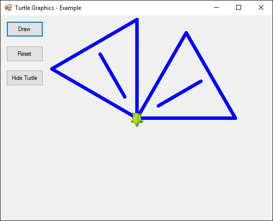{width="5.78125in" height="4.666666666666667in"}

Вече костенурката чертае по-сложни фигури чрез приятно анимирано
движение.

9.  Напишете кода и за останалите два бутона. Целта на бутона
    **\[Reset\]** е да изтрие графиката и да започне да чертае на чисто:

+-------------------------------------------------------------+
| private void buttonReset\_Click(object sender, EventArgs e) |
|                                                             |
| {                                                           |
|                                                             |
| Turtle.Reset();                                             |
|                                                             |
| }                                                           |
+-------------------------------------------------------------+

10. Целта на бутона **\[Show / Hide Turtle\]** е да показва или скрива
    костенурката:

+----------------------------------------------------------------------+
| private void buttonShowHideTurtle\_Click(object sender, EventArgs e) |
|                                                                      |
| {                                                                    |
|                                                                      |
| if (Turtle.ShowTurtle)                                               |
|                                                                      |
| {                                                                    |
|                                                                      |
| Turtle.ShowTurtle = false;                                           |
|                                                                      |
| this.buttonShowHideTurtle.Text = \"Show Turtle\";                    |
|                                                                      |
| }                                                                    |
|                                                                      |
| else                                                                 |
|                                                                      |
| {                                                                    |
|                                                                      |
| Turtle.ShowTurtle = true;                                            |
|                                                                      |
| this.buttonShowHideTurtle.Text = \"Hide Turtle\";                    |
|                                                                      |
| }                                                                    |
|                                                                      |
| }                                                                    |
+----------------------------------------------------------------------+

11. **Стартирайте** приложението с **\[Ctrl+F5\]**. Тествайте дали
    работят правилно всички бутони.

\* Чертане на шестоъгълник с костенурката
-----------------------------------------

Добавете бутон **\[Hexagon\]**, който чертае правилен шестоъгълник:

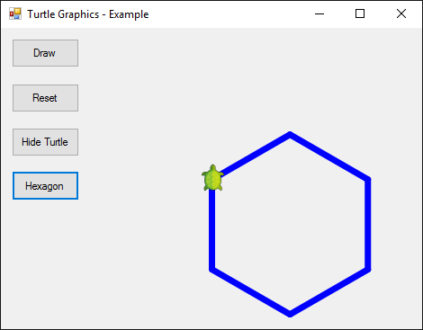{width="4.895833333333333in"
height="3.8229166666666665in"}

**Подсказка**: В цикъл повторете 6 пъти следното: ротация на 60 градуса;
движение напред 100.

\* Чертане на звезда с костенурката
-----------------------------------

Добавете бутон **\[Star\]**, който чертае звезда с 5 върха
(**петолъчка**) като на фигурата по-долу:

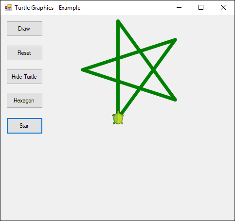{width="3.433333333333333in"
height="3.234297900262467in"}

**Подсказка**:

-   Сменете цвета: Turtle.PenColor = Color.Green.

-   В цикъл повторете 5 пъти следното: движение напред 200, ротация на
    144 градуса.

\* Чертане на спирала с костенурката
------------------------------------

Добавете бутон **\[Spiral\]**, който чертае спирала с 20 върха като на
фигурата по-долу:

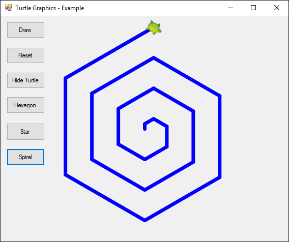{width="4.465143263342083in"
height="3.7419160104986875in"}

**Подсказка**: Чертайте в цикъл като движите напред и завъртате. С всяка
стъпка увеличавайте постепенно дължината на движението напред и
завъртайте на 60 градуса.

\* Чертане на слънце с костенурката
-----------------------------------

Добавете бутон **\[Sun\]**, който чертае слънце с 36 върха като на
фигурата по-долу:

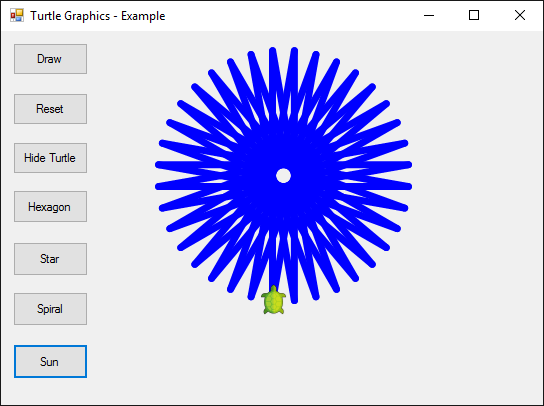{width="4.529665354330708in"
height="3.3805971128608925in"}

\* Чертане на спирален триъгълник с костенурката
------------------------------------------------

Добавете бутон **\[Triangle\]**, който три триъгълника с по 22 върха
като на фигурата по-долу:

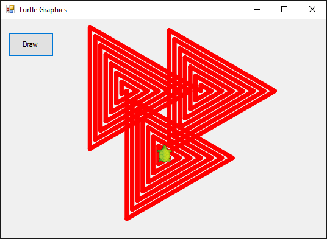{width="5.584113079615048in"
height="4.094320866141732in"}

**Подсказка**: Чертайте в цикъл като движите напред и завъртате. С всяка
стъпка увеличавайте с 10 дължината на движението напред и завъртайте на
120 градуса. Повторете 3 пъти за трите триъгълника.

Изпитни задачи от минали издания на курса
=========================================

\* Дядо Ставри
--------------

*Четвърта задача от изпита на 17 септември 2017. Тествайте решението си
[**тук**](https://judge.softuni.bg/Contests/Practice/Index/784#3)*

Дядо Ставри има казан за ракия и всеки ден вари от любимата си напитка.
Ако вари **N дена** и всеки ден получава **различно количество ракия** и
**алкохолен градус**, да се намери за всичките дни **общото количество
ракия и градуса на получената смес. **

### Вход

От конзолата се четат **поредица от числа, всяко на отделен ред**:

-   На **първия ред** -- N -- брой дни -- **цяло число в интервала**
    **\[1\...300\]**

-   За **всеки един ден** на отделен ред :

<!-- -->

-   **количество на ракията** -- **реално число в интервала
    \[1.00\...500.00\]**

-   **градус на получената напитка - реално число в интервала
    \[10.00\...99.00\]**

### Изход

Да се отпечатат на конзолата **3 реда**, както следва:

-   **Първи ред** -- да се отпечатва съобщение форматирано до втори знак
    „**Liter**:{общо литрите}"

-   **Втори ред** -- да се отпечатва съобщение форматирано до втори знак
    „**Degrees**:{градусите на общата смес} ;

-   **Трети ред** -- да се отпечатва:

<!-- -->

-   Ако градусът е по-малко от 38, да се отпечата съобщение „Не е добре,
    трябва преваряване!". \"**Not good, you should baking**!\".

-   Ако е от 38 до 42, да се отпечата съобщение „Супер!" \"**Super**!\"

-   Ако е повече от 42, да се отпечата „Разреждане с дестилирана вода!"
    \"**Dilution with distilled water**!\"

### Примерен вход и изход

+-------------+-------------+-------------+-------------+-------------+
| **Вход**    | **Изход**   | **Обяснения | **Вход**    | **Изход**   |
|             |             | **          |             |             |
+=============+=============+=============+=============+=============+
| 3           | Liter:      | **Първи     | 2           | Liter:      |
|             | 300.00      | ден:**      |             | 400.00      |
| 100         |             | общото=100  | 200         |             |
|             | Degrees:    | литра       |             | Degrees:    |
| 45          | 42.17       |             | 43          | 41.50       |
|             |             | 100 \*      |             |             |
| 50          | Dilution    | 45=4500     | 200         | Super!      |
|             | with        |             |             |             |
| 55          | distilled   | **Втори     | 40          |             |
|             | water!      | ден:**      |             |             |
| 150         |             | общото=     |             |             |
|             |             | 100+50=150; |             |             |
| 36          |             |             |             |             |
|             |             | 4500+55\*50 |             |             |
|             |             | =7250;      |             |             |
|             |             |             |             |             |
|             |             | **Трети     |             |             |
|             |             | ден:**      |             |             |
|             |             | общото=     |             |             |
|             |             | 150+150=300 |             |             |
|             |             | ;           |             |             |
|             |             |             |             |             |
|             |             | 7250+150\*3 |             |             |
|             |             | 6=12650;    |             |             |
|             |             |             |             |             |
|             |             | **градусите |             |             |
|             |             | **=12650    |             |             |
|             |             | /           |             |             |
|             |             | 300=42.1666 |             |             |
|             |             | 66...       |             |             |
+-------------+-------------+-------------+-------------+-------------+

\* Торта
--------

*Четвърта задача от изпита на 03 септември 2017. Тествайте решението си
[**тук**](https://judge.softuni.bg/Contests/Practice/Index/750#3)*

Поканен сте на **30-тия рожден ден на Кендрик Ламар**, но като част от
организацията. Той иска да покани много гости и планира да вземе
**огромна торта**. Иска да знае обаче колко **парчета** могат да се
вземат от нея. Всеки път когато някой си вземе, трябва да се **отчита**,
че **едно** или **повече** парчета са взети. Така трябва да се продължи
**докато не свърши тортата** или **докато гостите не спрат да си
взимат**.

Напишете **програма**, която да изчислява броя **останали** парчета. Ще
получите размерите на тортата и след това на всеки ред, докато не
получите командата **STOP** или докато не свърши тортата (**pieces \<
0**), ще получавате цяло число, равно на взетите парчета. Накрая трябва
да се отпечата **колко парчета са останали** или, **че са свършили**.

**Note: Тортата е с правоъгълна форма. Едно парче е с размер 1х1.**

### Вход

Потребителят въвежда следните данни на отделни редове:

1.  **Широчина на тортата -- цяло число в интервала \[1\...1000\];**

2.  **Дължина на тортата -- цяло число в интервала \[1\...1000\];**

3.  На следващите редове **(докато не получите командата STOP)** --
    **брой парчета, които се взимат от тортата -- цели числа в интервала
    \[1\...1000\];**

### Изход

Да се **отпечата** на конзолата **един** от следните редове:

-   **\"{брой парчета} pieces are left.\" -** ако стигнете до STOP и не
    се свършили парчетата торта

-   **\"No more cake left! You need {брой недостигащи парчета} pieces
    more.\"**

### Примерен вход и изход

+----------+--------------------------------------------+
| **Вход** | **Изход**                                  |
+==========+============================================+
| 10       | No more cake left! You need 1 pieces more. |
|          |                                            |
| 10       |                                            |
|          |                                            |
| 20       |                                            |
|          |                                            |
| 20       |                                            |
|          |                                            |
| 20       |                                            |
|          |                                            |
| 20       |                                            |
|          |                                            |
| 21       |                                            |
+----------+--------------------------------------------+
| **Вход** | **Изход**                                  |
+----------+--------------------------------------------+
| 10       | 8 pieces are left.                         |
|          |                                            |
| 2        |                                            |
|          |                                            |
| 2        |                                            |
|          |                                            |
| 4        |                                            |
|          |                                            |
| 6        |                                            |
|          |                                            |
| STOP     |                                            |
+----------+--------------------------------------------+

\* Разход на енергия
--------------------

*Четвърта задача от изпита на 23 юли 2017. Тествайте решението си
[**тук**](https://judge.softuni.bg/Contests/Practice/Index/715#3)*

След финалите всички танцьори се връщат към регулярните си тренировки в
залата. **Всички тренират определен брой дни по определени часове.**
**Да се изчисли колко средно енергия е останала неизхабена за всички
тренировъчни дни** като се има предвид че:

                                            **Проценти изхабена енергия на човек**
  ----------------------------------------- ----------------------------------------
  **Четна тренировка и четни часове**       **68%**
  **Нечетна тренировка и четни часове**     **49%**
  **Четна тренировка и нечетни часове**     **65%**
  **Нечетна тренировка и нечетни часове**   **30%**

**Всеки танцьор започва със 100% енергия.**

### Вход

От конзолата се четат **поредица от числа**, всяко **на отделен ред**:

1.  **N -- брой тренировъчни дни -- цяло число в интервала \[0 ...
    31\].**

2.  **А -- брой танцьори -- цяло число в интервала \[0 ... 100\].**

**За всеки тренировъчен ден** се прочита **на отделен ред**:

-   **Часовете, които са тренирали** -- **цяло число в интервала \[0 ...
    12\].**

### Изход

Отпечатва се **1 ред** в следния формат:

**АКО** средния разход на енергия за тренировъчните дни е **50% или по -
малко**

-   **"They feel good! Energy left:** {**останала енергия**}**"**.

**AКО** средния разход на енергия за тренировъчните дни е **над 50%**

-   **"They are wasted! Energy left:** {**останала енергия**}**"**.

**Резултатът трябва да се форматира до втория знак след десетичната
запетая**.

+-----------------------+-----------------------+-----------------------+
| **Вход**              | **Изход**             | **Обяснения**         |
+=======================+=======================+=======================+
| 4                     | They are wasted!      | **Нечетен ден и       |
|                       | Energy left: 47.00    | нечетни часове** --   |
| 10                    |                       | 10 \* 30 = 300 общо   |
|                       |                       | отдадена енергия от   |
| 5                     |                       | всички.               |
|                       |                       |                       |
| 8                     |                       | **Четен ден и четни   |
|                       |                       | часове** -- 68 \* 10  |
| 2                     |                       | = 680                 |
|                       |                       |                       |
| 3                     |                       | **Нечетен ден и четни |
|                       |                       | часове** = 49 \* 10 = |
|                       |                       | 490                   |
|                       |                       |                       |
|                       |                       | **Четен ден и нечетни |
|                       |                       | часове** -- 65 \* 10  |
|                       |                       | = 650                 |
|                       |                       |                       |
|                       |                       | **Обща енергия** за   |
|                       |                       | всички дни на         |
|                       |                       | танцьорите =\         |
|                       |                       | 100 \* 10 \* 4 = 4000 |
|                       |                       |                       |
|                       |                       | Неизхабена енергия    |
|                       |                       | общо за **всички**    |
|                       |                       | дни -\                |
|                       |                       | 4000 -- (300 + 680 +  |
|                       |                       | 490 + 650) = 1880     |
|                       |                       |                       |
|                       |                       | Неизхабена енергия на |
|                       |                       | **танцьор** **за      |
|                       |                       | ден** --\             |
|                       |                       | 1880 / 10 / 4 = 47    |
+-----------------------+-----------------------+-----------------------+
| **Вход**              | **Изход**             | **Обяснения**         |
+-----------------------+-----------------------+-----------------------+
| 4                     | They feel good!       | **Нечетен ден и       |
|                       | Energy left: 52.50    | нечетни часове --     |
| 10                    |                       | 10\*30 = 300 **       |
|                       |                       |                       |
| 1                     |                       | **Четен ден и нечетни |
|                       |                       | часове -- 65\*10 =650 |
| 1                     |                       | **                    |
|                       |                       |                       |
| 1                     |                       | **Нечетен ден и       |
|                       |                       | нечетни часове --     |
| 1                     |                       | 10\*30 = 300 **       |
|                       |                       |                       |
|                       |                       | **Четен ден и нечетни |
|                       |                       | часове -- 65\*10 =    |
|                       |                       | 650 **                |
|                       |                       |                       |
|                       |                       | **Обща енергия** за   |
|                       |                       | всички дни на         |
|                       |                       | танцьорите --\        |
|                       |                       | 100 \* 10 \* 4 = 4000 |
|                       |                       |                       |
|                       |                       | Неизхабена енергия    |
|                       |                       | общо за **всички**    |
|                       |                       | дни -\                |
|                       |                       | 4000 -- (650 + 650 +  |
|                       |                       | 300 + 300) = 2100     |
|                       |                       |                       |
|                       |                       | Неизхабена енергия на |
|                       |                       | **танцьор** **за      |
|                       |                       | ден** --\             |
|                       |                       | 2100 / 10 / 4 = 52.5  |
+-----------------------+-----------------------+-----------------------+

\* Парична награда
------------------

*Четвърта задача от изпита на 25 юни 2017. Тествайте решението си
[**тук**](https://judge.softuni.bg/Contests/Practice/Index/642#3)*

Сашо, Пешо, Гошо, Иво и Стоян печелят състезание за най-добре изготвен
проект и получават парична награда. **Проектът се разделя на части.
Различните части на проекта, носят различен брой точки. За всяка четна
част (2, 4, 6...) има бонус -- точките умножени по две.** Да се напише
програма, която пресмята **каква сума са получили участниците. От
конзолата се прочита на колко части е разделен проектът, паричната
награда за всяка точка и колко точки се дават за всяка част.**

### Вход

От конзолата се четат **поредица от числа**, всяко **на отделен ред**:

1.  **На колко части е разделен проектът --** **цяло число** **в
    интервала \[1 ... 50\].**

2.  **Паричната награда за една точка** -- **реално число в интервала
    \[0.00 ... 10000.00\].**

**За всяка част от проекта** се прочита **на отделен ред**:

-   **Точките, които се получават** -- **цяло число в интервала \[0 ...
    100\].**

### Изход

Отпечатва се **1 ред** в следния формат:

-   **"The project prize was {сумата} lv."**.

**Резултатът трябва да се форматира до втория знак след десетичната
запетая**.

### Примерен вход и изход

+-----------------------+-----------------------+-----------------------+
| **Вход**              | **Изход**             | **Обяснения**         |
+=======================+=======================+=======================+
| 7                     | The project prize was | Проектът е разделен   |
|                       | 3517.50 lv.           | на **7 части.**       |
| 100.5                 |                       |                       |
|                       |                       | **Точки**: 2 + (4 \*  |
| 2                     |                       | 2) + 5 + (1 \* 2) + 1 |
|                       |                       | + (7 \* 2) + 3 =      |
| 4                     |                       | **35**                |
|                       |                       |                       |
| 5                     |                       | **Награда:** 100.5 \* |
|                       |                       | 35 = **3517.50 лв.**  |
| 1                     |                       |                       |
|                       |                       |                       |
| 1                     |                       |                       |
|                       |                       |                       |
| 7                     |                       |                       |
|                       |                       |                       |
| 3                     |                       |                       |
+-----------------------+-----------------------+-----------------------+

\* Футболен турнир
------------------

*Четвърта задача от изпита на 07 май 2017. Тествайте решението си
[**тук**](https://judge.softuni.bg/Contests/Practice/Index/540#3)*

Екипът на СофтУни си организира футболен турнир. Първоначално прочитаме
от **конзолата капацитета на стадиона и броят на всички фенове**. След
това **за всеки фен се чете секторът, в който се намира**. Феновете на
**първия отбор** са в **сектор А и Б**, а на **втория -- В и Г**. Да се
напише програма, която **изчислява процентите на феновете във всеки
сектор, спрямо общия брой фенове на стадиона, както и общият процент на
феновете за двата отбора, спрямо капацитета на стадиона. Общият брой на
феновете НЕ надвишава капацитета на стадиона.**

### Вход

От конзолата се четат **поредица от числа**, всяко **на отделен ред**:

3.  **Капацитетът на стадиона** -- **цяло число в интервала \[1 ...
    10000\]**;

4.  **Броят на всички фенове** -- **цяло число в интервала \[1 ...
    10000\]**.

**За всеки един фен**, **на отделен ред** се прочита:

1.  **Секторът, на който се намира** -- **текст** - **"A", "B", "V" и
    "G"**.

### Изход

Да се отпечатат на конзолата **5 реда**, всеки от които съдържа
**процент между 0.00% и 100.00%**, **форматирани до втората цифра след
десетичната запетая**:

1.  **Процентът на феновете в сектор А**;

2.  **Процентът на феновете в сектор Б**;

3.  **Процентът на феновете в сектор В**;

4.  **Процентът на феновете в сектор Г**;

5.  **Процентът на всички фенове, спрямо капацитета на стадиона**.

### Примерен вход и изход:

+-----------------+-----------------+-----------------+-----------------+
| **Вход**        | **Изход**       | **Обяснения**   |
+=================+=================+=================+=================+
| 76              | 20.00%          | Феновете в      |                 |
|                 |                 | сектор А са     |                 |
| 10              | 30.00%          | **2**.          |                 |
|                 |                 | Изчисляваме     |                 |
| A               | 40.00%          | какъв процент   |                 |
|                 |                 | са от **общия   |                 |
| V               | 10.00%          | брой фенове --  |                 |
|                 |                 | 10** на         |                 |
| V               | 13.16%          | стадиона.       |                 |
|                 |                 |                 |                 |
| V               |                 | 2 / 10 \* 100 = |                 |
|                 |                 | **20.00%**      |                 |
| G               |                 |                 |                 |
|                 |                 | Феновете в      |                 |
| B               |                 | сектор B са     |                 |
|                 |                 | **3**. По същия |                 |
| A               |                 | начин           |                 |
|                 |                 | изчисляваме     |                 |
| V               |                 | **техния        |                 |
|                 |                 | процент**       |                 |
| B               |                 | спрямо общия    |                 |
|                 |                 | брой на         |                 |
| B               |                 | феновете.       |                 |
|                 |                 |                 |                 |
|                 |                 | 3 / 10 \* 100 = |                 |
|                 |                 | **30.00%**      |                 |
|                 |                 |                 |                 |
|                 |                 | Феновете в      |                 |
|                 |                 | сектор V са     |                 |
|                 |                 | **4**. По същия |                 |
|                 |                 | начин           |                 |
|                 |                 | изчисляваме     |                 |
|                 |                 | **техния        |                 |
|                 |                 | процент**       |                 |
|                 |                 | спрямо общия    |                 |
|                 |                 | брой на         |                 |
|                 |                 | феновете.       |                 |
|                 |                 |                 |                 |
|                 |                 | 4 / 10 \* 100 = |                 |
|                 |                 | **40.00%**      |                 |
|                 |                 |                 |                 |
|                 |                 | В сектор G има  |                 |
|                 |                 | само **1** фен. |                 |
|                 |                 | По същия начин  |                 |
|                 |                 | изчисляваме     |                 |
|                 |                 | **какъв процент |                 |
|                 |                 | е спрямо общия  |                 |
|                 |                 | брой на         |                 |
|                 |                 | феновете. **    |                 |
|                 |                 |                 |                 |
|                 |                 | 1/10 \* 100 =   |                 |
|                 |                 | **10.00%**      |                 |
|                 |                 |                 |                 |
|                 |                 | Изчисляваме     |                 |
|                 |                 | процентът на    |                 |
|                 |                 | всички фенове,  |                 |
|                 |                 | спрямо          |                 |
|                 |                 | капацитетът на  |                 |
|                 |                 | стадиона:       |                 |
|                 |                 |                 |                 |
|                 |                 | 10/ 76 \* 100 = |                 |
|                 |                 | **13.16%**      |                 |
+-----------------+-----------------+-----------------+-----------------+
| **Вход**        | **Изход**       | **Вход**        | **Изход**       |
+-----------------+-----------------+-----------------+-----------------+
| 93              | 25.00%          | 1000            | 50.00%          |
|                 |                 |                 |                 |
| 16              | 50.00%          | 12              | 0.00%           |
|                 |                 |                 |                 |
| A               | 6.25%           | A               | 33.33%          |
|                 |                 |                 |                 |
| V               | 18.75%          | A               | 16.67%          |
|                 |                 |                 |                 |
| G               | 17.20%          | V               | 1.20%           |
|                 |                 |                 |                 |
| G               |                 | V               |                 |
|                 |                 |                 |                 |
| B               |                 | A               |                 |
|                 |                 |                 |                 |
| B               |                 | G               |                 |
|                 |                 |                 |                 |
| G               |                 | A               |                 |
|                 |                 |                 |                 |
| B               |                 | A               |                 |
|                 |                 |                 |                 |
| A               |                 | V               |                 |
|                 |                 |                 |                 |
| B               |                 | G               |                 |
|                 |                 |                 |                 |
| B               |                 | V               |                 |
|                 |                 |                 |                 |
| B               |                 | A               |                 |
|                 |                 |                 |                 |
| A               |                 |                 |                 |
|                 |                 |                 |                 |
| B               |                 |                 |                 |
|                 |                 |                 |                 |
| B               |                 |                 |                 |
|                 |                 |                 |                 |
| A               |                 |                 |                 |
+-----------------+-----------------+-----------------+-----------------+
