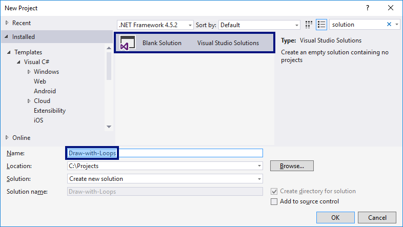
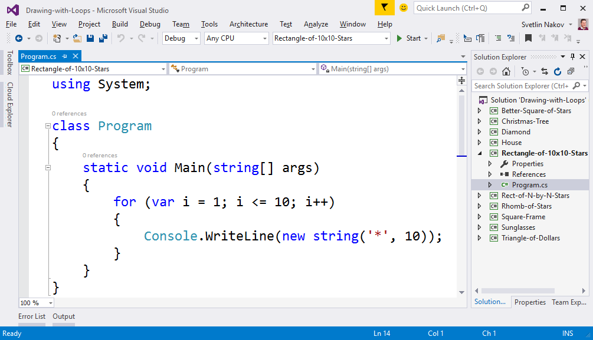
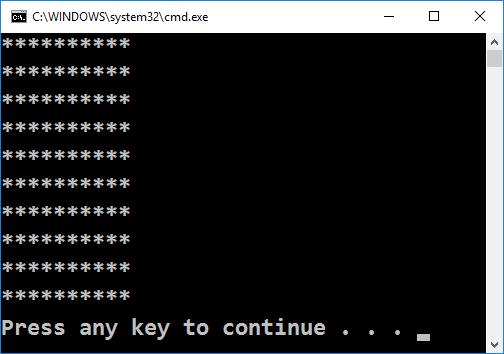
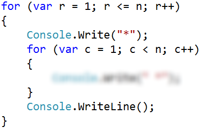
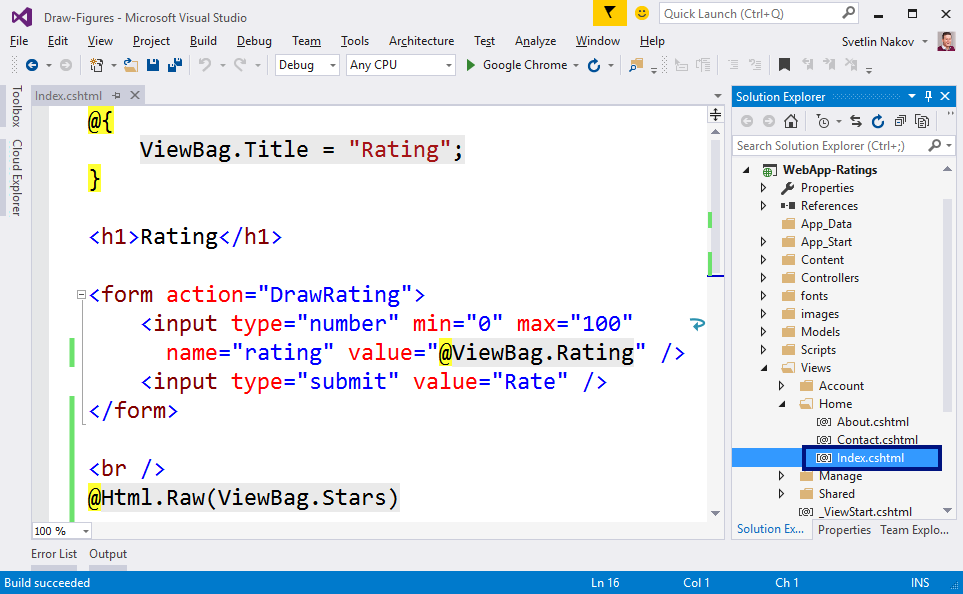
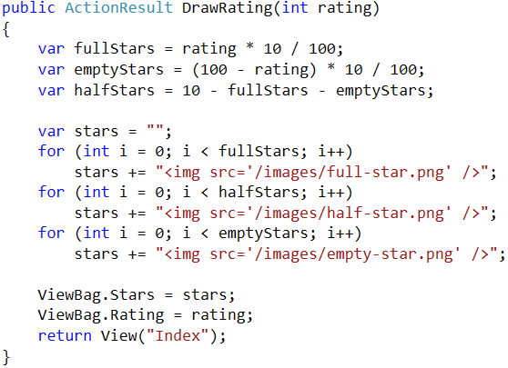
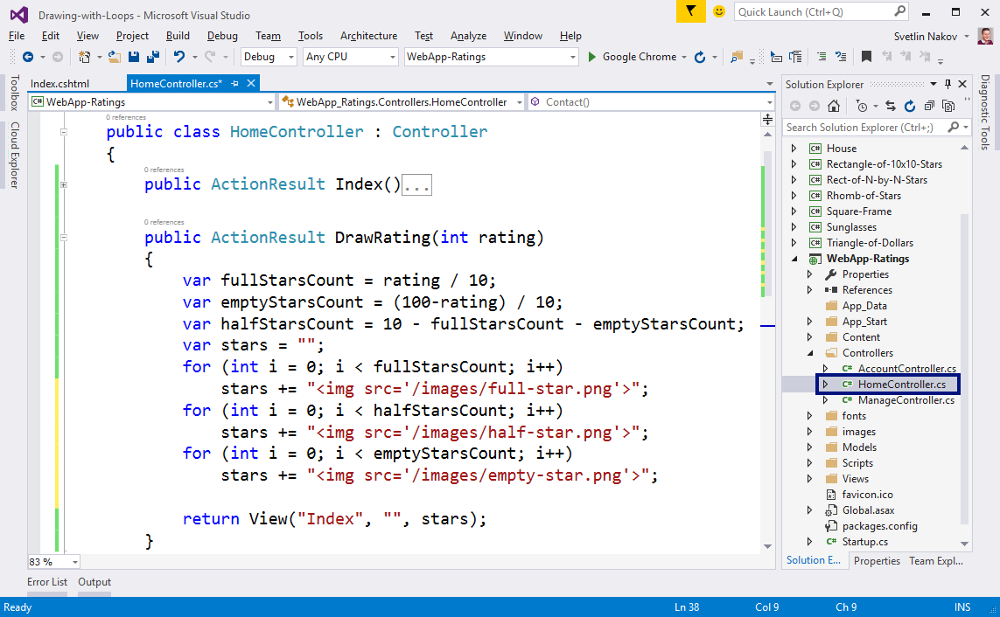
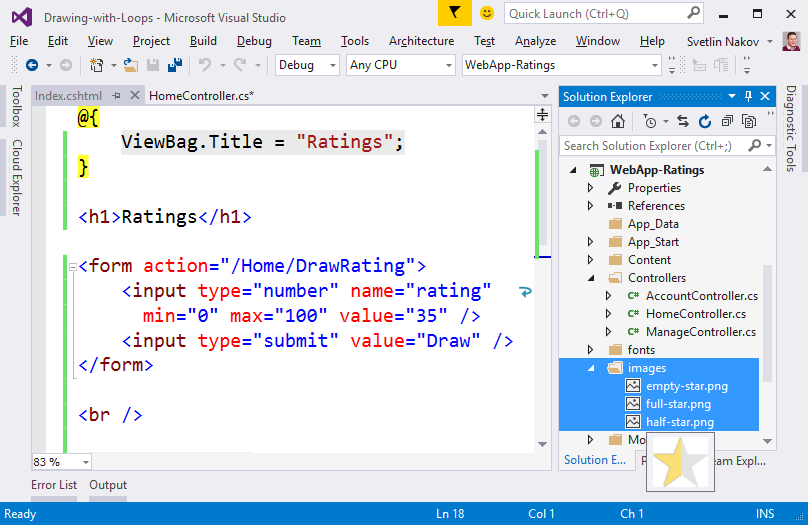
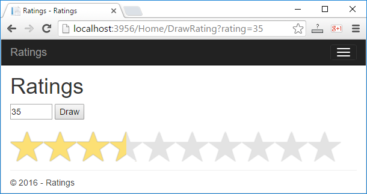

Упражнения: Чертане с цикли
===========================

Задачи за упражнение в клас и за домашно към курса [„Основи на
програмирането" @
СофтУни](https://softuni.bg/courses/programming-basics).

Празно Visual Studio решение (Blank Solution)
---------------------------------------------

1.  Създайте празно решение (**Blank Solution**) във Visual Studio за да
    организирате кода от задачите за упражнение. Целта на този **blank
    solution** e да съдържа **по един проект за всяка задача** от
    упражненията.

{width="6.721739938757655in"
height="3.788264435695538in"}

2.  Задайте **да се стартира по подразбиране текущия проект** (не
    първият в решението). Кликнете с десен бутон на мишката върху
    **Solution \'Draw-with-Loops\'** **\[Set StartUp Projects...\]**
    **\[Current selection\]**.

Правоъгълник от 10 x 10 звездички
---------------------------------

Напишете програма, която чертае на конзолата **правоъгълник от 10 x 10
звездички**:

+----------+----------------------+
| **вход** | **изход**            |
+==========+======================+
| (няма)   | \*\*\*\*\*\*\*\*\*\* |
|          |                      |
|          | \*\*\*\*\*\*\*\*\*\* |
|          |                      |
|          | \*\*\*\*\*\*\*\*\*\* |
|          |                      |
|          | \*\*\*\*\*\*\*\*\*\* |
|          |                      |
|          | \*\*\*\*\*\*\*\*\*\* |
|          |                      |
|          | \*\*\*\*\*\*\*\*\*\* |
|          |                      |
|          | \*\*\*\*\*\*\*\*\*\* |
|          |                      |
|          | \*\*\*\*\*\*\*\*\*\* |
|          |                      |
|          | \*\*\*\*\*\*\*\*\*\* |
|          |                      |
|          | \*\*\*\*\*\*\*\*\*\* |
+----------+----------------------+

**Подсказки**:

1.  Създайте **нов проект** в съществуващото Visual Studio решение --
    конзолна C\# програма. Задайте подходящо име на проекта, например
    "**Rectangle-of-10x10-Stars**".

2.  Отидете в тялото на метода **Main(string\[\]** **args)** и напишете
    решението на задачата. Можете да си помогнете с кода от картинката
    по-долу:

{width="6.72525699912511in"
height="3.8611417322834645in"}

3.  **Стартирайте** програмата с \[Ctrl+F5\] и я **тествайте**:

{width="3.813117891513561in"
height="2.678261154855643in"}

4.  **Тествайте** решението си в **judge системата**:
    <https://judge.softuni.bg/Contests/Practice/Index/155#0>. Трябва да
    получите **100 точки** (напълно коректно решение).

Правоъгълник от N x N звездички
-------------------------------

Напишете програма, която чете цяло положително число **n**, въведено от
потребителя, и печата на конзолата **правоъгълник от n \* n звездички**.
Примери:

+----------+-----------+--+----------+-----------+--+----------+-----------+
| **вход** | **изход** |  | **вход** | **изход** |  | **вход** | **изход** |
+==========+===========+==+==========+===========+==+==========+===========+
| 2        | \*\*      |  | 3        | \*\*\*    |  | 4        | \*\*\*\*  |
|          |           |  |          |           |  |          |           |
|          | \*\*      |  |          | \*\*\*    |  |          | \*\*\*\*  |
|          |           |  |          |           |  |          |           |
|          |           |  |          | \*\*\*    |  |          | \*\*\*\*  |
|          |           |  |          |           |  |          |           |
|          |           |  |          |           |  |          | \*\*\*\*  |
+----------+-----------+--+----------+-----------+--+----------+-----------+

**Тествайте** решението си в **judge системата**:
<https://judge.softuni.bg/Contests/Practice/Index/155#1>.

**Подсказка**: отпечатайте **n** звездички в цикъл **n** пъти, точно
както в предната задача.

Квадрат от звездички
--------------------

Напишете програма, която чете число **n**, въведено от потребителя, и
чертае **квадрат от n \* n звездички**. Разликата с предходната задача
е, че между всеки две звездички има по един интервал. Примери:

+----------+-----------+--+----------+-----------+--+----------+-------------+
| **вход** | **изход** |  | **вход** | **изход** |  | **вход** | **изход**   |
+==========+===========+==+==========+===========+==+==========+=============+
| 2        | \* \*     |  | 3        | \* \* \*  |  | 4        | \* \* \* \* |
|          |           |  |          |           |  |          |             |
|          | \* \*     |  |          | \* \* \*  |  |          | \* \* \* \* |
|          |           |  |          |           |  |          |             |
|          |           |  |          | \* \* \*  |  |          | \* \* \* \* |
|          |           |  |          |           |  |          |             |
|          |           |  |          |           |  |          | \* \* \* \* |
+----------+-----------+--+----------+-----------+--+----------+-------------+

**Тествайте** решението си в **judge системата**:
<https://judge.softuni.bg/Contests/Practice/Index/155#2>.

**Подсказка**: завъртете два вложени цикъла. Може да си помогнете с кода
по-долу (част от кода е нарочно замъглен, за да не преписвате механично,
а да се замислите малко):

{width="2.9107141294838144in"
height="1.8665758967629047in"}

Триъгълник от долари
--------------------

Да се напише програма, която чете число **n**, въведено от потребителя,
и печата **триъгълник от долари** като в примерите:

<table>
<thead>
<tr class="header">
<th><strong>вход</strong></th>
<th><strong>изход</strong></th>
<th></th>
<th><strong>вход</strong></th>
<th><strong>изход</strong></th>
<th></th>
<th><strong>вход</strong></th>
<th><strong>изход</strong></th>
<th></th>
<th><strong>вход</strong></th>
<th><strong>изход</strong></th>
</tr>
</thead>
<tbody>
<tr class="odd">
<td>2</td>
<td>
$

$ $
</td>
<td></td>
<td>3</td>
<td>
$

$ $

$ $ $
</td>
<td></td>
<td>4</td>
<td>
$

$ $

$ $ $

$ $ $ $
</td>
<td></td>
<td>5</td>
<td>
$

$ $

$ $ $

$ $ $ $

$ $ $ $ $
</td>
</tr>
</tbody>
</table>

**Тествайте** решението си в **judge системата**:
<https://judge.softuni.bg/Contests/Practice/Index/155#3>.

**Подсказка**: завъртете два вложени цикъла: за първия **row** = **1**
... **n**; за втория **col** = **1** ... **row**.

Квадратна рамка
---------------

Напишете програма, която чете цяло положително число **n**, въведено от
потребителя, и чертае на конзолата **квадратна рамка** с размер **n** \*
**n** като в примерите по-долу:

<table>
<thead>
<tr class="header">
<th><strong>вход</strong></th>
<th><strong>изход</strong></th>
<th></th>
<th><strong>вход</strong></th>
<th><strong>изход</strong></th>
<th></th>
<th><strong>вход</strong></th>
<th><strong>изход</strong></th>
<th></th>
<th><strong>вход</strong></th>
<th><strong>изход</strong></th>
</tr>
</thead>
<tbody>
<tr class="odd">
<td>3</td>
<td>
+ - +

| - |

+ - +
</td>
<td></td>
<td>4</td>
<td>
+ - - +

| - - |

| - - |

+ - - +
</td>
<td></td>
<td>5</td>
<td>
<strong>+ - - - +</strong>

<strong>| - - - |</strong>

<strong>| - - - |</strong>

<strong>| - - - |</strong>

<strong>+ - - - +</strong>
</td>
<td></td>
<td>6</td>
<td>
+ - - - - +

| - - - - |

| - - - - |

| - - - - |

| - - - - |

+ - - - - +
</td>
</tr>
</tbody>
</table>

**Тествайте** решението си в **judge системата**:
<https://judge.softuni.bg/Contests/Practice/Index/155#4>.

**Подсказки**:

-   Отпечатайте горната част: знак "**+**", n-2 пъти знак "**-**", знак
    "**+**".

-   Отпечатайте средната част: в цикъл n-2 пъти печатайте знак "**\|**",
    n-2 пъти знак "**-**", знак "**\|**".

-   Отпечатайте долната част: знак "**+**", n-2 пъти знак "**-**", знак
    "**+**".

Ромбче от звездички
-------------------

Напишете програма, която чете цяло положително число **n**, въведено от
потребителя, и печата **ромбче от звездички** с размер **n** като в
примерите по-долу:

<table>
<thead>
<tr class="header">
<th><strong>вход</strong></th>
<th><strong>изход</strong></th>
<th></th>
<th><strong>вход</strong></th>
<th><strong>изход</strong></th>
<th></th>
<th><strong>вход</strong></th>
<th><strong>изход</strong></th>
<th></th>
<th><strong>вход</strong></th>
<th><strong>изход</strong></th>
</tr>
</thead>
<tbody>
<tr class="odd">
<td>1</td>
<td>*</td>
<td></td>
<td>2</td>
<td>
*

* *

*
</td>
<td></td>
<td>3</td>
<td>
*

* *

* * *

* *

*
</td>
<td></td>
<td>4</td>
<td>
*

* *

* * *

* * * *

* * *

* *

*
</td>
</tr>
</tbody>
</table>

**Тествайте** решението си в **judge системата**:
<https://judge.softuni.bg/Contests/Practice/Index/155#5>.

**Подсказки**:

-   Разделете ромба на горна и долна част и ги печатайте с два отделни
    цикъла.

-   За **горната част** завъртете цикъл за **row** от **1** то **n**:

    -   Отпечатайте **n-row** интервала.

    -   Отпечатайте "**\***".

    -   Отпечатайте **row-1** пъти " **\***".

-   **Долната част** отпечатайте аналогично на горната с цикъл от **1**
    до **n-1**.

Коледна елха
------------

Напишете програма, която чете число **n** (1 ≤ **n** ≤ 100), въведено от
потребителя, и печата **коледна елха** с размер **n** като в примерите
по-долу:

<table>
<thead>
<tr class="header">
<th><strong>вход</strong></th>
<th><strong>изход</strong></th>
<th></th>
<th><strong>вход</strong></th>
<th><strong>изход</strong></th>
<th></th>
<th><strong>вход</strong></th>
<th><strong>изход</strong></th>
<th></th>
<th><strong>вход</strong></th>
<th><strong>изход</strong></th>
</tr>
</thead>
<tbody>
<tr class="odd">
<td>1</td>
<td>
|

* | *
</td>
<td></td>
<td>2</td>
<td>
|

* | *

** | **
</td>
<td></td>
<td>3</td>
<td>
|

* | *

** | **

*** | ***
</td>
<td></td>
<td>4</td>
<td>
|

* | *

** | **

*** | ***

**** | ****
</td>
</tr>
</tbody>
</table>

**Тествайте** решението си в **judge системата**:
<https://judge.softuni.bg/Contests/Practice/Index/155#6>.

**Подсказки**:

-   В цикъл за **i** от **0** до **n** печатайте (за лявата част на
    елхата):

    -   **n-i** интервала; **n** звездички; вертикална черта.

-   Аналогично довършете дясната част на елхата.

Слънчеви очила
--------------

Напишете програма, която чете цяло число **n** (3 ≤ **n** ≤ 100),
въведено от потребителя, и печата **слънчеви очила** с размер **5\*n** x
**n** като в примерите:

+----------+-------------------------------------------+
| **вход** | **изход**                                 |
+==========+===========================================+
| 3        | \*\*\*\*\*\* \*\*\*\*\*\*                 |
|          |                                           |
|          | \*////\*\|\|\|\*////\*                    |
|          |                                           |
|          | \*\*\*\*\*\* \*\*\*\*\*\*                 |
+----------+-------------------------------------------+
| 4        | \*\*\*\*\*\*\*\* \*\*\*\*\*\*\*\*         |
|          |                                           |
|          | \*//////\*\|\|\|\|\*//////\*              |
|          |                                           |
|          | \*//////\* \*//////\*                     |
|          |                                           |
|          | \*\*\*\*\*\*\*\* \*\*\*\*\*\*\*\*         |
+----------+-------------------------------------------+
| 5        | \*\*\*\*\*\*\*\*\*\* \*\*\*\*\*\*\*\*\*\* |
|          |                                           |
|          | \*////////\* \*////////\*                 |
|          |                                           |
|          | \*////////\*\|\|\|\|\|\*////////\*        |
|          |                                           |
|          | \*////////\* \*////////\*                 |
|          |                                           |
|          | \*\*\*\*\*\*\*\*\*\* \*\*\*\*\*\*\*\*\*\* |
+----------+-------------------------------------------+

**Тествайте** решението си в **judge системата**:
<https://judge.softuni.bg/Contests/Practice/Index/155#7>.

**Подсказки**:

-   Отпечатайте **най-горния ред** от очилата:

    -   **2\*n** звездички; **n** интервала; **2\*n** звездички

-   Отпечатайте **средните** **n-2** **реда**:

    -   звездичка; **2\*n-2** наклонени черти; звездичка; **n**
        интервала; звездичка; **2\*n-2** наклонени черти; звездичка

    -   когато редът е **(n-1)** **/** **2** **-** **1**, печатайте
        **n** вертикални черти вместо **n** интервала

-   Отпечатайте **най-долния ред** от очилата:

    -   **2\*n** звездички; **n** интервала; **2\*n** звездички

Къщичка
-------

Напишете програма, която чете число **n** (2 ≤ **n** ≤ 100), въведено от
потребителя, и печата **къщичка** с размер **n** x **n**:

<table>
<thead>
<tr class="header">
<th><strong>вход</strong></th>
<th><strong>изход</strong></th>
<th></th>
<th><strong>вход</strong></th>
<th><strong>изход</strong></th>
<th></th>
<th><strong>вход</strong></th>
<th><strong>изход</strong></th>
<th></th>
<th><strong>вход</strong></th>
<th><strong>изход</strong></th>
<th></th>
<th><strong>вход</strong></th>
<th><strong>изход</strong></th>
</tr>
</thead>
<tbody>
<tr class="odd">
<td>2</td>
<td>
**

||
</td>
<td></td>
<td>3</td>
<td>
-*-

***

|*|
</td>
<td></td>
<td>4</td>
<td>
-**-

****

|**|

|**|
</td>
<td></td>
<td>5</td>
<td>
--*--

-***-

*****

|***|

|***|
</td>
<td></td>
<td>6</td>
<td>
--**--

-****-

******

|****|

|****|

|****|
</td>
</tr>
</tbody>
</table>

**Тествайте** решението си в **judge системата**:
<https://judge.softuni.bg/Contests/Practice/Index/155#8>.

**Подсказки**:

-   Отпечатайте в цикъл **покрива** на къщичката:

    -   Той съдържа **(n** **+** **1)** **/** **2** реда.

    -   На първия си ред съдържа **1** звездичка при нечетно **n** или
        **2** звездички при четно **n**.

    -   На всеки следващ ред съдържа с **2** звездички повече.

-   Отпечатайте в цикъл основата на къщичката: **n** **/** **2** **-**
    **1** реда.

\* Диамант
----------

Напишете програма, която чете цяло число **n** (1 ≤ **n** ≤ 100),
въведено от потребителя, и печата диамант с размер **n** като в
примерите по-долу:

<table>
<thead>
<tr class="header">
<th><strong>вход</strong></th>
<th><strong>изход</strong></th>
<th></th>
<th><strong>вход</strong></th>
<th><strong>изход</strong></th>
<th></th>
<th><strong>вход</strong></th>
<th><strong>изход</strong></th>
<th></th>
<th><strong>вход</strong></th>
<th><strong>изход</strong></th>
<th></th>
<th><strong>вход</strong></th>
<th><strong>изход</strong></th>
</tr>
</thead>
<tbody>
<tr class="odd">
<td>1</td>
<td>*</td>
<td></td>
<td>2</td>
<td>**</td>
<td></td>
<td>3</td>
<td>
-*-

*-*

-*-
</td>
<td></td>
<td>4</td>
<td>
-**-

*--*

-**-
</td>
<td></td>
<td>5</td>
<td>
--*--

-*-*-

*---*

-*-*-

--*--
</td>
</tr>
</tbody>
</table>

<table>
<thead>
<tr class="header">
<th><strong>вход</strong></th>
<th><strong>изход</strong></th>
<th></th>
<th><strong>вход</strong></th>
<th><strong>изход</strong></th>
<th></th>
<th><strong>вход</strong></th>
<th><strong>изход</strong></th>
<th></th>
<th><strong>вход</strong></th>
<th><strong>изход</strong></th>
</tr>
</thead>
<tbody>
<tr class="odd">
<td>6</td>
<td>
--**--

-*--*-

*----*

-*--*-

--**--
</td>
<td></td>
<td>7</td>
<td>
---*---

--*-*--

-*---*-

*-----*

-*---*-

--*-*--

---*---
</td>
<td></td>
<td>8</td>
<td>
---**---

--*--*--

-*----*-

*------*

-*----*-

--*--*--

---**---
</td>
<td></td>
<td>9</td>
<td>
----*----

---*-*---

--*---*--

-*-----*-

*-------*

-*-----*-

--*---*--

---*-*---

----*----
</td>
</tr>
</tbody>
</table>

**Тествайте** решението си в **judge системата**:
<https://judge.softuni.bg/Contests/Practice/Index/155#9>.

**Подсказки**:

-   Всички редове съдържат точно по **n** символа.

-   Първият ред съдържа **отляво и отдясно** точно **leftRight** =
    **(n - 1) / 2** тирета.

-   Всеки следващ ред **до средния** съдържа отляво и отдясно с **1 тире
    по-малко** от предходния.

-   Всеки следващ ред **след средния** съдържа отляво и отдясно с **1
    тире повече** от предходния.

-   Всеки ред съдържа **в средата** си (във вътрешността на диаманта)
    **mid** = **n - 2 \* leftRight - 2** тирета.

-   Всеки ред съдържа **2 звездички**, освен когато **mid** е
    отрицателно (тогава има само 1 звездичка).

-   За всеки ред може да се изчислят и отпечатат неговите 5 съставни
    части:

    -   **leftRight** тиренца отляво

    -   **1** звездичка

    -   **mid** тиренца в средата (когато **mid** \>= **0**)

    -   **1** звездичка (когато **mid** \>= **0**)

    -   **1** звездичка

    -   **leftRight** тиренца отляво

Рейтинги -- визуализация в уеб среда
------------------------------------

Да се разработи ASP.NET MVC уеб приложение за визуализация на рейтинг
(число от 0 до 100). Чертаят се от 1 до 10 звездички (с половинки).
Звездичките да се генерират с **for**-цикъл:

{width="3.8303412073490812in"
height="1.172040682414698in"}

1.  Във Visual Studio създайте **ново ASP.NET MVC уеб приложение** с
    език C\#. Добавете нов проект от \[Solution Explorer\] \[Add\] \[New
    Project...\] . Дайте смислено име, например "**WebApp-Ratings**":

{width="6.955097331583552in"
height="3.9246073928258967in"}

Изберете тип на уеб приложението "**MVC**":

{width="6.635531496062992in"
height="5.17488845144357in"}

2.  Редактирайте файла **Views/Home/Index.cshtml**. Изтрийте всичко и
    въведете кода от картинката:

{width="6.672614829396325in"
height="4.115471347331583in"}

Този код създава уеб форма **\<form\>** с едно поле "**rating**" за
въвеждане на число в интервала \[0...100\] и бутон **\[Draw\]** за
изпращане на данните от формата към сървъра. Действието, което ще
обработи данните, се казва "**/Home/DrawRatings**", което означава метод
"**DrawRatings**" в контролер "**Home**", който се намира във файла
"**HomeController.cs**". След формата се отпечатва съдържанието на
**ViewBag.Stars**. Кодът, който ще се съдържа в него, ще бъде динамично
генериран от контролера **HTML** с поредица от звездички.

3.  Добавете метод "**DrawRatings**" в контролера "**HomeController**".
    Отворете файла **Controllers/ HomeController.cs** и добавете следния
    код:

{width="5.054806430446194in"
height="3.668811242344707in"}

Горният код взима въведеното число **rating**, прави малко пресмятания и
изчислява броя **пълни звездички**, броя **празни звездички** и броя
**половинки звездички**, след което генерира **HTML код**, който нарежда
няколко картинки със звездички една след друга, за да сглоби от тях
картинката с рейтинга. Подготвеният HTML код се записва във
**ViewBag.Stars** за визуализация от изгледа **Index.cshtml**.
Допълнително се запазва и изпратеният рейтинг (като число) във
**ViewBag.Rating**, за да се зададе в полето за рейтинг в изгледа.

За да се оеринтирате по-добре в проекта, може да си помогнете с
картинката от Visual Studio по-долу:

{width="7.290867235345582in"
height="4.503079615048119in"}

4.  От **\[Solution Explorer\]** направете папка "**images**" в проекта:

{width="6.707481408573928in"
height="3.2460739282589675in"}

Сега добавете картинките със звездичките (те са част от заданието за
домашно). Копирайте ги от Windows Explorer и ги поставете в папката
"**images**" в **\[Solution Explorer\]** във Visual Studio с **copy /
paste**.

{width="6.704735345581803in"
height="4.356310148731408in"}

5.  Стартирайте проекта с \[Ctrl+F5\] и му се порадвайте:

    {width="6.355053587051619in"
    height="3.3650524934383204in"}

  {#section .ListParagraph}
-

Изпитни задачи от минали издания на курса:
==========================================

\* Шевица
---------

*Пета задача от междинния изпит на 17 септември 2017. Тествайте
решението си
[**тук**](https://judge.softuni.bg/Contests/Practice/Index/784#4).*

Баба Вера обича да шие карета. Да се напише програма, която прочита от
конзолата **цяло число** **n** и чертае **шевица** с ширина **3 \* n
колони** и **2 \* n + 8** **редове,** като в примерите по-долу.

### Вход

Входът е **цяло НЕЧЕТНО число** **n** в интервала \[**1**...**99**\].

### Изход

Да се отпечатат на конзолата **2 \* n + 8** текстови реда, изобразяващи
**шевицата**, точно както в примерите.

### Примерен вход и изход

+----------+--------------+----------+----------------------+
| **вход** | **изход**    | **вход** | **изход**            |
+==========+==============+==========+======================+
| 3        | \....x\....  | 5        | \...\....x\...\....  |
|          |              |          |                      |
|          | \.../x\\\... |          | \...\.../x\\\...\... |
|          |              |          |                      |
|          | \...x\|x\... |          | \...\...x\|x\...\... |
|          |              |          |                      |
|          | .xxx\|xxx.   |          | ..xxxxx\|xxxxx..     |
|          |              |          |                      |
|          | xxxx\|xxxx   |          | .xxxxxx\|xxxxxx.     |
|          |              |          |                      |
|          | .xxx\|xxx.   |          | xxxxxxx\|xxxxxxx     |
|          |              |          |                      |
|          | \.../x\\\... |          | .xxxxxx\|xxxxxx.     |
|          |              |          |                      |
|          | \...\\x/\... |          | ..xxxxx\|xxxxx..     |
|          |              |          |                      |
|          | .xxx\|xxx.   |          | \...\.../x\\\...\... |
|          |              |          |                      |
|          | xxxx\|xxxx   |          | \...\...\\x/\...\... |
|          |              |          |                      |
|          | .xxx\|xxx.   |          | ..xxxxx\|xxxxx..     |
|          |              |          |                      |
|          | \...x\|x\... |          | .xxxxxx\|xxxxxx.     |
|          |              |          |                      |
|          | \...\\x/\... |          | xxxxxxx\|xxxxxxx     |
|          |              |          |                      |
|          | \....x\....  |          | .xxxxxx\|xxxxxx.     |
|          |              |          |                      |
|          |              |          | ..xxxxx\|xxxxx..     |
|          |              |          |                      |
|          |              |          | \...\...x\|x\...\... |
|          |              |          |                      |
|          |              |          | \...\...\\x/\...\... |
|          |              |          |                      |
|          |              |          | \...\....x\...\....  |
+----------+--------------+----------+----------------------+

\* Снежинка
-----------

*Пета задача от междинния изпит на 03 септември 2017. Тествайте
решението си
[**тук**](https://judge.softuni.bg/Contests/Practice/Index/750#4).*

Напишете програма която по зададено число **N** разпечатва на конзолата
снежинка. **Височината** на фигурата е **2 \* n + 1**. **Широчината** на
фигурата е **2 \* n + 3**.

### Вход

От конзолата се чете 1 **число: N**

Ограничения: **3** ≤ **N** ≤ **100**.

### Изход

Да се отпечата на конзолата снежинка.

### Примерен вход и изход

+----------+----------------------------------------+
| **Вход** | **Изход**                              |
+==========+========================================+
| 3        | \*\...\*\...\*                         |
|          |                                        |
|          | .\*..\*..\*.                           |
|          |                                        |
|          | ..\*\*\*\*\*..                         |
|          |                                        |
|          | \*\*\*\*\*\*\*\*\*                     |
|          |                                        |
|          | ..\*\*\*\*\*..                         |
|          |                                        |
|          | .\*..\*..\*.                           |
|          |                                        |
|          | \*\...\*\...\*                         |
+----------+----------------------------------------+
| 5        | \*\.....\*\.....\*                     |
|          |                                        |
|          | .\*\....\*\....\*.                     |
|          |                                        |
|          | ..\*\...\*\...\*..                     |
|          |                                        |
|          | \...\*..\*..\*\...                     |
|          |                                        |
|          | \....\*\*\*\*\*\....                   |
|          |                                        |
|          | \*\*\*\*\*\*\*\*\*\*\*\*\*             |
|          |                                        |
|          | \....\*\*\*\*\*\....                   |
|          |                                        |
|          | \...\*..\*..\*\...                     |
|          |                                        |
|          | ..\*\...\*\...\*..                     |
|          |                                        |
|          | .\*\....\*\....\*.                     |
|          |                                        |
|          | \*\.....\*\.....\*                     |
+----------+----------------------------------------+
| 8        | \*\...\.....\*\...\.....\*             |
|          |                                        |
|          | .\*\...\....\*\...\....\*.             |
|          |                                        |
|          | ..\*\...\...\*\...\...\*..             |
|          |                                        |
|          | \...\*\.....\*\.....\*\...             |
|          |                                        |
|          | \....\*\....\*\....\*\....             |
|          |                                        |
|          | \.....\*\...\*\...\*\.....             |
|          |                                        |
|          | \...\...\*..\*..\*\...\...             |
|          |                                        |
|          | \...\....\*\*\*\*\*\...\....           |
|          |                                        |
|          | \*\*\*\*\*\*\*\*\*\*\*\*\*\*\*\*\*\*\* |
|          |                                        |
|          | \...\....\*\*\*\*\*\...\....           |
|          |                                        |
|          | \...\...\*..\*..\*\...\...             |
|          |                                        |
|          | \.....\*\...\*\...\*\.....             |
|          |                                        |
|          | \....\*\....\*\....\*\....             |
|          |                                        |
|          | \...\*\.....\*\.....\*\...             |
|          |                                        |
|          | ..\*\...\...\*\...\...\*..             |
|          |                                        |
|          | .\*\...\....\*\...\....\*.             |
|          |                                        |
|          | \*\...\.....\*\...\.....\*             |
+----------+----------------------------------------+

\* Купа
-------

*Пета задача от междинния изпит на 23 юли 2017. Тествайте решението си
[**тук**](https://judge.softuni.bg/Contests/Practice/Index/715#4).*

Като най-запаления фен на групата по танци решаваш да им направиш
най-милия и незабравим подарък, който един кандидат - програмист може да
сътвори, а именно -- „**конзолна купа**".

**Купата е широка 5\*N.**

### Вход

Входът се чете от конзолата и съдържа само **едно число**:

-   **N четно число в интервала\[6...100\]**

### Изход

Да се отпечата на конзолата **купа** като в примерите по-долу.

+-----------------+-----------------+-----------------+-----------------+
| **Вход**        | **Изход**       | **Вход**        | **Изход**       |
+=================+=================+=================+=================+
| 6               | \...\...\#\#\#\ | 8               | \...\.....\#\#\ |
|                 | #\#\#\#\#\#\#\# |                 | #\#\#\#\#\#\#\# |
|                 | \#\#\#\#\#\#\#\ |                 | \#\#\#\#\#\#\#\ |
|                 | ...\...         |                 | #\#\#\#\#\#\#\. |
|                 |                 |                 | ..\.....        |
|                 | \...\....\#\#\# |                 |                 |
|                 | \#\#\#\#\#\#\#\ |                 | \...\...\...\#\ |
|                 | #\#\#\#\#\#\... |                 | #\#\#\#\#\#\#\# |
|                 | \....           |                 | \#\#\#\#\#\#\#\ |
|                 |                 |                 | #\#\#\#\#\#\... |
|                 | \...\.....\#\#\ |                 | \...\...        |
|                 | #\#\#\#\#\#\#\# |                 |                 |
|                 | \#\#\#\#\...\.. |                 | \...\...\....\# |
|                 | ...             |                 | \#\#\#\#\#\#\#\ |
|                 |                 |                 | #\#\#\#\#\#\#\# |
|                 | \...\...\...\#\ |                 | \#\#\#\#\...\.. |
|                 | ...\...\....\#\ |                 | .\....          |
|                 | ...\...\...     |                 |                 |
|                 |                 |                 | \...\...\.....\ |
|                 | \...\...\....\# |                 | #\#\#\#\#\#\#\# |
|                 | \...\.....\#\.. |                 | \#\#\#\#\#\#\#\ |
|                 | .\...\....      |                 | #\#\#\...\...\. |
|                 |                 |                 | ....            |
|                 | \...\...\.....\ |                 |                 |
|                 | #\...\...\#\... |                 | \...\...\...\.. |
|                 | \...\.....      |                 | .\#\...\...\... |
|                 |                 |                 | \.....\#\...\.. |
|                 | \...\...\...\.. |                 | .\...\...       |
|                 | .\#\....\#\...\ |                 |                 |
|                 | ...\...\...     |                 | \...\...\...\.. |
|                 |                 |                 | ..\#\...\...\.. |
|                 | \...\...\...\.. |                 | .\...\#\...\... |
|                 | .\#\#\#\#\#\#\. |                 | \...\....       |
|                 | ..\...\...\...  |                 |                 |
|                 |                 |                 | \...\...\...\.. |
|                 | \...\...\....\# |                 | ...\#\...\...\. |
|                 | \#\#\#\#\#\#\#\ |                 | ...\#\...\...\. |
|                 | #\#\...\...\... |                 | ..\.....        |
|                 | .               |                 |                 |
|                 |                 |                 | \...\...\...\.. |
|                 | \...\...\....\# |                 | .\...\#\...\... |
|                 | \#\#\#\#\#\#\#\ |                 | ..\#\...\...\.. |
|                 | #\#\...\...\... |                 | .\...\...       |
|                 | .               |                 |                 |
|                 |                 |                 | \...\...\...\.. |
|                 | \...\...\....\# |                 | .\....\#\...\.. |
|                 | \#\#\#\#\#\#\#\ |                 | .\#\...\...\... |
|                 | #\#\...\...\... |                 | \...\....       |
|                 | .               |                 |                 |
|                 |                 |                 | \...\...\...\.. |
|                 | \...\...\....D\ |                 | .\....\#\#\#\#\ |
|                 | ^A\^N\^C\^E\^\. |                 | #\#\#\#\...\... |
|                 | ..\...\....     |                 | \...\...\....   |
|                 |                 |                 |                 |
|                 | \...\...\....\# |                 | \...\...\...\.. |
|                 | \#\#\#\#\#\#\#\ |                 | ...\#\#\#\#\#\# |
|                 | #\#\...\...\... |                 | \#\#\#\#\#\#\.. |
|                 | .               |                 | .\...\...\..... |
|                 |                 |                 |                 |
|                 | \...\...\....\# |                 | \...\...\...\.. |
|                 | \#\#\#\#\#\#\#\ |                 | ...\#\#\#\#\#\# |
|                 | #\#\...\...\... |                 | \#\#\#\#\#\#\.. |
|                 | .               |                 | .\...\...\..... |
|                 |                 |                 |                 |
|                 | \...\...\....\# |                 | \...\...\...\.. |
|                 | \#\#\#\#\#\#\#\ |                 | ...\#\#\#\#\#\# |
|                 | #\#\...\...\... |                 | \#\#\#\#\#\#\.. |
|                 | .               |                 | .\...\...\..... |
|                 |                 |                 |                 |
|                 | \...\...\....\# |                 | \...\...\...\.. |
|                 | \#\#\#\#\#\#\#\ |                 | ...\#\#\#\#\#\# |
|                 | #\#\...\...\... |                 | \#\#\#\#\#\#\.. |
|                 | .               |                 | .\...\...\..... |
|                 |                 |                 |                 |
|                 |                 |                 | \...\...\...\.. |
|                 |                 |                 | .\...D\^A\^N\^C |
|                 |                 |                 | \^E\^\...\...\. |
|                 |                 |                 | ..\...\...      |
|                 |                 |                 |                 |
|                 |                 |                 | \...\...\...\.. |
|                 |                 |                 | ...\#\#\#\#\#\# |
|                 |                 |                 | \#\#\#\#\#\#\.. |
|                 |                 |                 | .\...\...\..... |
|                 |                 |                 |                 |
|                 |                 |                 | \...\...\...\.. |
|                 |                 |                 | ...\#\#\#\#\#\# |
|                 |                 |                 | \#\#\#\#\#\#\.. |
|                 |                 |                 | .\...\...\..... |
|                 |                 |                 |                 |
|                 |                 |                 | \...\...\...\.. |
|                 |                 |                 | ...\#\#\#\#\#\# |
|                 |                 |                 | \#\#\#\#\#\#\.. |
|                 |                 |                 | .\...\...\..... |
|                 |                 |                 |                 |
|                 |                 |                 | \...\...\...\.. |
|                 |                 |                 | ...\#\#\#\#\#\# |
|                 |                 |                 | \#\#\#\#\#\#\.. |
|                 |                 |                 | .\...\...\..... |
|                 |                 |                 |                 |
|                 |                 |                 | \...\...\...\.. |
|                 |                 |                 | ...\#\#\#\#\#\# |
|                 |                 |                 | \#\#\#\#\#\#\.. |
|                 |                 |                 | .\...\...\..... |
+-----------------+-----------------+-----------------+-----------------+

\* Триъгълник
-------------

*Пета задача от междинния изпит на 25 юни 2017. Тествайте решението си
[**тук**](https://judge.softuni.bg/Contests/Practice/Index/642#4).*

Да се напише програма, която прочита от конзолата **цяло число N**
чертае **триъгълник**, като в примерите по-долу. Триъгълникът има
**ширина - (4 \* n) + 1 колони** и **височина - (2 \* n) + 1 реда**.

### Вход

Входът се чете от конзолата и съдържа само **едно число**:

-   **N -- цяло число в интервала \[2 ... 50\].**

### Изход

Да се отпечата на конзолата **триъгълник** като в примерите по-долу.

### Примерен вход и изход

+-----------------+-----------------+-----------------+-----------------+
| **Вход**        | **Изход**       | **Вход**        | **Изход**       |
+=================+=================+=================+=================+
| 5               | \#\#\#\#\#\#\#\ | 8               | \#\#\#\#\#\#\#\ |
|                 | #\#\#\#\#\#\#\# |                 | #\#\#\#\#\#\#\# |
|                 | \#\#\#\#\#\#    |                 | \#\#\#\#\#\#\#\ |
|                 |                 |                 | #\#\#\#\#\#\#\# |
|                 | .\#\#\#\#\#\#\# |                 | \#\#\#          |
|                 | \#\#            |                 |                 |
|                 | \#\#\#\#\#\#\#\ |                 | .\#\#\#\#\#\#\# |
|                 | #\#.            |                 | \#\#\#\#\#\#\#\ |
|                 |                 |                 | #               |
|                 | ..\#\#\#\#\#\#\ |                 | \#\#\#\#\#\#\#\ |
|                 | #               |                 | #\#\#\#\#\#\#\# |
|                 | \#\#\#\#\#\#\#. |                 | .               |
|                 | .               |                 |                 |
|                 |                 |                 | ..\#\#\#\#\#\#\ |
|                 | \...\#\#\#\#\#  |                 | #\#\#\#\#\#\#   |
|                 | (@)             |                 | \#\#\#\#\#\#\#\ |
|                 | \#\#\#\#\#\...  |                 | #\#\#\#\#\#..   |
|                 |                 |                 |                 |
|                 | \....\#\#\#     |                 | \...\#\#\#\#\#\ |
|                 | \#\#\#\....     |                 | #\#\#\#\#\#     |
|                 |                 |                 | \#\#\#\#\#\#\#\ |
|                 | \.....\#        |                 | #\#\#\#\...     |
|                 | \#\.....        |                 |                 |
|                 |                 |                 | \....\#\#\#\#\# |
|                 | \...\...\#\#\#\ |                 | \#\#\#\#        |
|                 | #\#\#\#\#\#\... |                 | \#\#\#\#\#\#\#\ |
|                 | \...            |                 | #\#\....        |
|                 |                 |                 |                 |
|                 | \...\....\#\#\# |                 | \.....\#\#\#\#\ |
|                 | \#\#\#\#\...\.. |                 | #\#\#           |
|                 | ..              |                 | (@)             |
|                 |                 |                 | \#\#\#\#\#\#\#\ |
|                 | \...\.....\#\#\ |                 | .....           |
|                 | #\#\#\...\..... |                 |                 |
|                 |                 |                 | \...\...\#\#\#\ |
|                 | \...\...\...\#\ |                 | #\#             |
|                 | #\#\...\...\... |                 | \#\#\#\#\#\...\ |
|                 |                 |                 | ...             |
|                 | \...\...\....\# |                 |                 |
|                 | \...\...\....   |                 | \...\....\#\#\# |
|                 |                 |                 | \#\#\#\...\.... |
|                 |                 |                 |                 |
|                 |                 |                 | \...\.....\#    |
|                 |                 |                 | \#\...\.....    |
|                 |                 |                 |                 |
|                 |                 |                 | \...\...\...\#\ |
|                 |                 |                 | #\#\#\#\#\#\#\# |
|                 |                 |                 | \#\#\#\#\#\#\.. |
|                 |                 |                 | .\...\...       |
|                 |                 |                 |                 |
|                 |                 |                 | \...\...\....\# |
|                 |                 |                 | \#\#\#\#\#\#\#\ |
|                 |                 |                 | #\#\#\#\#\...\. |
|                 |                 |                 | ..\....         |
|                 |                 |                 |                 |
|                 |                 |                 | \...\...\.....\ |
|                 |                 |                 | #\#\#\#\#\#\#\# |
|                 |                 |                 | \#\#\#\...\...\ |
|                 |                 |                 | .....           |
|                 |                 |                 |                 |
|                 |                 |                 | \...\...\...\.. |
|                 |                 |                 | .\#\#\#\#\#\#\# |
|                 |                 |                 | \#\#\...\...\.. |
|                 |                 |                 | .\...           |
|                 |                 |                 |                 |
|                 |                 |                 | \...\...\...\.. |
|                 |                 |                 | ..\#\#\#\#\#\#\ |
|                 |                 |                 | #\...\...\...\. |
|                 |                 |                 | ...             |
|                 |                 |                 |                 |
|                 |                 |                 | \...\...\...\.. |
|                 |                 |                 | ...\#\#\#\#\#\. |
|                 |                 |                 | ..\...\...\.... |
|                 |                 |                 | .               |
|                 |                 |                 |                 |
|                 |                 |                 | \...\...\...\.. |
|                 |                 |                 | .\...\#\#\#\... |
|                 |                 |                 | \...\...\...\.. |
|                 |                 |                 | .               |
|                 |                 |                 |                 |
|                 |                 |                 | \...\...\...\.. |
|                 |                 |                 | .\....\#\...\.. |
|                 |                 |                 | .\...\...\....  |
+-----------------+-----------------+-----------------+-----------------+

\* Корона
---------

*Пета задача от междинния изпит на 07 май 2017. Тествайте решението си
[**тук**](https://judge.softuni.bg/Contests/Practice/Index/540#4).*

Да се напише програма, която прочита от конзолата **цяло число N**
чертае **корона**, като в примерите по-долу. Короната има **ширина - (2
\* n) -- 1 колони** и **височина - (n / 2) + 4 реда**.

### Вход

Входът се чете от конзолата и съдържа само **едно четно число**:

-   **N -- цяло число в интервала \[8 ... 50\].**

### Изход

Да се отпечата на конзолата **корона** като в примерите по-долу.

### Примерен вход и изход

+-----------------+-----------------+-----------------+-----------------+
| **Вход**        | **Изход**       | **Вход**        | **Изход**       |
+=================+=================+=================+=================+
| 8               | @ @ @           | 10              | @ @ @           |
|                 |                 |                 |                 |
|                 | \*\* \* \*\*    |                 | \*\* \* \*\*    |
|                 |                 |                 |                 |
|                 | \*.\* \*.\*     |                 | \*.\* \*.\*     |
|                 | \*.\*           |                 | \*.\*           |
|                 |                 |                 |                 |
|                 | \*..\* \*\...\* |                 | \*..\* \*\...\* |
|                 | \*..\*          |                 | \*..\*          |
|                 |                 |                 |                 |
|                 | \*\...\*\.....\ |                 | \*\...\*        |
|                 | *\...\*         |                 | \*\.....\*      |
|                 |                 |                 | \*\...\*        |
|                 | \*\....\*\*.\*\ |                 |                 |
|                 | *\....\*        |                 | \*\....\*\...\. |
|                 |                 |                 | ...\*\....\*    |
|                 | \*\*\*\*\*\*\*\ |                 |                 |
|                 | *\*\*\*\*\*\*\* |                 | \*\.....\*\*\*. |
|                 |                 |                 | \*\*\*\.....\*  |
|                 | \*\*\*\*\*\*\*\ |                 |                 |
|                 | *\*\*\*\*\*\*\* |                 | \*\*\*\*\*\*\*\ |
|                 |                 |                 | *\*\*\*\*\*\*\* |
|                 |                 |                 | \*\*\*\*        |
|                 |                 |                 |                 |
|                 |                 |                 | \*\*\*\*\*\*\*\ |
|                 |                 |                 | *\*\*\*\*\*\*\* |
|                 |                 |                 | \*\*\*\*        |
+-----------------+-----------------+-----------------+-----------------+
