Упражнения: Работа с по-сложни цикли
====================================

Задачи за упражнение в клас и за домашно към курса [„Основи на
програмирането" @
СофтУни](https://softuni.bg/courses/programming-basics).

Празно Visual Studio решение (Blank Solution)
---------------------------------------------

1.  Създайте празно решение (**Blank Solution**) във Visual Studio за да
    организирате кода от задачите за упражнение. Целта на този **blank
    solution** e да съдържа **по един проект за всяка задача** от
    упражненията.

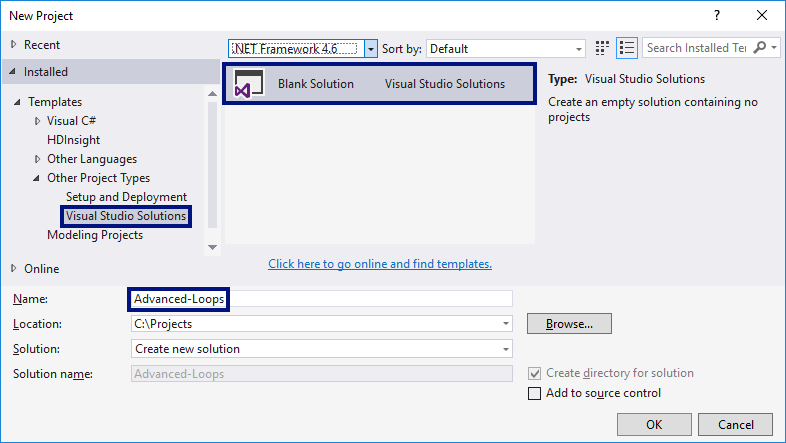{width="6.663904199475065in"
height="3.7556692913385827in"}

2.  Задайте **да се стартира по подразбиране текущия проект** (не
    първият в решението). Кликнете с десен бутон на мишката върху
    **Solution \'Advanced-Loops\'** **\[Set StartUp Projects...\]**
    **\[Current selection\]**.

Числата от 1 до N през 3
------------------------

Напишете програма, която чете число **n**, въведено от потребителя, и
отпечатва **числата от 1 до** **n** **през 3** (със стъпка 3). Примери:

+----------+-----------+--+----------+-----------+--+----------+-----------+
| **вход** | **изход** |  | **вход** | **изход** |  | **вход** | **изход** |
+==========+===========+==+==========+===========+==+==========+===========+
| 10       | 1         |  | 7        | 1         |  | 15       | 1         |
|          |           |  |          |           |  |          |           |
|          | 4         |  |          | 4         |  |          | 4         |
|          |           |  |          |           |  |          |           |
|          | 7         |  |          | 7         |  |          | 7         |
|          |           |  |          |           |  |          |           |
|          | 10        |  |          |           |  |          | 10        |
|          |           |  |          |           |  |          |           |
|          |           |  |          |           |  |          | 13        |
+----------+-----------+--+----------+-----------+--+----------+-----------+

**Подсказки**:

1.  Създайте **нов проект** в съществуващото Visual Studio решение --
    конзолна C\# програма. Задайте подходящо име на проекта, например
    "**LoopByStep3**".

2.  Можете да завъртите **for-цикъл със стъпка 3** по следния начин:
    **for (var i** **=** **1; i** **\<=** **n; i+=3)**.

3.  Отидете в тялото на метода **Main(string\[\]** **args)** и напишете
    решението на задачата. Можете да си помогнете с кода от картинката
    по-долу:

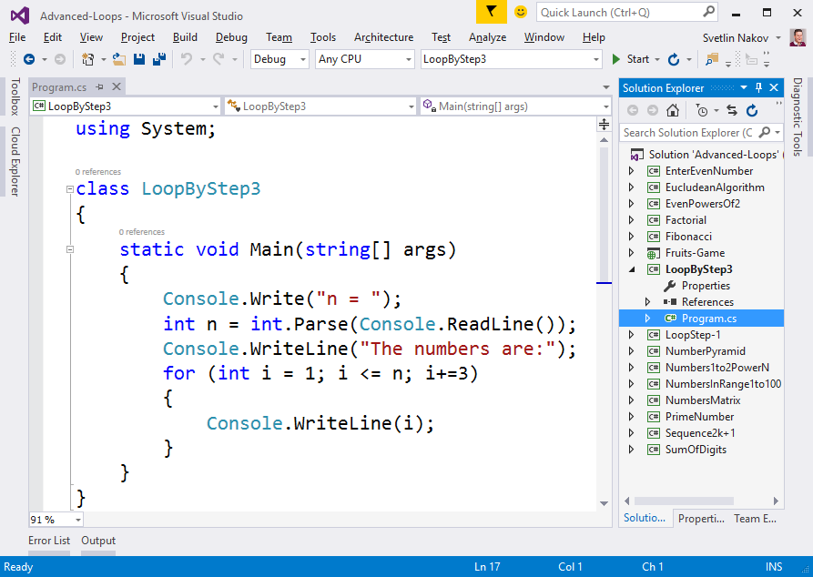{width="6.7980282152230975in"
height="4.826046587926509in"}

4.  **Стартирайте** програмата с \[Ctrl+F5\] и я **тествайте**:

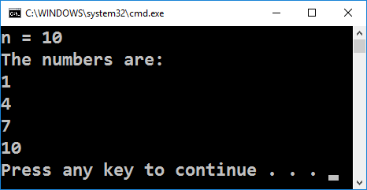{width="3.295275590551181in"
height="1.704724409448819in"}
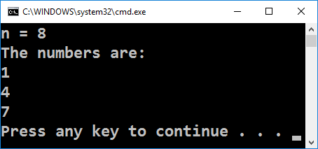{width="3.295275590551181in"
height="1.704724409448819in"}

5.  **Тествайте** решението си в **judge системата**:
    <https://judge.softuni.bg/Contests/Practice/Index/156#0>. Трябва да
    получите **100 точки** (напълно коректно решение).

Числата от N до 1 в обратен ред
-------------------------------

Напишете програма, която чете цяло положително число **n**, въведено от
потребителя, и печата **числата от** **n** **до** **1** **в обратен
ред** (от най-голямото към най-малкото). Примери:

+----------+-----------+--+----------+-----------+--+----------+-----------+
| **вход** | **изход** |  | **вход** | **изход** |  | **вход** | **изход** |
+==========+===========+==+==========+===========+==+==========+===========+
| 2        | 2         |  | 3        | 3         |  | 5        | 5         |
|          |           |  |          |           |  |          |           |
|          | 1         |  |          | 2         |  |          | 4         |
|          |           |  |          |           |  |          |           |
|          |           |  |          | 1         |  |          | 3         |
|          |           |  |          |           |  |          |           |
|          |           |  |          |           |  |          | 2         |
|          |           |  |          |           |  |          |           |
|          |           |  |          |           |  |          | 1         |
+----------+-----------+--+----------+-----------+--+----------+-----------+

**Тествайте** решението си в **judge системата**:
<https://judge.softuni.bg/Contests/Practice/Index/156#1>.

**Подсказка**: отпечатайте **n** звездички в цикъл **n** пъти, точно
както в предната задача.

Числа от 2^0^ до 2^n^
---------------------

Напишете програма, която чете от конзолата цяло число **n**, въведено от
потребителя, и **печата числата от 1 до 2^n^**. Примери:

+----------+-----------+--+----------+-----------+--+----------+-----------+
| **вход** | **изход** |  | **вход** | **изход** |  | **вход** | **изход** |
+==========+===========+==+==========+===========+==+==========+===========+
| 3        | 1         |  | 4        | 1         |  | 5        | 1         |
|          |           |  |          |           |  |          |           |
|          | 2         |  |          | 2         |  |          | 2         |
|          |           |  |          |           |  |          |           |
|          | 4         |  |          | 4         |  |          | 4         |
|          |           |  |          |           |  |          |           |
|          | 8         |  |          | 8         |  |          | 8         |
|          |           |  |          |           |  |          |           |
|          |           |  |          | 16        |  |          | 16        |
|          |           |  |          |           |  |          |           |
|          |           |  |          |           |  |          | 32        |
+----------+-----------+--+----------+-----------+--+----------+-----------+

**Тествайте** решението си в **judge системата**:
<https://judge.softuni.bg/Contests/Practice/Index/156#2>.

**Подсказка**: завъртете **for**-цикъл от **0** до **n** и започвайки от
**num** = **1** на всяка стъпка умножавайте **num** по **2**.

Четни степени на 2
------------------

Да се напише програма, която чете число **n**, въведено от потребителя,
и **печата четните степени на 2** **≤** **2^n^**: **2^0^**, **2^2^**,
**2^4^**, **2^8^**, ..., **2^n^**. Примери:

<table>
<thead>
<tr class="header">
<th><strong>вход</strong></th>
<th><strong>изход</strong></th>
<th></th>
<th><strong>вход</strong></th>
<th><strong>изход</strong></th>
<th></th>
<th><strong>вход</strong></th>
<th><strong>изход</strong></th>
<th></th>
<th><strong>вход</strong></th>
<th><strong>изход</strong></th>
<th></th>
<th><strong>вход</strong></th>
<th><strong>изход</strong></th>
</tr>
</thead>
<tbody>
<tr class="odd">
<td>3</td>
<td>
1

4
</td>
<td></td>
<td>4</td>
<td>
1

4

16
</td>
<td></td>
<td>5</td>
<td>
1

4

16
</td>
<td></td>
<td>6</td>
<td>
1

4

16

64
</td>
<td></td>
<td>7</td>
<td>
1

4

16

64
</td>
</tr>
</tbody>
</table>

**Тествайте** решението си в **judge системата**:
<https://judge.softuni.bg/Contests/Practice/Index/156#3>.

**Подсказка**: започнете от 1 и в цикъл умножавайте по 4 на всяка
стъпка.

Редица числа 2k+1
-----------------

Напишете програма, която чете число **n**, подадено от потребителя, и
отпечатва **всички числа ≤ n от редицата**: 1, 3, 7, 15, 31, .... Всяко
следващо число се изчислява като **предишното число \* 2 + 1**. Примери:

<table>
<thead>
<tr class="header">
<th><strong>вход</strong></th>
<th><strong>изход</strong></th>
<th></th>
<th><strong>вход</strong></th>
<th><strong>изход</strong></th>
<th></th>
<th><strong>вход</strong></th>
<th><strong>изход</strong></th>
<th></th>
<th><strong>вход</strong></th>
<th><strong>изход</strong></th>
</tr>
</thead>
<tbody>
<tr class="odd">
<td>3</td>
<td>
1

3
</td>
<td></td>
<td>8</td>
<td>
1

3

7
</td>
<td></td>
<td>17</td>
<td>
1

3

7

15
</td>
<td></td>
<td>31</td>
<td>
1

3

7

15

31
</td>
</tr>
</tbody>
</table>

**Тествайте** решението си в **judge системата**:
<https://judge.softuni.bg/Contests/Practice/Index/156#4>.

**Подсказки**:

-   Започнете от **num** = **1**.

-   В цикъл докато **num** не стигне **n**, печатайте, го умножавайте по
    **2** и прибавяйте **1**.

Число в диапазона \[1...100\]
-----------------------------

Напишете програма, която чете цяло положително **число** n **в диапазона
\[1...100**\], въведено от потребителя. При въвеждане на число извън
посочения диапазон, да се отпечата съобщение за грешка и потребителят да
се подкани **да въведе ново число**. Примери:

+----------------------------------------------------+
| **вход / изход**                                   |
+====================================================+
| Еnter a number in the range \[1\...100\]: **35**   |
|                                                    |
| The number is: 35                                  |
+----------------------------------------------------+
| Еnter a number in the range \[1\...100\]: **105**  |
|                                                    |
| Invalid number!                                    |
|                                                    |
| Еnter a number in the range \[1\...100\]: **0**    |
|                                                    |
| Invalid number!                                    |
|                                                    |
| Еnter a number in the range \[1\...100\]: **-200** |
|                                                    |
| Invalid number!                                    |
|                                                    |
| Еnter a number in the range \[1\...100\]: **77**   |
|                                                    |
| The number is: 77                                  |
+----------------------------------------------------+

**Тествайте** решението си в **judge системата**:
<https://judge.softuni.bg/Contests/Practice/Index/156#5>.

**Подсказки**:

-   Въведете число.

-   Повтаряйте в цикъл докато числото е невалидно: отпечатайте грешка и
    въведете число отново.

Най-голям общ делител (НОД)
---------------------------

Напишете програма, която чете две цели положителни числа **a** и **b**,
въведени от потребителя, и изчислява и отпечатва **най-големият им общ
делител (НОД)**. Примери:

<table>
<thead>
<tr class="header">
<th><strong>вход</strong></th>
<th><strong>изход</strong></th>
<th></th>
<th><strong>вход</strong></th>
<th><strong>изход</strong></th>
<th></th>
<th><strong>вход</strong></th>
<th><strong>изход</strong></th>
<th></th>
<th><strong>вход</strong></th>
<th><strong>изход</strong></th>
<th></th>
<th><strong>вход</strong></th>
<th><strong>изход</strong></th>
</tr>
</thead>
<tbody>
<tr class="odd">
<td>
24

16
</td>
<td>8</td>
<td></td>
<td>
67

18
</td>
<td>1</td>
<td></td>
<td>
15

9
</td>
<td>3</td>
<td></td>
<td>
100

88
</td>
<td>4</td>
<td></td>
<td>
10

10
</td>
<td>10</td>
</tr>
</tbody>
</table>

**Тествайте** решението си в **judge системата**:
<https://judge.softuni.bg/Contests/Practice/Index/156#6>.

**Подсказка**: имплементирайте **алгоритъма на Евклид**:
[https://bg.wikipedia.org/wiki/алгоритъм-на-Евклид](https://bg.wikipedia.org/wiki/алгоритъм-на-Евклид%D0%90%D0%BB%D0%B3%D0%BE%D1%80%D0%B8%D1%82%D1%8A%D0%BC_%D0%BD%D0%B0_%D0%95%D0%B2%D0%BA%D0%BB%D0%B8%D0%B4).

Факториел
---------

Напишете програма, която чете цяло число **n** (1 ≤ **n** ≤ 12),
въведено от потребителя, и **изчислява и отпечатва** **n!** = 1 \* 2 \*
... \* **n** (**n** **факториел**). Примери:

  **вход**   **изход**      **вход**   **изход**      **вход**   **изход**      **вход**   **изход**      **вход**   **изход**
  ---------- ----------- -- ---------- ----------- -- ---------- ----------- -- ---------- ----------- -- ---------- -----------
  5          120            6          720            10         3628800        1          1              2          2

**Тествайте** решението си в **judge системата**:
<https://judge.softuni.bg/Contests/Practice/Index/156#7>.

**Подсказка**: в цикъл умножете числата от **1** до **n**.

Сумиране на цифрите на число
----------------------------

Напишете програма, която чете цяло число **num**, въведено от
потребителя, и отпечатва **сумата от цифрите му**.

Примери:

  **вход**   **изход**   **коментар**      **вход**   **изход**   **коментар**      **вход**   **изход**      **вход**   **изход**
  ---------- ----------- -------------- -- ---------- ----------- -------------- -- ---------- ----------- -- ---------- -----------
  5634       18          5+6+3+4 = 18      19         10          1+9 = 10          5          5              17151      15

**Тествайте** решението си в **judge системата**:
<https://judge.softuni.bg/Contests/Practice/Index/156#8>.

**Подсказка**: в цикъл докато не стигнете до 0 сумирайте последната
цифра на числото (**num % 10**) и го разделяйте след това на 10 (така
изтривате последната му цифра).

Проверка за просто число
------------------------

Напишете програма, която чете цяло число **n**, въведено от потребителя,
и **проверява дали е** **просто число** (дали се дели само на себе си и
на единица). Да се отпечата "**Prime**" или "**Not prime**". Примери:

  **вход**   **изход**      **вход**   **изход**      **вход**   **изход**      **вход**   **изход**      **вход**   **изход**
  ---------- ----------- -- ---------- ----------- -- ---------- ----------- -- ---------- ----------- -- ---------- -----------
  2          Prime          3          Prime          4          Not Prime      5          Prime          7          Prime

  **вход**   **изход**      **вход**   **изход**      **вход**   **изход**      **вход**   **изход**
  ---------- ----------- -- ---------- ----------- -- ---------- ----------- -- ---------- -----------
  1          Not Prime      0          Not Prime      -1         Not Prime      149        Prime

**Тествайте** решението си в **judge системата**:
<https://judge.softuni.bg/Contests/Practice/Index/156#9>.

**Подсказки**:

-   Ако числото е по-малко от 2, значи не е просто.

-   Всяко друго число първоначално се приема за **просто** и се
    проверява в цикъл дали се дели на числата 2, 3, 4, ..., до корен
    квадратен от **n** (цялата част).

Въвеждане на четно число (с обработка на грешен вход)
-----------------------------------------------------

Напишете програма, която **чете четно число**, въведено от потребителя.
Ако потребителят въведе **грешно число** (нечетно число или стринг,
който не е цяло число), трябва да му излиза **съобщение за** **грешка**
и да **въвежда отново**. Примери:

+-----------------------------------------+
| **вход / изход**                        |
+=========================================+
| Enter even number: **34**               |
|                                         |
| Even number entered: 34                 |
+-----------------------------------------+
| Enter even number: **35**               |
|                                         |
| The number is not even.                 |
|                                         |
| Enter even number: **hello**            |
|                                         |
| Invalid number!                         |
|                                         |
| Enter even number: **12.85**            |
|                                         |
| Invalid number!                         |
|                                         |
| Enter even number: **3464232636536513** |
|                                         |
| Invalid number!                         |
|                                         |
| Enter even number: **8**                |
|                                         |
| Even number entered: 8                  |
+-----------------------------------------+

**Тествайте** решението си в **judge системата**:
<https://judge.softuni.bg/Contests/Practice/Index/156#10>.

**Подсказки**:

-   В цикъл въвеждайте число и проверявайте дали е четно. При коректно
    число излезте от цикъла.

-   С **try { ... }** **catch { ... }** конструкция прихванете грешните
    числа, които не могат да се обърнат в **int**.

Числа на Фибоначи
-----------------

Напишете програма, която чете цяло число **n**, въведено от потребителя,
и пресмята **n-тото** **число на Фибоначи**. Нулевото число на Фибоначи
е 1, първото е също 1, а всяко следващо е сумата от предходните две.
Примери:

  **вход**   **изход**      **вход**   **изход**      **вход**   **изход**      **вход**   **изход**      **вход**   **изход**
  ---------- ----------- -- ---------- ----------- -- ---------- ----------- -- ---------- ----------- -- ---------- -----------
  0          1              1          1              2          2              5          8              10         89

**Тествайте** решението си в **judge системата**:
<https://judge.softuni.bg/Contests/Practice/Index/156#11>.

**Подсказка**:

-   При **n \< 2** отпечатайте **1**.

-   Започнете от **f0**=**1** и **f1**=**1** и в цикъл сумирайте
    последните две числа. Записвайте последните две числа след всяка
    стъпка в **f0** и **f1**.

Пирамида от числа
-----------------

Напишете програма, която чете цяло число **n**, въведено от потребителя,
и отпечатва **пирамида от числа** като в примерите:

<table>
<thead>
<tr class="header">
<th><strong>вход</strong></th>
<th><strong>изход</strong></th>
<th></th>
<th><strong>вход</strong></th>
<th><strong>изход</strong></th>
<th></th>
<th><strong>вход</strong></th>
<th><strong>изход</strong></th>
<th></th>
<th><strong>вход</strong></th>
<th><strong>изход</strong></th>
</tr>
</thead>
<tbody>
<tr class="odd">
<td>7</td>
<td>
1

2 3

4 5 6

7
</td>
<td></td>
<td>10</td>
<td>
1

2 3

4 5 6

7 8 9 10
</td>
<td></td>
<td>12</td>
<td>
1

2 3

4 5 6

7 8 9 10

11 12
</td>
<td></td>
<td>15</td>
<td>
1

2 3

4 5 6

7 8 9 10

11 12 13 14 15
</td>
</tr>
</tbody>
</table>

**Тествайте** решението си в **judge системата**:
<https://judge.softuni.bg/Contests/Practice/Index/156#12>.

**Подсказка**:

-   С **два вложени цикъла** печатайте пирамида от числа: на първия ред
    едно число, на втория ред 2 числа, на третия ред 3 числа и т.н.

-   В отделен **брояч** пазете колко числа сте отпечатали до момента (и
    кое е текущото число). Когато стигнете **n**, излезте внимателно от
    двата вложени цикъла с **break** или **return**.

Таблица с числа
---------------

Напишете програма, която чете цяло число **n**, въведено от потребителя,
и отпечатва **таблица (матрица) от числа** като в примерите:

<table>
<thead>
<tr class="header">
<th><strong>вход</strong></th>
<th><strong>изход</strong></th>
<th></th>
<th><strong>вход</strong></th>
<th><strong>изход</strong></th>
<th></th>
<th><strong>вход</strong></th>
<th><strong>изход</strong></th>
<th></th>
<th><strong>вход</strong></th>
<th><strong>изход</strong></th>
</tr>
</thead>
<tbody>
<tr class="odd">
<td>2</td>
<td>
1 2

2 1
</td>
<td></td>
<td>3</td>
<td>
1 2 3

2 3 2

3 2 1
</td>
<td></td>
<td>4</td>
<td>
1 2 3 4

2 3 4 3

3 4 3 2

4 3 2 1
</td>
<td></td>
<td>5</td>
<td>
1 2 3 4 5

2 3 4 5 4

3 4 5 4 3

4 5 4 3 2

5 4 3 2 1
</td>
</tr>
</tbody>
</table>

**Тествайте** решението си в **judge системата**:
<https://judge.softuni.bg/Contests/Practice/Index/156#13>.

**Подсказка**:

-   С **два вложени цикъла** за **row** (ред) и **col** (колона)
    печатайте число по формулата **num** = **row + col + 1**.

-   За долната дясна половина на таблицата ще се получат грешни
    резултати. Там използвайте формулата **2\*n - num**.

-   Как се сетихме за тези формули? Математическа досетливост:
    наблюдаваме числата, предполагаме каква е формулата, тестваме и ако
    не се получи, измисляме друга формула и пак пробваме. В случая имаме
    различни формули за горната лява и долната дясна половина от
    матрицата.

Уеб игра „Обстреляй плодовете!"
-------------------------------

Да се разработи **ASP.NET MVC уеб приложение** -- игра, в която играчът
**стреля по плодове**, подредени в таблица. Успешно уцелените плодове
изчезват, а играчът получава точки за всеки уцелен плод. При уцелване на
**динамит**, плодовете се взривяват и играта свършва (като във Fruit
Ninja).

Стрелбата се извършва по колони, отгоре надолу или отдолу нагоре, а
местоположението на удара (колоната под обстрел) се задава чрез скролер
(scroll bar). Заради неточността на скролера, играчът не е съвсем
сигурен по коя колона ще стреля. Така при всеки изстрел има шанс да не
улучи и това прави играта по-интересна (подобно на прашката в Angry
Birds).

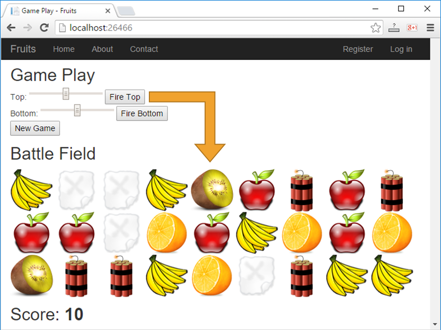{width="4.64in" height="3.476142825896763in"}
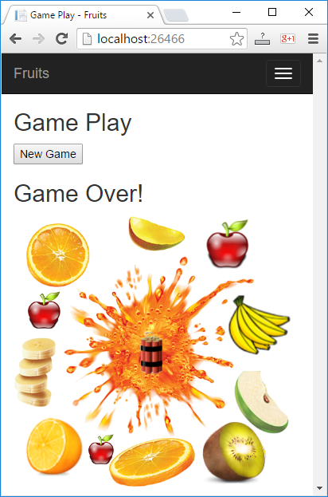{width="2.296000656167979in"
height="3.4718667979002626in"}

1.  Във Visual Studio създайте **ново ASP.NET MVC уеб приложение** с
    език **C\#**. Добавете нов проект от \[Solution Explorer\] \[Add\]
    \[New Project...\] . Дайте смислено име, например
    "**Fruits-Web-Game**":

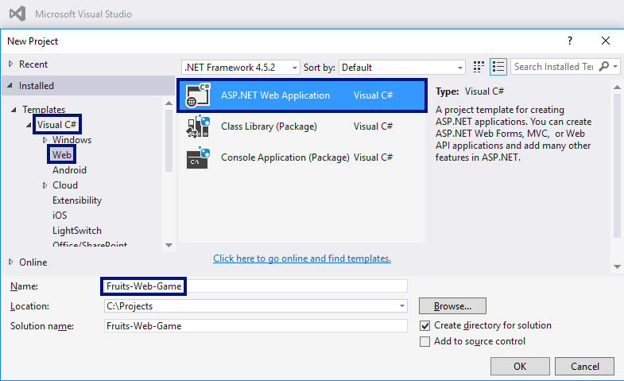{width="6.974527559055118in"
height="4.2555643044619424in"}

Изберете тип на уеб приложението "**MVC**":

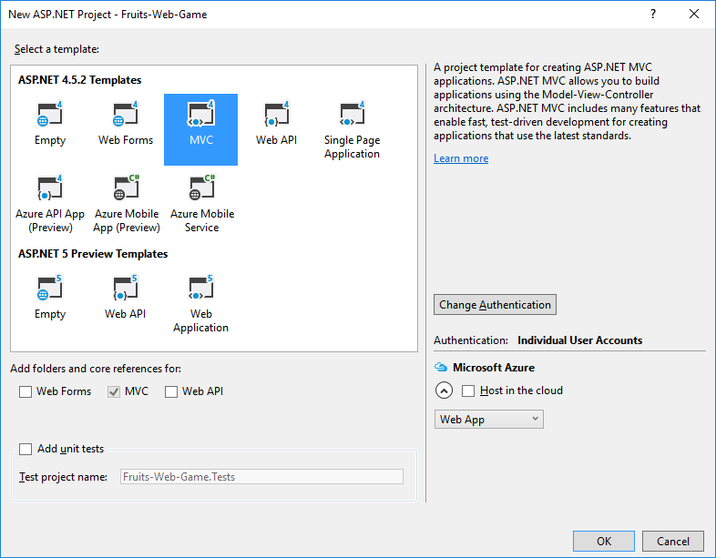{width="6.815636482939633in"
height="5.3146937882764655in"}

2.  Сега създавайте **контролите за играта**.

Целта е да добавите **скролиращи ленти** (scroll bars), с които се
играчът се прицелва, и бутон за старт на **нова игра**. Редактирайте
файла **Views/Home/Index.cshtml**. Изтрийте всичко и въведете кода от
картинката:

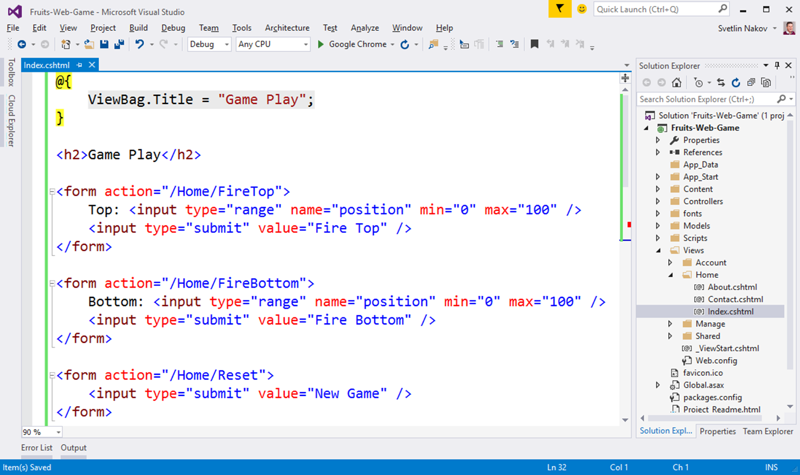{width="6.7124453193350835in"
height="3.9911581364829396in"}

Този код създава уеб форма **\<form\>** със скролер (поле)
"**position**" за задаване на число в интервала \[0...100\] и бутон
**\[Fire Top\]** за изпращане на данните от формата към сървъра.
Действието, което ще обработи данните, се казва "**/Home/FireTop**",
което означава метод "**FireTop**" в контролер "**Home**", който се
намира във файла "**HomeController.cs**". Следват още две подобни форми
с бутони **\[Fire Bottom\]** и **\[New Game\]**.

3.  Сега трябва **да подготвите плодовете** за рисуване в изгледа.

Добавете кода от картинката в контролера
**Controllers/HomeController.cs**:

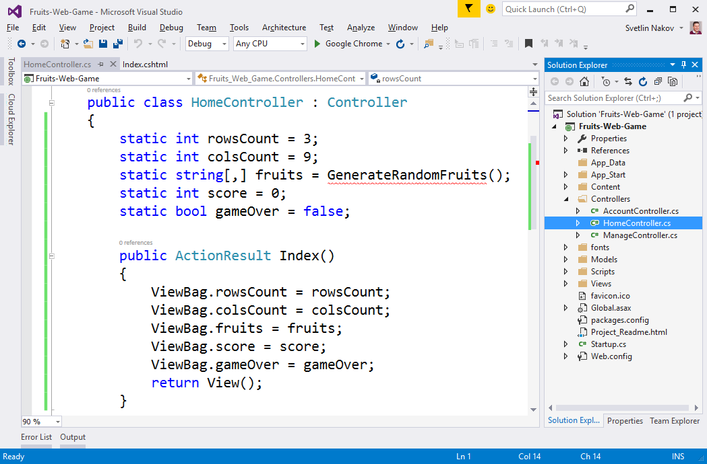{width="6.726527777777778in"
height="4.423973097112861in"}

Горният код дефинира полета за **брой редове**, **брой колони**, за
**таблицата с плодовете** (игралното поле), за натрупаните от играча
**точки** и информация дали играта е активна или е **свършила** (поле
**gameOver**). Игралното поле е с рамери 9 колони на 3 реда и съдържа за
всяко поле текст какво има в него: **apple**, **banana**, **orange**,
**kiwi**, **empty** или **dynamite**.

Главното действие **Index()** подготвя игралното поле за чертане като
записва във **ViewBag** структурата елементите на играта и извиква
изгледа, който ги чертае в страницата на играта в уеб браузъра като
HTML.

4.  Генерирайте **случайни плодове**.

За да генерирате случайни плодове, трябва да напишете метод
**GenerateRandomFruits()** с кода от картинката по-долу. Този код
записва в таблицата (матрицата) **fruits** имена на различни картинки и
така изгражда игралното поле. Във всяка клетка от таблицата се записва
една от следните стойности: **apple**, **banana**, **orange**, **kiwi**,
**empty** или **dynamite**. След това, за да се нарисува съответното
изображение в изгледа, към текста от таблицата ще се долепи "**.png**" и
така ще се получи името на файла с картинката, която да се вмъкне в HTML
страницата като част от игралното поле. Попълването на игралното поле (9
колони с по 3 реда) става в изгледа **Index.cshtml** с два вложени
**for**-цикъла (за ред и за колона).

За да се генерират случайни плодове за всяка клетка се генерира
**случайно число** между 0 и 8 (вж. класа
[Random()](https://msdn.microsoft.com/en-us/library/system.random.aspx)
в .NET). Ако числото e 0 или 1, се слага **apple**, ако е между 2 и 3,
се слага **banana** и т.н. Ако числото е 8, се поставя **dynamite**.
Така плодовете се появяват 2 пъти по-често отколкото динамита. Ето и
кода:

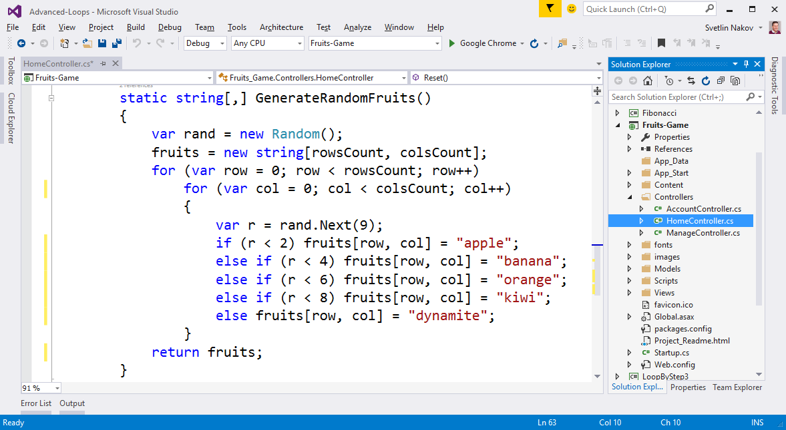{width="6.763529090113736in"
height="3.7120002187226597in"}

5.  **Добавете картинките** за играта.

От **\[Solution Explorer\]** направете папка "**images**" в коренната
директория на проекта. Използвайте менюто **\[Add\]** **\[New
Folder\]**.

Сега добавете **картинките** за играта (те са част от файловете със
заданието за домашно). Копирайте ги от Windows Explorer и ги поставете в
папката "**images**" в **\[Solution Explorer\]** във Visual Studio с
**copy / paste**.

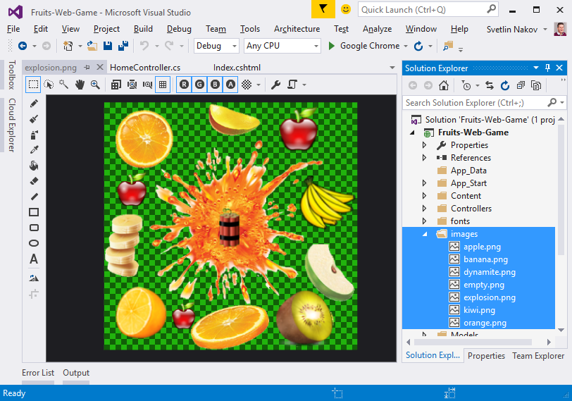{width="6.702528433945757in"
height="4.696586832895888in"}

6.  Чертане на плодовете в **Index.cshtml**

За да **начертаете игралното поле** с подовете, трябва да завъртите
**два вложени цикъла** (за редовете и за колоните). Всеки ред се състои
от 9 на брой картинки, всяка от които съдържа **apple**, **banana** или
друг плод или празно (**empty**) или динамит (**dynamite**). Картинките
се чертаят като се отпечата HTML таг за вмъкване на картинка от вида на
**\**. Девет картинки се
подреждат една след друга на всеки от редовете, а след тях се преминава
на нов ред с **\<br** **/\>**. Това се повтаря три пъти за трите реда.
Накрая се отпечатват точките на играча. Ето как изглежда **кодът** за
чертане на игралното поле и точките:

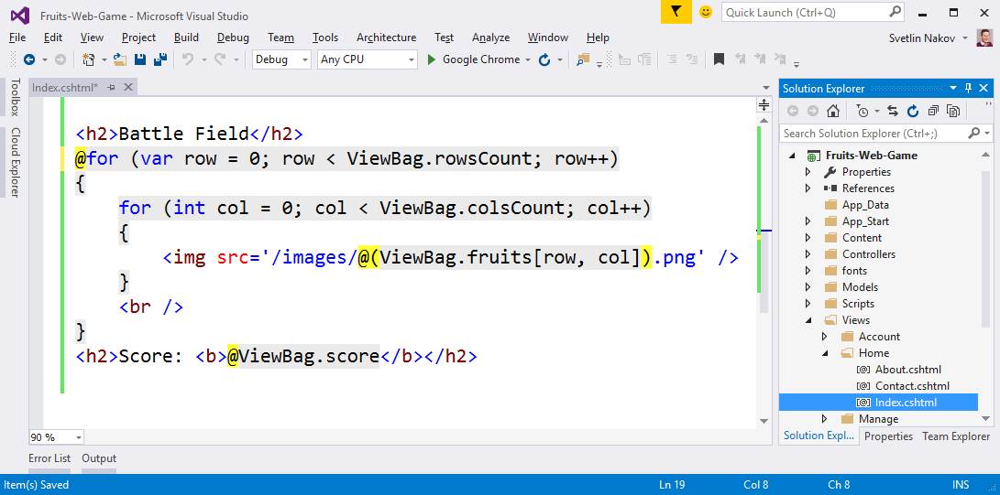{width="6.718527996500438in"
height="3.33125656167979in"}

Обърнете внимание на жълтите символи **@** -- те служат за превключване
между езика **C\#** и езика **HTML** и идват от **Razor** синтаксиса за
рисуване на динамични уеб страници.

7.  Нагласете текстовете във файла **/Views/Shared/\_Layout.cshtml**.
    Заменете "**My ASP.NET Application**" с по-подходящи текстове,
    например "**Fruits**":

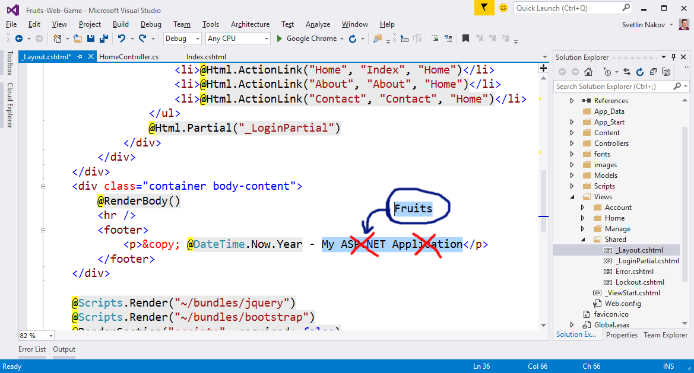{width="6.736438101487314in"
height="3.62418416447944in"}

8.  Стартирайте проекта с **\[Ctrl+F5\]** и му се порадвайте. Очаква се
    да бъде генерирано случайно игрово поле с плодове с размери 9 на 3 и
    да се визуализира в уеб страницата чрез поредица картинки:

    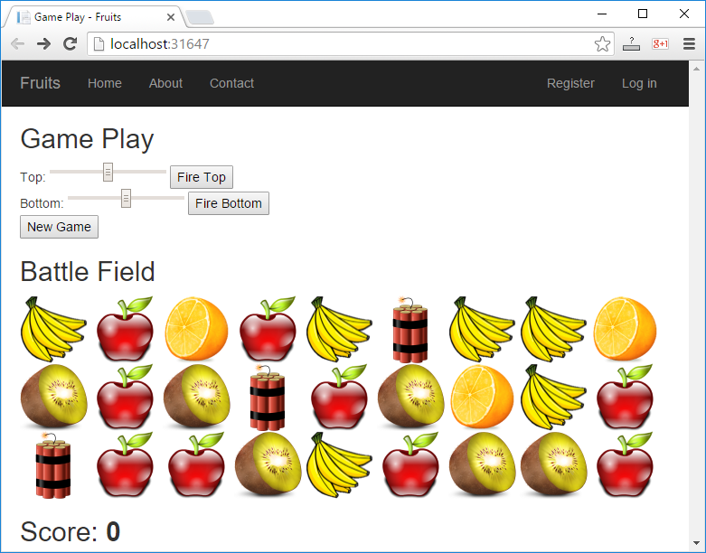{width="7.246527777777778in"
    height="5.677777777777778in"}

Сега играта е донякъде направена: игралното поле се генерира случайни и
се визуализира успешно (ако не сте допуснали грешка някъде). Остава да
се реализира същината на играта: **стрелянето по плодовете**.

9.  Добавете действията \[**New Game**\] и \[**Fire Top**\] / \[**Fire
    Top**\] в контролера "**HomeController.cs**":

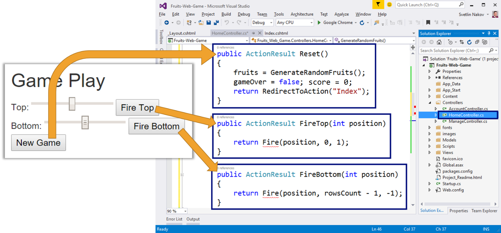{width="7.246527777777778in"
height="3.3756944444444446in"}

Горният код дефинира три действия:

-   **Reset()** -- стартира нова игра, като генерира новo случайно
    игрално поле с плодове и експлозиви, нулира точките на играча и
    прави играта валидна (**gameOver** = **false**). Това действие е
    доста просто и може да се тества веднага с \[Ctrl+F5\], преди да се
    напишат другите.

-   **FireTop(position)** -- стреля по ред **0** на позиция **position**
    (число от 0 до 100). Извиква се стреляне в посока **надолу** (+1) от
    ред **0** (най-горния). Самото стреляне е по-сложно като логика и ще
    бъде разгледано след малко.

-   **FireBottom(position)** -- стреля по ред **2** на позиция
    **position** (число от 0 до 100). Извиква се стреляне в посока
    **нагоре** (-1) от ред **2** (най-долния).

10. Имплементирайте \"стрелянето\" -- метода **Fire(position,**
    **startRow,** **step)**:

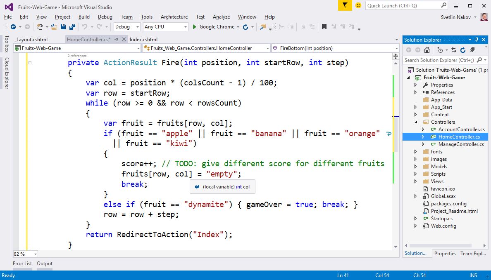{width="7.246527777777778in"
height="4.141666666666667in"}

Стрелянето работи по следния начин: първо се изчислява номера на
колоната **col**, към която играчът се е прицелил. Входното число от
скролера (между 0 и 100) се намалява до число между 0 и 8 (за всяка от
9-те колони). Номерът на реда **row** е или 0 (ако изстрелът е отгоре)
или броят редове минус едно (ако изстрелът е отдолу). Съответно посоката
на стрелба (стъпката) е **1** (надолу) или **-1** (нагоре).

За да се намери къде изстрелът поразява плод или динамит, се преминава в
цикъл през всички клетки от игралното в прицелената колона и от първия
до последния атакуван ред. Ако се срещне плод, той изчезва (замества се
с **empty**) и се дават точки на играча. Ако се срещне **dynamite**,
играта се отбелязва като свършила.

Оставаме на по-запалените да имплементират по-сложно поведение, например
да се дават различни точки при уцелване на различен плод, да се
реализира анимация с експлозия (това не е твърде лесно), да се взимат
точки при излишно стреляне в празна колона и подобни.

11. **Тествайте** какво работи до момента като стартирате с \[Ctrl+F5\]:

-   **Нова игра** бутонът за нова игра трябва да генерира ново игрално
    поле със случайно разположени плодове и експлозиви и да нулира
    точките на играча.

-   **Стреляне отгоре** стрелянето отгоре трябва да премахва най-горният
    плод в уцелената колона или да предизвиква край на играта при
    динамит. Всъщност при край на играта все още нищо няма да се случва,
    защото в изгледа този случай още не се разглежда.

-   **Стреляне отдолу** стрелянето отдолу трябва да премахва най-долния
    плод в уцелената колона или да прекратява играта при уцелване на
    динамит.

{width="4.64in" height="3.476142825896763in"}

12. Имплементирайте \"**Край на играта**\". За момента при край на
    играта нищо не се случа. Ако играчът уцели динамит, в контролера се
    отбелязва, че играта е свършила (**gameOver = true**), но този факт
    не се визуализира по никакъв начин. За да заработи свършването на
    играта, е необходимо да добавим няколко проверки в изгледа:

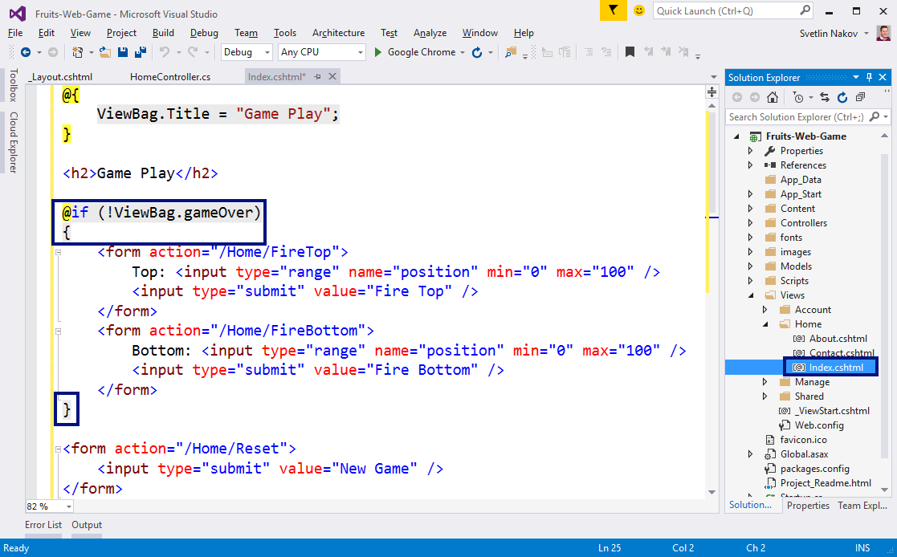{width="6.684288057742783in"
height="4.152777777777778in"}

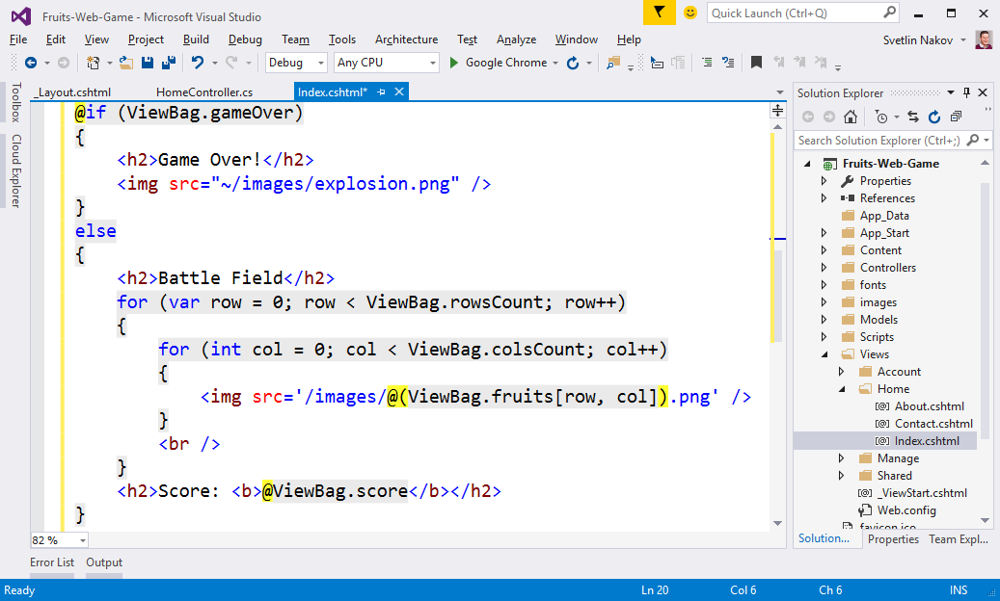{width="6.72715113735783in"
height="4.0478947944007in"}

Кодът по-горе проверява дали е свършила играта и показва съответно
контролите за стреляне и игралното поле (при активна игра) или картинка
с експлодирали плодове при край на играта.

13. След промяната в кода на изгледа стартирайте с \[Ctrl+F5\] и
    **тествайте** играта отново:

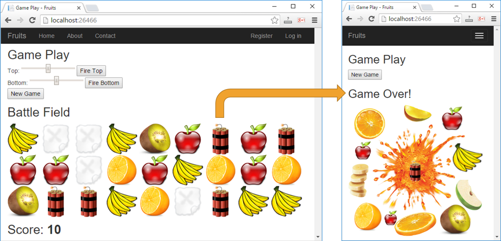{width="7.267064741907261in"
height="3.5006944444444446in"}

Този път при уцелване на динамит, трябва да се появи дясната картинка и
да се позволява единствено действието "нова игра" (бутонът **\[New
Game\]**).

  {#section .ListParagraph}
-

Изпитни задачи от минали издания на курса
=========================================

\* Песента на колелетата
------------------------

*Шеста задача от междинния изпит на 17 септември 2017. Тествайте
решението си
[**тук**](https://judge.softuni.bg/Contests/Practice/Index/784#5).*

Прапраправнукът на Сали Яшар е получил наследство - сейф с парола -
четири цифри. В него е заключена тайната на пеещите каруци. Той има
автосервиз и се нуждае от реклама, затова е решил да направи такава
каруца. Проблема е, че паролата е скрита в следната задача:

***„Парола ще получиш, ако знаеш едно цяло число, контролна стойност се
нарича то,***

***почива в интервала от 4 до 144 включително, но да го откриеш може би
ще е мъчително. "***

Паролата има формат: „**abcd"** и контролната стойност трябва да е равна
н**а a\*b + c\*d ,** но трябва да бъдат спазени следните условия:

-   **при намирането на а и b: a \< b **

-   **при намиране на c и d: c \> d .**

**Каруцата има четири колела, затова паролата ще е четвърто число, което
трябва да се отпечата.**

**В случай, че НЕ се намери такова число, отпечатва се** „**No!"**.

### Вход

От конзолата се четe **едно цяло число (контролната стойност)**: **M**
-- **цяло число в интервала \[4 ... 144\]**;

### Изход

Отпечатването на конзолата зависи от резултата:

-   **Ако са намерени четворки числа (аbcd), отговарящи на условието, ги
    отпечатваме всичките с разделител интервал**: **"{а}{b}{c}{d} "**

-   **Отпечатва се един от двата реда на нов ред:**

    -   **Ако съществува четвърта четворка се отпечатва: „Password:
        {а}{b}{c}{d}"**

    -   **Ако НЕ са намерени такива числа или няма четвърта четворка
        отпечатваме**: **"No!"**

### Примерен вход и изход

+-----------+-----------+-----------+-----------+-----------+-----------+
| **Вход**  | **Изход** | **Обяснен |
|           |           | ия**      |
+===========+===========+===========+===========+===========+===========+
| 11        | 1291 1342 | Започваме |           |           |           |
|           | 1381 1471 | да        |           |           |           |
|           | 1532 1561 | проверява |           |           |           |
|           | 1651 1741 | ме        |           |           |           |
|           | 1831 1921 | числата   |           |           |           |
|           | 2351 2431 | последова |           |           |           |
|           |           | телно:    |           |           |           |
|           | Password: |           |           |           |           |
|           | 1471      | {1} {1}   |           |           |           |
|           |           | {1} {1};  |           |           |           |
|           |           | {1} {1}   |           |           |           |
|           |           | {1} {2};  |           |           |           |
|           |           | {1} {1}   |           |           |           |
|           |           | {1} {3};  |           |           |           |
|           |           | ...; {1}  |           |           |           |
|           |           | {2} {9}   |           |           |           |
|           |           | {1}; ...  |           |           |           |
|           |           |           |           |           |           |
|           |           | четворкат |           |           |           |
|           |           | а         |           |           |           |
|           |           | 1291      |           |           |           |
|           |           | **спазва  |           |           |           |
|           |           | условието |           |           |           |
|           |           | и         |           |           |           |
|           |           | отпечатва |           |           |           |
|           |           | ме        |           |           |           |
|           |           | и т.н.**  |           |           |           |
+-----------+-----------+-----------+-----------+-----------+-----------+
| **Вход**  | **Изход** | **Вход**  | **Изход** | **Вход**  | **Изход** |
+-----------+-----------+-----------+-----------+-----------+-----------+
| 139       | No!       | 110       | 6987 7896 | 55        | 1786 2595 |
|           |           |           |           |           | 3585 3974 |
|           |           |           | No!       |           | 4575 4793 |
|           |           |           |           |           | 5754 5853 |
|           |           |           |           |           | 5952 6871 |
|           |           |           |           |           |           |
|           |           |           |           |           | Password: |
|           |           |           |           |           | 3974      |
+-----------+-----------+-----------+-----------+-----------+-----------+

\* Банкноти и монети
--------------------

*Шеста задача от междинния изпит на 03 септември 2017. Тествайте
решението си
[**тук**](https://judge.softuni.bg/Contests/Practice/Index/750#5).*

Имаме банкноти и монети по **1лв.**, по **2лв.** и по **5лв.** Да се
напише програма, която прочита въведените от потребителя брой банкноти и
монети и **сума**, и извежда на екран всички възможни начини по които
сумата може да се изплати с наличните банкноти.

### Вход

Входът се чете от **конзолата** и съдържа **точно 4 реда**:

1.  **Брой** монети по **1лв.** - **цяло положително число; **

2.  **Брой** монети по **2лв.** - **цяло положително число;**

3.  **Брой** банкноти по **5лв.** - **цяло положително число;**

4.  **Сума** - **цяло положително число** в интервала \[**1...1000**\];

### Изход

Да се отпечатат на конзолата **всички комбинации от дадените номинали,
образуващи сумата**, форматирани по следния начин:

-   **\"{бр. 1лв.} \* 1 lv. + {бр. 2лв.} \* 2 lv. + {бр. 5лв.} \* 5 lv.
    > = {сума} lv.\"**

### Примерен вход и изход

+----------+-----------------------------------------------+
| **Вход** | **Изход**                                     |
+==========+===============================================+
| 3        | 0 \* 1 lv. + 0 \* 2 lv. + 2 \* 5 lv. = 10 lv. |
|          |                                               |
| 2        | 1 \* 1 lv. + 2 \* 2 lv. + 1 \* 5 lv. = 10 lv. |
|          |                                               |
| 3        | 3 \* 1 lv. + 1 \* 2 lv. + 1 \* 5 lv. = 10 lv. |
|          |                                               |
| 10       |                                               |
+----------+-----------------------------------------------+
| **Вход** | **Изход**                                     |
+----------+-----------------------------------------------+
| 5        | 0 \* 1 lv. + 1 \* 2 lv. + 1 \* 5 lv. = 7 lv.  |
|          |                                               |
| 3        | 1 \* 1 lv. + 3 \* 2 lv. + 0 \* 5 lv. = 7 lv.  |
|          |                                               |
| 1        | 2 \* 1 lv. + 0 \* 2 lv. + 1 \* 5 lv. = 7 lv.  |
|          |                                               |
| 7        | 3 \* 1 lv. + 2 \* 2 lv. + 0 \* 5 lv. = 7 lv.  |
|          |                                               |
|          | 5 \* 1 lv. + 1 \* 2 lv. + 0 \* 5 lv. = 7 lv.  |
+----------+-----------------------------------------------+

\* Име на група
---------------

*Шеста задача от междинния изпит на 23 юли 2017. Тествайте решението си
[**тук**](https://judge.softuni.bg/Contests/Practice/Index/715#5).*

Групата сменя своя ръководител и съответно трябва да се избере ново име.
За целта всеки един танцьор дава предложения. Предложенията винаги се
дават по азбучен ред от **първата буква** в азбуката **до въведена**.
Името на групата **съдържа и цифра**. Винаги цифрата **започва от нула**
и достига до **въведената.** Имената се дават по азбучен ред.

Да се изчисли **колко предложения са били дадени преди да се достигне до
името на групата**, като се има предвид, че **дължината на името винаги
е 5 символа** и винаги **първия символ е главна буква**, **последващите
3 символа са малки букви** ,а **последния е цифра**.

### Вход

От конзолата се четат **5 реда:**

-   **Голяма** буква -- символ в интервала \[**A - Z**\]

-   **Малка** буква -- символ в интервала \[**a - z**\]

-   **Малка** буква -- символ в интервала \[**a - z**\]

-   **Малка** буква -- символ в интервала \[**a - z**\]

-   **Цифра** -- цяло число в интервала \[**0 - 9**\]

### Изход

Да се отпечата на конзолата цяло число -- броя предложения **точно**
**преди** достигането на името.

### Примерен вход и изход

+-----------------------+-----------------------+-----------------------+
| **вход**              | **изход**             | **Обяснения**         |
+=======================+=======================+=======================+
| A                     | 0                     |                       |
|                       |                       |                       |
| a                     |                       |                       |
|                       |                       |                       |
| a                     |                       |                       |
|                       |                       |                       |
| a                     |                       |                       |
|                       |                       |                       |
| 0                     |                       |                       |
+-----------------------+-----------------------+-----------------------+
| K                     | 395                   | Aaaa0 Aaaa1 Aaaa2     |
|                       |                       | Aaaa3 Aaaa4 Aaaa5     |
| a                     |                       | Aaab0 Aaab1 Aaab2     |
|                       |                       | Aaab3 Aaab4 Aaab5     |
| b                     |                       | Aaac0 Aaac1 Aaac2     |
|                       |                       | Aaac3 Aaac4 Aaac5     |
| c                     |                       | Aaba0 Aaba1 Aaba2     |
|                       |                       | Aaba3 Aaba4 Aaba5     |
| 5                     |                       | Aabb0 Aabb1 Aabb2     |
|                       |                       | Aabb3 Aabb4 Aabb5     |
|                       |                       | Aabc0 Aabc1 Aabc2     |
|                       |                       | Aabc3 Aabc4 Aabc5     |
|                       |                       | Baaa0 Baaa1 Baaa2     |
|                       |                       | Baaa3 Baaa4 Baaa5     |
|                       |                       | Baab0 Baab1 Baab2     |
|                       |                       | Baab3 Baab4 Baab5     |
|                       |                       | Baac0 Baac1 Baac2     |
|                       |                       | Baac3 Baac4 Baac5     |
|                       |                       | Baba0 Baba1 Baba2     |
|                       |                       | Baba3 Baba4 Baba5     |
|                       |                       | Babb0 Babb1 Babb2     |
|                       |                       | Babb3 Babb4 Babb5     |
|                       |                       | Babc0                 |
|                       |                       |                       |
|                       |                       | **\...**              |
|                       |                       |                       |
|                       |                       | Kaac2 Kaac3 Kaac4     |
|                       |                       | Kaac5 Kaba0 Kaba1     |
|                       |                       | Kaba2 Kaba3 Kaba4     |
|                       |                       | Kaba5 Kabb0 Kabb1     |
|                       |                       | Kabb2 Kabb3 Kabb4     |
|                       |                       | Kabb5 Kabc0 Kabc1     |
|                       |                       | Kabc2 Kabc3 Kabc4     |
+-----------------------+-----------------------+-----------------------+
| I                     | 5543                  | Aaaa0 Aaaa1 Aaab0     |
|                       |                       | Aaab1 Aaac0 Aaac1     |
| v                     |                       | Aaad0 Aaad1 Aaae0     |
|                       |                       | Aaae1 Aaaf0 Aaaf1     |
| a                     |                       | Aaag0 Aaag1 Aaah0     |
|                       |                       | Aaah1 Aaai0 Aaai1     |
| n                     |                       | Aaaj0 Aaaj1 Aaak0     |
|                       |                       | Aaak1 Aaal0 Aaal1     |
| 1                     |                       | Aaam0 Aaam1 Aaan0     |
|                       |                       | Aaan1 Abaa0 Abaa1     |
|                       |                       | Abab0 Abab1 Abac0     |
|                       |                       | Abac1 Abad0 Abad1     |
|                       |                       | Abae0 Abae1 Abaf0     |
|                       |                       | Abaf1 Abag0 Abag1     |
|                       |                       | Abah0 Abah1 Abai0     |
|                       |                       | Abai1 Abaj0 Abaj1     |
|                       |                       | Abak0 Abak1 Abal0     |
|                       |                       | Abal1 Abam0 Abam1     |
|                       |                       | Aban0 Aban1 Acaa0     |
|                       |                       | Acaa1 Acab0 Acab1     |
|                       |                       | Acac0 Acac1 Acad0     |
|                       |                       | Acad1 Acae0 Acae1     |
|                       |                       | Acaf0 Acaf1 Acag0     |
|                       |                       | Acag1 Acah0 Acah1     |
|                       |                       | Acai0 Acai1 Acaj0     |
|                       |                       | Acaj1 Acak0 Acak1     |
|                       |                       | Acal0 Acal1           |
|                       |                       |                       |
|                       |                       | **\... **             |
|                       |                       |                       |
|                       |                       | Ivam0 Ivam1 Ivan0     |
+-----------------------+-----------------------+-----------------------+

\* Сбор или произведение
------------------------

*Шеста задача от междинния изпит на 25 юни 2017. Тествайте решението си
[**тук**](https://judge.softuni.bg/Contests/Practice/Index/642#5).*

От конзолата се чете **едно цяло число -- контролно**. Трябва да се
отпечатат в определен формат **всички тройки числа (a, b и c) в
интервала от 1 до 30 включително, чиито сбор или произведение е равен на
контролното число.** Като трябва да бъдат спазени следните условия:

-   **при намирането на сбора: a \< b \< c**

-   **при намиране на произведението: a \> b \> c.**

**В случай, че НЕ са намерени такива числа трябва да отпечатаме**
**No**.

Например **при контролно число 18:**

**Отпечатваме**

-   1 + 2 + 15 = 18 **(a \< b \< c) **

-   **...**

-   6 \* 3 \* 1 = 18 **( а \> b \> c)**

-   **...**

**НЕ отпечатваме**

-   1 + 1 + 16 = 18; 1 + 10 + 7 = 18 защото не е спазено условието **(a
    \< b \< c); **

-   1 \* 2 \* 9 = 18; 2 \* 1 \* 9 = 18 защото не е спазено условието
    **(a \> b \> c).**

### Вход

От конзолата се четe **1 цяло число**: **N** -- **цяло число в интервала
\[1 ... 30000\]**;

### Изход

Отпечатването на конзолата зависи от резултата:

-   **Ако са намерени тройки числа (a \< b \< c), сборът, на които е
    равен на контролното число отпечатваме**:

<!-- -->

-   **"{а} + {b} + {c} = {N}"**

<!-- -->

-   **Ако са намерени тройки числа (a \> b \> c), произведението, на
    които е равно на контролното число отпечатваме**:

<!-- -->

-   **"{а} \* {b} \* {c} = {N}"**

<!-- -->

-   **Ако НЕ са намерени такива числа отпечатваме**:

<!-- -->

-   **"No!"**

**Всички комбинации се принтират в нарастващ ред.**

### Примерен вход и изход

+-----------+-----------+-----------+-----------+-----------+-----------+
| **Вход**  | **Изход** | **Обяснен |
|           |           | ия**      |
+===========+===========+===========+===========+===========+===========+
| 12        | 1 + 2 + 9 | Започваме |           |           |           |
|           | = 12      | да        |           |           |           |
|           |           | проверява |           |           |           |
|           | 1 + 3 + 8 | ме        |           |           |           |
|           | = 12      | числата   |           |           |           |
|           |           | последова |           |           |           |
|           | 1 + 4 + 7 | телно:    |           |           |           |
|           | = 12      |           |           |           |           |
|           |           | {1} {1}   |           |           |           |
|           | 1 + 5 + 6 | {1}; {1}  |           |           |           |
|           | = 12      | {1} {2};  |           |           |           |
|           |           | {1} {1}   |           |           |           |
|           | 2 + 3 + 7 | {3}; ...  |           |           |           |
|           | = 12      | **{1} {1} |           |           |           |
|           |           | {10}**    |           |           |           |
|           | 2 + 4 + 6 | **-\>**   |           |           |           |
|           | = 12      | **12**    |           |           |           |
|           |           | (**сборът |           |           |           |
|           | 3 + 4 + 5 | е равен   |           |           |           |
|           | = 12      | на        |           |           |           |
|           |           | контролно |           |           |           |
|           | 4 \* 3 \* | то        |           |           |           |
|           | 1 = 12    | число**,  |           |           |           |
|           |           | но **не е |           |           |           |
|           | 6 \* 2 \* | спазено   |           |           |           |
|           | 1 = 12    | условието |           |           |           |
|           |           | a \< b \< |           |           |           |
|           |           | c и НЕ    |           |           |           |
|           |           | отпечатва |           |           |           |
|           |           | ме**);    |           |           |           |
|           |           | ... **{1} |           |           |           |
|           |           | {1}       |           |           |           |
|           |           | {12}**    |           |           |           |
|           |           | **-\>     |           |           |           |
|           |           | 12**      |           |           |           |
|           |           | (**произв |           |           |           |
|           |           | едението  |           |           |           |
|           |           | е равно   |           |           |           |
|           |           | на 12, но |           |           |           |
|           |           | не е      |           |           |           |
|           |           | спазено   |           |           |           |
|           |           | условието |           |           |           |
|           |           | a \> b \> |           |           |           |
|           |           | c и НЕ    |           |           |           |
|           |           | отпечатва |           |           |           |
|           |           | ме**);    |           |           |           |
|           |           | ... **{1} |           |           |           |
|           |           | {2} {6}   |           |           |           |
|           |           | -\> 12**  |           |           |           |
|           |           | (**произв |           |           |           |
|           |           | едението  |           |           |           |
|           |           | е 12,     |           |           |           |
|           |           | трите     |           |           |           |
|           |           | числа са  |           |           |           |
|           |           | различни, |           |           |           |
|           |           | но НЕ е   |           |           |           |
|           |           | спазено   |           |           |           |
|           |           | условието |           |           |           |
|           |           | a \> b \> |           |           |           |
|           |           | c и       |           |           |           |
|           |           | отново НЕ |           |           |           |
|           |           | принтирам |           |           |           |
|           |           | е);**     |           |           |           |
|           |           |           |           |           |           |
|           |           | **{1} {2} |           |           |           |
|           |           | {9} -\>   |           |           |           |
|           |           | 12**      |           |           |           |
|           |           | (**сборът |           |           |           |
|           |           | е 12**,   |           |           |           |
|           |           | три       |           |           |           |
|           |           | различни  |           |           |           |
|           |           | числа,    |           |           |           |
|           |           | спазено   |           |           |           |
|           |           | условие   |           |           |           |
|           |           | **a \< b  |           |           |           |
|           |           | \< c и    |           |           |           |
|           |           | принтирам |           |           |           |
|           |           | е);**     |           |           |           |
|           |           | ... **{4} |           |           |           |
|           |           | {3} {1}   |           |           |           |
|           |           | -\> 12    |           |           |           |
|           |           | (произвед |           |           |           |
|           |           | ението    |           |           |           |
|           |           | е 12,     |           |           |           |
|           |           | условието |           |           |           |
|           |           | е спазено |           |           |           |
|           |           | и         |           |           |           |
|           |           | принтирам |           |           |           |
|           |           | е);       |           |           |           |
|           |           | ... {10}  |           |           |           |
|           |           | {1} {1}   |           |           |           |
|           |           | -\> 12    |           |           |           |
|           |           | (сборът е |           |           |           |
|           |           | 12, но не |           |           |           |
|           |           | е спазено |           |           |           |
|           |           | условието |           |           |           |
|           |           | a \< b \< |           |           |           |
|           |           | c,        |           |           |           |
|           |           | програмат |           |           |           |
|           |           | а         |           |           |           |
|           |           | продължав |           |           |           |
|           |           | а);       |           |           |           |
|           |           | **        |           |           |           |
+-----------+-----------+-----------+-----------+-----------+-----------+
| **Вход**  | **Изход** | **Вход**  | **Изход** | **Вход**  | **Изход** |
+-----------+-----------+-----------+-----------+-----------+-----------+
| 100       | 10 \* 5   | 93        | No!       | 75        | 15 \* 5   |
|           | \* 2 =    |           |           |           | \* 1 = 75 |
|           | 100       |           |           |           |           |
|           |           |           |           |           | 16 + 29 + |
|           | 20 \* 5   |           |           |           | 30 = 75   |
|           | \* 1 =    |           |           |           |           |
|           | 100       |           |           |           | 17 + 28 + |
|           |           |           |           |           | 30 = 75   |
|           | 25 \* 4   |           |           |           |           |
|           | \* 1 =    |           |           |           | 18 + 27 + |
|           | 100       |           |           |           | 30 = 75   |
|           |           |           |           |           |           |
|           |           |           |           |           | 18 + 28 + |
|           |           |           |           |           | 29 = 75   |
|           |           |           |           |           |           |
|           |           |           |           |           | 19 + 26 + |
|           |           |           |           |           | 30 = 75   |
|           |           |           |           |           |           |
|           |           |           |           |           | 19 + 27 + |
|           |           |           |           |           | 29 = 75   |
|           |           |           |           |           |           |
|           |           |           |           |           | 20 + 25 + |
|           |           |           |           |           | 30 = 75   |
|           |           |           |           |           |           |
|           |           |           |           |           | 20 + 26 + |
|           |           |           |           |           | 29 = 75   |
|           |           |           |           |           |           |
|           |           |           |           |           | 20 + 27 + |
|           |           |           |           |           | 28 = 75   |
|           |           |           |           |           |           |
|           |           |           |           |           | 21 + 24 + |
|           |           |           |           |           | 30 = 75   |
|           |           |           |           |           |           |
|           |           |           |           |           | 21 + 25 + |
|           |           |           |           |           | 29 = 75   |
|           |           |           |           |           |           |
|           |           |           |           |           | 21 + 26 + |
|           |           |           |           |           | 28 = 75   |
|           |           |           |           |           |           |
|           |           |           |           |           | 22 + 23 + |
|           |           |           |           |           | 30 = 75   |
|           |           |           |           |           |           |
|           |           |           |           |           | 22 + 24 + |
|           |           |           |           |           | 29 = 75   |
|           |           |           |           |           |           |
|           |           |           |           |           | 22 + 25 + |
|           |           |           |           |           | 28 = 75   |
|           |           |           |           |           |           |
|           |           |           |           |           | 22 + 26 + |
|           |           |           |           |           | 27 = 75   |
|           |           |           |           |           |           |
|           |           |           |           |           | 23 + 24 + |
|           |           |           |           |           | 28 = 75   |
|           |           |           |           |           |           |
|           |           |           |           |           | 23 + 25 + |
|           |           |           |           |           | 27 = 75   |
|           |           |           |           |           |           |
|           |           |           |           |           | 24 + 25 + |
|           |           |           |           |           | 26 = 75   |
|           |           |           |           |           |           |
|           |           |           |           |           | 25 \* 3   |
|           |           |           |           |           | \* 1 = 75 |
+-----------+-----------+-----------+-----------+-----------+-----------+

\* Генератор на числа
---------------------

*Шеста задача от междинния изпит на 07 май 2017. Тествайте решението си
[**тук**](https://judge.softuni.bg/Contests/Practice/Index/540#4).*

Да се напише програма, която прочита от конзолата **три цели числа** --
**M, N и L,** и **генерира всички числа в диапазона от MNL до 111**. От
конзолата се чете **едно специално** и **едно контролно число**. **За
всяка комбинация** от тройката числа **се прави проверка**:

1.  **Ако се дели на 3 без остатък -- към специалното число се добавя
    5**;

2.  **Ако завършва на 5 -- от специалното число се вади 2**;

3.  **Ако е четно число -- специалното число се умножава по 2**.

Трябва да се има предвид, едно число **може да отговаря на повече от
една проверка**. В такъв случай трябва да се гледа **приоритетът на
операциите**. **Първо дали се дели на 3, после дали завършва на 5 и
накрая дали е четно числото**. Например:

**972** **се дели на 3 и е четно**. В такъв случай изпълняваме само
операцията с най-голям приоритет и **към специалното число добавяме 5,
но НЕ го умножаваме по 2 след това**.

**315 се дели на 3 и завършва на 5. Към специалното число добавяме 5.**

**В случай, че не отговаря на нито една от посочените проверки, НЕ се
извършва операция и програмата продължава**. **Ако специалното число
стане равно или по-голямо от контролното програмата приключва**.

### Вход

От конзолата се четат **5 числа**, всяко **на отделен ред**:

1.  **М** -- **цяло число в интервала \[1 ... 9\]**;

2.  **N** -- **цяло число в интервала \[1 ... 9\]**;

3.  **L** -- **цяло число в интервала \[1 ... 9\]**;

4.  **Специално число** -- **цяло число в интервала \[0 ... 100\]**;

5.  **Контролно число** -- **цяло число в интервала \[0 ... 1000\]**;

### Изход

Отпечатването на конзолата зависи от резултата:

-   **Ако контролното число е достигнато** се отпечатват **1 ред**:

<!-- -->

-   **"Yes! Control number was reached! Current special number is
    {специалното число}**.**"**

<!-- -->

-   **Ако контролното число НЕ е достигнато** се отпечатва **1 ред**:

<!-- -->

-   **"No! {специалното число} is the last reached special number."**

### Примерен вход и изход

+-----------------------+-----------------------+-----------------------+
| **Вход**              | **Изход**             | **Обяснения**         |
+=======================+=======================+=======================+
| 9                     | Yes! Control number   | 973 -- не се дели на  |
|                       | was reached! Current  | 3, не завършва на 5 и |
| 7                     | special number is 48. | не е четно =\> върху  |
|                       |                       | него не се извършват  |
| 3                     |                       | никакви операции.     |
|                       |                       | Специалното число е   |
| 2                     |                       | по-малко от           |
|                       |                       | контролното и         |
| 44                    |                       | програмата            |
|                       |                       | продължава.           |
|                       |                       |                       |
|                       |                       | 972 - дели се на 3    |
|                       |                       | =\> 2 + 5 = 7.        |
|                       |                       | Специалното число е   |
|                       |                       | по-малко от           |
|                       |                       | контролното и         |
|                       |                       | програмата            |
|                       |                       | продължава.           |
|                       |                       |                       |
|                       |                       | 971 -- не отговаря на |
|                       |                       | условията и не се     |
|                       |                       | извършват операции    |
|                       |                       |                       |
|                       |                       | 963 - дели се на 3    |
|                       |                       | =\> 7 + 5 = 12        |
|                       |                       |                       |
|                       |                       | 962 - четно =\> 12 \* |
|                       |                       | 2 = 24                |
|                       |                       |                       |
|                       |                       | 961 - не отговаря на  |
|                       |                       | условията и не се     |
|                       |                       | извършват операции    |
|                       |                       |                       |
|                       |                       | ...                   |
|                       |                       |                       |
|                       |                       | 952 - четно =\> 24 \* |
|                       |                       | 2 = 48                |
|                       |                       |                       |
|                       |                       | 48 \>= 44             |
+-----------------------+-----------------------+-----------------------+
| **Вход**              | **Изход**             | **Обяснения**         |
+-----------------------+-----------------------+-----------------------+
| 1                     | No! 35 is the last    | 117 - дели се на 3    |
|                       | reached special       | =\> 1 + 5 = 6         |
| 1                     | number.               |                       |
|                       |                       | 116 - четно =\> 6 \*  |
| 7                     |                       | 2 = 12                |
|                       |                       |                       |
| 1                     |                       | 115 - завършва на 5   |
|                       |                       | =\> 12 -- 2 = 10      |
| 308                   |                       |                       |
|                       |                       | 114 - дели се на 3    |
|                       |                       | =\> 10 + 5 = 15       |
|                       |                       |                       |
|                       |                       | 113 - не отговаря на  |
|                       |                       | нито една проверка и  |
|                       |                       | програмата продължава |
|                       |                       |                       |
|                       |                       | 112 - четно =\> 15 \* |
|                       |                       | 2 = 30                |
|                       |                       |                       |
|                       |                       | 111 - дели се на 3    |
|                       |                       | =\> 30 + 5 = 35       |
|                       |                       |                       |
|                       |                       | 35 \< 308             |
+-----------------------+-----------------------+-----------------------+
