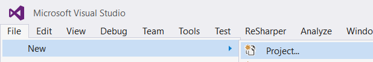
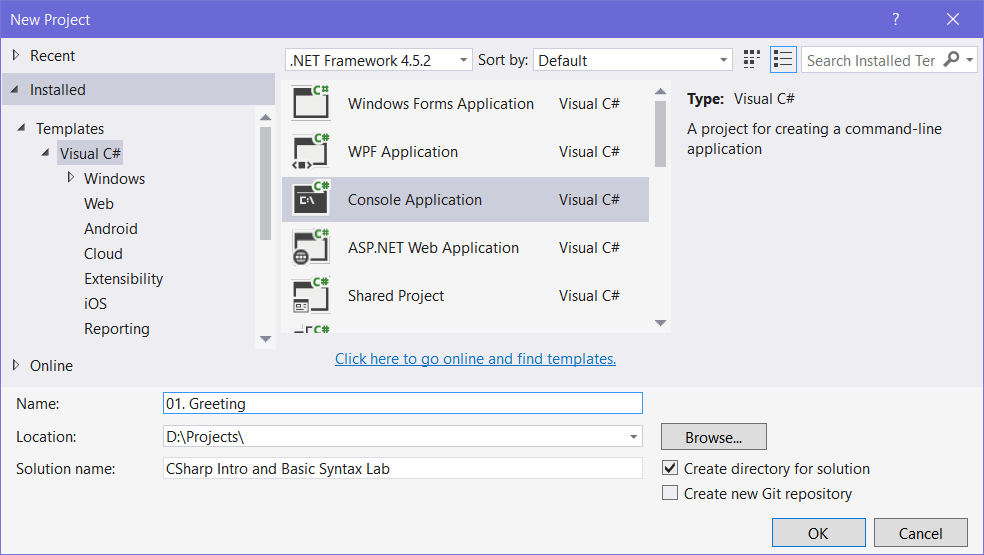
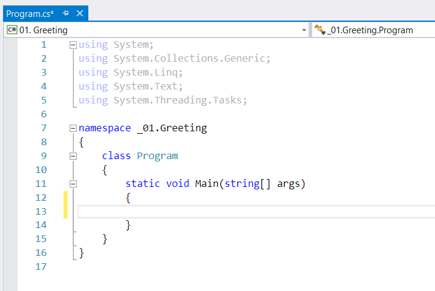
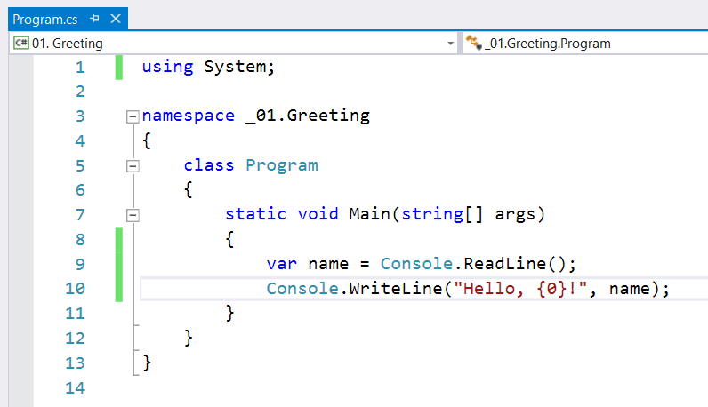
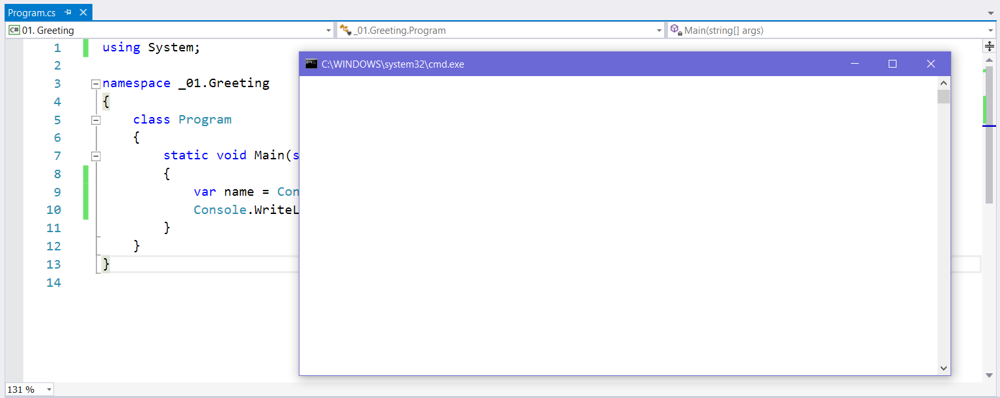
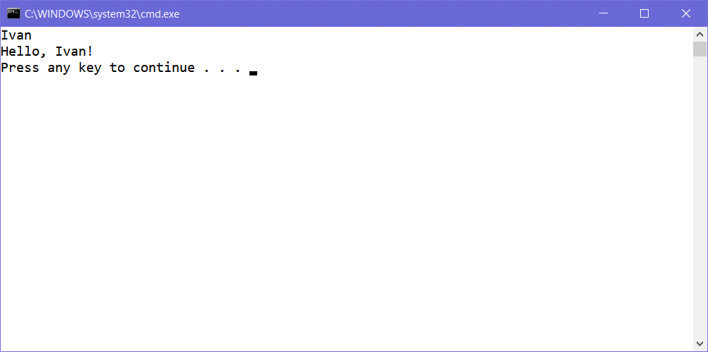
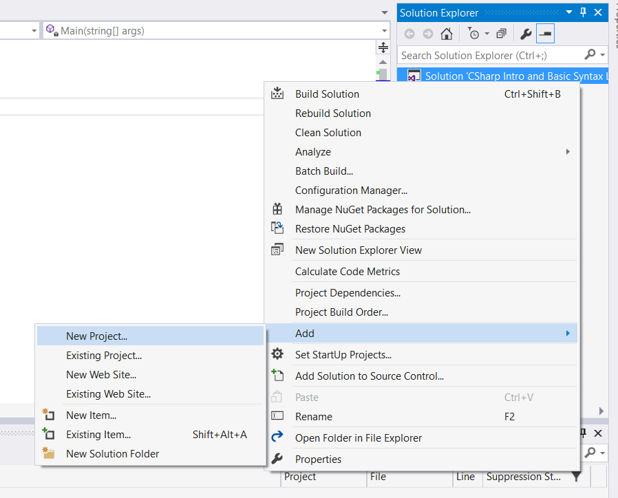
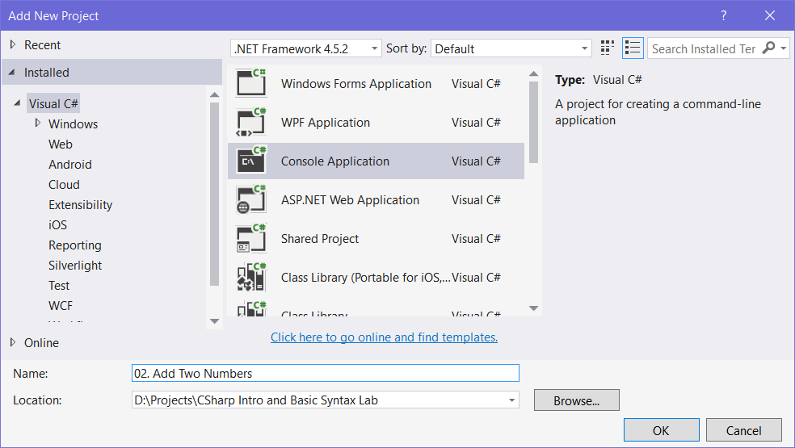

Lab: C\# Intro and Basic Syntax
===============================

Problems for exercises and homework for the ["Programming Fundamentals
Extended" course @
SoftUni](https://softuni.bg/courses/programming-fundamentals).

Greeting
--------

Write a program, which **greets** the user by their **name**, which it
**reads** from the **console**.

### Create a New C\# Project, using Visual Studio

Open **Visual Studio** and create a new project by going into **\[File
New Project\]**:

{width="5.111907261592301in"
height="0.8519838145231846in"}

After that, the project creation window will open.

Select **Visual C\#**, then **Console Application** and name it
appropriately:

{width="4.643974190726159in"
height="2.619048556430446in"}

### Write the Program Logic

A new file opens in the editor, which looks like this:

{width="3.759803149606299in"
height="2.515301837270341in"}

Let's write the program logic. We want to **read** a name and then
**print** that name with some additional text on the **console**. To
accomplish this, we'll use **Console.ReadLine()** and
**Console.WriteLine()**:

{width="4.845387139107611in"
height="2.7878969816272967in"}

### Test the Program

After we wrote the program logic, we can **start** our program, using
**\[Ctrl+F5\]**:

{width="7.139483814523184in"
height="2.8441622922134733in"}

Let's **type in** a name and see if it works:

{width="3.2276531058617675in"
height="1.190475721784777in"}

If you followed all the steps correctly, you should be greeted by your
program! Submit the code in **Judge** and test if it works correctly.

### Examples

  **Input**   **Output**
  ----------- ---------------
  Pesho       Hello, Pesho!
  Ivan        Hello, Ivan!
  Merry       Hello, Merry!

Add Two Numbers
---------------

Write a program, which **reads 2 whole numbers** and **adds** them
together. Then, print them in the following format:

-   "**a + b = sum**"

### Create a New C\# Project Inside the Solution

In **Visual Studio**, create a new project in our **current solution**
by **right clicking** the **solution** in the **Solution Explorer** and
navigating to **\[Add New Project...**\]:

{width="5.120226377952756in"
height="4.128075240594925in"}

After that, name it appropriately and hit **\[OK\]**:

{width="5.008978565179352in"
height="2.8249004811898515in"}

### Change the Startup Project

Now that you've created a new project inside the solution, you need to
**set** **the startup project to the currently selected project**,
otherwise whenever you hit **\[Ctrl+F5\]**, the **previous problem**
will start. So **right click** the **solution** and hit "**Set Startup
Projects"**:

  ------------------------------------------------------------------- -- -----------------------------------------------------------------------------------
  {width="2.43005905511811in" height="2.84in"}      {width="4.029761592300963in" height="2.8433923884514436in"}
  ------------------------------------------------------------------- -- -----------------------------------------------------------------------------------

Now we're ready to write our logic.

### Examples

+-----------+------------+
| **Input** | **Output** |
+===========+============+
| 2         | 2 + 5 = 7  |
|           |            |
| 5         |            |
+-----------+------------+
| 1         | 1 + 3 = 4  |
|           |            |
| 3         |            |
+-----------+------------+
| -3        | -3 + 5 = 2 |
|           |            |
| 5         |            |
+-----------+------------+

Employee Data
-------------

Write a program to read **data** about an **employee** and print it on
the console with the appropriate formatting. The order the input comes
in is as such:

-   Name -- **no** formatting

-   Age -- **no** formatting

-   Employee ID -- **8-digit padding** (employee id 356 is 00000356)

-   Monthly Salary -- formatted to **2 decimal places** (2345.56789
    becomes 2345.56)

### Examples

+-----------+-----------------------+
| **Input** | **Output**            |
+===========+=======================+
| Ivan      | Name: Ivan            |
|           |                       |
| 24        | Age: 24               |
|           |                       |
| 1192      | Employee ID: 00001192 |
|           |                       |
| 1500.353  | Salary: 1500.35       |
+-----------+-----------------------+
| Peter     | Name: Peter           |
|           |                       |
| 30        | Age: 30               |
|           |                       |
| 113236    | Employee ID: 00113236 |
|           |                       |
| 1738.1112 | Salary: 1738.11       |
+-----------+-----------------------+
| Naiden    | Name: Naiden          |
|           |                       |
| 27        | Age: 27               |
|           |                       |
| 1111222   | Employee ID: 01111222 |
|           |                       |
| 3560      | Salary: 3560.00       |
+-----------+-----------------------+

### Hints

-   You can use "**D**" and "**F**" to format numbers in C\#. You can
    read more about formatting strings
    [here](https://msdn.microsoft.com/en-us/library/dwhawy9k(v=vs.110).aspx).
