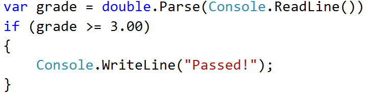
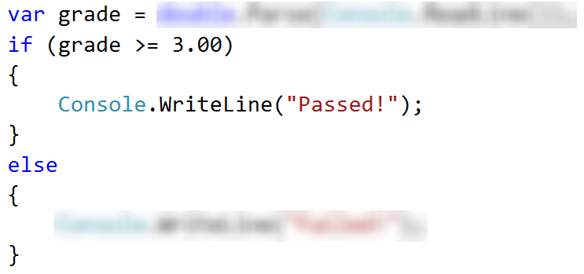
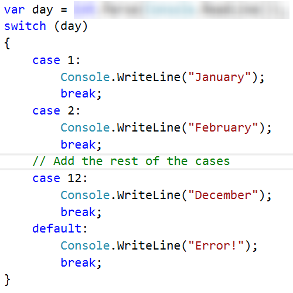
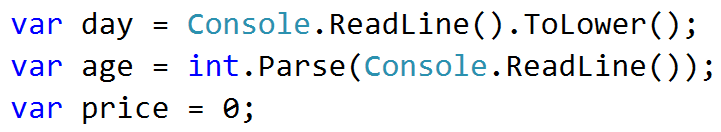
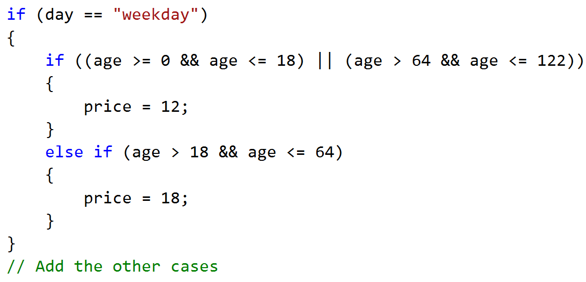
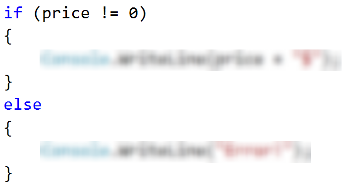
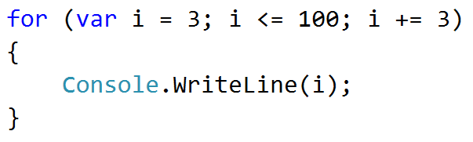
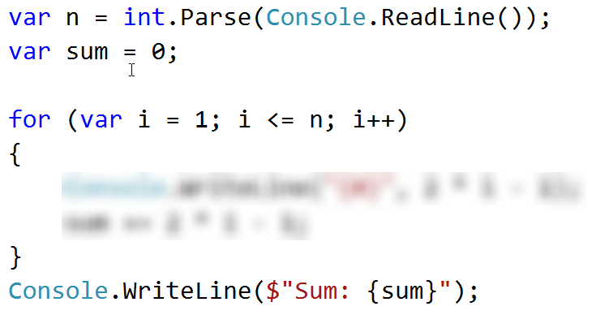

Lab: Conditional Statements and Loops
=====================================

Problems for exercises and homework for the [\"Programming Fundamentals
Extended\" course @
SoftUni](https://softuni.bg/courses/programming-fundamentals).

You can check your solutions here:
[https://judge.softuni.bg/Contests/563](https://judge.softuni.bg/Contests/563/CSharp-Conditional-Statements-and-Loops-Lab)

Problem 1. Passed
=================

Write a program, which takes as an input a **grade** and prints
"**Passed!**" if the grade is **equal or more than 3.00**.

### Input

The **input** comes as a single floating-point number.

### Output

The **output** is either \"**Passed!**\" if the grade is **equal or more
than 3.00**, otherwise you should print nothing.

### Examples

  **Input**   **Output**      **Input**   **Output**
  ----------- ------------ -- ----------- ---------------
  5.32        Passed!         2.34        *(no output)*

### Solution

We need to take as an input a floating-point number from the console. We
will use **double.Parse()** to convert **string** to **double**, which
we receive from **Console.ReadLine()**. After that we compare the grade
with **3.00** and prints the result **only** **if** the condition
returns **true**.

{width="4.061111111111111in"
height="1.133837489063867in"}

Problem 2. Passed or Failed
===========================

Modify the above program, so it will print \"**Failed**!\" if the grade
is **lower than 3.00**.

### Input

The **input** comes as a single double number.

### Output

The **output** is either \"**Passed**!\" if the grade is **more than
2.99**, otherwise you should print \"**Failed**!\".

### Examples

  **Input**   **Output**      **Input**   **Output**
  ----------- ------------ -- ----------- ------------
  5.32        Passed!         2.36        Failed!

### Solution

Again, we need to take **floating-point** number from the console. After
that print in the **else** statement the appropriate message.

{width="3.8833333333333333in"
height="1.8216732283464567in"}

Problem 3. Back in 30 Minutes
=============================

Every time Stamat tries to pay his bills he sees on the cash desk the
sign: **\"I will be back in 30 minutes\"**. One day Stamat was sick of
waiting and decided he needs a program, which **prints the time** after
**30** **minutes**. That way he won't have to wait on the desk and come
at the appropriate time. He gave the assignment to you, so you have to
do it.

### Input

The **input** will be on two lines. On the **first** **line**, you will
receive the **hours** and on the **second** you will receive the
**minutes**.

### Output

Print on the console the time after **30** minutes. The result should be
in format **hh:mm**. The **hours** have **one or two** **numbers** and
the **minutes** have always **two numbers (with leading zero)**.

### Constraints

-   The **hours** will be between **0 and 23**.

-   The **minutes** will be between **0 and 59**.

### Examples

<table>
<thead>
<tr class="header">
<th><strong>Input</strong></th>
<th><strong>Output</strong></th>
<th></th>
<th><strong>Input</strong></th>
<th><strong>Output</strong></th>
<th></th>
<th><strong>Input</strong></th>
<th><strong>Output</strong></th>
<th></th>
<th><strong>Input</strong></th>
<th><strong>Output</strong></th>
<th></th>
<th><strong>Input</strong></th>
<th><strong>Output</strong></th>
</tr>
</thead>
<tbody>
<tr class="odd">
<td>
1

46
</td>
<td>2:16</td>
<td></td>
<td>
0

01
</td>
<td>0:31</td>
<td></td>
<td>
23

59
</td>
<td>0:29</td>
<td></td>
<td>
11

08
</td>
<td>11:38</td>
<td></td>
<td>
11

32
</td>
<td>12:02</td>
</tr>
</tbody>
</table>

### Hints

-   Add 30 minutes to the initial minutes, which you receive from the
    console. If the minutes are more than 59 -- increase the hours with
    1 and decrease the minutes with 60. The same way check if the hours
    are more than 23. When you print check for leading zero.

Problem 4. Month Printer
========================

Write a program, which takes an **integer** from the console and prints
the corresponding **month**. If the number **is more than 12** or **less
than 1** print \"**Error!**\".

### Input

You will receive a **single** **integer** on a **single line**.

### Output

If the number is within the boundaries print the corresponding month,
otherwise print \"**Error!**\".

### Examples

  **Input**   **Output**      **Input**   **Output**
  ----------- ------------ -- ----------- ------------
  2           February        13          Error!

### Solution

{width="3.6951760717410322in"
height="3.687785433070866in"}

Problem 5. Foreign Languages
============================

Write a program, which prints the language, that a given country speaks.
You can receive only the following combinations: English **is spoken**
in England and USA; Spanish **is spoken** in Spain, Argentina and
Mexico; for the others**,** we should print \"unknown\".

### Input

You will receive a **single country name** on a **single line**.

### Output

**Print** the **language**, which the country **speaks**, or if it is
**unknown** for your program, print **\"unknown\"**.

### Examples

  **Input**   **Output**      **Input**   **Output**
  ----------- ------------ -- ----------- ------------
  USA         English         Germany     unknown

### Hint

Think how you can **merge** multiple cases, in order to **avoid**
writing more code than you need to.

Problem 6. Theatre Promotions
=============================

A theatre **is doing a ticket sale**, but they need a program **to**
calculate the price of a single ticket. If the given age does not fit
one of the categories**,** you should print \"Error!\". You can see the
prices i**n** the table below:

  **Day / Age**   **0 \<= age \<= 18**   **18 \< age \<= 64**   **64 \< age \<= 122**
  --------------- ---------------------- ---------------------- -----------------------
  **Weekday**     12\$                   18\$                   12\$
  **Weekend**     15\$                   20\$                   15\$
  **Holiday**     5\$                    12\$                   10\$

### Input

The input comes in **two lines**. On the **first** line, you will
receive the **type of day**. On the **second** -- the **age** of the
person.

### Output

Print the price of the ticket according to the table, or \"**Error!**\"
if the age is not in the table.

### Constraints

-   The age will be in the interval **\[-1000...1000\]**.

-   The type of day will **always be** **valid**.

### Examples

<table>
<thead>
<tr class="header">
<th><strong>Input</strong></th>
<th><strong>Output</strong></th>
<th></th>
<th><strong>Input</strong></th>
<th><strong>Output</strong></th>
<th></th>
<th><strong>Input</strong></th>
<th><strong>Output</strong></th>
<th></th>
<th><strong>Input</strong></th>
<th><strong>Output</strong></th>
</tr>
</thead>
<tbody>
<tr class="odd">
<td>
Weekday

42
</td>
<td>18$</td>
<td></td>
<td>
Holiday

-12
</td>
<td>Error!</td>
<td></td>
<td>
Holiday

15
</td>
<td>5$</td>
<td></td>
<td>
Weekend

122
</td>
<td>15$</td>
</tr>
</tbody>
</table>

### Solution

#### Step 1. Read the Input

We need to read **two** lines. **First** one will be the **type of
day**. We will convert it to **lower case** letters with the method
"**ToLower()**". After that, we will read the **age** of the person and
declare a **variable** -- **price**, which we will use to set the price
of the ticket.

{width="3.727777777777778in"
height="0.6811909448818898in"}

#### Step 2. Add if-else Statements for the Different Types of Day

For every **type of day**, we will need to add **different cases** to
check the **age** of the person and **set the price**. Some of the **age
groups** have **equal** **prices** for the **same type** of day. This
means we can use **logical operators** to **merge some of the
conditions**.

{width="5.129861111111111in"
height="2.4714446631671043in"}

Think **where** and **how** you can use **logical operators** for the
**other cases**.

#### Step 3. Print the result

We can check if the **price has a value** different, than the
**initial** one. It it does, that means we got a **valid combination of
day and age** and the price of the ticket is saved in the **price**
variable. If the **price** has a **value of 0**, then none of the cases
got hit, therefore we have to **print the error message**.

{width="3.0722222222222224in"
height="1.6734273840769904in"}

Problem 7. Divisible by 3
=========================

Write a program, which prints all the numbers from **1 to 100**, which
are **divisible by 3**. You have to use a single **for** loop. The
program should not receive input.

### Solution

{width="3.0in" height="0.9020242782152231in"}

Problem 8. Sum of Odd Numbers
=============================

Write a program that prints the next **n** **odd numbers** (starting
from 1) and on the **last row** prints the **sum of them**.

### Input

On the first line, you will receive a number -- **n**. This number shows
how many **odd numbers** you should print.

### Output

Print the next **n** odd numbers, starting from **1**, separated by
**new lines**. On the last line, print the **sum** of these numbers.

### Constraints

-   **n** will be in the interval **\[1...100\]**

### Examples

+-----------+------------+--+-----------+------------+
| **Input** | **Output** |  | **Input** | **Output** |
+===========+============+==+===========+============+
| 5         | 1          |  | 3         | 1          |
|           |            |  |           |            |
|           | 3          |  |           | 3          |
|           |            |  |           |            |
|           | 5          |  |           | 5          |
|           |            |  |           |            |
|           | 7          |  |           | Sum: 9     |
|           |            |  |           |            |
|           | 9          |  |           |            |
|           |            |  |           |            |
|           | Sum: 25    |  |           |            |
+-----------+------------+--+-----------+------------+

### Solution

{width="3.716666666666667in"
height="1.961573709536308in"}

Problem 9. Multiplication Table
===============================

You will receive an **integer** as an input from the console. Print the
**10 times table** for this integer. See the examples below for more
information.

### Output

Print every row of the table in the following format:

{theInteger} X {times} = {product}

### Constraints

-   The integer will be in the interval **\[1...100\]**

### Examples

+-----------+-------------+--+-----------+-------------+
| **Input** | **Output**  |  | **Input** | **Output**  |
+===========+=============+==+===========+=============+
| 5         | 5 X 1 = 5   |  | 2         | 2 X 1 = 2   |
|           |             |  |           |             |
|           | 5 X 2 = 10  |  |           | 2 X 2 = 4   |
|           |             |  |           |             |
|           | 5 X 3 = 15  |  |           | 2 X 3 = 6   |
|           |             |  |           |             |
|           | 5 X 4 = 20  |  |           | 2 X 4 = 8   |
|           |             |  |           |             |
|           | 5 X 5 = 25  |  |           | 2 X 5 = 10  |
|           |             |  |           |             |
|           | 5 X 6 = 30  |  |           | 2 X 6 = 12  |
|           |             |  |           |             |
|           | 5 X 7 = 35  |  |           | 2 X 7 = 14  |
|           |             |  |           |             |
|           | 5 X 8 = 40  |  |           | 2 X 8 = 16  |
|           |             |  |           |             |
|           | 5 X 9 = 45  |  |           | 2 X 9 = 18  |
|           |             |  |           |             |
|           | 5 X 10 = 50 |  |           | 2 X 10 = 20 |
+-----------+-------------+--+-----------+-------------+

Problem 10. Multiplication Table 2.0
====================================

Rewrite you program so it can receive the **multiplier from the
console**. Print the **table from the given multiplier to 10**. If the
given multiplier is **more than 10** - print only one row with the
**integer**, the given **multiplier** and the **product**. See the
examples below for more information.

### Output

Print every row of the table in the following format:

{theInteger} X {times} = {product}

### Constraints

-   The integer will be in the interval **\[1...100\]**

### Examples

+-----------+-------------+--+-----------+-------------+--+-----------+-------------+
| **Input** | **Output**  |  | **Input** | **Output**  |  | **Input** | **Output**  |
+===========+=============+==+===========+=============+==+===========+=============+
| 5         | 5 X 1 = 5   |  | 2         | 2 X 5 = 10  |  | 2         | 2 X 14 = 28 |
|           |             |  |           |             |  |           |             |
| 1         | 5 X 2 = 10  |  | 5         | 2 X 6 = 12  |  | 14        |             |
|           |             |  |           |             |  |           |             |
|           | 5 X 3 = 15  |  |           | 2 X 7 = 14  |  |           |             |
|           |             |  |           |             |  |           |             |
|           | 5 X 4 = 20  |  |           | 2 X 8 = 16  |  |           |             |
|           |             |  |           |             |  |           |             |
|           | 5 X 5 = 25  |  |           | 2 X 9 = 18  |  |           |             |
|           |             |  |           |             |  |           |             |
|           | 5 X 6 = 30  |  |           | 2 X 10 = 20 |  |           |             |
|           |             |  |           |             |  |           |             |
|           | 5 X 7 = 35  |  |           |             |  |           |             |
|           |             |  |           |             |  |           |             |
|           | 5 X 8 = 40  |  |           |             |  |           |             |
|           |             |  |           |             |  |           |             |
|           | 5 X 9 = 45  |  |           |             |  |           |             |
|           |             |  |           |             |  |           |             |
|           | 5 X 10 = 50 |  |           |             |  |           |             |
+-----------+-------------+--+-----------+-------------+--+-----------+-------------+

Problem 11. Odd Number
======================

Take as an input an **odd number** and print the **absolute value** of
it. If the number is even, print **\"Please write an odd number.\"** and
continue reading numbers.

### Input

You will receive even integers until you receive an odd number.

### Output

Print **\"Please write an odd number.\"** if the received number is
even. If the number is odd -- **\"The number is: {number}\"**.

### Constraints

-   You will receive maximum 10 numbers

-   The numbers will be in the interval **\[-1000...1000\]**

### Examples

+-----------+-----------------------------+--+-----------+------------------+
| **Input** | **Output**                  |  | **Input** | **Output**       |
+===========+=============================+==+===========+==================+
| 2         | Please write an odd number. |  | -7        | The number is: 7 |
|           |                             |  |           |                  |
| 4         | Please write an odd number. |  |           |                  |
|           |                             |  |           |                  |
| 5         | The number is: 5            |  |           |                  |
+-----------+-----------------------------+--+-----------+------------------+

Problem 12. Number checker
==========================

Write a program, which reads an input from the console and prints **\"It
is a number.\"** if it's a **number**. If it is **not** write
**\"Invalid input!\"**

### Input

You will receive a single line of input.

### Output

Print one of the messages, but without throwing an exception.

### Examples

  **Input**   **Output**           **Input**   **Output**
  ----------- ----------------- -- ----------- ----------------
  5           It is a number.      five        Invalid input!

### Hints

You can use a **try-catch** block to prevent throwing an exception.
