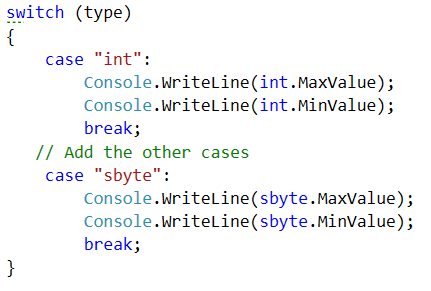
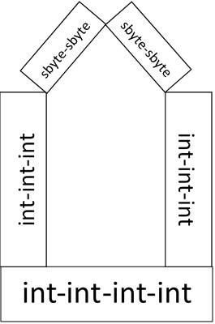

More Exercises: Data Types and Variables
========================================

Problems for exercises and homework for the ["Programming Fundamentals"
course @ SoftUni](https://softuni.bg/courses/programming-fundamentals).

Check your solutions here: <https://judge.softuni.bg/Contests/570/>

Numeral Types and Type Conversion
=================================

Type Boundaries
---------------

Write a program which receives a **number type** (**as a string**) and
prints the **maximum** and the **minimum value** of that type. You can
receive one of the following types: "**int**", "**uint**", "**long**",
"**byte**" and "**sbyte**".

*Note: For this example, the Java's **byte** corresponds to the C\#'s
**sbyte**.*

### Examples

+-----------+-------------+--+-------------+--------------+
| **Input** | **Output**  |  | > **Input** | > **Output** |
+===========+=============+==+=============+==============+
| int       | 2147483647  |  | > byte      | > 255        |
|           |             |  |             | >            |
|           | -2147483648 |  |             | > 0          |
+-----------+-------------+--+-------------+--------------+

### Hints

-   Follow the idea in the code below:\
    {width="3.456022528433946in"
    height="2.3334175415573055in"}

<!-- -->

-   For Java: you can import **com.sun.jmx.snmp.SnmpUnsignedInt** for
    printing the **uint** values.

Number Checker
--------------

Write a program, which checks if a **number** is an **integer** or a
**floating-point** number and **prints** either "**floating-point**" or
"**integer**", depending on the case. You will **only** receive
**numbers**.

### Constraints

-   **Integer numbers** will be in the interval
    **\[-9223372036854775808...9223372036854775807\]**

### Examples

+-----------+------------+--+-------------+------------------+
| **Input** | **Output** |  | > **Input** | > **Output**     |
+===========+============+==+=============+==================+
| 3         | integer    |  | > 2.31      | > floating-point |
+-----------+------------+--+-------------+------------------+

Water Overflow
--------------

You have a **water** **tank** with capacity of **255 liters**. On the
next **n** lines, you will receive **liters of water**, which you have
to **pour** in your **tank**. If the **capacity** is **not enough**,
print "**Insufficient capacity!**" and **continue reading** the next
line. On the last line, print the **liters** in the **tank**.

### Input

The **input** will be on two lines:

-   On the **first** **line**, you will receive **n** -- the number of
    **lines**, which will **follow**

-   On the next **n lines** -- you receive **quantities** of water,
    which you have to **pour** in the **tank**

### Output

Every time you do not have **enough** **capacity** in the tank to pour
the given liters, **print**:

Insufficient capacity!

On the last line, **print** only the **liters** in the **tank**.

### Constraints

-   **n** will be in the interval **\[1...20\]**

-   **liters** will be in the interval **\[1...1000\]**

### Examples

+-----------+------------------------+--+-----------+------------------------+
| **Input** | **Output**             |  | **Input** | **Output**             |
+===========+========================+==+===========+========================+
| **5**     | Insufficient capacity! |  | **1**     | Insufficient capacity! |
|           |                        |  |           |                        |
| 20        | 240                    |  | 1000      | 0                      |
|           |                        |  |           |                        |
| 100       |                        |  |           |                        |
|           |                        |  |           |                        |
| 100       |                        |  |           |                        |
|           |                        |  |           |                        |
| 100       |                        |  |           |                        |
|           |                        |  |           |                        |
| 20        |                        |  |           |                        |
+-----------+------------------------+--+-----------+------------------------+

+-----------+------------+--+-----------+------------------------+
| **Input** | **Output** |  | **Input** | **Output**             |
+===========+============+==+===========+========================+
| **7**     | 105        |  | **4**     | Insufficient capacity! |
|           |            |  |           |                        |
| 10        |            |  | 250       | Insufficient capacity! |
|           |            |  |           |                        |
| 20        |            |  | 10        | Insufficient capacity! |
|           |            |  |           |                        |
| 30        |            |  | 20        | 250                    |
|           |            |  |           |                        |
| 10        |            |  | 40        |                        |
|           |            |  |           |                        |
| 5         |            |  |           |                        |
|           |            |  |           |                        |
| 10        |            |  |           |                        |
|           |            |  |           |                        |
| 20        |            |  |           |                        |
+-----------+------------+--+-----------+------------------------+

Tourist Information
-------------------

Write a program, which helps tourists **convert** **imperial** **units**
of measurement to **metric units**. Your program needs to support the
**following conversions**: **miles** to **kilometers**, **inches** to
**centimeters**, **feet** to **centimeters**, **yards** to **meters**
and **gallons** to **liters**. The **conversion** **table** looks like
this:

  **If you receive:**   **Multiply by:**   **To get:**
  --------------------- ------------------ -------------
  miles                 1.6                kilometers
  inches                2.54               centimeters
  feet                  30                 centimeters
  yards                 0.91               meters
  gallons               3.8                liters

### Input

The **input** will be on **two lines**:

-   On the **first** **line**, you will receive the **imperial**
    **unit**, which you need to convert

-   On the **second line**, you will receive the **value**, which you
    need to **convert**

### Output

Print the answer in the following format:

{initial value} {initial imperial unit} = {converted value} {metric
unit}

**Format** the **converted** **value** to the **2^nd^ decimal place**.

Print the **initial** **value** as it is **given**.

### Constraints

-   The **value**, which needs to be **converted** will be in the
    interval **\[±1.5×10-45... ±3.4×1038\].**

### Examples

+-------------+-------------+-------------+-------------+-------------+
| **Input**   | **Output**  |             | **Input**   | **Output**  |
+=============+=============+=============+=============+=============+
| miles       | 12.313      |             | gallons     | 12 gallons  |
|             | miles =     |             |             | = 45.60     |
| 12.313      | 19.70       |             | 12          | liters      |
|             | kilometers  |             |             |             |
+-------------+-------------+-------------+-------------+-------------+

Weather Forecast
----------------

You invented a new groundbreaking technology to **predict the weather**,
using **numerology**. You will be given a **number** from the
**console** and with it, you can predict **tomorrow's weather**. Your
system works in the following way:

-   If the number can fit in **sbyte** (for C\#) or **byte** (for Java)
    -- the weather will be­**­ "Sunny**"

-   If the numbers can fit in **int** -- the weather will be
    "**Cloudy**"

-   If the number fits in **long** -- the weather will be "**Windy**"

-   If it is **floating point** number -- the weather will be
    "**Rainy**"

**Always** **print** the **smallest** **possible** option.

### Input

-   On the first line, you will receive a **number**.

### Output

**Print** your prediction for the **weather**.

### Constraints

-   Any whole **numbers** will be in the interval
    **\[-9223372036854775808...9223372036854775807\]**.

### Examples

  **Input**   **Output**      **Input**   **Output**
  ----------- ------------ -- ----------- ------------
  120         Sunny           -1.31       Rainy

 Catch the Thief
----------------

In the future, a very dangerous thief has escaped. Your mission is to
catch him, but the only thing you know is the **numeral type**, which is
his **id**.

On the **first line,** you will receive the **numeral type** of
**thief's id**. On the **second line,** you will receive **n** -- the
number of ids you will receive. The person who has an id **closest** to
the **maximum value** of the given numeral type **without**
**overflowing it** is the **thief's id**.

### Input

-   On the first line, you will receive the thief's id **numeral type**.
    The type will **always** be one of the following: "**sbyte**",
    "**int**" or "**long**".

-   On the second line, you will receive **n** -- the **count** of
    **ids** you are going to receive. **Each** will be on a **new**
    **line**.

### Output

Print the **id** of the **thief**.

### Constraints

-   The type will **always** be one of the following: "**sbyte**",
    "**int**" or "**long**"

-   The **sbyte** interval will be **\[-128...127\] **

-   The number **n** will be in the interval **\[1...20\]**.

-   The **ids** will be integers in the interval
    **\[-9223372036854775808...9223372036854775807\]**

### Examples

+-----------+------------+--+-----------+------------+
| **Input** | **Output** |  | **Input** | **Output** |
+===========+============+==+===========+============+
| **sbyte** | 126        |  | **long**  | 6          |
|           |            |  |           |            |
| **5**     |            |  | **4**     |            |
|           |            |  |           |            |
| 1         |            |  | 1         |            |
|           |            |  |           |            |
| 126       |            |  | 6         |            |
|           |            |  |           |            |
| 128       |            |  | 3         |            |
|           |            |  |           |            |
| 1000      |            |  | 2         |            |
|           |            |  |           |            |
| 1241      |            |  |           |            |
+-----------+------------+--+-----------+------------+

\* Sentence the Thief
---------------------

In the last task, you caught the thief, but in the future, everyone is
multitasking and you need to **calculate** his **sentence** as well.

His sentence equals to the **times** his **id** **overflows** the
numerical type **sbyte**. Round the years to the **nearest larger
integer value** (5.01 6).

Example: If the thief's id is **5251**, that means the sentence will
equal: **5251 / 127 = 41.35** years. Rounded to the **next** **integer**
**value**, the final sentence would be **42 years**.

Notice that the **id** might be **negative** and can **overflow** the
**negative** boundary of **sbyte**.

### Input

-   On the first line, you will receive the thief's id **numeral type**.
    The type will **always** be one of the following: "**sbyte**",
    "**int**" or "**long**".

-   On the second line, you will receive **n** -- the **count** of
    **ids** you are going to receive. **Each** will be on a **new**
    **line**.

### Output

If the **years** of the sentence are more than **1** print them in the
following format:

Prisoner with id {id of the thief} is sentenced to {duration of the
sentence} years

Otherwise use this format:

Prisoner with id {id of the thief} is sentenced to {duration of the
sentence} year

### Constraints

-   The type will **always** be one of the following: "**sbyte**",
    "**int**" or "**long**"

-   We will use for **sbyte** the interval **\[-128...127\] **

-   **n** will be in the interval **\[1...20\]**

-   The **ids** will be integers in the interval
    **\[-9223372036854775808...9223372036854775807\] **

-   The **id** will **never** be **0**.

### Examples

+-----------------------+-----------------------+-----------------------+
| **Input**             | **Output**            | **Comments**          |
+=======================+=======================+=======================+
| **int**               | Prisoner with id      | The biggest int,      |
|                       | -2561 is sentenced to | which is the          |
| **4**                 | 21 years              | **closest** to        |
|                       |                       | **long's** max value  |
| -2561                 |                       | is **-2561**, and     |
|                       |                       | this is the thief's   |
| -3412                 |                       | id. Their sentence    |
|                       |                       | will equal to:        |
| -5999                 |                       |                       |
|                       |                       | **-2561 / -128 =      |
| -2641                 |                       | 20.01**. After        |
|                       |                       | rounding that equals  |
|                       |                       | **21 years**.         |
+-----------------------+-----------------------+-----------------------+

+-------------+-------------+-------------+-------------+-------------+
| **Input**   | **Output**  |             | **Input**   | **Output**  |
+=============+=============+=============+=============+=============+
| **sbyte**   | Prisoner    |             | **long**    | Prisoner    |
|             | with id 126 |             |             | with id 100 |
| **5**       | is          |             | **5**       | is          |
|             | sentenced   |             |             | sentenced   |
| 1           | to 1 year   |             | 1           | to 1 year   |
|             |             |             |             |             |
| 126         |             |             | 56          |             |
|             |             |             |             |             |
| 128         |             |             | 100         |             |
|             |             |             |             |             |
| 1000        |             |             | -42         |             |
|             |             |             |             |             |
| 1241        |             |             | -2411       |             |
+-------------+-------------+-------------+-------------+-------------+

House Builder
-------------

You are a house builder and you need to buy the materials for one of
your clients. This is quite a special house and it needs special
materials. The house needs **4 sbyte** variables and **10 int**
variables. A rough design of the house can be seen below:

{width="2.2083333333333335in"
height="3.3333333333333335in"}

You will receive **two** numbers from the console, which will be the
prices of the **materials**. **One** will be an **integer** and the
**other** will be **sbyte**, but you do not know the order in which they
will be given. The **int** number will be the **price** of the **int
materials** and the **sbyte** number will be the **price** of the
**sbyte materials**.

Calculate the **total** **price of the materials** and print them on the
console.

### Input

-   You will receive **two lines** of input, containing different
    **numbers** from **different numeral types**.

### Output

Print the **total** price for the **materials**.

### Constraints

-   The **sbyte** **price** will be integers in the interval
    **\[0...127\]**

-   The **int** **price** will be integer in the interval
    **\[128...2147483647\] **

### Examples

+-----------+------------+--+------------+-------------+
| **Input** | **Output** |  | **Input**  | **Output**  |
+===========+============+==+============+=============+
| 100       | 20400      |  | 2147483647 | 21474836978 |
|           |            |  |            |             |
| 2000      |            |  | 127        |             |
+-----------+------------+--+------------+-------------+

Text and Other Types
====================

Make a Word
-----------

Write a program, which combines **n** characters and prints on a single
line the **combinations** of these characters.

### Input

-   On the **first** **line**, you will receive **n** -- the number of
    **lines**, which will **follow**

-   On the next **n lines** -- you will receive **lower** and
    **uppercase** characters from the **English** alphabet

### Output

**Print** the **word** in the format:

The word is: {word}

### Constraints

-   **n** will be in the interval **\[1...20\]**.

-   The **characters** will always be either **uppercase** or
    **lowercase** letters from the **English alphabet**

-   You will receive **one** **letter** per **line**, **without**
    **empty** spaces.

### Examples

+-----------+--------------------+--+-----------+---------------------------+
| **Input** | **Output**         |  | **Input** | **Output**                |
+===========+====================+==+===========+===========================+
| **5**     | The word is: AbCdE |  | **12**    | The word is: SoftUniRulzz |
|           |                    |  |           |                           |
| A         |                    |  | S         |                           |
|           |                    |  |           |                           |
| b         |                    |  | o         |                           |
|           |                    |  |           |                           |
| C         |                    |  | f         |                           |
|           |                    |  |           |                           |
| d         |                    |  | t         |                           |
|           |                    |  |           |                           |
| E         |                    |  | U         |                           |
|           |                    |  |           |                           |
|           |                    |  | n         |                           |
|           |                    |  |           |                           |
|           |                    |  | i         |                           |
|           |                    |  |           |                           |
|           |                    |  | R         |                           |
|           |                    |  |           |                           |
|           |                    |  | u         |                           |
|           |                    |  |           |                           |
|           |                    |  | l         |                           |
|           |                    |  |           |                           |
|           |                    |  | z         |                           |
|           |                    |  |           |                           |
|           |                    |  | z         |                           |
+-----------+--------------------+--+-----------+---------------------------+

Sum of Chars
------------

Write a program, which sums the ASCII codes of **n** characters and
prints the **sum** on the console.

### Input

-   On the **first** **line**, you will receive **n** -- the number of
    **lines**, which will **follow**

-   On the next **n lines** -- you will receive letters from the
    **Latin** alphabet

### Output

Print the **total** **sum** in the following format:

The sum equals: {totalSum}

### Constraints

-   **n** will be in the interval **\[1...20\]**.

-   The **characters** will always be either **upper** or **lower**-case
    letters from the **English alphabet**

-   You will always receive **one** **letter** per **line**

### Examples

+-----------+---------------------+--+-----------+----------------------+
| **Input** | **Output**          |  | **Input** | **Output**           |
+===========+=====================+==+===========+======================+
| **5**     | The sum equals: 399 |  | **12**    | The sum equals: 1263 |
|           |                     |  |           |                      |
| A         |                     |  | S         |                      |
|           |                     |  |           |                      |
| b         |                     |  | o         |                      |
|           |                     |  |           |                      |
| C         |                     |  | f         |                      |
|           |                     |  |           |                      |
| d         |                     |  | t         |                      |
|           |                     |  |           |                      |
| E         |                     |  | U         |                      |
|           |                     |  |           |                      |
|           |                     |  | n         |                      |
|           |                     |  |           |                      |
|           |                     |  | i         |                      |
|           |                     |  |           |                      |
|           |                     |  | R         |                      |
|           |                     |  |           |                      |
|           |                     |  | u         |                      |
|           |                     |  |           |                      |
|           |                     |  | l         |                      |
|           |                     |  |           |                      |
|           |                     |  | z         |                      |
|           |                     |  |           |                      |
|           |                     |  | z         |                      |
+-----------+---------------------+--+-----------+----------------------+

String Concatenation
--------------------

Write a program, which reads **three** lines from the console. On the
**first** line, there will be **delimiter** (**char**) -- you have to
**separate** the **strings** by this delimiter. The **second** line will
be either "**even**" or "**odd**". If you receive "**odd**", you have to
take every odd string and vice versa if you receive "**even**". The last
line will be the number of lines -- **n** which you will receive. The
**first** iteration of the **loop** starts from **1**.

Print the newly created string on a **new line**.

### Constraints

-   **n** will be in the interval **\[1...20\]**.

-   The strings will be at most **30** characters long

### Examples

+-----------+------------+--+-----------+-------------+
| **Input** | **Output** |  | **Input** | **Output**  |
+===========+============+==+===========+=============+
| \-        | Two-Four   |  | **&**     | Pesho&Maria |
|           |            |  |           |             |
| **even**  |            |  | **odd**   |             |
|           |            |  |           |             |
| **5**     |            |  | **4**     |             |
|           |            |  |           |             |
| One       |            |  | Pesho     |             |
|           |            |  |           |             |
| Two       |            |  | Stefan    |             |
|           |            |  |           |             |
| Three     |            |  | Maria     |             |
|           |            |  |           |             |
| Four      |            |  | Gergana   |             |
|           |            |  |           |             |
| Five      |            |  |           |             |
+-----------+------------+--+-----------+-------------+

### Hints

-   In C\#, you can use
    [String.Remove(...)](https://msdn.microsoft.com/en-us/library/d8d7z2kk(v=vs.110).aspx)
    to remove the last delimiter.

-   In Java, you can use
    [String.substring(...)](https://www.javatpoint.com/java-string-substring)
    for the same operation.

Beer Kegs
---------

Write a program, which calculates the volume of **n** beer kegs. You
will receive in total **3 \* n** lines. **Each three lines** will hold
**information** for a **single** keg. First up is the **model** of the
keg, after that is the **radius** of the keg, and lastly is the
**height** of the keg.

Calculate the volume using the following formula: **π \* r\^2 \* h**.

At the end, print the **model** of the **biggest** keg.

### Input

You will receive **3 \* n** lines. Each group of lines will be on a new
line:

-   First -- **model** -- **string**.

-   Second --**radius** -- **floating-point** number

-   Third -- **height** -- **integer** number

### Output

Print the **model** of the **biggest** keg.

### Constraints

-   **n** will be in the interval **\[1...10\]**

-   The **radius** will be a **floating-point number** in the interval
    **\[1...3.402823E+38\]**

-   The **height** will be an **integer** in the interval
    **\[1...2147483647\]**

### Examples

+-----------+------------+--+-------------+------------+
| **Input** | **Output** |  | **Input**   | **Output** |
+===========+============+==+=============+============+
| **3**     | Keg 2      |  | **2**       | Bigger Keg |
|           |            |  |             |            |
| Keg 1     |            |  | Smaller Keg |            |
|           |            |  |             |            |
| 10        |            |  | 2.41        |            |
|           |            |  |             |            |
| 10        |            |  | 10          |            |
|           |            |  |             |            |
| Keg 2     |            |  | Bigger Keg  |            |
|           |            |  |             |            |
| 20        |            |  | 5.12        |            |
|           |            |  |             |            |
| 20        |            |  | 20          |            |
|           |            |  |             |            |
| Keg 3     |            |  |             |            |
|           |            |  |             |            |
| 10        |            |  |             |            |
|           |            |  |             |            |
| 30        |            |  |             |            |
+-----------+------------+--+-------------+------------+

Decrypting Messages
-------------------

You will receive a **key** (**integer**) and **n** characters afterward.
Add the key to each of the characters and append them to **message**. At
the end print the message, which you decrypted.

### Input

-   On the **first line**, you will receive the **key**

-   On the **second line**, you will receive **n** -- the number of
    **lines**, which will **follow**

-   On the next **n lines** -- you will receive **lower** and
    **uppercase** characters from the **Latin** alphabet

### Output

Print the **decrypted message**.

### Constraints

-   The **key** will be in the interval **\[0...20\]**

-   **n** will be in the interval **\[1...20\]**

-   The **characters** will always be **upper** or **lower**-case
    letters from the **English alphabet**

-   You will receive **one** **letter** per **line**

### Examples

+-----------+------------+--+-----------+------------+
| **Input** | **Output** |  | **Input** | **Output** |
+===========+============+==+===========+============+
| **3**     | SoftUni    |  | **1**     | Decrypt    |
|           |            |  |           |            |
| **7**     |            |  | **7**     |            |
|           |            |  |           |            |
| P         |            |  | C         |            |
|           |            |  |           |            |
| l         |            |  | d         |            |
|           |            |  |           |            |
| c         |            |  | b         |            |
|           |            |  |           |            |
| q         |            |  | q         |            |
|           |            |  |           |            |
| R         |            |  | x         |            |
|           |            |  |           |            |
| k         |            |  | o         |            |
|           |            |  |           |            |
| f         |            |  | s         |            |
+-----------+------------+--+-----------+------------+

\* Boat Simulator
-----------------

You have the task to write a simulator of a boat race. You will receive
**two** characters, which will **represent** the two **boats**.

After that you will receive **n** random strings. Each string on an
**odd** line represents the **speed** of the **first** **boat** and on
an **even** line -- the **speed** of the **second** **boat**. The boat
**moves** with the count of the tiles, equal to the **length** of the
given **string**. The **first** **boat**, which reaches **50** **tiles**
is the **winner**.

Our boats can be **upgradable**, which means when we receive the string
"**UPGRADE**" we **add** **3** to the **ASCII** codes of **both** of the
boats characters and after that, we use those **characters** to
represent the boats. If you receive "**UPGRADE**", you should **not**
**move** the boats.

If one of the boats **reaches 50** moves -- print the character of the
**winner** and **stop** taking any **input**. If **neither** of the
boats reach **50** moves -- print the boat, which reached the **most**
**moves**.

### Input

-   On the **first line**, you will receive the **character** of the
    **first** boat

-   On the **second line**, you will receive the **character** of the
    **second** boat

-   On the **third line,** you will receive **n** -- the number of
    lines, which will follow

### Output

Print only the **character representation** of the **winning boat**.

### Constraints

-   **n** will be in the interval **\[1...20\]**

-   The length of the stings will be between **\[1...100\]** characters

-   At the **end,** the boats will **not** have **equal** **moves**

### Examples

+-----------------------+-----------------------+-----------------------+
| **Input**             | **Output**            | **Comments**          |
+=======================+=======================+=======================+
| **!**                 | .                     | First boat '**!**',   |
|                       |                       | second boat '**(**'   |
| **(**                 |                       |                       |
|                       |                       | "**move**" **4        |
| **7**                 |                       | letters long**        |
|                       |                       | **first** **boat (odd |
| move                  |                       | row)** moves **4      |
|                       |                       | tiles**               |
| need for speed        |                       |                       |
|                       |                       | "**need for speed**"  |
| go                    |                       | 14 letters long       |
|                       |                       | **second boat (even   |
| fast and furious      |                       | row)** moves **14**   |
|                       |                       | tiles.                |
| UPGRADE               |                       |                       |
|                       |                       | "**go**" 2 letters    |
| stopTheBoat           |                       | long **first boat**   |
|                       |                       | **(odd row)** moves   |
| UPGRADE               |                       | **2** tiles.          |
|                       |                       |                       |
|                       |                       | "**fast and           |
|                       |                       | furious**" 16 letters |
|                       |                       | long **second boat**  |
|                       |                       | moves **16** tiles.   |
|                       |                       |                       |
|                       |                       | "**UPGRADE**" add 3   |
|                       |                       | to'**!**' upgrades to |
|                       |                       | **'\$'**, add 3 to    |
|                       |                       | **'('** upgrades to   |
|                       |                       | **'+'**.              |
|                       |                       |                       |
|                       |                       | "**stopTheBoat**" 11  |
|                       |                       | letters long **second |
|                       |                       | boat** moves **11**   |
|                       |                       | tiles.                |
|                       |                       |                       |
|                       |                       | "**UPGRADE**" add 3   |
|                       |                       | to '**\$**' upgrades  |
|                       |                       | to **'\''**, add 3 to |
|                       |                       | **'+'** upgrades to   |
|                       |                       | **'.'**.              |
|                       |                       |                       |
|                       |                       | **Winner -- second    |
|                       |                       | boat 41 moves \>**    |
|                       |                       | **6 moves** **second  |
|                       |                       | boat wins**           |
+-----------------------+-----------------------+-----------------------+

+-----------------------+-----------------------+-----------------------+
| **Input**             | **Output**            | **Comments**          |
+=======================+=======================+=======================+
| **E**                 | H                     | We start with an      |
|                       |                       | **UPGRADE** and the   |
| **A**                 |                       | first boat is         |
|                       |                       | represented by        |
| **10**                |                       | '**H**' and the       |
|                       |                       | second by '**D**'     |
| UPGRADE               |                       |                       |
|                       |                       | After the **5^th^**   |
| start                 |                       | line of input the     |
|                       |                       | **first** boat has    |
| driveWithTheSpeedOfLi |                       | made **50** moves and |
| ght                   |                       | you should **not**    |
|                       |                       | take as an input the  |
| go                    |                       | **other lines**.      |
|                       |                       |                       |
| driveWithTheSpeedOfLi |                       |                       |
| ghtOrFaster           |                       |                       |
|                       |                       |                       |
| Should not be read    |                       |                       |
|                       |                       |                       |
| a                     |                       |                       |
|                       |                       |                       |
| Should not be read    |                       |                       |
|                       |                       |                       |
| b                     |                       |                       |
|                       |                       |                       |
| Should not be read    |                       |                       |
+-----------------------+-----------------------+-----------------------+

\* Balanced Brackets
--------------------

You will receive **n** lines. On **those** **lines**, you will receive
**one** of the following:

-   Opening bracket -- "**(**",

-   Closing bracket -- "**)**" or

-   **Random string**

Your task is to find out if the **brackets** are **balanced**. That
means after every **closing** bracket should follow an **opening** one.
Nested parentheses are **not valid**, and if **two** **consecutive
opening brackets** exist, the expression should be marked as
**unbalanced**.

### Input

-   On the **first line**, you will receive **n** -- the number of
    lines, which will follow

-   On the next **n** lines, you will receive "**(**", "**)**" or
    **another** string

### Output

You have to print "**BALANCED**", if the parentheses are balanced and
"**UNBALANCED**" otherwise.

### Constraints

-   **n** will be in the interval **\[1...20\]**

-   The length of the stings will be between **\[1...100\]** characters

### Examples

+-----------+------------+--+-----------+------------+
| **Input** | **Output** |  | **Input** | **Output** |
+===========+============+==+===========+============+
| **8**     | BALANCED   |  | **6**     | UNBALANCED |
|           |            |  |           |            |
| (         |            |  | 12 \*     |            |
|           |            |  |           |            |
| 5 + 10    |            |  | )         |            |
|           |            |  |           |            |
| )         |            |  | 10 + 2 -  |            |
|           |            |  |           |            |
| \* 2 +    |            |  | (         |            |
|           |            |  |           |            |
| (         |            |  | 5 + 10    |            |
|           |            |  |           |            |
| 5         |            |  | )         |            |
|           |            |  |           |            |
| )         |            |  |           |            |
|           |            |  |           |            |
| -12       |            |  |           |            |
+-----------+------------+--+-----------+------------+
