Lab: Methods, Debugging and Troubleshooting Code
================================================

Problems for exercises and homework for the ["Programming Fundamentals"
course @ SoftUni](https://softuni.bg/courses/programming-fundamentals).

You can check your solutions here:
<https://judge.softuni.bg/Contests/304/Methods-and-Debugging-Lab>.

Declaring and Invoking Methods
==============================

Blank Receipt
-------------

Create a method that prints a blank cash receipt. The method should
invoke three other methods: one for printing the header, one for the
body and one for the footer of the receipt.

+-----------------------------------+-----------------------------------+
| The header should contain the     | CASH RECEIPT                      |
| following text:                   |                                   |
|                                   | \-\-\-\-\-\-\-\-\-\-\-\-\-\-\-\-\ |
|                                   | -\-\-\-\-\-\-\-\-\-\-\-\--        |
+===================================+===================================+
| The body should contain the       | Charged                           |
| following text:                   | to\_\_\_\_\_\_\_\_\_\_\_\_\_\_\_\ |
|                                   | _\_\_\_\_                         |
|                                   |                                   |
|                                   | Received                          |
|                                   | by\_\_\_\_\_\_\_\_\_\_\_\_\_\_\_\ |
|                                   | _\_\_\_                           |
+-----------------------------------+-----------------------------------+
| And the text for the footer:      | \-\-\-\-\-\-\-\-\-\-\-\-\-\-\-\-\ |
|                                   | -\-\-\-\-\-\-\-\-\-\-\-\--        |
|                                   |                                   |
|                                   | © SoftUni                         |
+-----------------------------------+-----------------------------------+

### Examples

+-------------------------------------------------------------+
| **Output**                                                  |
+=============================================================+
| CASH RECEIPT                                                |
|                                                             |
| \-\-\-\-\-\-\-\-\-\-\-\-\-\-\-\-\-\-\-\-\-\-\-\-\-\-\-\-\-- |
|                                                             |
| Charged to\_\_\_\_\_\_\_\_\_\_\_\_\_\_\_\_\_\_\_\_          |
|                                                             |
| Received by\_\_\_\_\_\_\_\_\_\_\_\_\_\_\_\_\_\_\_           |
|                                                             |
| \-\-\-\-\-\-\-\-\-\-\-\-\-\-\-\-\-\-\-\-\-\-\-\-\-\-\-\-\-- |
|                                                             |
| © SoftUni                                                   |
+-------------------------------------------------------------+

### Hints

1.  First create a method with no parameters for printing the header
    starting with **static void**. Give it a **meaningful name** like
    \"PrintReceiptHeader\" and write the code that it will execute:

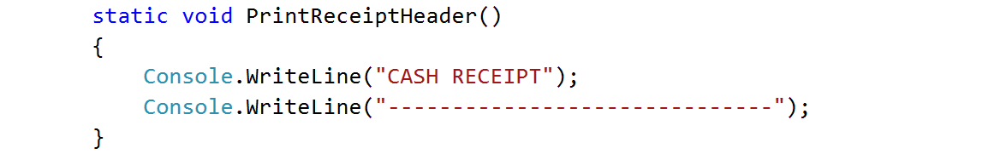{width="5.483829833770779in"
height="0.9520417760279966in"}

2.  Do the same for printing the receipt body and footer.

3.  Create a **method that will call all three methods** in the
    necessary order. Again, give it a **meaningful and descriptive
    name** like \"PrintReceipt\" and write the code:

    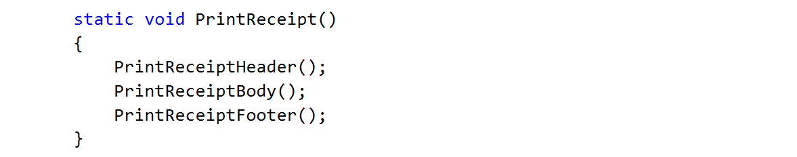{width="6.433721566054243in"
    height="1.2023818897637795in"}

4.  For printing **\"©\"** use Unicode **\"\\u00A9\"**

5.  **Call** (invoke) the PrintReceipt method from the main.

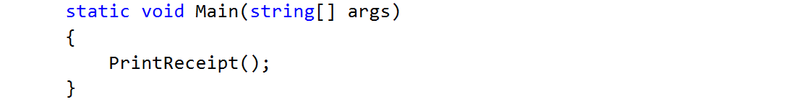{width="5.0098031496063in"
height="0.7075492125984252in"}

Sign of Integer Number
----------------------

Create a method that prints the sign of an integer number n.

### Examples

  **Input**   **Output**
  ----------- ----------------------------
  2           The number 2 is positive.
  -5          The number -5 is negative.
  0           The number 0 is zero.

### Hints

1.  Create a method with a **descriptive name** like \"PrintSign\" which
    should receive **one parameter** of type **int**.

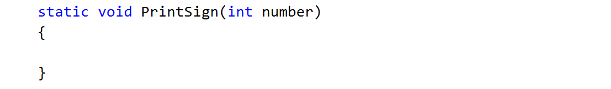{width="4.970506342957131in"
height="0.7102023184601924in"}

2.  Implement the body of the method by handling different cases:

    a.  If the number is greater than zero

    b.  If the number is less than zero

    c.  And if the number is equal to zero

3.  Call (invoke) the newly created method from the main.

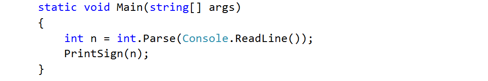{width="5.475489938757655in"
height="0.9098162729658793in"}

Printing Triangle
-----------------

Create a method for printing triangles as shown below:

### Examples

+-----------+------------+
| **Input** | **Output** |
+===========+============+
| 3         | 1          |
|           |            |
|           | 1 2        |
|           |            |
|           | 1 2 3      |
|           |            |
|           | 1 2        |
|           |            |
|           | 1          |
+-----------+------------+
| 4         | 1          |
|           |            |
|           | 1 2        |
|           |            |
|           | 1 2 3      |
|           |            |
|           | 1 2 3 4    |
|           |            |
|           | 1 2 3      |
|           |            |
|           | 1 2        |
|           |            |
|           | 1          |
+-----------+------------+

### Hints

1.  After you read the input

2.  Start by creating a method **for printing a single line** from a
    **given start** to a **given end**. Choose a **meaningful name** for
    it, describing its purpose:

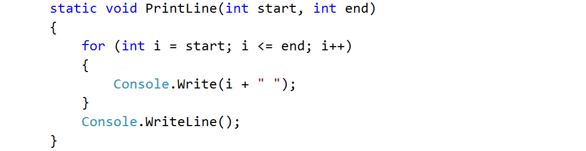{width="5.3805555555555555in"
height="1.3485608048993876in"}

3.  Think how you can use it to solve the problem

4.  After you spent some time thinking, you should have come to the
    conclusion that you will need two loops

5.  In the first loop you can print the first half of the triangle
    without the middle line:

> 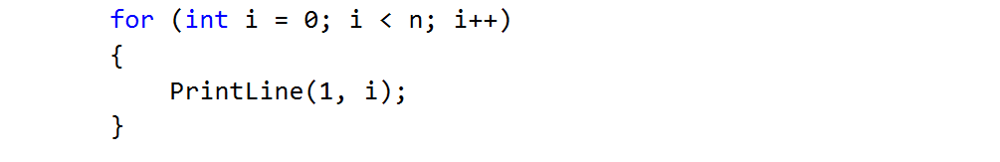{width="4.930555555555555in"
> height="0.8513702974628171in"}

6.  Next, print the middle line:

{width="4.642856517935258in"
height="0.34317366579177605in"}

7.  Lastly, print the rest of the triangle:

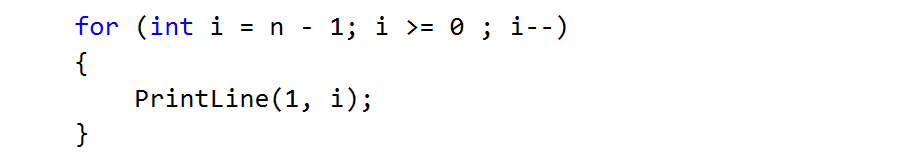{width="4.974895013123359in"
height="0.7833333333333333in"}

Draw a Filled Square
--------------------

Draw at the console a filled square of size n like in the example:

### Examples

+-----------+-----------------+
| **Input** | **Output**      |
+===========+=================+
| 4         | \-\-\-\-\-\-\-- |
|           |                 |
|           | -\\/\\/\\/-     |
|           |                 |
|           | -\\/\\/\\/-     |
|           |                 |
|           | \-\-\-\-\-\-\-- |
+-----------+-----------------+

### Hints

1.  Read the input

2.  Create a method which will print the top and the bottom rows (they
    are the same). Don't forget to give it a descriptive name and to
    give it as a parameter some length

    a.  Instead of loop you can use the \"new string\" command which
        creates a new string consisting of a character repeated some
        given times:

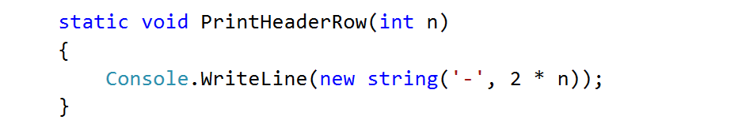{width="4.7810367454068246in"
height="0.8201388888888889in"}

3.  Create the method which will print the middle rows. Well, of course,
    you should probably name it \"PrintMiddleRow\"

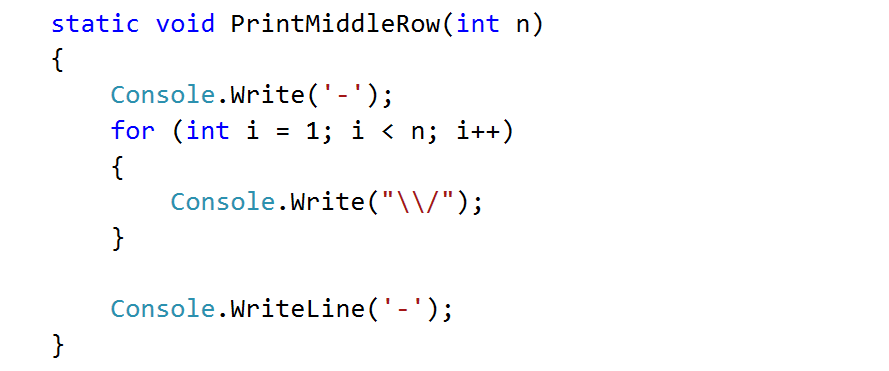{width="4.694741907261593in"
height="1.8354024496937882in"}

4.  Use the methods that you\'ve just created to draw a square

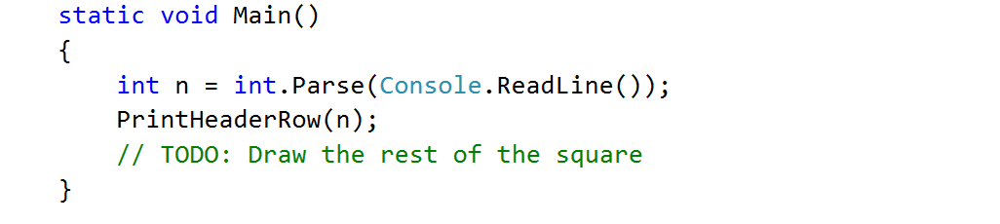{width="5.671862423447069in"
height="1.2243055555555555in"}

Returning Values and Overloading
================================

Temperature Conversion
----------------------

Create a method that converts a temperature from **Fahrenheit** to
**Celsius**. Format the result to the 2^nd^ decimal point.

Use the formula: **(fahrenheit - 32) \* 5 / 9**.

### Examples

  **Input**   **Output**
  ----------- ------------
  95          35.00
  33.8        1.00
  -40         -40.00

### Hints

1.  Read the input

2.  Create a method, which **returns a value of type double**:\
    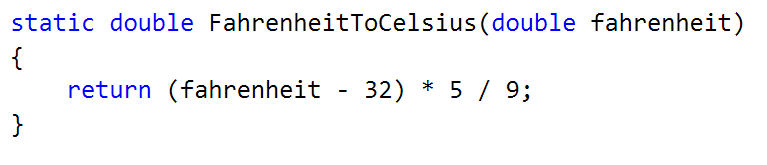{width="3.7009470691163604in"
    height="0.8110487751531059in"}

3.  **Invoke** the method in the main and **save the return value in a
    new variable**:\
    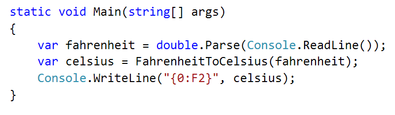{width="3.9036843832020995in"
    height="1.0450754593175853in"}

Calculate Triangle Area
-----------------------

Create a method that calculates and **returns** the
[area](http://www.mathopenref.com/trianglearea.html) of a triangle by
given base and height:

### Examples

+-----------+------------+
| **Input** | **Output** |
+===========+============+
| 3         | 6          |
|           |            |
| 4         |            |
+-----------+------------+

### Hints

1.  After reading the input

2.  Create a method, but this time **instead** of typing **\"static
    void\"** before its name, type **\"static double\"** as this will
    make it to **return a value of type double**:

> 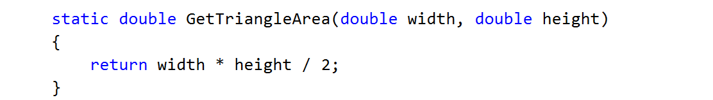{width="5.602877296587926in"
> height="0.815916447944007in"}

3.  **Invoke** the method in the main and **save the return value in a
    new variable**:

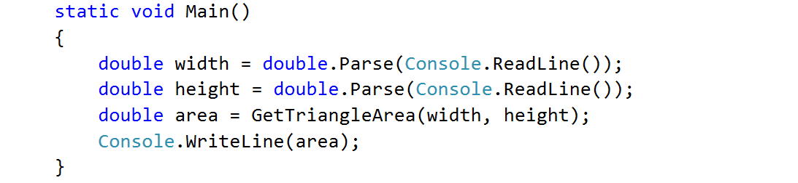{width="5.385119203849519in"
height="1.208902012248469in"}

Math Power
----------

Create a method that calculates and returns the value of a number raised
to a given power:

### Examples

+-----------+------------+
| **Input** | **Output** |
+===========+============+
| 2         | 256        |
|           |            |
| 8         |            |
+-----------+------------+
| 3         | 81         |
|           |            |
| 4         |            |
+-----------+------------+

### Hints

1.  As usual, read the input

2.  Create a method which will have two parameters - the number and the
    power, and will return a result of type double:

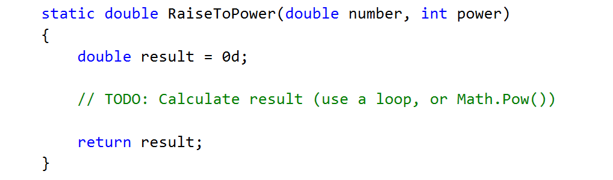{width="5.399628171478565in"
height="1.5534722222222221in"}

3.  Print the result

Greater of Two Values
---------------------

You are given two values of the same type as input. The values can be of
type int, char of string. Create a method GetMax() that returns the
greater of the two values:

### Examples

+-----------+------------+
| **Input** | **Output** |
+===========+============+
| int       | 16         |
|           |            |
| 2         |            |
|           |            |
| 16        |            |
+-----------+------------+
| char      | z          |
|           |            |
| a         |            |
|           |            |
| z         |            |
+-----------+------------+
| string    | Todor      |
|           |            |
| Ivan      |            |
|           |            |
| Todor     |            |
+-----------+------------+

### Hints

1.  For this method you need to create three methods with the same name
    and different signatures

2.  Create a method which will compare integers:

> 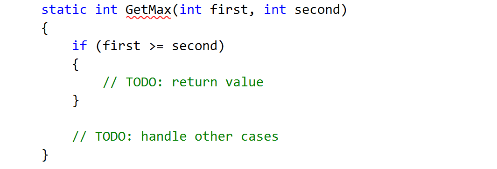{width="4.701458880139983in" height="1.65in"}

3.  Create a second method with the same name which will compare
    characters. Follow the logic of the previous method:

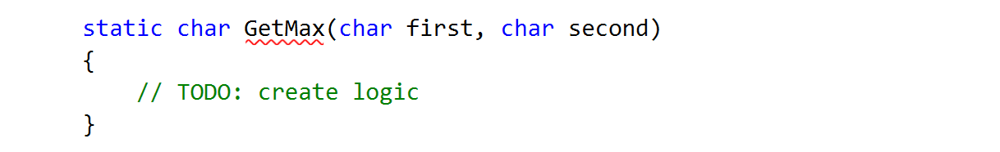{width="5.793452537182852in"
height="0.8832688101487314in"}

4.  Lastly you need to create a method to compare strings. This is a bit
    different as strings don\'t allow to be compared with the
    operators \> and \<

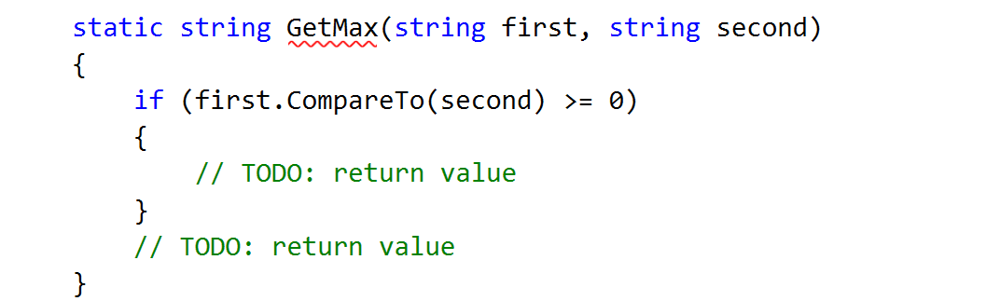{width="4.966369203849519in"
height="1.45121062992126in"}

You need to use the method \"CompareTo()\", which returns an integer
value (greater than zero if the compared object is greater, less than
zero if the compared object is lesser and zero if the two objects are
equal.

5.  The last step is to read the input, use appropriate variables and
    call the GetMax() from your Main():

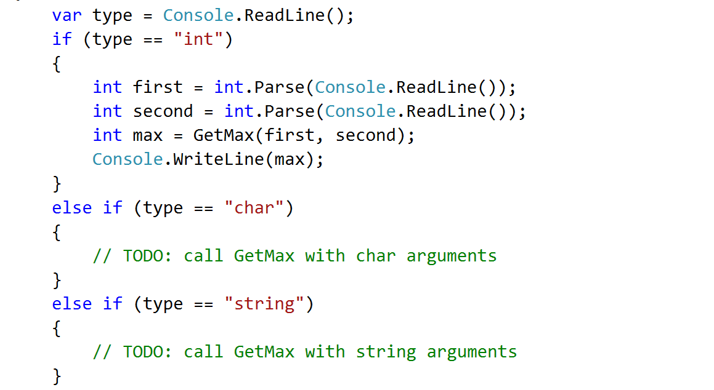{width="4.935238407699037in" height="2.6125in"}

Debugging and Program Flow
==========================

Multiply Evens by Odds
----------------------

Create a program that reads an **integer number** and **multiplies the
sum of all its even digits** by **the sum of all its odd digits**:

### Examples

+-----------------------+-----------------------+-----------------------+
| **Input**             | **Output**            | **Comments**          |
+=======================+=======================+=======================+
| 12345                 | 54                    | 12345 has **2 even    |
|                       |                       | digits** - 2 and 4.   |
|                       |                       | Even digits has **sum |
|                       |                       | of 6**.               |
|                       |                       |                       |
|                       |                       | Also it has **3 odd   |
|                       |                       | digits** - 1, 3 and   |
|                       |                       | 5. Odd digits has     |
|                       |                       | **sum of 9**.         |
|                       |                       |                       |
|                       |                       | **Multiply 6 by 9**   |
|                       |                       | and you get **54**.   |
+-----------------------+-----------------------+-----------------------+
| -12345                | 54                    |                       |
+-----------------------+-----------------------+-----------------------+

### Hints

1.  Create a method with a **name describing its purpose** (like
    GetMultipleOfEvensAndOdds). The method should have a **single
    integer parameter** and an **integer return value**. Also the method
    will call two other methods:

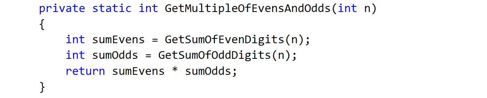{width="5.385714129483815in"
height="1.0769619422572179in"}

2.  Create two other methods each of which will sum either even or odd
    digits

3.  Implement the logic for summing odd digits:

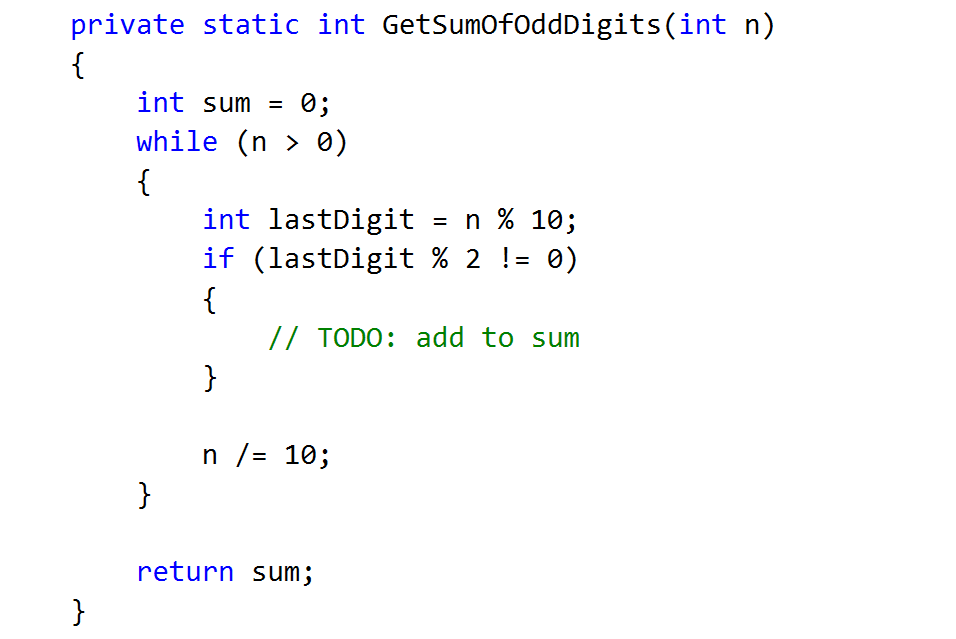{width="4.419515529308836in"
height="2.821527777777778in"}

4.  Do the same for the method that will sum even digits

5.  As you test your solution you may notice that it doesn\'t work for
    negative numbers. Following the program execution line by line, find
    and fix the bug (**hint: you can use Math.Abs()**)

Debug the Code: Holidays Between Two Dates
------------------------------------------

You are assigned to **find and fix the bugs** in an existing piece of
code, using the Visual Studio **debugger**. You should trace the program
execution to find the lines of code that produce incorrect or unexpected
results.

You are given a program (existing **source code**) that aims to **count
the non-working days between two dates** given in format
**day.month.year** (e.g. between **1.05.2015** and **15.05.2015** there
are **5** non-working days -- Saturday and Sunday).

### Examples

+-----------------------+-----------------------+-----------------------+
| **Input**             | **Output**            | **Comments**          |
+=======================+=======================+=======================+
| 1.05.2016             | 5                     | There are 5           |
|                       |                       | non-working days      |
| 15.05.2016            |                       | (Saturday / Sunday)   |
|                       |                       | in this period:\      |
|                       |                       | 1-May-2016,           |
|                       |                       | 7-May-2016,           |
|                       |                       | 8-May-2016,           |
|                       |                       | 14-May-2016,          |
|                       |                       | 15-May-2016           |
+-----------------------+-----------------------+-----------------------+
| 1.5.2016              | 1                     | Only 1 non-working    |
|                       |                       | day in the specified  |
| 2.5.2016              |                       | period: 1.05.2016     |
|                       |                       | (Sunday)              |
+-----------------------+-----------------------+-----------------------+
| 15.5.2020             | 0                     | The second date is    |
|                       |                       | before the first. No  |
| 10.5.2020             |                       | dates in the range.   |
+-----------------------+-----------------------+-----------------------+
| 22.2.2020             | 4                     | Two Saturdays and     |
|                       |                       | Sundays:              |
| 1.3.2020              |                       |                       |
|                       |                       | -   22.02.2020 and    |
|                       |                       |     23.02.2020        |
|                       |                       |                       |
|                       |                       | -   29.02.2020 and    |
|                       |                       |     1.03.2020         |
+-----------------------+-----------------------+-----------------------+

You can **find the broken code** in the judge system: [Broken Code for
Refactoring](http://softuni.bg/downloads/svn/soft-tech/Sep-2016/Programming-Fundamentals-Sep-2016/03.%20Programming-Fundamentals-Methods-Debugging-and-Troubleshooting-Code/03.Programming-Fundamentals-Methods-and-Debugging-Lab-Broken-Solutions.zip).
It looks as follows:

+---------------------------------------------------------------+
| HolidaysBetweenTwoDates.cs                                    |
+===============================================================+
| using System;                                                 |
|                                                               |
| using System.Globalization;                                   |
|                                                               |
| class HolidaysBetweenTwoDates                                 |
|                                                               |
| {                                                             |
|                                                               |
| static void Main()                                            |
|                                                               |
| {                                                             |
|                                                               |
| var startDate = DateTime.ParseExact(Console.ReadLine(),       |
|                                                               |
| \"dd.m.yyyy\", CultureInfo.InvariantCulture);                 |
|                                                               |
| var endDate = DateTime.ParseExact(Console.ReadLine(),         |
|                                                               |
| \"dd.m.yyyy\", CultureInfo.InvariantCulture);                 |
|                                                               |
| var holidaysCount = 0;                                        |
|                                                               |
| for (var date = startDate; date \<= endDate; date.AddDays(1)) |
|                                                               |
| if (date.DayOfWeek == DayOfWeek.Saturday &&                   |
|                                                               |
| date.DayOfWeek == DayOfWeek.Sunday) holidaysCount++;          |
|                                                               |
| Console.WriteLine(holidaysCount);                             |
|                                                               |
| }                                                             |
|                                                               |
| }                                                             |
+---------------------------------------------------------------+

### Hints

There are **4** **mistakes** in the code. You've got to **use the
debugger** to find them and fix them. After you do that, submit your
**fixed code in the judge contest**:
<https://judge.softuni.bg/Contests/Practice/Index/304#8>.

Price Change Alert
------------------

You are assigned to **rework a given piece of code** which is working
**without bugs** but is **not properly formatted**.

The given program **tracks stock prices** and **gives updates** about
the **significance in each price change**. Based on the significance,
there are **four kind of changes**: no change at all (price is equal to
the previous), minor (difference is below the significance threshold),
price up and price down.

You can **find the broken code** here: [Broken Code for
Refactoring](http://softuni.bg/downloads/svn/soft-tech/Sep-2016/Programming-Fundamentals-Sep-2016/03.%20Programming-Fundamentals-Methods-Debugging-and-Troubleshooting-Code/03.Programming-Fundamentals-Methods-and-Debugging-Lab-Broken-Solutions.zip).

### Input

-   On the first line you are given **N** - the number of prices

-   On the second line you are given the significance threshold

-   On the next N lines, you are given prices

### Output

-   Don't print anything for the first price

-   If there is **no difference** from the previous price the output
    message is: \"NO CHANGE: {current price}\"

-   In case of **minor change**: \"MINOR CHANGE: {last price} to
    {current price} ({difference}%)\"

-   In case of **major change**: \"PRICE UP: {last price} to {current
    price} ({difference}%)\" or \"PRICE DOWN: {last price} to {current
    price} ({difference}%)\"

The percentage should be rounded to the second digit after the decimal
point.

### Examples

+-----------+--------------------------------+
| **Input** | **Output**                     |
+===========+================================+
| 3         | PRICE UP: 10 to 11 (10.00%)    |
|           |                                |
| 0.1       | MINOR CHANGE: 11 to 12 (9.09%) |
|           |                                |
| 10        |                                |
|           |                                |
| 11        |                                |
|           |                                |
| 12        |                                |
+-----------+--------------------------------+
| 3         | NO CHANGE: 10                  |
|           |                                |
| 0.1       | PRICE UP: 10 to 12 (20.00%)    |
|           |                                |
| 10        |                                |
|           |                                |
| 10        |                                |
|           |                                |
| 12        |                                |
+-----------+--------------------------------+

### Hints

1.  Download the source code and get familiar with it

2.  Deal with poor code formatting - Remove unnecessary blank lines,
    indent the code properly

3.  Fix method parameters naming

4.  Give methods a proper name
