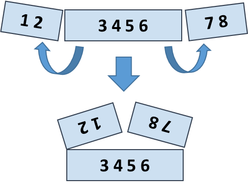

Lab: Dictionaries, Lambda and LINQ
==================================

Problems for exercises and homework for the ["Programming Fundamentals"
course @ SoftUni](https://softuni.bg/courses/programming-fundamentals).

Check your solutions here:
<https://judge.softuni.bg/Contests/174/Dictionaries-Lambda-and-LINQ-Lab>.

Associative Arrays
==================

Count Real Numbers
------------------

Read a **list of real numbers** and **print them in ascending order**
along with their **number of occurrences**.

### Examples

+-----------------+------------+--+-------------+------------+--+----------------+------------+
| **Input**       | **Output** |  | **Input**   | **Output** |  | **Input**      | **Output** |
+=================+============+==+=============+============+==+================+============+
| 8 2.5 2.5 8 2.5 | 2.5 -\> 3  |  | 1.5 5 1.5 3 | 1.5 -\> 2  |  | -2 0.33 0.33 2 | -2 -\> 1   |
|                 |            |  |             |            |  |                |            |
|                 | 8 -\> 2    |  |             | 3 -\> 1    |  |                | 0.33 -\> 2 |
|                 |            |  |             |            |  |                |            |
|                 |            |  |             | 5 -\> 1    |  |                | 2 -\> 1    |
+-----------------+------------+--+-------------+------------+--+----------------+------------+

### Hints

-   Use **SortedDictionary\<double,** **int\>** named **counts**.

-   Pass through each input number **num** and increase
    **counts\[num\]** (when **num** exists in the dictionary) or assign
    **counts\[num\]** = **1** (when **num** does not exist in the
    dictionary).

-   Pass through all numbers **num** in the dictionary (**counts.Keys**)
    and print the number **num** and its count of occurrences
    **counts\[num\]**.

Odd Occurrences
---------------

Write a program that extracts from a given sequence of words all
elements that present in it **odd number of times** (case-insensitive).

-   Words are given in a single line, space separated.

-   Print the result elements in lowercase, in their order of
    appearance.

### Examples

  **Input**                        **Output**
  -------------------------------- ---------------
  Java C\# PHP PHP JAVA C java     java, c\#, c
  3 5 5 hi pi HO Hi 5 ho 3 hi pi   5, hi
  a a A SQL xx a xx a A a XX c     a, sql, xx, c

### Hints

-   Use a **dictionary** (**string** **int**) to count the occurrences
    of each word (just like in the previous problem).

-   Pass through all **key-value pairs** in the dictionary and append to
    the results list all **keys** that have **odd value**.

-   Print the results list.

LINQ
====

Sum, Min, Max, Average
----------------------

Write a program to read **n** integers and print their **sum**, **min**,
**max**, **first**, **last** and **average** values.

### Examples

+-----------+-----------------+
| **Input** | **Output**      |
+===========+=================+
| **5**     | Sum = 72        |
|           |                 |
| 12        | Min = -5        |
|           |                 |
| 20        | Max = 37        |
|           |                 |
| -5        | Average = 14.4  |
|           |                 |
| 37        |                 |
|           |                 |
| 8         |                 |
+-----------+-----------------+
| **4**     | Sum = 135       |
|           |                 |
| 50        | Min = 20        |
|           |                 |
| 20        | Max = 50        |
|           |                 |
| 25        | Average = 33.75 |
|           |                 |
| 40        |                 |
+-----------+-----------------+

### Hints

-   Include the "**System.Linq**" namespace to enable aggregate
    functions.

-   Read the input array **nums\[\]**.

-   Use **nums.Min()**, **nums.Max()**, etc.

Largest 3 Numbers
-----------------

Read a **list of real numbers** and **print largest 3 of them**. If less
than 3 numbers exit, print all of them.

### Examples

  **Input**          **Output**      **Input**   **Output**
  ------------------ ------------ -- ----------- ------------
  10 30 15 20 50 5   50 30 20        20 30       30 20

### Hints

You can use LINQ query like this: **nums.OrderByDescending(x** **=\>**
**x).Take(3)**.

Short Words Sorted
------------------

Read a **text**, extract its **words**, find all **short words** (less
than 5 characters) and print them **alphabetically**, in **lowercase**.

-   Use the following separators: **.** **,** **:** **;** **(** **)**
    **\[** **\]** **\"** **\'** **\\** **/** **!** **?** *(space)*.

-   Use case-insensitive matching.

-   Remove duplicated words.

### Examples

  **Input**                                                                                                       **Output**
  --------------------------------------------------------------------------------------------------------------- --------------------------------------------
  In SoftUni you can study Java, C\#, PHP and JavaScript. JAVA and c\# developers graduate in 2-3 years. Go in!   2-3, and, c\#, can, go, in, java, php, you

### Hints

-   To extract the words from the input text, **split** by the specified
    separators.

-   Use a **LINQ expression**:

    -   Filter by word length: **Where(...)**

    -   Order by word: **OrderBy(...)**

    -   Use **distinct** to avoid repeated words: **Distinct()**.

Fold and Sum
------------

Read an array of **4\*k integers**, **fold** it like shown below, and
**print the sum** of the upper and lower rows (**2\*k integers**):

{width="2.404761592300962in"
height="1.8194444444444444in"}

### Examples

+-------------------------------+----------------+-----------------+
| **Input**                     | **Output**     | **Comments**    |
+===============================+================+=================+
| 5 **2 3** 6                   | 7 9            | 5 6 +           |
|                               |                |                 |
|                               |                | 2 3 =           |
|                               |                |                 |
|                               |                | 7 9             |
+-------------------------------+----------------+-----------------+
| 1 2 **3 4 5 6** 7 8           | 5 5 13 13      | 2 1 8 7 +       |
|                               |                |                 |
|                               |                | 3 4 5 6 =       |
|                               |                |                 |
|                               |                | 5 5 13 13       |
+-------------------------------+----------------+-----------------+
| 4 3 -1 **2 5 0 1 9 8** 6 7 -2 | 1 8 4 -1 16 14 | -1 3 4 -2 7 6 + |
|                               |                |                 |
|                               |                | 2 5 0 1 9 8 =   |
|                               |                |                 |
|                               |                | 1 8 4 -1 16 14  |
+-------------------------------+----------------+-----------------+

**Hints**

Use a **LINQ expression**:

-   Row 1, left part: take the **first** **k** numbers and **reverse**.

-   Row 1, right part: **reverse** and take the **first** **k** numbers.

-   **Concatenate** the **left** and the **right** part of row 1.

-   Row 2: skip the **first k** numbers and take the next **2\*k**
    numbers.

-   Sum the arrays **row1** and **row2**: **var** **sum** **=**
    **row1.Select((x,** **index)** **=\>** **x** **+**
    **row2\[index\])**.
