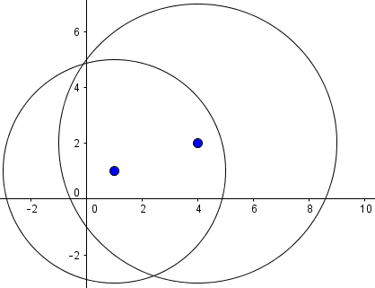

Exercises: Objects and Classes
==============================

Problems for exercises and homework for the ["Programming Fundamentals"
course @ SoftUni](https://softuni.bg/courses/programming-fundamentals).

You can check your solutions here:
<https://judge.softuni.bg/Contests/210/Objects-and-Classes-Exercises>.

Count Working Days
------------------

Write a program that **reads two dates** in format **dd-MM-yyyy** and
prints the **number of working days** between these two dates
**inclusive**. Non-working days are:

-   All days that are **Saturday** or **Sunday**.

-   All days that are **official holidays** in Bulgaria:

    -   New Year Eve (**1 Jan**)

    -   Liberation Day (**3 March**)

    -   Worker's day (**1 May**)

    -   Saint George's Day (**6 May**)

    -   Saints Cyril and Methodius Day (**24 May**)

    -   Unification Day (**6 Sept**)

    -   Independence Day (**22 Sept**)

    -   National Awakening Day (**1 Nov**)

    -   Christmas (**24**, **25** and **26 Dec**)

All days not mentioned above are **working** and should count.

### Examples

+------------+------------+
| **Input**  | **Output** |
+============+============+
| 11-04-2016 | 4          |
|            |            |
| 14-04-2016 |            |
+------------+------------+
| 11-04-2016 | 10         |
|            |            |
| 22-04-2016 |            |
+------------+------------+
| 20-12-2015 | 7          |
|            |            |
| 31-12-2015 |            |
+------------+------------+

### Hints

-   Read **start date** and **end date** from Console.

-   **Create** two objects of type **DateTime** -- **startDate** and
    **endDate**.

-   Create an **array of type DateTime** and add **all official
    holidays** in it.

-   Loop from **startDate** to **endDate**. Add **1 day** at each
    iteration.

-   Get the **current da**y in the loop and check whether is
    **Saturday**, **Sunday** or it is **contained** **in the holidays
    array**. If it is not, increment the **workingDaysCounter**.

Advertisement Message
---------------------

Write a program that **generate random fake advertisement message** to
extol some product. The messages must consist of 4 parts: **laudatory**
**phrase** + **event** + **author** + **city**. Use the following
predefined parts:

-   **Phrases** -- {\"Excellent product.\", \"Such a great product.\",
    \"I always use that product.\", \"Best product of its category.\",
    \"Exceptional product.\", \"I can't live without this product.\"}

-   **Events** -- {\"Now I feel good.\", \"I have succeeded with this
    product.\", \"Makes miracles. I am happy of the results!\", \"I
    cannot believe but now I feel awesome.\", \"Try it yourself, I am
    very satisfied.\", \"I feel great!\"}

-   **Authors** -- {\"Diana\", \"Petya\", \"Stella\", \"Elena\",
    \"Katya\", \"Iva\", \"Annie\", \"Eva\"}

-   **Cities** -- {\"Burgas\", \"Sofia\", \"Plovdiv\", \"Varna\",
    \"Ruse\"}

The format of the output message is: **{phrase} {event} {author} --
{city}**.

As an input, you take the **number of messages** to be generated. Print
each random message at a separate line.

### Examples

+-----------------------------------+-----------------------------------+
| **Input**                         | **Output**                        |
+===================================+===================================+
| 3                                 | Such a great product. Now I feel  |
|                                   | good. Elena -- Ruse               |
|                                   |                                   |
|                                   | Excelent product. Makes miracles. |
|                                   | I am happy of the results! Katya  |
|                                   | -- Varna                          |
|                                   |                                   |
|                                   | Best product of its category.     |
|                                   | That makes miracles. Eva - Sofia  |
+-----------------------------------+-----------------------------------+

### Hints

-   Hold the **phrases**, **events**, **authors** and **towns** in 4
    **string arrays**.

-   Create a **Random** object and **generate** **4 random numbers**
    each in the following ranges:

    -   phraseIndex ­(0, phrases.Length)

    -   eventIndex (0, events.Length)

    -   authorIndex (0, authors.Length)

    -   townIndex (0, towns.Length)

-   Get one **random element** from each of the four arrays and
    **compose a message** in the required format.

Intersection of Circles
-----------------------

Create class **Circle** with properties **Center** and **Radius**. The
center is a point with coordinates **X** and **Y** (make a class
**Point**). Write a method **bool** **Intersect(Circle** **c1,**
**Circle** **c2)** that tells whether the two given circles **intersect
or not**. Write a program that tells if two circles intersect.

The input lines will be in format: **{X} {Y} {Radius}**. Print as output
"**Yes**" or "**No**".

### Examples

+-----------------------+-----------------------+-----------------------+
| **Input**             | **Output**            | **Visualization**     |
+=======================+=======================+=======================+
| 4 4 2                 | No                    |  |
|                       |                       | {width="2.69685039370 |
| 8 8 1                 |                       | 07875in"              |
|                       |                       | height="2.64960629921 |
|                       |                       | 25986in"}             |
+-----------------------+-----------------------+-----------------------+
| 3 3 2                 | Yes                   |  |
|                       |                       | {width="2.69685039370 |
| 4 3 6                 |                       | 07875in"              |
|                       |                       | height="2.64960629921 |
|                       |                       | 25986in"}             |
+-----------------------+-----------------------+-----------------------+
| 1 1 4                 | Yes                   |  |
|                       |                       | {width="2.78055555555 |
| 4 2 5                 |                       | 55554in"              |
|                       |                       | height="2.13541666666 |
|                       |                       | 66665in"}             |
+-----------------------+-----------------------+-----------------------+

### Hints

-   Calculate **d** = **distance between the circle centers**.

-   If the **d** **≤** **r1** **+** **r2** (the sum of radiuses**)** the
    circles **intersect** (or one of the circles is inside the other or
    the circles have one common point when **d** **=** **r1** **+**
    **r2**).

-   If the **d** **\>** **r1** **+** **r2** the circles do **not
    intersect** (they have not common shared point).

Average Grades
--------------

Define a class **Student**, which holds the following information about
students: **name**, **list of grades** and **average grade** (calculated
property, read-only). A single grade will be in range \[2...6\], e.g.
3.25 or 5.50.

Read a **list of students** and print the students that have **average
grade ≥ 5.00** ordered **by name** (ascending), then by **average**
**grade** (descending). Print the student name and the calculated
average grade.

### Examples

+-------------------------+----------------+
| **Input**               | **Output**     |
+=========================+================+
| 3                       | Diana -\> 5.75 |
|                         |                |
| Ivan 3                  | Todor -\> 5.33 |
|                         |                |
| Todor 5 5 6             |                |
|                         |                |
| Diana 6 5.50            |                |
+-------------------------+----------------+
| 6                       | Ani -\> 5.58   |
|                         |                |
| Petar 3 5 4 3 2 5 6 2 6 | Ani -\> 5.50   |
|                         |                |
| Mitko 6 6 5 6 5 6       | Gosho -\> 6.00 |
|                         |                |
| Gosho 6 6 6 6 6 6       | Mitko -\> 5.67 |
|                         |                |
| Ani 6 5 6 5 6 5 6 5     |                |
|                         |                |
| Iva 4 5 4 3 4 5 2 2 4   |                |
|                         |                |
| Ani 5.50 5.25 6.00      |                |
+-------------------------+----------------+

### Hints

-   Create class **Student** with properties **Name** (**string**),
    **Grades** (**double\[\]**), and property **AverageGrade**
    (calculated by LINQ as **Grades.Average()**, read-only).

-   Make a **list of students** and **filter with LINQ** all students
    that has average **grade** **\>=** **5.00**.

-   Print the filtered students **ordered by name** in ascending order,
    then by **average grade** in descending order.

Book Library 
-------------

To model a **book library**, define classes to hold a **book** and a
**library**.

The library must have a **name** and a **list of books**. The books must
contain the **title**, **author**, **publisher**, **release date** (in
**dd.MM.yyyy** format), **ISBN-number** and **price. **

Read a **list of books**, add them to the library and print the **total
sum of prices by author**, ordered **descending by price** and **then by
author's name lexicographically**.

Books in the input will be in format **{title} {author} {publisher}
{release date} {ISBN} {price}**.

The total prices must be printed **formatted to the second decimal
place**.

### Examples

+------------------------------------------------------+---------------------+
| **Input**                                            | **Output**          |
+======================================================+=====================+
| 5                                                    | Tolkien -\> 40.25   |
|                                                      |                     |
| LOTR Tolkien GeorgeAllen 29.07.1954 0395082999 30.00 | JKRowling -\> 35.50 |
|                                                      |                     |
| Hobbit Tolkien GeorgeAll 21.09.1937 0395082888 10.25 | OBowden -\> 14.00   |
|                                                      |                     |
| HP1 JKRowling Bloomsbury 26.06.1997 0395082777 15.50 |                     |
|                                                      |                     |
| HP7 JKRowling Bloomsbury 21.07.2007 0395082666 20.00 |                     |
|                                                      |                     |
| AC OBowden PenguinBooks 20.11.2009 0395082555 14.00  |                     |
+------------------------------------------------------+---------------------+

### Hints

-   Create classes **Book** and **Library** with all the mentioned above
    properties:\
    {width="3.524508967629046in"
    height="0.9863801399825022in"}

-   **Create** an object of type **Library**.

-   **Read the input** and create a **Book** object for each book in the
    input.

-   Create a **LINQ** query that will **sum the prices by author**,
    **order the results** as requested.

-   **Print** the results.

Book Library Modification
-------------------------

Use the classes from the previous problem and make a program that **read
a list of books** and **print all titles** **released after given date**
ordered **by date** and then **by** **title lexicographically**. The
date is given in the format "**dd.MM.yyyy**" at the last line in the
input.

### Examples

+------------------------------------------------------+--------------------+
| **Input**                                            | **Output**         |
+======================================================+====================+
| 5                                                    | HP1 -\> 26.06.1997 |
|                                                      |                    |
| LOTR Tolkien GeorgeAllen 29.07.1954 0395082999 30.00 | HP7 -\> 21.07.2007 |
|                                                      |                    |
| Hobbit Tolkien GeorgeAll 21.09.1937 0395082888 10.25 | AC -\> 20.11.2009  |
|                                                      |                    |
| HP1 JKRowling Bloomsbury 26.06.1997 0395082777 15.50 |                    |
|                                                      |                    |
| HP7 JKRowling Bloomsbury 21.07.2007 0395082666 20.00 |                    |
|                                                      |                    |
| AC OBowden PenguinBooks 20.11.2009 0395082555 14.00  |                    |
|                                                      |                    |
| 30.07.1954                                           |                    |
+------------------------------------------------------+--------------------+

Andrey and Billiard
-------------------

Andrey is the guy who gives us food and drinks at the game bar. He likes
to play **billiard**. Since you are nice guy you want to help him play
more of his favorite game. You decide to create a program which will
help him to take orders faster and generate billing information.

First you will receive an integer - the **amount** of entities with
prices (separated by "**-**"). Then you will receive a **list** of
**clients**. For every customer, you will receive **what** to buy and
**how much**. When you receive the command "**end of clients**" you
should **display information** about every **client** as described
below. After that, print how much total money were **spent** while
Andrey was playing billiard.

### Constraints

-   If an entity is added more than once you should **override** the
    **previous price**.

-   If a buyer tries to buy an entity that **does not exist** - you
    should **ignore** that line.

-   Buyers should be **ordered** by their **name** in **ascending
    order**.

-   All **floating-point** digits must be rounded to **2 digits** after
    the decimal separator.

-   In the end, **every** buyer's respective **bill** should be
    **summed**.

-   The **quantities** will be **integers**. The **prices** will be
    **floating-point** numbers.

### Examples

+-----------------------+-----------------------+-----------------------+
| **Input**             | **Output**            | **Comments**          |
+=======================+=======================+=======================+
| 4                     | Mira                  | Bira\'s price **is**  |
|                       |                       | **overwritten**.      |
| Cola-1.25             | \-- Sandwich - 1      |                       |
|                       |                       | Since there is no     |
| Sandwich-2.30         | Bill: 2.30            | entity named          |
|                       |                       | \"Kola\"- we should   |
| Bira-0.01             | Toshko                | **ignore** that line. |
|                       |                       |                       |
| Bira-2                | \-- Bira - 3          |                       |
|                       |                       |                       |
| Toshko-Bira,3         | Bill: 6.00            |                       |
|                       |                       |                       |
| Mira-Sandwich,1       | Total bill: 8.30      |                       |
|                       |                       |                       |
| Marto-Kola,2          |                       |                       |
|                       |                       |                       |
| end of clients        |                       |                       |
+-----------------------+-----------------------+-----------------------+

### Hints

-   **Create** a Dictionary\<**string, decimal**\> as our **shop** that
    will contain the **price** for every **entity** in it.

-   Create class **Customer**. Every customer should have a **name**, a
    **Dictionary\<string, int\>**, which holds every **bought product**
    with its **quantity** (something like a **ShopList**) and a **Bill**
    property.

-   Save all customers that their wanted item is **actually in the
    shop** into a **list**. For every customer go through his "shop
    list" and **add** "**price\*quantity"** to his Bill.

-   For printing every customer, you can iterate through every object:

    {width="5.796864610673666in"
    height="2.129869860017498in"}

**Print** the results.

Mentor Group
------------

You are mentor of a group. You have done your job well and now you have
to generate a report about your group\'s activity. You will be given
usernames and dates (\"***dd/MM/yyyy***\"), dates (**if any**) are
separated with comma, until you receive command \"**end of dates**\".
After that you will receive user and some comment (separated with dash).
You can add comment for every user who is **in** your group (if **not**
ignore the line). Adding comment/date to same user more than once should
**append** to that user the comment/date. Upon receiving command \"**end
of comments**\" you should generate report in format:

+-----------------------+
| {user}                |
|                       |
| Comments:             |
|                       |
| \- {firstComment} ... |
|                       |
| Dates attended:       |
|                       |
| \-- {firstDate}       |
|                       |
| \-- {secondDate}      |
+-----------------------+

Users should be printed ordered by name (ascending). For every user,
their dates should be sorted again in ascending order. Input will be
valid and in the format described - you should **not check** it
explicitly!

### Examples

+-----------------------+-----------------------+-----------------------+
| **Input**             | **Output**            | **Comments**          |
+=======================+=======================+=======================+
| nakov                 | nakov                 | Not that simeon10 has |
| 22/08/2016,20/08/2016 |                       | no comments but we    |
|                       | Comments:             | still leave the       |
| simeon10 22/08/2016   |                       | comments section.     |
|                       | \- Excellent          | User Gesh4o does not  |
| end of dates          | algorithmetic         | have attendancy date  |
|                       | thinking.             | so he is not          |
| nakov-Excellent       |                       | registered in your    |
| algorithmetic         | Dates attended:       | group therefore he is |
| thinking.             |                       | not a part from the   |
|                       | \-- 20/08/2016        | report.               |
| Gesh4o-Total noob.    |                       |                       |
|                       | \-- 22/08/2016        |                       |
| end of comments       |                       |                       |
|                       | simeon10              |                       |
|                       |                       |                       |
|                       | Comments:             |                       |
|                       |                       |                       |
|                       | Dates attended:       |                       |
|                       |                       |                       |
|                       | \-- 22/08/2016        |                       |
+-----------------------+-----------------------+-----------------------+

### Hints

-   **Create** a class **Student** with **List\<string\>** for comments
    and **List\<DateTime\>** for attendance dates and a name.

-   You can save all students into a **list** or you can save every
    student in a **dictionary** where the **key** will be the student's
    **name** and the **value** will be the **student object** itself.

Teamwork projects
-----------------

It\'s time for teamwork projects and you are responsible for making the
teams. First you will receive an integer - the **count** of the teams
you will have to **register**. You will be given a **user** and a
**team** (separated with "**-**"). The user is the **creator** of that
team.

For every newly created team you should **print** a message: \"**Team
{team Name} has been created by {user}!**\".

Next you will receive user with team (separated with \"*-\>*\") which
means that the user wants to **join** that **team**. Upon receiving the
command: "**end of assignment**", you should print **every team**,
**ordered** by the **count** of its **members** (**descending**) and
then by **name** (**ascending**). For each team, you have to print its
members **sorted** by name (**ascending**). However, there are several
**rules**:

-   If user tries to **create** a team more than once a message should
    be displayed:

    -   \"**Team {teamName} was already created!***\"*

-   Creator of a team cannot **create** another team - message should be
    thrown:

    -   \"**{user} cannot create another team!**\"

-   If user tries to **join** currently non-existing team a message
    should be displayed:

    -   \"**Team {teamName} does not exist!***\"*

-   Member of a team cannot **join** another team - message should be
    thrown:

    -   \"**Member {user} cannot join team {team Name}!**\"

-   In the **end** (*after teams\' report*) teams with **zero** members
    (with **only a creator**) should **disband**. Every **valid** team
    should be printed ordered by **name** (ascending) in this format:

+-------------------+
| \"{teamName}:     |
|                   |
| \- {creator}      |
|                   |
| \-- {member}...\" |
+-------------------+

### Examples

+-----------------------+-----------------------+-----------------------+
| **Input**             | **Output**            | **Comments**          |
+=======================+=======================+=======================+
| 2                     | Team PowerPuffsCoders | Toni created a team   |
|                       | has been created by   | in which he tried     |
| Didi-PowerPuffsCoders | Didi!                 | later to join. So     |
|                       |                       | message was shown.    |
| Toni-Toni is the best | Team Toni is the best | Since there is no one |
|                       | has been created by   | other who is trying   |
| Petq-\>PowerPuffsCode | Toni!                 | to join his team the  |
| rs                    |                       | team have to          |
|                       | Member Toni cannot    | **disband**.          |
| Toni-\>Toni is the    | join team Toni is the |                       |
| best                  | best!                 |                       |
|                       |                       |                       |
| end of assignment     | PowerPuffsCoders      |                       |
|                       |                       |                       |
|                       | \- Didi               |                       |
|                       |                       |                       |
|                       | \-- Petq              |                       |
|                       |                       |                       |
|                       | Teams to disband:     |                       |
|                       |                       |                       |
|                       | Toni is the best      |                       |
+-----------------------+-----------------------+-----------------------+
| 3                     | Team CloneClub has    | Note that when you    |
|                       | been created by       | join a team you       |
| Tatyana-CloneClub     | Tatyana!              | should check          |
|                       |                       | **first** if it       |
| Helena-CloneClub      | Team CloneClub was    | exists, **then**      |
|                       | already created!      | check if the user is  |
| Trifon-AiNaBira       |                       | already in a team:    |
|                       | Team AiNaBira has     |                       |
| Pesho-\>aiNaBira      | been created by       | Tatyana has created   |
|                       | Trifon!               | CloneClub, then she   |
| Pesho-\>AiNaBira      |                       | tries to join a       |
|                       | Team aiNaBira does    | non-existing team --  |
| Tatyana-\>Leda        | not exist!            | so message for        |
|                       |                       | non-existing team is  |
| PeshO-\>AiNaBira      | Team Leda does not    | shown.                |
|                       | exist!                |                       |
| Cossima-\>CloneClub   |                       |                       |
|                       | AiNaBira              |                       |
| end of assignment     |                       |                       |
|                       | \- Trifon             |                       |
|                       |                       |                       |
|                       | \-- Pesho             |                       |
|                       |                       |                       |
|                       | \-- PeshO             |                       |
|                       |                       |                       |
|                       | CloneClub             |                       |
|                       |                       |                       |
|                       | \- Tatyana            |                       |
|                       |                       |                       |
|                       | \-- Cossima           |                       |
|                       |                       |                       |
|                       | Teams to disband:     |                       |
+-----------------------+-----------------------+-----------------------+

### Hints

-   **Create** a class **Team** with name, List\<**string**\> for
    members and again name but his time for the creator.

-   Based on this you can have a List\<Team\> where you can safely
    **check** for every condition described above.

-   **After** populating the teams, you can **filter** them into two
    **separate** collections (one for the teams with only a creator in
    it and another for the rest)

\*\* Student Groups
-------------------

At the Software University, we often organize programming courses for
beginners in different towns. We usually run a **registration form** and
after the registration finishes, we distribute the **students** into
**study groups**. Groups have different sizes in each town.

You are given a report holding the **registrations for each town** and
the **lab capacity** (seats count) for each town. It comes in the
following format:

-   **Town name** =\> **X** seats (where **X** is the capacity of the
    training lab in this town).

    -   **Student name** \| **student email** \| **registration**
        **date** (in format day-month-year). The month name is given as
        3 letters in English, e.g. "May", "Aug" or "Nov".

    -   The next student come after the first, etc.

-   Then the next town and its students come, etc.

-   The input ends by a line holding "**End**".

The **input** comes in the following structure:

+-------------------------------------------------------------------+
| Town1 =\> X seats                                                 |
|                                                                   |
| Student1 Name \| student1\_email\@somewhere.com \| day-month-year |
|                                                                   |
| Student2 Name \| student2\_email\@somewhere.com \| day-month-year |
|                                                                   |
| Student3 Name \| student3\_email\@somewhere.com \| day-month-year |
|                                                                   |
| ...                                                               |
|                                                                   |
| Town2 =\> X seats                                                 |
|                                                                   |
| Student1 Name \| student1\_email\@somewhere.com \| day-month-year |
|                                                                   |
| Student2 Name \| student2\_email\@somewhere.com \| day-month-year |
|                                                                   |
| ...                                                               |
|                                                                   |
| End                                                               |
+-------------------------------------------------------------------+

Your task is to **create** and **print the study groups** for each town
as follows:

-   For **each town** create and print one or several **study groups**
    (depends of the number or registered students and the capacity of
    the lab in this town).

-   For each town **order the students** by registration date
    (ascending), then by name (ascending) then by email (ascending),
    then fill them into groups. If the students are less or equal to the
    lab capacity, create only one group. When the students are more than
    the lab capacity, distribute them in multiple groups.

-   Print all **groups ordered by town** (ascending) in the following
    format:

    -   **Created G groups and T towns:**

    -   **Town1 =\> email1, email2, ...**

    -   **Town1 =\> email1, email2, ...**

    -   ...

    -   **Town2 =\> email1, email2, ...**

    -   ...

### Examples

+-----------------------------------------------------------------------+
| **Input**                                                             |
+=======================================================================+
| **Plovdiv** =\> **5** seats                                           |
|                                                                       |
| Ani Kirilova \|ani88\@abv.bg \|27-May-2016                            |
|                                                                       |
| Todor Nikolov \| tod92\@mente.org \| 28-May-2016                      |
|                                                                       |
| Kiril Stoyanov \| kirtak\@gmail.com \| 27-May-2016                    |
|                                                                       |
| Stefka Petrova \| st96\@abv.bg \| 26-May-2016                         |
|                                                                       |
| Ani Kirilova \| ani.k\@yahoo.co.uk \| 27-May-2016                     |
|                                                                       |
| Ivan Ivanov \| ivan.i.ivanov\@gmail.com\| 27-May-2016                 |
|                                                                       |
| **Veliko Tarnovo** =\> **3** seats                                    |
|                                                                       |
| Petya Stoyanova \| stoyanova\_p\@abv.bg \| 27-May-2016                |
|                                                                       |
| Stoyan Kirilov \| 100yan\@gmail.com \| 24-May-2016                    |
|                                                                       |
| Didi Miteva \| miteva\_d\@yahoo.co.uk \| 28-May-2016                  |
|                                                                       |
| Kiril Nikolov \| kiro\@kiro.net \| 25-May-2016                        |
|                                                                       |
| Ivan Stefanov \| ivan.stef86\@gmail.com \| 27-May-2016                |
|                                                                       |
| Maria Kirova \| maria.k\@abv.bg \| 26-May-2016                        |
|                                                                       |
| **Varna** =\> **2** seats                                             |
|                                                                       |
| Ivan Ivanov \| ivan.ivanov96\@gmail.com\| 29-May-2016                 |
|                                                                       |
| Stoyan Petrov \| sto.sto.sto\@gmail.com \| 27-May-2016                |
|                                                                       |
| Ivan Ivanov \| vankata\@mail.bg \| 1-Jun-2016                         |
|                                                                       |
| Kiril Anev \| anev\_k\@yahoo.co.uk \| 27-May-2016                     |
|                                                                       |
| Ivan Ivanov \| vanyo98\@abv.bg \| 29-May-2016                         |
|                                                                       |
| Petya Vladimirova\|pete98\@abv.bg \| 20-May-2016                      |
|                                                                       |
| Ivan Ivanov \| ivan.94.ivan\@gmail.com \| 29-May-2016                 |
|                                                                       |
| **End**                                                               |
+-----------------------------------------------------------------------+
| **Output**                                                            |
+-----------------------------------------------------------------------+
| Created **8** groups in **3** towns:                                  |
|                                                                       |
| Plovdiv =\> st96\@abv.bg, ani.k\@yahoo.co.uk, ani88\@abv.bg,          |
| ivan.i.ivanov\@gmail.com, kirtak\@gmail.com                           |
|                                                                       |
| Plovdiv =\> tod92\@mente.org                                          |
|                                                                       |
| Varna =\> pete98\@abv.bg, anev\_k\@yahoo.co.uk                        |
|                                                                       |
| Varna =\> sto.sto.sto\@gmail.com, ivan.94.ivan\@gmail.com             |
|                                                                       |
| Varna =\> ivan.ivanov96\@gmail.com, vanyo98\@abv.bg                   |
|                                                                       |
| Varna =\> vankata\@mail.bg                                            |
|                                                                       |
| Veliko Tarnovo =\> 100yan\@gmail.com, kiro\@kiro.net, maria.k\@abv.bg |
|                                                                       |
| Veliko Tarnovo =\> ivan.stef86\@gmail.com, stoyanova\_p\@abv.bg,      |
| miteva\_d\@yahoo.co.uk                                                |
+-----------------------------------------------------------------------+
| **Comments**                                                          |
+-----------------------------------------------------------------------+
| **Plovdiv (group 1 -- 5/5 students)**                                 |
|                                                                       |
| Stefka Petrova \| st96\@abv.bg \| 26-May-2016                         |
|                                                                       |
| Ani Kirilova \| ani.k\@yahoo.co.uk \| 27-May-2016                     |
|                                                                       |
| Ani Kirilova \| ani88\@abv.bg \| 27-May-2016                          |
|                                                                       |
| Ivan Ivanov \| ivan.i.ivanov\@gmail.com \| 27-May-2016                |
|                                                                       |
| Kiril Stoyanov \| kirtak\@gmail.com \| 27-May-2016                    |
|                                                                       |
| **Plovdiv (group 2 -- 1/5 students)**                                 |
|                                                                       |
| Todor Nikolov \| tod92\@mente.org \| 28-May-2016                      |
|                                                                       |
| **Varna (group 1 -- 2/2 students)**                                   |
|                                                                       |
| Petya Vladimirova \| pete98\@abv.bg \| 20-May-2016                    |
|                                                                       |
| Kiril Anev \| anev\_k\@yahoo.co.uk \| 27-May-2016                     |
|                                                                       |
| **Varna (group 2 -- 2/2 students)**                                   |
|                                                                       |
| Stoyan Petrov \| sto.sto.sto\@gmail.com \| 27-May-2016                |
|                                                                       |
| Ivan Ivanov \| ivan.94.ivan\@gmail.com \| 29-May-2016                 |
|                                                                       |
| **Varna (group 3 -- 2/2 students)**                                   |
|                                                                       |
| Ivan Ivanov \| ivan.ivanov96\@gmail.com \| 29-May-2016                |
|                                                                       |
| Ivan Ivanov \| vanyo98\@abv.bg \| 29-May-2016                         |
|                                                                       |
| **Varna (group 4 -- 1/2 students)**                                   |
|                                                                       |
| Ivan Ivanov \| vankata\@mail.bg \| 1-Jun-2016                         |
|                                                                       |
| **Veliko Tarnovo (group 1 -- 3/3 students)**                          |
|                                                                       |
| Stoyan Kirilov \| 100yan\@gmail.com \| 24-May-2016                    |
|                                                                       |
| Kiril Nikolov \| kiro\@kiro.net \| 25-May-2016                        |
|                                                                       |
| Maria Kirova \| maria.k\@abv.bg \| 26-May-2016                        |
|                                                                       |
| **Veliko Tarnovo (group 2 -- 3/3 students)**                          |
|                                                                       |
| Ivan Stefanov \| ivan.stef86\@gmail.com \| 27-May-2016                |
|                                                                       |
| Petya Stoyanova \| stoyanova\_p\@abv.bg \| 27-May-2016                |
|                                                                       |
| Didi Miteva \| miteva\_d\@yahoo.co.uk \| 28-May-2016                  |
+-----------------------------------------------------------------------+

### Hints

First, create the **classes** to hold the **students**, **towns** and
**groups**.

#### Creating Classes Student, Town and Group

The class **Student** will hold the information about a student: name,
email and date of registration.

{width="3.97244094488189in"
height="1.0984251968503937in"}

The class **Town** will hold the information about a town holding a list
of registered students.

{width="3.779527559055118in"
height="1.125984251968504in"}

The class **Groups** will hold the information about a group holding a
subset of the students for certain town.

{width="3.779527559055118in"
height="0.9212598425196851in"}

#### Read the Input

The next step is to **read and parse the input** to list of towns, each
holding a list of students. Write a method to read the input from the
console:

{width="3.2086614173228347in"
height="1.1141732283464567in"}

In a loop, read a text line **inputLine** from the console, until
"**End**" is reached.

For each input line check whether the input line contains "**=\>**".

-   If yes **inputLine** holds a **town**, e.g. "Plovdiv =\> 5 seats".

    -   Create a new **Town** object.

    -   Parse the town **name** and **seats count** from the input line
        and put them in the town.

    -   Assign an empty student list for the new town:\
        **town.Students = new List\<Student\>()**.

    -   Add the new town to the list of towns.

-   If no **inputLine** holds a **student**, e.g. "Ani Kirilova \|
    ani.k\@yahoo.co.uk \| 27-May-2016".

    -   Create a new **Student** object.

    -   Parse the student **name**, **email** and **date** from the
        input line and put them in the student.

    -   Append the new student to the list of students for the last town
        in the towns list.

#### Distribute the Students into Groups

Now, solve the essential part of the problem: for each town, create
**one or several groups** and distribute the students between them.

Start from an empty method that takes as **input** a **list of towns**
and produces as **output** a **list of groups**:

{width="5.169291338582677in"
height="1.1062992125984252in"}

How to distribute the students?

In a **loop** go through the **towns, sorted by name**.

-   For each town **order the students** by registration date, name and
    email.

-   For each town put the first **Town.SeatsCount** students in the
    first group, the next **Town.SeatsCount** students in the second
    group, etc.

You may use code like this or write it yourself:

{width="6.358267716535433in"
height="1.9015748031496063in"}

#### Print the Groups

Once the students are distributed into groups, **printing the output**
is the easiest part of this problem.

-   Print the **total count of groups** and total **count of towns**
    (distinct town names).

-   Loop through the **groups, sorted by town name**.

-   For each group **print** its **name** and the **emails** of its
    students, joined by "**,** ".
