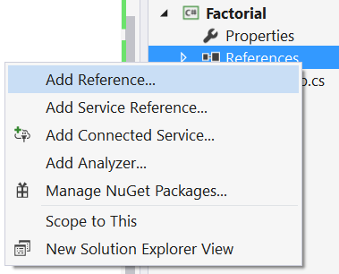
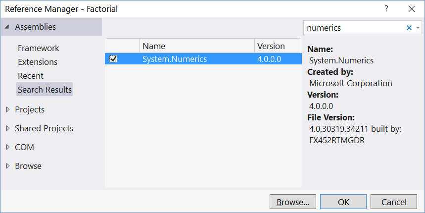
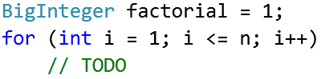
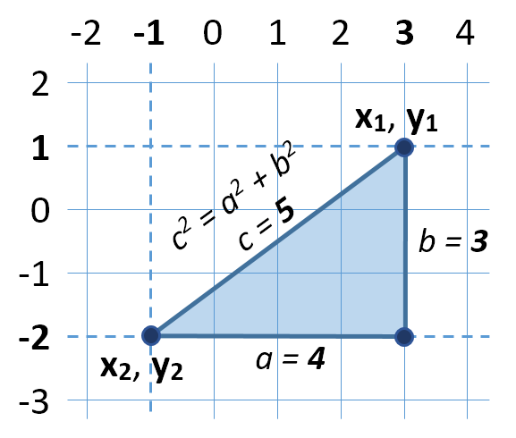

Lab: Objects and Classes
========================

Problems for exercises and homework for the ["Programming Fundamentals"
course @ SoftUni](https://softuni.bg/courses/programming-fundamentals).

You can check your solutions here:
<https://judge.softuni.bg/Contests/175/Objects-and-Classes-Lab>.

Using the Built-in .NET Classes
===============================

Day of Week
-----------

You are given a **date** in format **day-month-year**. Calculate and
print the **day of week** in **English**.

### Examples

  **Input**    **Output**
  ------------ ------------
  18-04-2016   Monday
  27-11-1996   Wednesday

### Hints

-   **Read the date as string** from the Console.

-   Use the method [**DateTime.ParseExact(string date, format,
    provider)**](https://msdn.microsoft.com/en-us/library/w2sa9yss(v=vs.110).aspx)
    to convert the input string to object of type **DateTime**. Use
    format **"d-M-yyyy"** and **CultureInfo.InvariantCulture**.

    -   Alternatively split the input by "**-**" and you will get the
        day, month and year as numbers. Now you can create **new
        DateTime(year, month, day)**.

-   The newly created **DateTime** object has property
    [**DayOfWeek**](https://msdn.microsoft.com/en-us/library/system.datetime.dayofweek(v=vs.110).aspx).

Randomize Words
---------------

You are given a **list of words in one line**. **Randomize their order**
and print each word at a separate line.

### Examples

+-----------------------+-----------------------+-----------------------+
| **Input**             | **Output**            | **Comments**          |
+=======================+=======================+=======================+
| Welcome to SoftUni    | learning              | The order of the      |
| and have fun learning |                       | words in the output   |
| programming           | Welcome               | will be different     |
|                       |                       | after each program    |
|                       | SoftUni               | execution.            |
|                       |                       |                       |
|                       | and                   |                       |
|                       |                       |                       |
|                       | fun                   |                       |
|                       |                       |                       |
|                       | programming           |                       |
|                       |                       |                       |
|                       | have                  |                       |
|                       |                       |                       |
|                       | to                    |                       |
+-----------------------+-----------------------+-----------------------+

### Hints

-   **Split** the input string by (space) and create an **array of
    words**.

-   Create a random number generator -- an object **rnd** of type
    **Random**.

-   In a **for-loop exchange each number** at positions 0, 1, ...
    **words.Length-1** by a number at **random position**. To generate a
    random number in range use **rnd.[Next(minValue,
    maxValue)](https://msdn.microsoft.com/en-us/library/2dx6wyd4(v=vs.110).aspx)**.
    Note that by definition **minValue** is **inclusive**, but
    **maxValue** is **exclusive**.

-   Print each word in the array on new line.

Big Factorial
-------------

Calculate and print **n!** (n factorial) for very big integer n (e.g.
1000).

### Examples

  **Input**   **Output**
  ----------- ------------------------------------------------------------------
  5           120
  50          3041409320171337804361260816606476884437764156896051200000000000

### Hints

Use the class **BigInteger** from the built-in .NET library
**System.Numerics.dll**.

1.  Add reference to **System.Numerics.dll**.

{width="2.858974190726159in"
height="2.308300524934383in"}

{width="5.932961504811899in"
height="2.970174978127734in"}

2.  Import the namespace "**System.Numerics**":

{width="1.9551279527559056in"
height="0.19924978127734033in"}

3.  Use the type **BigInteger** instead of **long** or **decimal** to
    keep the factorial value:

    {width="2.4423075240594927in"
    height="0.6044706911636045in"}

Defining Simple Classes
=======================

Distance Between Points
-----------------------

Write a method to calculate the distance between two points **p~1~**
{**x~1~**, **y~1~**} and **p~2~** {**x~2~**, **y~2~**}. Write a program
to read **two points** (given as two integers) and print the **Euclidean
distance** between them.

### Examples

+-----------+------------+
| **Input** | **Output** |
+===========+============+
| 3 4       | 5.000      |
|           |            |
| 6 8       |            |
+-----------+------------+
| 3 4       | 2.000      |
|           |            |
| 5 4       |            |
+-----------+------------+
| 8 -2      | 11.402     |
|           |            |
| -1 5      |            |
+-----------+------------+

### Hints

-   Create a **class Point** holding properties **X** and **Y**.

-   Write a method **CalcDistance(Point** **p1,** **Point** **p2)** that
    returns the distance between the given points -- a **double**
    number.

-   Use [this
    formula](http://www.cut-the-knot.org/pythagoras/DistanceFormula.shtml)
    to calculate the distance between two points. How it works?

    -   Let\'s have two points **p~1~** {**x~1~**, **y~1~**} and
        **p~2~** {**x~2~**, **y~2~**}

    -   Draw a right-angled triangle

    -   Side **a = \|x~1~ - x~2~\|**

    -   Side **b = \|y~1~ - y~2~\|**

    -   Distance == side **c** (hypotenuse)

    -   **c^2^** = **a^2^** + **b^2^** (Pythagorean theorem)

    -   Distance = **c** = $\sqrt{\mathbf{a}^{2} + \mathbf{b}^{2}}$

{width="2.903846237970254in"
height="2.4660050306211723in"}

-   You can use
    [**Math.Sqrt(number)**](https://msdn.microsoft.com/en-us/library/system.math.sqrt(v=vs.90).aspx)
    method for calculating a square root.

Closest Two Points
------------------

Write a program to read **n** points and find the **closest two** of
them.

### Input

The **input** holds the number of points **n** and **n** lines, each
holding a point {**X** and **Y** coordinate}.

### Output

-   The **output** holds the shortest distance and the closest two
    points.

-   If several pairs of points are equally close, print **the first** of
    them (from top to bottom).

### Examples

+-----------------+-----------------+-----------------+-----------------+
| **Input**       | **Output**      | **Visualization | **Comments**    |
|                 |                 | **              |                 |
+=================+=================+=================+=================+
| 4               | 1.414           | {width="2 | points are      |
| 3 4             | (3, 4)          | .35416666666666 | **{3, 4}** and  |
|                 |                 | 65in"           | **{2, 5}** at   |
| 6 8             | (2, 5)          | height="2.22916 | distance        |
|                 |                 | 66666666665in"} | 1.4142135623731 |
| 2 5             |                 |                 | ≈ **1.414**.    |
|                 |                 |                 |                 |
| -1 3            |                 |                 |                 |
+-----------------+-----------------+-----------------+-----------------+
| 3               | 0.000           | {width="1 | points have the |
| 12 -30          | (6, 18)         | .95833333333333 | same            |
|                 |                 | 33in"           | coordinates     |
| 6 18            | (6, 18)         | height="2.45833 | **{6, 18}**, so |
|                 |                 | 33333333335in"} | the distance    |
| 6 18            |                 |                 | between them is |
|                 |                 |                 | **0**.          |
+-----------------+-----------------+-----------------+-----------------+
| 3               | 1.414           | {width="2 | points {{1, 1}, |
| 1 1             | (1, 1)          | .25in"          | {2, 2}} and     |
|                 |                 | height="1.77083 | {{2,2}, {3,3}}  |
| 2 2             | (2, 2)          | 33333333333in"} | stay at the     |
|                 |                 |                 | same distance,  |
| 3 3             |                 |                 | but the first   |
|                 |                 |                 | pair is {**{1,  |
|                 |                 |                 | 1}**, **{2,     |
|                 |                 |                 | 2}**}. The      |
|                 |                 |                 | distance        |
|                 |                 |                 | between them is |
|                 |                 |                 | 1.4142135623731 |
|                 |                 |                 | ≈ **1.414**.    |
+-----------------+-----------------+-----------------+-----------------+

### Hints

-   Use the **class** **Point** you created in the previous task.

-   Create an array **Point\[\] points** that will keep all points.

-   Create a method **Point\[\] FindClosestPoints(Point\[\]**
    **points)** that will check distance **between every two pairs**
    from the array of points and returns the two closest points in a new
    array.

-   Print the **closest distance** and the **coordinates** of the two
    closest points.

Rectangle Position
------------------

Write a program to **read two rectangles** {left, top, width, height}
and print whether the first is inside the second.

The input is given as two lines, each holding a rectangle, described by
4 integers: **left**, **top**, **width** and **height**.

### Examples

+-----------------+-----------------+-----------------+-----------------+
| **Input**       | **Output**      | **Visualization | **Comments**    |
|                 |                 | **              |                 |
+=================+=================+=================+=================+
| 4 -3 6 4        | Inside          | {width="2 | rectangle stays |
| 2 -3 10 6       |                 | .28740157480314 | **inside** the  |
|                 |                 | 95in"           | second.         |
|                 |                 | height="1.79921 |                 |
|                 |                 | 25984251968in"} |                 |
+-----------------+-----------------+-----------------+-----------------+
| 2 -3 10 6       | Not inside      | {width=" | intersect, no   |
| 4 -5 6 10       |                 | 1.8937007874015 | the first is    |
|                 |                 | 748in"          | **not insid**e  |
|                 |                 | height="1.48818 | the second.     |
|                 |                 | 89763779528in"} |                 |
+-----------------+-----------------+-----------------+-----------------+

### Hints

-   Create a class **Rectangle** holding properties **Top**, **Left**,
    **Width** and **Height**.

-   Define calculated properties **Right** and **Bottom**.

-   Define a method **bool** **IsInside(Rectangle** **r)**. A rectangle
    **r1** is inside another rectangle **r2** when:

    -   r1.Left ≥ r2.Left

    -   r1.Right ≤ r2.Right

    -   r1.Top ≤ r2.Top

    -   r1.Bottom ≤ r2.Bottom

-   Create a method to **read** a **Rectangle**.

-   Combine all methods into a single program.

Sales Report
------------

Write a class **Sale** holding the following data: **town**,
**product**, **price**, **quantity**. Read a **list of sales** and
calculate and print the **total sales by town** as shown in the output.
Order **alphabetically** the towns in the output.

### Examples

+-----------------------+-----------------------+-----------------------+
| **Input**             | **Output**            | **Comments**          |
+=======================+=======================+=======================+
| 5                     | Plovdiv -\> 96.80     | Plovdiv -\> 1.10 \*   |
|                       |                       | 88 = 96.80            |
| Sofia beer 1.20 160   | Sofia -\> 533.20      |                       |
|                       |                       | Sofia -\> 1.20 \* 160 |
| Varna chocolate 2.35  | Varna -\> 266.98      | + 0.40 \* 853 =       |
| 86                    |                       | 533.20                |
|                       |                       |                       |
| Sofia coffee 0.40 853 |                       | Varna -\> 2.35 \* 86  |
|                       |                       | + 0.86 \* 75.44 =     |
| Varna apple 0.86      |                       | 266.98                |
| 75.44                 |                       |                       |
|                       |                       |                       |
| Plovdiv beer 1.10 88  |                       |                       |
+-----------------------+-----------------------+-----------------------+

### Hints

-   Define the class **Sale** holding properties **Town**, **Product**,
    **Price** and **Quantity**.

-   Create a method **ReadSale()** that reads a sale data line from the
    console and returns **Sale** object. It could split the input line
    by space and parse the price and quantity.

-   To read the input, first read an integer **n**, then **n** times
    read a sale.

-   **Approach I -- LINQ**

    -   Using **LINQ** select the **distinct town names** from the array
        of sales and sort them.

    -   For **each town** in a loop use a LINQ query to calculate the
        **total sales** (aggregate the sum of **price** \* **quantity**
        for all sales by the current town).

-   **Approach II -- Dictionary {town sales}**

    -   Define a dictionary **SortedDictionary\<string,** **decimal\>**
        **salesByTown** to hold the total sales for each town.

    -   Pass through all the sales from the input in a loop and for each
        sale, add its **price** \* **quantity** to the **salesByTown**
        for the current **town**. If the town is missing in the
        dictionary, first create it.

    -   Finally print the dictionary.

-   The second approach is faster, because it scans the array of sales
    only once.
