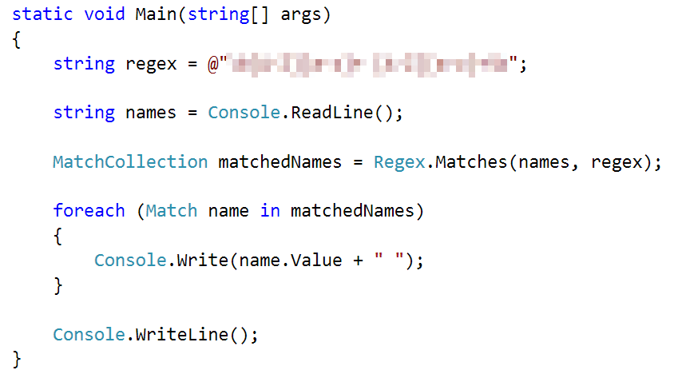
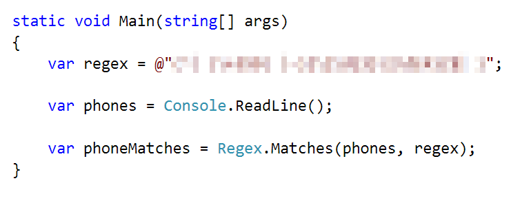
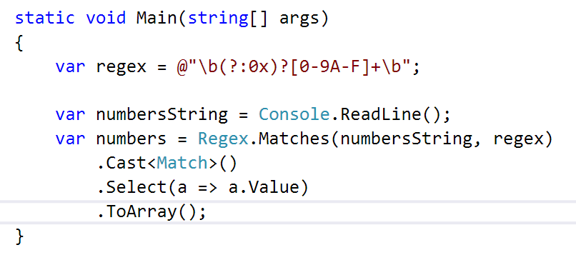
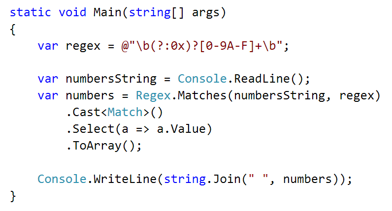
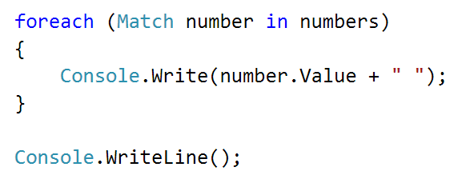

Lab: Regular Expressions (RegEx)
================================

This document defines the homework assignments from the [\"Programming
Fundamentals\" Course @ Software
University](https://softuni.bg/courses/programming-fundamentals). Please
submit your solutions (source code) of all below described problems in
the [Judge System](https://judge.softuni.bg/Contests/452/Regex-Lab).

Match Full Name
---------------

Write a C\# Program to **match full names** from a list of names and
**print** them on the console.

### Writing the Regular Expression

First, write a regular expression to match a valid full name, according
to these conditions:

-   A valid full name has the following characteristics:

    -   It consists of **two words**.

    -   Each word **starts** with a **capital letter**.

    -   After the first letter, it **only contains lowercase letters
        afterwards**.

    -   **Each** of the **two words** should be **at least two letters
        long**.

    -   The **two words** are **separated** by a **single space**.

To help you out, we\'ve outlined several steps:

1.  Use an online regex tester like <https://regex101.com/>

2.  Check out how to use **character sets** (denoted with square
    brackets - \"**\[\]**\")

3.  Specify that you want **two words** with a space between them (the
    **space character \' \'**, and **not** any whitespace symbol)

4.  For each word, specify that it should begin with an uppercase letter
    using a **character set**. The desired characters are in a range --
    **from** '**A**' **to** '**Z**'.

5.  For each word, specify that what follows the first letter are only
    **lowercase letters**, one or more -- use another character set and
    the correct **quantifier**.

6.  To prevent capturing of letters across new lines, put \"**\\b**\" at
    the beginning and at the end of your regex. This will ensure that
    what precedes and what follows the match is a word boundary (like a
    new line).

In order to check your RegEx, use these values for reference (paste all
of them in the **Test String** field):

  **Match ALL of these**   **Match NONE of these**
  ------------------------ ------------------------------------------------------------------------------
  Ivan Ivanov              ivan ivanov, Ivan ivanov, ivan Ivanov, IVan Ivanov, Ivan IvAnov, Ivan Ivanov

By the end, the matches should look something like this:

{width="7.20786198600175in"
height="0.651586832895888in"}

After you've constructed your regular expression, it's time to write the
solution in C\#.

### Implementing the Solution in C\#

Create a new C\# project and copy your **regular expression** into a
**string** variable:

{width="3.3444444444444446in"
height="0.7641601049868766in"}

Note: It's usually a good idea to use a **verbatim string** (@ in front
of the string literal) to store **regular expressions**, since
characters like the backslash "**\\**" can clash with **string
escaping**.

Now, it's time to **read the input** and **extract all the matches**
from it. For this, we can use the **MatchCollection** class:

{width="4.77in" height="1.47in"}

After we extract all the matches, we need to **iterate** over the
**MatchCollection** and **print** every match that we found:

{width="4.85in" height="2.72in"}

### Examples

  **Input**
  ------------------------------------------------------------------------------
  Ivan Ivanov, Ivan ivanov, ivan Ivanov, IVan Ivanov, Test Testov, Ivan Ivanov
  **Output**
  Ivan Ivanov Test Testov

Match Phone Number
------------------

Write a regular expression to match a **valid phone number** from
**Sofia**. After you find all **valid phones**, **print** them on the
console, separated by a **comma and a space** "**,** ".

### Compose the Regular Expression

A valid number has the following characteristics:

-   It starts with \"**+359**\"

-   Then, it is followed by the area code (always **2**)

-   After that, it's followed by the **number** itself:

    -   The number consists of **7 digits** (separated in **two**
        **groups** of **3** and **4** **digits** respectively).

-   The different **parts** are **separated** by **either a space or a
    hyphen** (\'**-**\').

You can use the following RegEx properties to **help** with the
matching:

-   Use **quantifiers** to match a **specific number** of **digits**

-   Use a **capturing group** to make sure the delimiter is **only one
    of the allowed characters** **(space or hyphen)** and **not** a
    **combination** of both (e.g. **+359 2-111 111** has **mixed
    delimiters**, it is **invalid**). Use a **group backreference** to
    achieve this.

-   Add a **word boundary** at the **end** of the match to avoid
    **partial matches** (the last example on the right-hand side).

-   Ensure that before the **\'+\'** sign there is either a **space** or
    the **beginning of the string**.

You can use the following table of values to test your RegEx against:

+------------------------+---------------------------------------------------+
| **Match ALL of these** | **Match NONE of these**                           |
+========================+===================================================+
| +359 2 222 2222        | 359-2-222-2222, +359/2/222/2222, +359-2 222 2222  |
|                        |                                                   |
| +359-2-222-2222        | +359 2-222-2222, +359-2-222-222, +359-2-222-22222 |
+------------------------+---------------------------------------------------+

### Implement the Solution in C\#

Now it's time to write the solution, so let's start writing!

First, just like in the previous problem, put your RegEx in a variable:

{width="4.28in" height="0.86in"}

After that, let's make a **MatchCollection** for our matches:

{width="4.188888888888889in"
height="1.689365704286964in"}

Let's try to print **all the matches**, using only a **single line**
**of code**. Since **MatchCollection** is, as its name suggests, a
**collection**, we can use **LINQ** methods on it.

In order to get all of the matches and put them into a string array, we
need to perform several manipulations on the **MatchCollection**:

1.  Cast every single element of the **MatchCollection** to the
    **Match** type using **Cast\<Match\>()**.

2.  Since every element is a **Match** now, we can extract just the
    **Value** property of the match itself, which holds the **match
    value** as a **string**, using **Select()**. We can also **Trim()
    the value**, to get rid of any **leading** or **trailing spaces**.

3.  After getting the match value, we can use **ToArray()** to
    **convert** the collection to an **array**.

Here's what that looks like as a **LINQ** query:

{width="4.379166666666666in"
height="0.8939391951006124in"}

After that, just print the valid phone number array, using
**string.Join()**:

{width="4.38in" height="2.73in"}

### Examples

  **Input**
  ------------------------------------------------------------------------------------------------------------------------------------
  +359 2 222 2222,359-2-222-2222, +359/2/222/2222, +359-2 222 2222 +359 2-222-2222, +359-2-222-222, +359-2-222-22222 +359-2-222-2222
  **Output**
  +359 2 222 2222, +359-2-222-2222

Match Hexadecimal Numbers
-------------------------

Write a program, which finds all **valid hexadecimal numbers** in a
**string** and **print** them **space-separated**.

### Compose the Regular Expression

A valid hexadecimal number follows these conditions:

-   Can have "**0x**" in front of it (not required)

-   Has **one or more** **hexadecimal** **digits** after it (**0-9** and
    **A-F**).

-   Doesn't have anything on **either** of its sides (use **\\b**).

You can follow the table below to help with composing your RegEx:

  **Match ALL of these**       **Match NONE of these**
  ---------------------------- -------------------------
  0x10 0xAB 0x1F 10 AB 1F FF   0xG G 0x4G 4G 0xFG FG

Find all the **hexadecimal numbers** from the string and **print them**
on the **console**, separated by **spaces**.

### Implement the Solution in C\#

After we're done composing our RegEx, we can put it inside a variable:

{width="3.41in" height="1.01in"}

After that, we can **read the input** from the console, save it to a
variable and **match** it against our **RegEx**:

{width="4.63in" height="2.09in"}

Finally, we can just print the output, using **string.Join()**:

{width="4.58in" height="2.47in"}

### Examples

  **Input**                                          **Output**
  -------------------------------------------------- ----------------------------
  1F 0xG 0x1F G 0x4G 4G 0xAB 0xFG FG 0x10 10 AB FF   1F 0x1F 0xAB 0x10 10 AB FF

Match Dates
-----------

Write a program, which matches a date in the format
"**dd{separator}MMM{separator}yyyy**". Use **named** **capturing
groups** in your regular expression.

### Compose the Regular Expression

Every valid date has the following characteristics:

-   Always starts with **two digits**, followed by a **separator**

-   After that, it has **one uppercase** and **two lowercase** letters
    (e.g. **Jan**, **Mar**).

-   After that, it has a **separator** and **exactly 4 digits** (for the
    year).

-   The separator could be either of three things: a period ("**.**"), a
    hyphen ("**-**") or a forward slash ("**/**")

-   The separator needs to be **the same** for the whole date (e.g.
    13**.**03**.**2016 is valid, 13**.**03**/**2016 is **NOT**). Use a
    **group backreference** to check for this.

You can follow the table below to help with composing your RegEx:

  **Match ALL of these**                  **Match NONE of these**
  --------------------------------------- ---------------------------------------
  13/Jul/1928, 10-Nov-1934, 25.Dec.1937   01/Jan-1951, 23/sept/1973, 1/Feb/2016

Use **named capturing groups** for the **day**, **month** and **year**.

Since this problem requires more complex RegEx, which includes **named
capturing groups**, we'll take a look at how to construct it:

-   First off, we don't want anything at the **start** of our date, so
    we're going to use a **word boundary** "**\\b**":\
    {width="6.15in" height="0.79in"}

-   Next, we're going to match the **day**, by telling our RegEx to
    match **exactly two digits**, and since we want to **extract** the
    day from the match later, we're going to put it in a **capturing
    group**:\
    {width="6.15in" height="0.79in"}\
    We're also going to give our group a **name**, since it's easier to
    navigate by **group name** than by **group index**:\
    {width="6.15in" height="0.79in"}

-   Next comes the separator -- either a **hyphen**, **period** or
    **forward slash**. We can use a **character class** for this:\
    {width="6.15in" height="0.79in"}\
    Since we want to use the separator we matched here to match the
    **same separator** further into the date, we're going to put it in a
    **capturing group**:\
    {width="6.15in" height="0.79in"}

-   Next comes the **month**, which consists of a **capital Latin
    letter** and **exactly two lowercase Latin letters**:**\
    **{width="6.15in" height="0.79in"}

-   Next, we're going to match the **same separator** **we matched
    earlier**. We can use a **backreference** for that:\
    {width="6.15in" height="0.7928926071741033in"}

-   Next up, we're going to match the year, which consists of **exactly
    4 digits**:\
    {width="6.15in" height="0.79in"}

-   Finally, since we don't want to match the date if there's anything
    else **glued to it**, we're going to use another **word boundary**
    for the end:\
    {width="6.262820428696413in"
    height="0.8048545494313211in"}

Now it's time to find all the **valid dates** in the input and **print
each date** in the following format: "**Day: {day}, Month: {month},
Year: {year}**", each on a **new line**.

### Implement the Solution in C\#

First off, we're going to put our RegEx in a variable and get a
**MatchCollection** from the string:

{width="6.77in" height="1.14in"}

Since RegEx works differently across different languages, before we
continue, we're going to **set our backreference from \\2 to \\1**. This
is because **C\# backreferences** don't count **named capture groups for
backreferences**. So, **change it before we continue**.

Next, we're going to **iterate** over every single **Match** and
**extract** the **day**, **month** and **year** from the **groups**. We
can use a special syntax in C\# to get a match's group **value** by its
**key**, the **same way** as when we access a **Dictionary**'s values:

{width="5.61in" height="1.72in"}

### Examples

+-----------------------------------------------------------------------+
| **Input**                                                             |
+=======================================================================+
| 13/Jul/1928, 10-Nov-1934, , 01/Jan-1951,f 25.Dec.1937 23/09/1973,     |
| 1/Feb/2016                                                            |
+-----------------------------------------------------------------------+
| **Output**                                                            |
+-----------------------------------------------------------------------+
| Day: 13, Month: Jul, Year: 1928                                       |
|                                                                       |
| Day: 10, Month: Nov, Year: 1934                                       |
|                                                                       |
| Day: 25, Month: Dec, Year: 1937                                       |
+-----------------------------------------------------------------------+

Match Numbers
-------------

Write a program, which finds all **integer** and **floating-point
numbers** in a string.

### Compose the Regular Expression

A number has the following characteristics:

-   Has either **whitespace** before it or the **start** of the string
    (match either **\^** or what's called a [positive
    lookbehind](http://www.regular-expressions.info/lookaround.html)).
    The entire syntax for the **beginning** of your **RegEx** might look
    something like "**(\^\|(?\<=\\s))**".

-   The number might or might not be negative, so it might have a hyphen
    on its left side ("**-**").

-   Consists of **one or more digits**.

-   Might or might not have **digits after the** **decimal point**

-   The decimal part (if it exists) consists of a period ("**.**") and
    **one or more digits** after it. Use a **capturing group**.

-   Has either **whitespace** before it or the **end** of the string
    (match either **\$** or what's called a [positive
    lookahead](http://www.regular-expressions.info/lookaround.html)).
    The syntax for the **end** of the **RegEx** might look something
    like "**(\$\|(?=\\s))**".

Let's see how we would translate the above rules into a **regular
expression**:

-   First off, we need to establish what needs to exist **before** our
    number. We can't use **\\b** here, since it includes "**-**", which
    we need to match **negative numbers**.\
    Instead, we'll use a **positive lookbehind**, which **matches** if
    there's something **immediately behind** it. We'll match if we're
    either at the **start** of the string (**\^**), or if there's any
    **whitespace** **behind** the string:\
    {width="4.03in" height="0.78in"}

-   Next, we'll check whether there's a **hyphen**, signifying a
    **negative number**:**\
    **{width="4.03in" height="0.78in"}\
    Since having a negative sign **isn't required**, we'll use the
    "**?**" quantifier, which means "**between 0 and 1 times**".

-   After that, we'll match any integers -- naturally, consisting **one
    or more digits**:\
    {width="4.03in" height="0.78in"}

-   Next, we'll match the **decimal** part of the number, which **might
    or might not exist** (note: we need to escape the **period**
    character, as it's used for something else in RegEx):\
    {width="4.03in" height="0.78in"}

-   Finally, we're going to use the same logic for the end of our string
    as the start -- we're going to match **only** if the number has
    **either a whitespace or the end of the string ("\$")**:\
    {width="4.03in" height="0.78in"}

You can follow the table below to help with composing your RegEx:

  **Match ALL of these**           **Match NONE of these**
  -------------------------------- --------------------------------------
  1 -1 123 -123 123.456 -123.456   1s s2 s-s -1- \_55\_ s-2 s-3.5 s-1.1

Find all the **numbers** from the string and **print them** on the
**console**, separated by **spaces**.

### Implement the Solution in C\#

Now that we've written our regular expression, we can start by putting
it in a variable and extracting the matches:

{width="4.478472222222222in"
height="1.0128204286964129in"}

After that, it's only a matter of printing the numbers, separated by
spaces:

{width="3.38in" height="1.28in"}

### Examples

  **Input**                                                                  **Output**
  -------------------------------------------------------------------------- --------------------------------
  1 -1 1s 123 s-s -123 \_55\_ \_f 123.456 -123.456 s-1.1 s2 -1- zs-2 s-3.5   1 -1 123 -123 123.456 -123.456

Replace \<a\> Tag
-----------------

Write a program that replaces in a HTML document given as string **all
the tags \<a href=...\>...\</a\>** with corresponding **tags \[URL
href=...\>...\[/URL\]**. Read an input, until you receive the **"end**"
**command**. **Print** the lines on the **console**, but with the
**\<a\>** tags replaced.

### Examples

+-------------------------------------------------------+
| **Input**                                             |
+=======================================================+
| \<ul\>                                                |
|                                                       |
| \<li\>                                                |
|                                                       |
| \<a href=**\"http://softuni.bg\"**\>SoftUni\</a\>     |
|                                                       |
| \</li\>                                               |
|                                                       |
| \</ul\>                                               |
|                                                       |
| **end**                                               |
+-------------------------------------------------------+
| **Output**                                            |
+-------------------------------------------------------+
| \<ul\>                                                |
|                                                       |
| \<li\>                                                |
|                                                       |
| \[URL href=**\"http://softuni.bg\"**\]SoftUni\[/URL\] |
|                                                       |
| \</li\>                                               |
|                                                       |
| \</ul\>                                               |
+-------------------------------------------------------+
